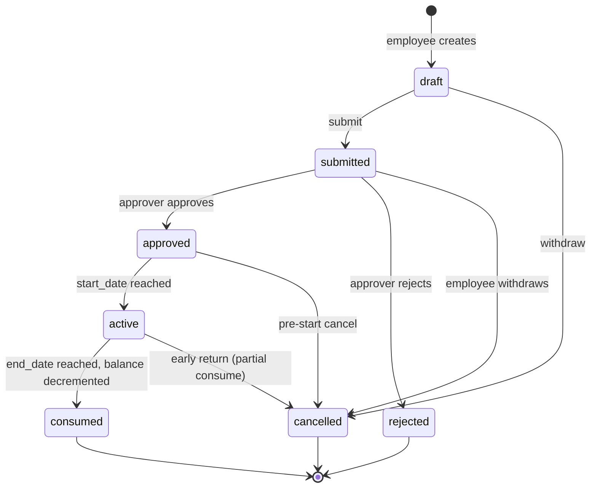

# HR Core

**Tier:** 2 — Enterprise Core (per [ADR-0016](../../../decisions/0016-module-tier-classification.md))
**Module ID:** `hr`
**Phase:** **2.5** — HR Core splits out of Phase 2 Enterprise Core into its
own phase ([phase-2.5-hr.md](../../../roadmap/phases/phase-2.5-hr.md)).
The Tier-2 classification above governs isolation rules, permission scope,
and cross-module-dependency constraints; the Phase assignment is the roadmap
slot (after CRM + Finance + Subscription + Projects land in Phase 2).
**Status:** In Review — Prompt 3 HR Agent, 2026-04-22

> Revision history: rewritten 2026-04-22 from the legacy "HR & Payroll" draft to a
> generic B2B employer spec per [ADR-0016 Module Tier Classification](../../../decisions/0016-module-tier-classification.md).
> Payroll-engine internals and GL posting were moved out of scope (GL belongs to
> [Finance](../finance/SPEC.md)). Vertical-flavored employee roles (teacher /
> volunteer / clinician) are now contact extensions per
> [ADR-0020 Contact Extensions by Vertical Modules](../../../decisions/0020-contact-extensions-by-vertical-modules.md).

## Scope

HR Core is the **organization-isolated employee-lifecycle backbone** of Nexora. It owns:

- **Employee records** — generic employer data. Core identity and contact attributes
  live in [Contacts](../../tier-1-core/contacts/SPEC.md); HR adds the employment
  facet (employment number, hire/termination dates, status, manager chain). Tier-3
  vertical roles (Education "teacher", NGO "volunteer", Healthcare "clinician") are
  implemented as contact extensions in the extending module per
  [ADR-0020](../../../decisions/0020-contact-extensions-by-vertical-modules.md), not
  here.
- **Department and Position management** — hierarchical org chart, position
  definitions, headcount.
- **Org hierarchy** — reports-to chain expressed as `Employee.manager_employee_id`;
  used by approval routing for leaves, expenses, and terminations.
- **Contract management** — start/end dates, contract type, salary/currency,
  renewal alerts, digital signing through
  [Documents](../../tier-1-core/documents/SPEC.md).
- **Leave management** — leave-type registry (annual, sick, unpaid, parental,
  custom), per-employee balance tracking on a configurable cycle year, request
  workflow with approval state machine.
- **Attendance tracking** — self-reported check-in/out or integration-sourced
  records (terminal, mobile, SSO-tagged entry).
- **Shift scheduling** — shift templates and per-employee assignments, publish
  flow with notifications.
- **Personnel document vault** — contracts, IDs, handbooks stored in Documents
  with HR-specific category tags and retention tagging.
- **Employee self-service** — employee-facing surface via `nexora-portal`
  (own profile, leave requests, payslips, shift calendar).
- **Third-party payroll integration hooks** — export/import contracts for Gusto,
  ADP, BambooHR, Paylocity. The concrete adapters are separate integration
  libraries; this spec defines only the contract surface and the
  `HR.PayrollProcessed` event.

## Out of scope

- **Payroll run engine internals** — gross-to-net calculation, jurisdictional
  statutory withholdings, tax tables. HR tracks the *approved outcome* of a
  payroll run and emits `HR.PayrollProcessed`; the calculation itself is either
  performed by an external payroll provider (Gusto/ADP/BambooHR) or by a future
  pluggable payroll engine that is not first-class spec content here.
- **General ledger posting** — Finance consumes `HR.PayrollProcessed` and posts
  the journal (DR Salary Expense / CR Bank + statutory-liability accounts) per
  its own COA and approval workflow. See [Finance](../finance/SPEC.md).
- **Concrete payroll-provider adapter specs** — Gusto/ADP/BambooHR connectors
  are adapter libraries shipped alongside HR; their wire protocols and field
  mappings are documented per-adapter, not in this core spec.
- **Recruitment / ATS** — candidate pipelines, job postings, interview
  scheduling. Candidate for a future Tier-4 `recruitment` module.
- **Learning management** — courses, certifications, training plans. Candidate
  for a future Tier-4 `lms` module.
- **Performance reviews, 360-feedback, goal/OKR tracking** — future extension.
- **Benefits-plan administration** (carrier enrollment, COBRA, FSA/HSA posting)
  — handled by the external payroll/benefits provider.
- **Expense reimbursement workflow** — belongs to Finance's expense management;
  HR only surfaces the link on the employee record.

## Dependencies

| Module | Relationship | Purpose |
|--------|--------------|---------|
| `identity` | **Required** | Tenant/org context, user provisioning on hire (auto-create Keycloak realm user), deactivation on termination, RBAC enforcement. |
| `contacts` | **Required** | Employee is a contact of type `employee`; core personal profile (name, email, phone, addresses) lives in Contacts. HR holds only the employment facet. |
| `documents` | **Required** | Contracts, IDs, handbooks, certifications, offer letters — all stored in Documents with HR-category tags. Digital signing flow for contract renewal. |
| `notifications` | **Required** | Leave decision delivery, contract renewal reminders, payroll confirmation, shift-published fan-out. |
| `audit` | **Required** | All employee, contract, payroll, and termination mutations are written through `IAuditRepository` per [ADR-0009](../../../decisions/0009-audit-repository-pattern.md). |
| `finance` | Integration | Consumes `HR.PayrollProcessed` to post the payroll journal. No direct call — event only. |
| `projects` | Integration | Consumes `HR.EmployeeDeactivated` to reassign open tasks owned by the terminated employee. |
| `portal` | Integration | `nexora-portal` renders the employee self-service surface against `/api/v1/hr/portal/*`. |

## Entities

```mermaid
erDiagram
    Employee ||--o{ EmploymentContract : "holds"
    Employee ||--o{ LeaveBalance : "accrues"
    Employee ||--o{ LeaveRequest : "submits"
    Employee ||--o{ AttendanceRecord : "logs"
    Employee ||--o{ ShiftAssignment : "assigned-to"
    Employee ||--o{ PersonnelDocument : "owns"
    Employee ||--o{ PayrollLine : "paid-on"
    Employee }o--|| Department : "belongs-to"
    Employee }o--|| Position : "holds"
    Employee }o--o| Employee : "reports-to"
    Department ||--o{ Department : "parent-of"
    EmploymentContract }o--o| PersonnelDocument : "signed-as"
    LeaveType ||--o{ LeaveBalance : "governs"
    LeaveType ||--o{ LeaveRequest : "typed-as"
    Shift ||--o{ ShiftAssignment : "fills"
    PayrollRun ||--o{ PayrollLine : "contains"

    Employee {
        EmployeeId id PK
        ContactId contact_id FK
        string employment_number
        date hire_date
        date termination_date
        string status "active|on-leave|terminated"
        EmployeeId manager_employee_id FK
        DepartmentId department_id FK
        PositionId position_id FK
    }
    Department {
        DepartmentId id PK
        DepartmentId parent_id FK
        string name
        string cost_center
    }
    Position {
        PositionId id PK
        string title
        string job_family
        string grade
    }
    EmploymentContract {
        ContractId id PK
        EmployeeId employee_id FK
        string contract_type "permanent|fixed-term|contractor|intern"
        date start_date
        date end_date
        Money salary "SharedKernel.Money — see ADR-0021"
        DocumentId document_id FK
        string status "draft|pending-signature|active|expired|terminated"
    }
    LeaveType {
        LeaveTypeId id PK
        string name
        bool paid
        int default_annual_days
        string accrual_rule
    }
    LeaveBalance {
        LeaveBalanceId id PK
        EmployeeId employee_id FK
        LeaveTypeId leave_type_id FK
        decimal balance_days
        int cycle_year
    }
    LeaveRequest {
        LeaveRequestId id PK
        EmployeeId employee_id FK
        LeaveTypeId leave_type_id FK
        date start_date
        date end_date
        decimal days
        string status "draft|submitted|approved|rejected|active|consumed|cancelled"
        EmployeeId approver_id FK
    }
    AttendanceRecord {
        AttendanceId id PK
        EmployeeId employee_id FK
        date work_date
        timestamp check_in
        timestamp check_out
        string source "self|terminal|sso|integration"
    }
    Shift {
        ShiftId id PK
        string name
        time start_time
        time end_time
        string recurrence
    }
    ShiftAssignment {
        ShiftAssignmentId id PK
        ShiftId shift_id FK
        EmployeeId employee_id FK
        date effective_from
        date effective_to
        string status
    }
    PayrollRun {
        PayrollRunId id PK
        string period "YYYY-MM"
        string status "draft|prepared|approved|processed|posted"
        Money total_amount "SharedKernel.Money — see ADR-0021"
        UserId prepared_by
        UserId approved_by
        timestamp approved_at
    }
    PayrollLine {
        PayrollLineId id PK
        PayrollRunId payroll_run_id FK
        EmployeeId employee_id FK
        Money gross "SharedKernel.Money — see ADR-0021"
        Money deductions "SharedKernel.Money — see ADR-0021"
        Money net "SharedKernel.Money — see ADR-0021"
    }
    PersonnelDocument {
        PersonnelDocumentId id PK
        EmployeeId employee_id FK
        DocumentId document_id FK
        string hr_category "contract|id|certification|handbook|offer|disciplinary"
        date retention_until
    }
```

## Leave Request State Machine

Transition notes:

- `draft → submitted` validates against `LeaveBalance` and any blackout windows.
- `submitted → approved` requires `hr.leaves.approve`; the approver is recorded
  on the request.
- `active → consumed` is a scheduled job (`hr:leave-lifecycle`, daily) that
  decrements the matching `LeaveBalance.balance_days`.
- A request cancelled after `active` refunds the unused portion of the balance.

## Payroll Approval — Four-Eyes Rule

Payroll runs enforce separation of duties:

1. A user with `hr.payroll.prepare` creates a `PayrollRun` and populates
   `PayrollLine`s (manually, by import from the payroll provider, or by internal
   engine). The run transitions `draft → prepared`.
2. A **different** user with `hr.payroll.approve` reviews and approves. The
   handler rejects approval when `approved_by == prepared_by` with
   `lockey_hr_payroll_four_eyes_violation`.
3. Only after `approved` does the system emit `HR.PayrollProcessed` and
   transition the run to `processed`.
4. Finance consumes `HR.PayrollProcessed`, posts the GL journal, and (on
   successful posting) emits `Finance.JournalPosted`; HR listens and moves the
   run to `posted`.

**Domain invariant (entity-level):** `PayrollRun.Approve(approvedBy)` throws `DomainException("lockey_hr_payroll_self_approval_forbidden")` when `approvedBy == PreparedBy`. This is enforced inside the aggregate, not in the handler — so any code path (API, background job, admin tool) that reaches the entity is protected. The handler's FluentValidation check is a defense-in-depth pre-check for early 400 response.

## Events produced

| Event | Trigger | Key payload |
|-------|---------|-------------|
| `HR.EmployeeOnboarded` | Employee record created + first contract active | `employeeId`, `contactId`, `hireDate`, `departmentId`, `positionId` |
| `HR.EmployeeDeactivated` | Termination date reached or immediate termination committed | `employeeId`, `terminationDate`, `reasonCode` |
| `HR.ContractSigned` | `Documents.DocumentSigned` correlates to a contract draft | `contractId`, `employeeId`, `effectiveDate` |
| `HR.ContractRenewalDue` | Daily job finds contracts expiring within 30 days (configurable) | `contractId`, `employeeId`, `expiresOn` |
| `HR.LeaveRequested` | LeaveRequest enters `submitted` | `leaveRequestId`, `employeeId`, `leaveTypeId`, `startDate`, `endDate`, `days` |
| `HR.LeaveApproved` | LeaveRequest enters `approved` | `leaveRequestId`, `approverId`, `decidedAt` |
| `HR.LeaveRejected` | LeaveRequest enters `rejected` | `leaveRequestId`, `approverId`, `reason` (lockey) |
| `HR.PayrollProcessed` | PayrollRun transitions to `processed` after four-eyes approval | `payrollRunId`, `period`, `totalAmount`, `currency`, `lines[]` |
| `HR.ShiftAssigned` | ShiftAssignment published | `shiftAssignmentId`, `shiftId`, `employeeId`, `effectiveFrom` |

## Events consumed

| Event | Source | Action |
|-------|--------|--------|
| `Documents.DocumentSigned` | Documents | If the document is linked to an `EmploymentContract` in `pending-signature`, transition the contract to `active` and emit `HR.ContractSigned`. |
| `Identity.UserDeactivated` | Identity | If the deactivated user maps to an Employee, trigger the offboarding flow (set termination date, emit `HR.EmployeeDeactivated`) when not already terminated. |
| `Contacts.ContactMerged` | Contacts | Rewrite `Employee.contact_id` references from the losing contact to the surviving contact; emit `HR.EmployeeContactReassigned` (internal). |

## Cross-module integration

- **Identity** — On hire, HR requests Keycloak user provisioning (new realm
  user if the contact is not already a Nexora user) with default `employee`
  role. On termination, HR calls Identity to revoke access; Identity also
  publishes `UserDeactivated` which HR consumes for the reverse direction.
- **Contacts** — Every Employee references a Contact (`contact_id`). Employee
  is a contact of type `employee`; vertical-specific roles (teacher, volunteer,
  clinician) are contact extensions added by the vertical module per
  [ADR-0020](../../../decisions/0020-contact-extensions-by-vertical-modules.md),
  not mixins on `Employee`.
- **Documents** — Contracts, IDs, handbooks, disciplinary letters are stored in
  Documents with an HR-specific category tag and linked via
  `PersonnelDocument.document_id`. Digital signing flows through Documents and
  surfaces back as `Documents.DocumentSigned`.
- **Finance** — HR emits `HR.PayrollProcessed`; Finance posts the GL journal
  (DR Salary Expense, CR Bank + statutory-liability sub-accounts) on its own
  approval path. HR does **not** know Finance's COA.
- **Notifications** — Leave decisions, contract renewal reminders, payroll
  confirmation, shift-published fan-out. All templates use `lockey_` keys.
- **Projects** — On `HR.EmployeeDeactivated`, Projects re-queues open tasks
  owned by the terminated employee for reassignment (implementation lives in
  Projects).

## API endpoints (category-level)

Admin surface (`/api/v1/hr/`):

- `/employees` — CRUD, search, deactivate.
- `/departments` — CRUD, hierarchy reorganize.
- `/positions` — CRUD.
- `/contracts` — draft, send-for-signature, cancel, renew.
- `/leaves/types` — CRUD on leave-type registry.
- `/leaves/balances` — read per employee, adjust (admin only).
- `/leaves/requests` — submit, approve, reject, cancel, list.
- `/attendance` — list, create, correct (admin).
- `/shifts` — shift templates CRUD, assignment publish.
- `/payroll/runs` — draft, prepare, approve, list.
- `/payroll/lines` — scoped under a run, import from provider, adjust
  (pre-approval only).

Portal surface (`/api/v1/hr/portal/`, requires `hr.self-service.read/submit`):

- `/portal/my-hr` — own employee profile + summary.
- `/portal/my-leaves` — own balances, submit and cancel requests.
- `/portal/my-payslips` — own payslip history (post-`processed` runs).

All endpoints follow [API_INTEGRATION_STANDARDS.md](../../../standards/api-integration.md)
envelope, error, and pagination conventions.

## Use cases

### UC-HR-001 — New hire onboarding

1. HR admin creates a Contact (or reuses an existing one) and an Employee with
   hire date, department, position, and manager.
2. HR calls Identity to provision a Keycloak realm user (or link existing) and
   assigns default `employee` role.
3. HR creates an `EmploymentContract` in `draft`, attaches a generated
   document template (Documents), and sends for signature.
4. On `Documents.DocumentSigned`, contract activates; HR emits
   `HR.EmployeeOnboarded` and sends a welcome notification.

### UC-HR-002 — Leave request flow

1. Employee submits a leave request via portal.
2. Balance and blackout validation runs; request enters `submitted`.
3. Manager (or delegated approver) approves.
4. On `start_date`, the scheduled job activates; on `end_date`, the balance is
   decremented and a calendar entry is pushed via Notifications.

### UC-HR-003 — Contract renewal

1. Daily `hr:contract-renewal-scan` job finds contracts expiring within 30
   days and emits `HR.ContractRenewalDue`.
2. Notifications alert the HR admin.
3. Admin generates a renewal document from template (Documents), assigns
   signatories; on signature, a new `EmploymentContract` activates and the old
   one transitions to `expired`.

### UC-HR-004 — Monthly payroll

1. Preparer creates a `PayrollRun` for the period; lines are imported from the
   external payroll provider or computed internally.
2. Run transitions to `prepared`.
3. A different user approves (four-eyes rule); run transitions to `approved`
   and HR emits `HR.PayrollProcessed`.
4. Finance posts the GL journal; HR moves the run to `posted` on
   `Finance.JournalPosted`.
5. Payslips are published to the portal for each employee.

### UC-HR-005 — Shift schedule publication

1. HR manager drafts shift assignments for the upcoming period.
2. On publish, HR emits `HR.ShiftAssigned` per assignment.
3. Notifications fan out to affected employees; portal calendar updates.

### UC-HR-006 — Termination and offboarding

1. HR admin records termination with effective date and reason.
2. On the effective date, HR emits `HR.EmployeeDeactivated`.
3. Identity revokes Keycloak access; Projects reassigns open tasks; Documents
   applies the personnel-file retention policy and archives personal files per
   tenant jurisdiction.

## Non-functional / compliance

- **PII sensitivity: HIGH.** All employee endpoints are audit-covered; see the
  audit matrix in [Standards Additions](#standards-additions). Hire date,
  termination date, salary, personal identifiers, and manager chain are all
  classified as HR-sensitive.
- **Export paths** (full employee export, contract export, payroll export) are
  gated behind explicit permissions (`hr.employees.admin`,
  `hr.payroll.approve`) and produce an audit event per export regardless of
  row count.
- **Multi-currency** — salary amounts are stored with explicit ISO-4217
  currency. Cross-currency reporting uses Finance's exchange-rate snapshot
  service per [multi-currency.md](../../../standards/multi-currency.md).
- **Localization** — all user-facing strings are `lockey_` keys per
  [localization.md](../../../standards/localization.md). Leave-type names,
  shift names, and department names are tenant-authored and stored as free
  text; system-generated messages (approval emails, rejection reasons) use
  lockeys.
- **Retention** — personnel files and payroll records are subject to
  jurisdiction-specific minimum retention periods. The default retention ladder
  is defined below and can be overridden per tenant via
  `ITenantConfiguration` keys (see `hr.retention.*`).

### Retention Matrix

| Data Category | Retention Period | Legal Basis | Deletion Method |
|---|---|---|---|
| Employee personal data (name, contact, DOB) | Duration of employment + 10 years | KVKK Art.5, GDPR Art.6(1)(b) | Anonymize on request; hard-delete after retention |
| Payroll / salary records | 10 years post-employment | Turkish Labor Law Art.32, KVKK | Soft-delete → hard-delete |
| Performance reviews | 5 years post-employment | KVKK Art.5 | Soft-delete → hard-delete |
| Disciplinary records | 5 years post-employment | KVKK Art.5 | Hard-delete after retention period |
| Health / medical records | 15 years (Turkish workplace health regs) | KVKK Art.6 (special category) | Encrypted at rest; hard-delete after retention |
| Recruitment / applicant data (rejected) | 2 years post-rejection | KVKK Art.5 | Hard-delete |
| Identity documents (passport, ID copy) | Duration of employment + 10 years | KVKK Art.6 | Encrypted at rest; hard-delete after retention |

> Tenant configuration key: `hr.retention.employee_records_years` (default: 10).
> Special-category data (health, biometric) requires explicit KVKK Art.6 consent, stored separately.
> GDPR deletion requests processed within 30 days via GDPR Deletion flow (ADR-008).
> Payroll records are exempt from erasure requests under Turkish Labor Law — document exemption in deletion workflow.

- **GDPR** — termination-triggered personal-file archival supports right-to-
  erasure requests per [ADR-0008](../../../decisions/0008-gdpr-deletion-strategy.md).
- **Availability** — HR is not on the transactional critical path; target 99.5%
  per-module availability. Payroll-run windows are batch-tolerant.

## Permissions

| Permission | Description |
|------------|-------------|
| `hr.employees.read` | Read employee records within authorized org scope. |
| `hr.employees.write` | Create and update employee records (non-termination). |
| `hr.employees.admin` | Terminate, export, rewrite manager chains. |
| `hr.contracts.read` | Read contracts. |
| `hr.contracts.manage` | Draft, send for signature, cancel, renew. |
| `hr.leaves.read` | Read leave balances and requests within scope. |
| `hr.leaves.manage` | Configure leave types, adjust balances. |
| `hr.leaves.approve` | Approve or reject leave requests. |
| `hr.payroll.read` | Read payroll runs and lines. |
| `hr.payroll.prepare` | Draft and prepare payroll runs. |
| `hr.payroll.approve` | Approve payroll runs (four-eyes partner). |
| `hr.shifts.read` | Read shifts and assignments. |
| `hr.shifts.manage` | Manage shift templates and assignments. |
| `hr.personnel-docs.read` | Read personnel documents within scope. |
| `hr.personnel-docs.manage` | Upload, tag, retention-mark personnel documents. |
| `hr.self-service.read` | Portal: read own HR data (balances, payslips, profile). |
| `hr.self-service.submit` | Portal: submit leave requests, correct own attendance. |

All permissions follow [permissions.md](../../../standards/permissions.md)
conventions and are registered centrally per
[ADR-0004](../../../decisions/0004-centralized-permission-seeding.md).

## Standards Additions

### Permission registration

All `hr.*` permissions listed above are seeded via the centralized permission
seeder per [ADR-0004](../../../decisions/0004-centralized-permission-seeding.md)
with module key `hr` and are organization-scoped (not tenant-global).
`hr.self-service.*` permissions are granted to every user who is also an
Employee by a default-assignment rule; all others are explicit grants.

**Self-service auto-grant:** Permissions `hr.self-service.view-own`, `hr.self-service.request-leave`, `hr.self-service.submit-timesheet` are auto-granted to every user with an active `Employee` record in this tenant. Mechanism: the `IdentityModuleMigration.SeedAsync` creates a virtual role `hr.employee` with these permissions; `Employee.OnCreated` handler adds the user to this role; `Employee.OnDeactivated` handler removes them. Keycloak role mapping: `hr.employee` is a realm-level role mirrored to Keycloak on role assignment change.

### Audit coverage matrix

Per [audit-coverage.md](../../../standards/audit-coverage.md), HR operations
carry the following audit obligations:

| Operation | Obligation | Notes |
|-----------|-----------|-------|
| Payroll run: prepare, approve, reject, export | **MUST** | Records preparer, approver, period, totals, currency. Approval record includes four-eyes validation outcome. |
| Contract: create, send-for-signature, activate, terminate, renew | **MUST** | Records before/after values for salary, dates, status, and the linked document id. |
| Employee: create, terminate, rewrite manager, export | **MUST** | Termination records reason code and effective date; export records row count and filter predicate. |
| Leave request: approve, reject, balance adjustment | **SHOULD** | Records approver and decision reason; balance adjustments record delta and justification. |
| Leave request: submit, cancel | **SHOULD** | Standard CRUD audit. |
| Attendance: correction by admin | **SHOULD** | Records original and corrected values. |
| Attendance: self check-in / check-out | **MAY** | High-volume; sampled audit only unless a tenant opts into full coverage. |
| Attendance: read | **MAY** | Read audit only when tenant sensitivity profile is elevated. |
| Shift: publish | **SHOULD** | Records shift id and affected-employee count. |
| Personnel document: upload, retention-mark, archive | **MUST** | Follows Documents audit chain; HR adds the category and retention delta. |

### Localization additions

HR introduces the `lockey_hr_*` namespace. Required subkeys at spec-freeze time:

- `lockey_hr_payroll_four_eyes_violation` — preparer cannot approve own run.
- `lockey_hr_leave_insufficient_balance` — submit-time balance failure.
- `lockey_hr_leave_blackout_window` — submit-time blackout failure.
- `lockey_hr_contract_not_pending_signature` — signing correlation failure.
- `lockey_hr_employee_already_terminated` — idempotent termination guard.
- `lockey_hr_notification_leave_approved`, `lockey_hr_notification_leave_rejected`,
  `lockey_hr_notification_contract_renewal_due`,
  `lockey_hr_notification_payroll_processed`, `lockey_hr_notification_shift_published`
  — notification templates.

All keys ship in `en` and `tr` at minimum per
[localization.md](../../../standards/localization.md).

### Multi-currency additions

Salary amounts on `EmploymentContract` and totals on `PayrollRun` / `PayrollLine`
are stored with explicit ISO-4217 currency. Cross-currency aggregation
(group-level payroll totals, headcount-weighted comparisons) uses Finance's
daily exchange-rate snapshot per
[multi-currency.md](../../../standards/multi-currency.md); HR does not maintain
its own rate table.

### Documentation-style additions

This spec follows [documentation-style.md](../../../standards/documentation-style.md):
all diagrams are Mermaid, embedded inline; entity IDs use strongly-typed-ID
style in the ER diagram; out-of-scope section is explicit and forward-linked
to the modules that take ownership.

---

**Status:** In Review — 2026-04-22
