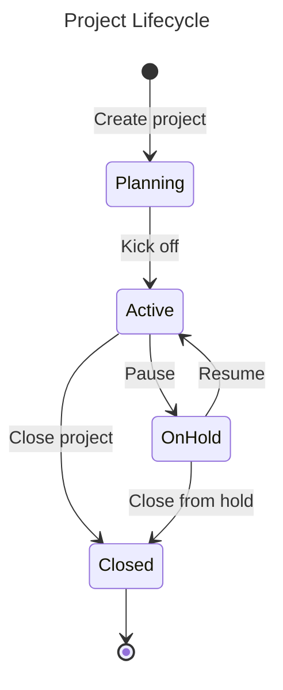
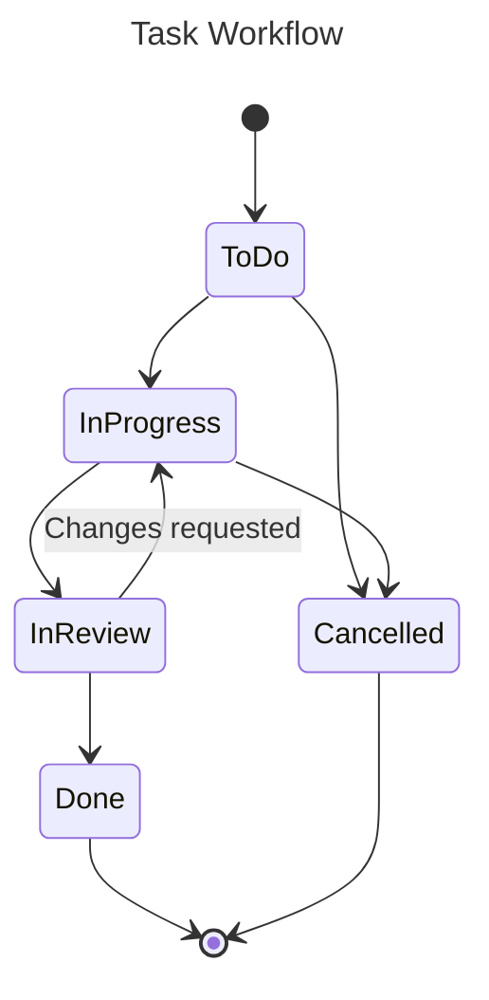
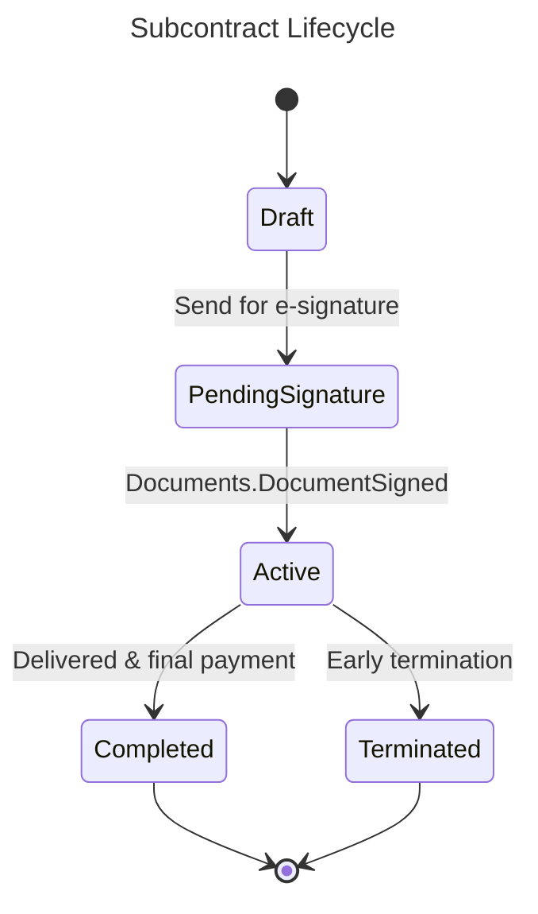
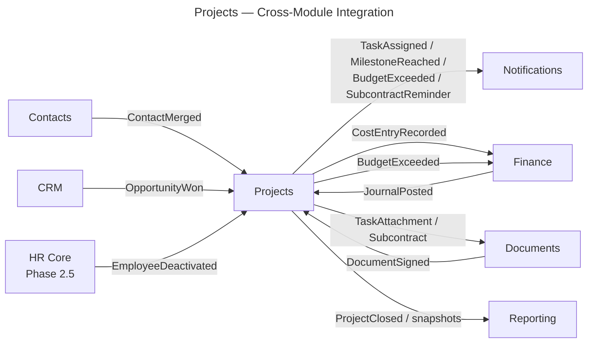

# Projects

**Tier:** 2 — Enterprise Core
**Module ID:** `projects`
**Scope:** Generic B2B/SaaS project and task management — project lifecycle (planning → active → closed), milestone tracking, Kanban-style task boards with WIP limits, per-task comments and attachments (via Documents), per-task/per-member time tracking, team and member management, project budgeting with cost-center tagging (materials / labor / subcontractors / other), meeting notes with action-item-to-task conversion, subcontractor contract management (Documents + e-signatures), labels and filters, project dashboard + Gantt view, Finance cost-journal integration, and a stakeholder portal view.
**Out of scope:** General HR records (employees, payroll, leave) — owned by Phase 2.5 HR Core module. GL posting internals and journal balancing — owned by Tier-2 Finance. Document storage internals (versioning, MinIO keys, e-signature provider adapters) — owned by Tier-1 Documents. Vertical project flavours (e.g. grant-funded programs) are layered on top by Tier-3 editions via event subscriptions.
**Dependencies:** `identity` (Tier 1), `contacts` (Tier 1), `notifications` (Tier 1), `audit` (Tier 1), `documents` (Tier 1), `reporting` (Tier 1), `finance` (Tier 2, for cost journal), `crm` (Tier 2, optional — opportunity handoff), `SharedKernel.Money` (see [multi-currency.md](../../../standards/multi-currency.md)). Tier placement per [ADR-0016](../../../decisions/0016-module-tier-classification.md); cross-module eventing follows ADR-0014.

## Overview

Projects gives enterprise tenants a generic work-management surface for B2B engagements: SaaS delivery projects, consulting engagements, construction jobs, and marketing-campaign execution. Members are drawn from the Tier-1 Contacts registry (contact types `employee`, `partner`, `vendor`) rather than a private roster, so identity and HR stay authoritative. Budget burn-down feeds Finance via a `CostEntryRecorded` stream; won CRM opportunities can seed a project with a maintainer-gated automation flag. All vocabulary is domain-neutral — vertical editions add flavour by subscribing to events, not by forking this module.

## Domain Model

### Entities

```mermaid
---
title: Projects Module — Entity Relationship Diagram
---
erDiagram
    Project ||--o{ Milestone : "has"
    Project ||--o{ Task : "contains"
    Project ||--o{ ProjectMember : "staffed by"
    Project ||--o| ProjectTeam : "optional grouping"
    Project ||--o{ ProjectBudget : "has budgets"
    Project ||--o{ CostEntry : "accrues costs"
    Project ||--o{ MeetingNote : "logs meetings"
    Project ||--o{ Subcontract : "has contracts"
    Project ||--o{ TaskLabel : "defines labels"

    Project {
        uuid id PK
        uuid organization_id FK
        uuid origin_opportunity_id FK "nullable, CRM handoff"
        string code "e.g. PRJ-2026-0042"
        string name
        string description
        string status "planning | active | on_hold | closed"
        date planned_start
        date planned_end
        date actual_start
        date actual_end
        string base_currency "ISO 4217"
        Money budget_total "SharedKernel.Money — see ADR-0021"
        timestamp closed_at
        timestamp created_at
    }

    Milestone ||--o{ Task : "groups"
    Milestone {
        uuid id PK
        uuid project_id FK
        string name
        string status "pending | in_progress | reached | missed"
        date start
        date end
        int sequence
        timestamp reached_at
    }

    Task ||--o{ TaskComment : "has"
    Task ||--o{ TaskAttachment : "has"
    Task ||--o{ TimeEntry : "logs time"
    Task ||--o{ TaskLabelAssignment : "tagged"
    Task }o--|| BoardColumn : "in column"
    Task }o--o| Task : "depends on (FS)"
    Task {
        uuid id PK
        uuid project_id FK
        uuid milestone_id FK "nullable"
        uuid board_column_id FK
        uuid assignee_contact_id FK "nullable"
        string title
        string description
        string priority "low | medium | high | critical"
        string status "todo | in_progress | in_review | done | cancelled"
        string position "fractional index for drag-reorder"
        date due_date
        int estimated_hours
        timestamp completed_at
        timestamp created_at
    }

    BoardColumn {
        uuid id PK
        uuid project_id FK
        string name
        int sequence
        int wip_limit "0 = unlimited"
        string mapped_status
    }

    TaskComment {
        uuid id PK
        uuid task_id FK
        uuid author_contact_id FK
        string body
        timestamp created_at
    }

    TaskAttachment {
        uuid id PK
        uuid task_id FK
        uuid document_id FK "ref Documents"
        string caption
        timestamp created_at
    }

    TaskLabel ||--o{ TaskLabelAssignment : "applied"
    TaskLabel {
        uuid id PK
        uuid project_id FK
        string name
        string color
    }

    TaskLabelAssignment {
        uuid task_id FK
        uuid label_id FK
    }

    TimeEntry {
        uuid id PK
        uuid task_id FK
        uuid member_id FK
        date entry_date
        decimal hours
        boolean is_billable
        Money billable_rate "SharedKernel.Money — see ADR-0021"
        string description
        timestamp created_at
    }

    ProjectTeam ||--o{ ProjectMember : "groups"
    ProjectTeam {
        uuid id PK
        uuid project_id FK
        string name
    }

    ProjectMember {
        uuid id PK
        uuid project_id FK
        uuid team_id FK "nullable"
        uuid contact_id FK "employee | partner | vendor"
        string role "owner | manager | member | stakeholder"
        Money default_hourly_rate "SharedKernel.Money — see ADR-0021"
        boolean is_active
        timestamp joined_at
        timestamp left_at
    }

    ProjectBudget ||--o{ BudgetLine : "has lines"
    ProjectBudget {
        uuid id PK
        uuid project_id FK
        string name
        Money total "SharedKernel.Money — see ADR-0021"
        string status "draft | approved | closed"
        timestamp approved_at
    }

    BudgetLine {
        uuid id PK
        uuid budget_id FK
        string cost_center "materials | labor | subcontractors | other"
        Money planned_amount "SharedKernel.Money — see ADR-0021"
        Money actual_amount "computed; SharedKernel.Money — see ADR-0021"
        decimal alert_threshold_pct "default 80"
    }

    CostEntry {
        uuid id PK
        uuid project_id FK
        uuid budget_line_id FK "nullable"
        string cost_center
        string source "time | expense | subcontractor | other"
        uuid source_ref_id "TimeEntry | Subcontract | manual"
        Money amount "SharedKernel.Money — see ADR-0021"
        date posted_date
        uuid finance_journal_id FK "nullable, set after Finance acks"
        timestamp created_at
    }

    MeetingNote ||--o{ ActionItem : "produces"
    MeetingNote {
        uuid id PK
        uuid project_id FK
        string title
        string body
        date meeting_date
        timestamp created_at
    }

    ActionItem {
        uuid id PK
        uuid meeting_note_id FK
        uuid task_id FK "nullable, set on conversion"
        uuid assignee_contact_id FK
        string description
        date due_date
        string status "open | converted | dropped"
    }

    Subcontract {
        uuid id PK
        uuid project_id FK
        uuid contact_id FK "vendor contact"
        uuid document_id FK "signed contract"
        Money amount "SharedKernel.Money — see ADR-0021"
        string status "draft | pending_signature | active | completed | terminated"
        date start_date
        date end_date
        timestamp signed_at
    }
```

### Value Objects

| Value Object | Description |
|--------------|-------------|
| `ProjectId`, `MilestoneId`, `TaskId`, `TimeEntryId`, `ProjectMemberId`, `ProjectBudgetId`, `BudgetLineId`, `CostEntryId`, `MeetingNoteId`, `ActionItemId`, `SubcontractId` | Strongly-typed identifiers. |
| `Money` | `SharedKernel.Money` — amount + ISO currency; used on budgets, time-entry rates, cost entries, subcontracts. |
| `ProjectStatus` | Enum: Planning, Active, OnHold, Closed. |
| `TaskStatus` | Enum: ToDo, InProgress, InReview, Done, Cancelled. |
| `MemberRole` | Enum: Owner, Manager, Member, Stakeholder. |
| `CostCenter` | Enum: Materials, Labor, Subcontractors, Other. |
| `CostSource` | Enum: Time, Expense, Subcontractor, Other. |
| `FractionalIndex` | Ordered string (e.g. `0|hzzzzz:`) used for drag-drop `Task.position` — gap-step rebalance runs lazily when precision erodes. |

### Domain Events

Topic names and payloads listed in §Integration Points.

### Entity Lifecycles

## Task Board Mechanics

- Board columns are **per-project configurable** states (`BoardColumn` rows) with a `mapped_status`, `sequence`, and optional `wip_limit`.
- Drag-drop reorders tasks by stored `Task.position` using **fractional indexing**. Clients post `{target_column_id, position_before, position_after}`; the handler computes a new position between the two. A nightly `projects:position-rebalance` Hangfire job runs gap-step normalisation when average gap drops below a threshold.
- **WIP limits** per column: when a move would exceed `wip_limit`, the server accepts the move but returns an `X-Nexora-Warning: lockey_projects_alert_wip_limit_breached` header and emits a banner-level warning. v1 does not block; maintainer-gated enforcement is deferred.
- Column transitions auto-update `Task.status` via `mapped_status`. Moving into a `done`-mapped column sets `completed_at` and emits `TaskCompleted`.

## Gantt View

- Client-side render driven by `GET /api/v1/projects/projects/{id}/gantt`, which returns `{milestones[], tasks[], dependencies[]}`.
- Bars drawn from `Milestone.start`/`Milestone.end` plus `Task.due_date` minus `estimated_hours`.
- v1 supports **Finish-to-Start** task dependencies only (`Task.depends_on_task_id`). Start-to-Start, Finish-to-Finish, Start-to-Finish are **deferred** — a maintainer ADR gates the expansion.

## Use Cases

All examples are strictly B2B/SaaS: SaaS delivery project, consulting engagement, construction job, marketing-campaign execution.

### UC-PRJ-001: New Project from Won CRM Opportunity
- **Actor:** CRM AE with `crm.opportunities.write`; Projects Ops with `projects.projects.write`.
- **Flow:** When an `OpportunityWon` event arrives and the tenant's `projects.auto_seed_from_won_opp` **maintainer-gated flag** is true, the Projects consumer creates a new Project in `planning` status, sets `origin_opportunity_id`, and seeds members: the opportunity owner becomes `Owner`; contacts linked to the opportunity are added as `Member` (employees/partners) or `Stakeholder` (customer-side contacts). The flag defaults off; when off, the event is dropped to a suggestions list the AE manually accepts.
- **Rules:** A given opportunity yields at most one project (idempotency key: `origin_opportunity_id`). Base currency copied from the opportunity; budget line stub for `labor` created with the opportunity amount.

### UC-PRJ-002: Kanban Task Board with Drag-Drop + WIP Warning
- **Actor:** Consulting delivery lead with `projects.tasks.write`.
- **Flow:** Lead drags a task from `In Progress` to `In Review`. Target column's WIP limit is 3 and is currently full. Server writes the move, recomputes `position`, returns `200 OK` with a `lockey_projects_alert_wip_limit_breached` warning payload; UI renders a banner. Board state cached in Redis (TTL 30s) is invalidated.
- **Rules:** Position recomputed from neighbours; on fractional-index collision the handler rebalances the column inline. Moves on cancelled tasks are rejected.

### UC-PRJ-003: Log Billable Time → Automatic Cost Entry + Finance Journal
- **Actor:** Consulting engineer with `projects.time.write`.
- **Flow:** Engineer posts `POST /api/v1/projects/time-entries` with `{task_id, date, hours: 6, is_billable: true}`. Handler multiplies hours by the member's `default_hourly_rate`; writes the `TimeEntry`; inserts a `CostEntry` in the `labor` cost center (`source = time`, `source_ref_id = time_entry_id`); publishes `TimeEntryLogged` and `CostEntryRecorded`. Finance consumes `CostEntryRecorded` and posts a journal: **DR Project Cost — CR Accrued Labor**, returning a `finance.journal.posted` event that sets `CostEntry.finance_journal_id`.
- **Rules:** Non-billable time logs no cost entry. Rate conversion uses the project's `base_currency` via `SharedKernel.Money`.

### UC-PRJ-004: Cost-Center Budget Thresholds → 80% Alert → 100% `BudgetExceeded`
- **Actor:** Construction PM with `projects.budgets.manage`; consumer is Finance + Notifications.
- **Flow:** PM approves a budget with a `materials` line (planned = 500 000 USD, alert = 80%). As `CostEntry` rows accumulate, `BudgetLine.actual_amount` is recomputed. Crossing 80% emits a notification (`lockey_projects_alert_budget_threshold`); crossing 100% publishes the `BudgetExceeded` integration event consumed by Finance (pass-through to its own `BudgetExceeded` stream for GL review) and Notifications.
- **Rules:** Threshold evaluation is synchronous on cost-entry write. Repeated crossings within a 24h window are deduped at the notification layer.

### UC-PRJ-005: Meeting Notes → Convert Action Items to Tasks
- **Actor:** Marketing-campaign PM with `projects.tasks.write`.
- **Flow:** PM records a `MeetingNote` with three `ActionItem` rows. Clicking "Convert to tasks" iterates the action items: for each, creates a `Task` in the default backlog column, copies `assignee_contact_id` and `due_date`, links back via `ActionItem.task_id`, flips the item's status to `converted`, and emits `TaskCreated` + `TaskAssigned` per item. Any items left unconverted remain on the meeting note for follow-up.
- **Rules:** Conversion is idempotent per `ActionItem.id`. Dropping an action item sets status `dropped` and skips task creation.

### UC-PRJ-006: Subcontractor Contract Signed → Subcontract Active → Initial Accrual
- **Actor:** Construction procurement with `projects.subcontracts.manage`; Documents module.
- **Flow:** Procurement drafts a `Subcontract`, sends the signed-contract `Document` for e-signature. `Documents.DocumentSigned` arrives; consumer matches `document_id` → flips `Subcontract.status` to `active`, records `signed_at`, and posts an initial `CostEntry` to the `subcontractors` cost center for the accrual portion (e.g. 10% mobilisation). `CostEntryRecorded` flows to Finance as in UC-PRJ-003.
- **Rules:** If the signed document doesn't match an open subcontract the event is logged and dropped. Termination before signature returns the subcontract to `draft`.

### UC-PRJ-007: Project Close-Out
- **Actor:** SaaS delivery manager with `projects.projects.close`.
- **Flow:** Manager triggers `POST /api/v1/projects/projects/{id}/close`. Handler counts open tasks; if any, responds with `409` + a reassign-or-archive prompt listing `{task_id, title, assignee}`. Manager either reassigns or archives; handler then sets `Project.status = closed`, `closed_at = now`, emits `ProjectClosed`, and triggers a Reporting-side final actuals snapshot (`projects.project-closed` subscribed by Reporting).
- **Rules:** Closed projects become read-only except for audit views; cost entries already posted to Finance are not rolled back.

## API Endpoints

Endpoint categories (route prefix `/api/v1/projects/`):

| Category | Paths | Primary permission |
|----------|-------|--------------------|
| Projects | `projects/projects` | `projects.projects.read|write|close` |
| Tasks | `projects/tasks`, `projects/tasks/{id}/move`, `projects/tasks/{id}/labels` | `projects.tasks.read|write` |
| Milestones | `projects/milestones` | `projects.projects.read|write` |
| Time entries | `projects/time-entries` | `projects.time.read|write` |
| Budgets | `projects/budgets`, `projects/budgets/{id}/lines` | `projects.budgets.read|manage` |
| Cost entries | `projects/cost-entries` | `projects.cost-entries.read|write` |
| Meeting notes | `projects/meeting-notes`, `projects/meeting-notes/{id}/convert` | `projects.tasks.write` |
| Subcontracts | `projects/subcontracts` | `projects.subcontracts.read|manage` |
| Members | `projects/members`, `projects/teams` | `projects.members.manage` |
| Board/Gantt | `projects/projects/{id}/kanban`, `projects/projects/{id}/gantt` | `projects.projects.read` |
| Portal | `projects/portal/my-projects`, `projects/portal/my-tasks` | stakeholder scope |

All user-facing messages follow [localization.md](../../../standards/localization.md) — handlers return `lockey_projects_*` keys via `LocalizedMessage.Of(...)`.

Representative localization keys: `lockey_projects_project_created_success`, `lockey_projects_project_closed_success`, `lockey_projects_error_project_not_found`, `lockey_projects_error_close_has_open_tasks`, `lockey_projects_alert_wip_limit_breached`, `lockey_projects_alert_budget_threshold`, `lockey_projects_alert_budget_exceeded`, `lockey_projects_validation_hours_positive`, `lockey_projects_validation_end_after_start`, `lockey_projects_notification_task_assigned`, `lockey_projects_notification_milestone_reached`, `lockey_projects_notification_subcontract_signature_required`.

## Integration Points

### Events Produced

| Event | Topic | Payload summary |
|-------|-------|-----------------|
| `ProjectCreated` | `nexora.projects.projects` | `{ projectId, organizationId, code, originOpportunityId? }` |
| `ProjectClosed` | `nexora.projects.projects` | `{ projectId, closedAt, finalActualAmount, currency }` |
| `TaskCreated` | `nexora.projects.tasks` | `{ taskId, projectId, title, assigneeContactId? }` |
| `TaskAssigned` | `nexora.projects.tasks` | `{ taskId, projectId, assigneeContactId, assignedByUserId }` |
| `TaskCompleted` | `nexora.projects.tasks` | `{ taskId, projectId, milestoneId?, completedAt }` |
| `MilestoneReached` | `nexora.projects.milestones` | `{ milestoneId, projectId, reachedAt }` |
| `TimeEntryLogged` | `nexora.projects.time` | `{ timeEntryId, taskId, projectId, memberId, hours, isBillable }` |
| `CostEntryRecorded` | `nexora.projects.costs` | `{ costEntryId, projectId, costCenter, amount, currency, source, sourceRefId }` |
| `BudgetExceeded` | `nexora.projects.budgets` | `{ budgetId, budgetLineId, projectId, costCenter, plannedAmount, actualAmount, currency }` |

### Events Consumed

| Event | Source | Action |
|-------|--------|--------|
| `CRM.OpportunityWon` | CRM | If `projects.auto_seed_from_won_opp` tenant flag is on, create a project from the won deal and seed members (UC-PRJ-001). Otherwise, write a suggestion row. |
| `Contacts.ContactMerged` | Contacts | Rewrite `ProjectMember.contact_id`, `Task.assignee_contact_id`, `TaskComment.author_contact_id`, and `Subcontract.contact_id` from the losing ID to the surviving ID. |
| `Documents.DocumentSigned` | Documents | Flip the matching `Subcontract.status` to `active`, set `signed_at`, post the mobilisation `CostEntry` (UC-PRJ-006). |
| `HR.EmployeeDeactivated` *(Phase 2.5)* | HR Core | Unassign open tasks held by the deactivated employee's contact, flag them for reassignment, emit a `TaskAssigned` with `assignee = null`. |

**HR integration (interim, pre-Phase-2.5):** Until HR module ships (Phase 2.5), project team member additions use `contact_id` directly (Contacts module). `ProjectMember.contact_id` is the canonical reference; `employee_id` is nullable and populated only when HR is installed and the contact has an active Employee record.

**Contact-only scenario:** Projects can be fully staffed using contacts without HR — e.g., external contractors, pre-hire consultants. Deactivation in this mode is manual (PM removes the member). Once HR is installed, `HR.EmployeeDeactivated` event auto-removes the member from all active projects and marks their `TimeEntry` records as billable_as_of `deactivated_at`.

**Post-HR install migration:** Running `projects:link-employees` Hangfire job matches existing `ProjectMember.contact_id` to newly-created `Employee` records and backfills `employee_id`.

### Cross-Module Integration

Cross-module notes:
- **Contacts** — all members reference `contact_id` (contact types `employee`, `partner`, `vendor`); no private roster in Projects.
- **Documents** — task attachments and signed subcontracts persist as `Document` entities; Projects stores only `document_id` references.
- **Finance** — `CostEntryRecorded` posts the journal (**DR Project Cost — CR Accrued Labor / Subcontractor / Bank**); Finance acks by setting `CostEntry.finance_journal_id`. `BudgetExceeded` is mirrored onto Finance's own `BudgetExceeded` stream for consolidated GL alerts.
- **Notifications** — task assignments, milestone reached, budget threshold/exceeded alerts, subcontract signature reminders. Consent is governed upstream by Notifications.
- **Reporting** — project progress, budget-vs-actual, utilization dashboards; Projects emits a final snapshot on `ProjectClosed` consumed by the Reporting projection.

Consistency: all cross-module writes follow the eventual-consistency, outbox-based pattern mandated by [ADR-0014](../../../decisions/0014-distributed-consistency-patterns.md); target freshness ≤ 5 s p95.

## Standards Additions

### Permission Matrix

Scope: Tenant (organization-filtered).

| Resource \ Action | read | write | close | manage |
|-------------------|:----:|:-----:|:-----:|:------:|
| `projects.projects` | ✓ | ✓ | ✓ | – |
| `projects.tasks` | ✓ | ✓ | – | – |
| `projects.time` | ✓ | ✓ | – | – |
| `projects.budgets` | ✓ | – | – | ✓ |
| `projects.cost-entries` | ✓ | ✓ | – | – |
| `projects.members` | – | – | – | ✓ |
| `projects.subcontracts` | ✓ | – | – | ✓ |

Permission keys emitted at module startup:

- `projects.projects.read`, `projects.projects.write`, `projects.projects.close`
- `projects.tasks.read`, `projects.tasks.write`
- `projects.time.read`, `projects.time.write`
- `projects.budgets.read`, `projects.budgets.manage`
- `projects.cost-entries.read`, `projects.cost-entries.write`
- `projects.members.manage`
- `projects.subcontracts.read`, `projects.subcontracts.manage`

Follows [permissions.md](../../../standards/permissions.md) `{module}.{resource}.{action}` contract. Stakeholder portal routes are gated by a scoped portal role that grants `projects.projects.read` + `projects.tasks.read` filtered to projects the contact is attached to.

### Audit Coverage

Per [audit-coverage.md](../../../standards/audit-coverage.md):

- **MUST audit:** project lifecycle changes (create / status transition / close / reopen); budget create / approve / line change; cost-entry create / update; time-entry **delete** (create/update are SHOULD); subcontract create / status change; member add / remove / role change.
- **SHOULD audit:** time-entry create / update; meeting-note → task conversion; task delete; bulk exports.
- **MAY audit:** read endpoints (Kanban, Gantt, list, dashboard, portal).

## Non-Functional Requirements

| Requirement | Target |
|-------------|--------|
| Active tasks per tenant | ≤ 10 000 |
| Board load (Kanban) | ≤ 500 ms p95 |
| Drag-drop reorder (perceived) | ≤ 100 ms p95 |
| Gantt load (≤ 500 tasks) | ≤ 700 ms p95 |
| Cost-entry write → Finance journal posted | ≤ 5 s p95 |
| Outbox → integration event freshness | ≤ 5 s p95 |
| Max members per project | 500 |
| Max board columns per project | 20 |
| Position rebalance cadence | nightly `projects:position-rebalance` job |

## Portal Extension Manifest

Projects ships a `module.manifest.yaml` per [ADR-0017](../../../decisions/0017-portal-extension-architecture.md) declaring routes (`/projects`, `/projects/tasks`, `/projects/gantt`), stakeholder portal routes (`/portal/my-projects`, `/portal/my-tasks`), menu contributions, dashboard widgets (`projects.burn-down`, `projects.my-tasks`), the `projects` permissions namespace, and the `projects` i18n namespace (`en`, `tr`). `license.requires: enterprise`.

## Open Items / TODOs

- TODO(maintainer): ADR for expanded Gantt dependency types (SS/FF/SF) once customer demand is validated.
- TODO(maintainer): evaluate hard-block WIP enforcement vs. the current warning-only behaviour after six months of telemetry.
- TODO(maintainer): finalise HR Core `EmployeeDeactivated` payload shape when Phase 2.5 spec lands; stubbed here against the current proposal.

---

Status: In Review — Prompt 3 Projects Agent, 2026-04-22
