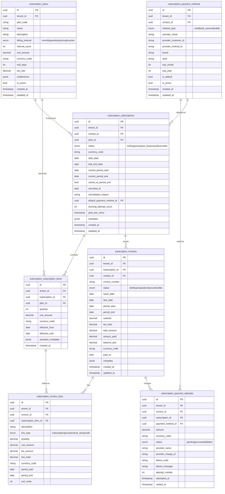
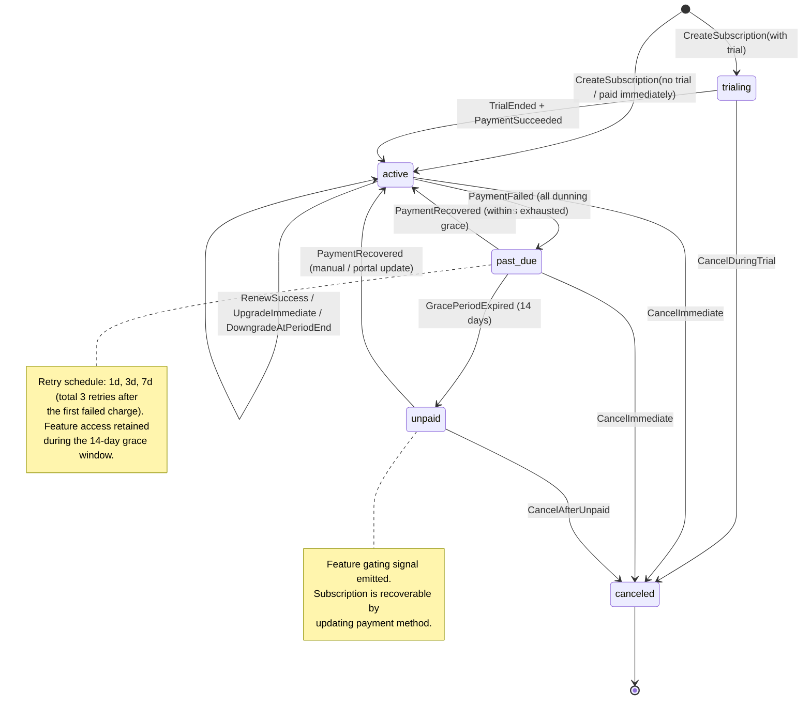

# Subscription

**Tier:** 2 — Enterprise Core
**Module ID:** `subscription`
**Version:** 2.0.0
**Status:** In Review — Prompt 2 Agent B, 2026-04-22
**Owner:** Nexora Platform Team

---

## 1. Scope

The Subscription module provides a recurring-billing engine for generic B2B / SaaS tenants on
Nexora. It owns the commercial lifecycle of plan-based subscriptions: creating and changing
subscriptions, running billing cycles, producing invoices, tracking payment attempts, driving
dunning, and managing customer payment methods.

Concretely, Subscription owns:

- **Plans** — price, billing interval (monthly / quarterly / annual / custom), trial length,
  currency, feature entitlements.
- **Subscriptions** — a tenant's customer instance of a plan, including trial state, renewal,
  cancellation, upgrade and downgrade.
- **Invoice generation** — scheduled issuance per billing cycle, including proration on plan
  changes and discounts applied at the line level.
- **Payment plan tracking** — installment / multi-invoice arrangements, including scheduled due
  dates and running balance per subscription.
- **Trial periods** — configurable trial length per plan, automatic conversion or cancellation
  at trial end, `TrialEnding` warning windows.
- **Plan upgrade / downgrade** — upgrade applies immediately with proration; downgrade applies
  at end of the current period (see §4).
- **Dunning** — retry schedule, status transitions to `past_due` / `unpaid`, grace periods,
  feature gating signal (see §5).
- **Payment method management** — tokenised PAN / bank instruments through a provider-agnostic
  `IPaymentProvider` port (see ADR-0018), default-method selection, soft-expiry handling.
- **Portal self-service** — customer's view of their own subscription, invoices, and payment
  methods; upgrade / cancel / change-payment flows.

## 2. Out of scope

- **Payment provider internals.** Stripe, iyzico, and any future providers are implementation
  details behind the `IPaymentProvider` port. Webhook parsing, API SDK versioning, and
  provider-specific reconciliation quirks live in `Infrastructure/PaymentProviders/*` and are
  not part of this specification. See ADR-0018.
- **General ledger entries.** Subscription never posts to GL. `InvoicePaid` and
  `PaymentFailed` are integration events consumed by the Finance module, which is responsible
  for journal entries, revenue recognition, deferred revenue, and tax bookings.
- **Cross-currency conversion.** Invoices are issued in the subscription's own currency
  (§6). Conversion to the tenant base currency for reporting is Finance's responsibility via
  the shared `IExchangeRateService` (see `standards/multi-currency.md`).
- **Tax calculation engine.** Line-level tax rates are applied per `Plan.taxRate` configuration
  only. Complex indirect-tax (e.g. VAT MOSS, US sales-tax nexus) is a Finance / external tax
  engine concern.
- **CRM quote-to-cash.** Converting an opportunity into a subscription is a CRM responsibility;
  Subscription accepts a typed command, not a pipeline.

## 3. Dependencies

Per ADR-016, Subscription is Tier 2 and may depend on SharedKernel, Infrastructure, and any
Tier-1 module. It must not depend on Tier 3 (editions) or Tier 4 (extensions).

| Dependency | Type | Purpose |
|------------|------|---------|
| `identity` | Required | Tenant / user resolution, permissions, license gate. |
| `contacts` | Required | Every subscription resolves a `ContactId` as the billable party. Consumes `Contacts.ContactUpdated`. |
| `notifications` | Required | Dunning emails, trial-ending reminders, receipt delivery. |
| `documents` | Optional | PDF invoice rendering; falls back to built-in generator. |
| `finance` | Peer (event only) | Consumes `InvoicePaid` / `PaymentFailed` for GL; publishes `Finance.RefundIssued` back. |
| `audit` | Required (infra) | Permission, plan-change, payment-failed events. |
| `SharedKernel` | Required | `Money`, `Currency`, `IExchangeRateService`, `ITenantContext`. |

---

## 4. Entity-Relationship Diagram

### 4.1 `cancel_at_period_end` semantics

`cancel_at_period_end` is a **boolean flag** on `subscription_subscriptions`, not a date. When
`cancel_at_period_end = true`, cancellation becomes effective at the subscription's current
`current_period_end` timestamp — no additional renewal charge is issued, and the renewal job
transitions the subscription to `canceled` on that date. While the flag is `true`, the
subscription retains full access until `current_period_end`. Setting the flag back to `false`
before that date reverts the pending cancellation and the subscription renews as normal. The
effective cancellation instant is therefore always `current_period_end`, never a separately
stored date.

---

## 5. Plan change strategy

Plan changes are modelled as replacing `SubscriptionItem`s on an existing `Subscription`. The
subscription's identity, trial state, and invoice history are preserved.

### 5.1 Upgrade — immediate with proration

An **upgrade** is any plan change whose new MRR is greater than the current MRR.

1. The current `SubscriptionItem` is closed with `effective_until = today`.
2. A new `SubscriptionItem` for the target plan is opened with `effective_from = today`.
3. A prorated credit line (unused portion of the old plan) and a prorated charge line (remaining
   portion of the new plan, same period) are added to the next invoice as `proration` lines —
   or to an **ad-hoc "upgrade" invoice** issued immediately if the tenant setting
   `subscription.upgrade.immediate_invoice` is true.
4. `SubscriptionUpgraded` is emitted.
5. New entitlements take effect immediately (the portal evaluates entitlements from the active
   `SubscriptionItem` on every request).

Proration basis: **daily**, using the current period's day count (calendar days, not 30-day
month convention). Money math is done in `decimal` with the plan's currency; rounding is
applied once at line-total per `standards/multi-currency.md` §4.

### 5.2 Downgrade — end of period

A **downgrade** is any plan change whose new MRR is less than or equal to the current MRR.

1. The requested change is stored as `Subscription.pending_plan_id` (deferred change).
2. At `current_period_end`, the renewal pipeline applies the pending plan as the new
   `SubscriptionItem` and clears `pending_plan_id`.
3. No proration is issued — the customer keeps the higher tier for the period they already
   paid.
4. `SubscriptionDowngraded` is emitted on the effective date (not the request date).

Customers may cancel a pending downgrade before it effects by calling
`POST /portal/my-subscription/cancel-pending-change`.

### 5.3 Provider abstraction

Every money-movement step (charge, refund, tokenise method) is executed through the
`IPaymentProvider` port. The concrete provider is resolved per tenant — **Stripe as global
default, iyzico for Turkey tenants, with a failover policy on provider outages** — per
ADR-0018 (`docs/decisions/0018-payment-provider-strategy.md`).

---

## 6. Dunning flow

When a scheduled charge against an invoice fails, the subscription enters the dunning
pipeline:

- **Attempt 1** at the scheduled charge time (day 0).
- **Retry 1** after 1 day (day 1).
- **Retry 2** after 2 more days (day 3).
- **Retry 3** after 4 more days (day 7) — final retry.

If any retry succeeds, the subscription returns to `active` and dunning counters reset. If all
3 retries fail, the subscription transitions to `past_due`. A 14-day grace window begins; during
this window the customer retains feature access but receives dunning notifications and a
banner in the portal. If the invoice is still unpaid at the end of the grace window, the
subscription transitions to `unpaid` and the platform emits the **feature-gating signal**
(`SubscriptionGateFeaturesRequested` on the internal bus, consumed by license / entitlement
enforcement). The customer can recover by updating their payment method in the portal, which
triggers an immediate retry.

### 6.1 Subscription status state diagram

### 6.2 Dunning edge cases

**Pending cancellation (`cancel_at_period_end = true`) + dunning:** When a subscription has
`cancel_at_period_end = true` and enters dunning, the scheduled cancellation takes precedence.
Retries must not be scheduled past `current_period_end`. If the period ends before all retries
are exhausted, any remaining retries are abandoned and the subscription is canceled on
`current_period_end` without further charge attempts.

**Pending downgrade + dunning:** When a subscription has a `pending_plan_id` (deferred
downgrade) and enters dunning, the downgrade is frozen — `pending_plan_id` is retained but not
applied at `current_period_end` while payment remains unresolved. Once payment is recovered
the normal renewal flow resumes and the pending downgrade applies at the next period end. If
dunning exhausts all retries and the grace period expires without recovery, the subscription
transitions to `unpaid` and, on final cancellation, is canceled outright. The pending downgrade
is discarded; it is never applied to a subscription canceled due to non-payment.

---

## 7. Multi-currency

Subscription follows `standards/multi-currency.md` in full.

- Every `Plan` carries one ISO-4217 currency; every `Subscription` inherits the plan's
  currency and cannot change it after creation (change requires cancel + new subscription).
- **Invoices are always issued in the subscription's currency.** No module-local conversion
  happens on the write path.
- Reporting and GL conversion to the tenant base currency is **Finance's responsibility** via
  `IExchangeRateService` and the daily-snapshot rate on the invoice `issue_date`.
- All monetary fields use the shared `Money` value object; storage columns are
  `numeric(19,4)`.

---

## 8. Events

### 8.1 Produced

| Event | Payload | Primary consumers |
|-------|---------|-------------------|
| `SubscriptionCreated` | `SubscriptionId, TenantId, ContactId, PlanId, Currency, StartDate, TrialEndDate?` | Contacts 360, Reporting |
| `SubscriptionActivated` | `SubscriptionId, TenantId, ContactId, ActivatedAt` | Contacts 360, Reporting |
| `SubscriptionCanceled` | `SubscriptionId, TenantId, ContactId, CanceledAt, Reason, AtPeriodEnd` | Contacts 360, Notifications, Reporting |
| `SubscriptionRenewed` | `SubscriptionId, TenantId, ContactId, NewPeriodStart, NewPeriodEnd` | Contacts 360, Reporting |
| `SubscriptionUpgraded` | `SubscriptionId, TenantId, ContactId, FromPlanId, ToPlanId, EffectiveAt, ProrationAmount` | Contacts 360, Reporting |
| `SubscriptionDowngraded` | `SubscriptionId, TenantId, ContactId, FromPlanId, ToPlanId, EffectiveAt` | Contacts 360, Reporting |
| `InvoiceIssued` | `InvoiceId, TenantId, SubscriptionId, ContactId, Total, Currency, DueDate` | Notifications, Finance, Reporting |
| `InvoicePaid` | `InvoiceId, TenantId, SubscriptionId, ContactId, AmountPaid, Currency, PaidAt, ProviderName, ProviderChargeId` | **Finance (GL)**, Contacts 360, Notifications |
| `PaymentFailed` | `InvoiceId, TenantId, SubscriptionId, ContactId, Amount, Currency, AttemptNumber, FailureCode, ProviderName` | Notifications (dunning), Finance, Reporting |
| `TrialEnding` | `SubscriptionId, TenantId, ContactId, TrialEndDate, DaysRemaining` | Notifications |

### 8.2 Consumed

| Event | Source | Handler behaviour |
|-------|--------|-------------------|
| `Contacts.ContactUpdated` | contacts | Invalidate cached contact display fields used on invoices (name, email, billing address). Open invoices are not mutated retroactively. |
| `Finance.RefundIssued` | finance | Attach refund to the originating `PaymentAttempt`; mark invoice `balance_due` up accordingly and, if balance becomes non-zero, reopen the invoice to `open`. Never re-posts to GL (Finance owns that). |

All events follow the platform outbox pattern (ADR-005) and consistency rules in ADR-014.

---

## 9. Cross-module integration

- **Contacts 360** — the Contacts module's 360 panel queries `GET /api/v1/subscription/portal/by-contact/{contactId}`
  (authoritative) and also caches `active subscription plan`, `last invoice status`, and a
  rolling 12-month `LTV` aggregate maintained from `InvoicePaid` events.
- **Finance** — consumes `InvoicePaid` to post revenue / deferred-revenue journal entries; the
  `InvoicePaid` payload includes `ProviderChargeId` so Finance can reconcile with bank
  statements. Finance may emit `RefundIssued` back to Subscription.
- **Notifications** — consumes `TrialEnding` (T-3 days by default, configurable per tenant),
  `PaymentFailed` (each attempt, templated differently per attempt number), and `InvoiceIssued`
  (receipt / upcoming-charge email).
- **Identity / License** — the feature-gating signal emitted on `unpaid` is consumed by the
  license-gate middleware to restrict premium routes until recovery.

---

## 10. API endpoints (category level)

All endpoints are prefixed with `/api/v1/subscription`. Every endpoint requires a permission
except portal endpoints, which authenticate the calling user and filter to their own resources.

| Category | Base route | Notes |
|----------|-----------|-------|
| Plans | `/plans` | CRUD, activate / deactivate. |
| Subscriptions | `/subscriptions` | Create, read, list, upgrade, downgrade, cancel. |
| Invoices | `/invoices` | Read, list, PDF, void (admin). |
| Payment methods | `/payment-methods` | Register (tokenise), list, set default, remove. |
| Portal — my subscription | `/portal/my-subscription` | Authenticated customer view. |
| Portal — cancel | `/portal/my-subscription/cancel` | Cancel at period end (or immediate, tenant-configurable). |
| Portal — upgrade | `/portal/my-subscription/upgrade` | Plan-change initiation from the portal. |
| Webhooks | `/webhooks/{provider}` | Provider-signed webhook intake; verified by HMAC. |

Common list-endpoint query parameters: `page`, `pageSize` (max 100), `status`, `contactId`,
`planId`, `fromDate`, `toDate`, `sortBy`, `sortDirection`, `search`.

---

## 11. Use cases

### UC-SUB-001 — Create a new subscription

**Actors:** Finance Admin (via API) or Portal Customer (self-service signup).
**Preconditions:** Plan is active; contact exists; a default payment method exists (unless the
plan has a trial).
**Flow:**

1. Client calls `POST /subscriptions` with `{ planId, contactId, paymentMethodId?, startDate? }`.
2. Command handler validates plan activity, contact existence, currency match, and payment
   method (if required).
3. `Subscription` aggregate is created in `trialing` if `plan.trialDays > 0`, else `active`.
4. First invoice is generated (zero-total if trialing; full prorated if mid-period start).
5. If `active`, a charge is attempted through `IPaymentProvider`.
6. `SubscriptionCreated` and (conditional) `SubscriptionActivated`, `InvoiceIssued`,
   `InvoicePaid` are emitted.

**Postconditions:** Subscription is persisted, invoice is open/paid, payment attempt
recorded.

### UC-SUB-002 — Trial start and conversion

**Actors:** Portal Customer.
**Preconditions:** Plan has `trialDays > 0`; no payment method required to start (but
required before conversion).
**Flow:**

1. Subscription is created in `trialing`; `trial_end_date = start_date + plan.trialDays`.
2. A `TrialEnding` event is emitted when `today + 3 days >= trial_end_date`.
3. On `trial_end_date`, the trial-conversion job runs:
   - If a valid default payment method exists, the first paid invoice is issued and charged;
     on success the subscription moves to `active`.
   - If not, the subscription moves to `canceled` (reason: `trial_no_payment_method`).

**Postconditions:** Subscription is `active` or `canceled`; appropriate events emitted.

### UC-SUB-003 — Upgrade plan (immediate with proration)

**Actors:** Portal Customer or Finance Admin.
**Preconditions:** Target plan is active; same currency as current subscription; caller has
`subscription.subscriptions.write` or owns the subscription.
**Flow:**

1. `POST /portal/my-subscription/upgrade` with `{ targetPlanId }`.
2. Proration is computed per §5.1.
3. Current `SubscriptionItem` is closed; new `SubscriptionItem` is opened effective today.
4. Proration lines are attached to the next invoice or an ad-hoc invoice per tenant config.
5. `SubscriptionUpgraded` is emitted.

**Postconditions:** Entitlements reflect the new plan immediately.

### UC-SUB-004 — Downgrade plan (end of period)

**Actors:** Portal Customer or Finance Admin.
**Preconditions:** Target plan is active; same currency.
**Flow:**

1. `POST /portal/my-subscription/upgrade` with `{ targetPlanId }` (same endpoint; server
   classifies as downgrade by MRR comparison).
2. `Subscription.pending_plan_id` is set; no immediate charge.
3. At `current_period_end`, the renewal job applies the pending plan, emits
   `SubscriptionDowngraded`, and issues the next invoice against the new plan.

**Postconditions:** New plan active from next period start; no proration issued.

### UC-SUB-005 — Cancel at period end

**Actors:** Portal Customer or Finance Admin.
**Preconditions:** Subscription is `trialing`, `active`, or `past_due`.
**Flow:**

1. `POST /portal/my-subscription/cancel` with `{ reason?, immediate? }`. Default behaviour sets
   `cancel_at_period_end = true`; the effective cancellation date is the subscription's current
   `current_period_end` timestamp.
2. Subscription status is unchanged until the effective date; `cancel_at_period_end` is set to
   `true`.
3. At the effective date, the renewal job moves status to `canceled`, emits
   `SubscriptionCanceled`, and does not issue a new invoice.

**Postconditions:** Access retained through the paid period; no further billing.

### UC-SUB-006 — Dunning on failed renewal charge

**Actors:** System (background job).
**Preconditions:** An `open` invoice is due; default payment method exists.
**Flow:**

1. Renewal job charges the invoice via `IPaymentProvider`.
2. On failure, a `PaymentAttempt` is recorded, `PaymentFailed` is emitted, and a follow-up
   retry is scheduled per §6.
3. After all retries fail, subscription transitions to `past_due`; Notifications dispatches
   the dunning sequence.
4. If the 14-day grace expires without recovery, status moves to `unpaid` and the feature-
   gating signal is emitted.

**Postconditions:** Either a successful charge (recovery) or the subscription is `unpaid`
pending customer action.

### UC-SUB-007 — Portal: update payment method

**Actors:** Portal Customer.
**Preconditions:** Authenticated; owns the subscription.
**Flow:**

1. Customer submits a tokenised payment method from the portal UI (`IPaymentProvider`'s
   `TokeniseMethodAsync`).
2. `POST /payment-methods` persists the new method; `PATCH /.../set-default` marks it default.
3. If the subscription is `past_due` or `unpaid`, the portal immediately retries the open
   invoice through the new method; on success the subscription returns to `active`.

**Postconditions:** Subscription has a valid default payment method; optional recovery
completed.

---

## 12. Permissions

Scope: **Tenant**. Every endpoint is gated by a registered permission.

| Permission | Description |
|------------|-------------|
| `subscription.plans.read` | View plans catalog. |
| `subscription.plans.manage` | Create, update, activate / deactivate plans. |
| `subscription.subscriptions.read` | View subscriptions (all, across contacts). |
| `subscription.subscriptions.write` | Create, upgrade, downgrade, cancel subscriptions. |
| `subscription.subscriptions.admin` | Administrative overrides: backdate, waive proration, force-cancel past unpaid. |
| `subscription.invoices.read` | View invoices (all). |
| `subscription.payment-methods.read` | View payment methods attached to a contact. |
| `subscription.payment-methods.write` | Register, replace, or remove payment methods. |

Portal self-service endpoints (`/portal/**`) are implicitly scoped to the caller's own
contact — no tenant-wide permission is required, but the endpoint checks that the target
subscription's `contact_id` matches the authenticated caller.

### 12.1 Permission matrix

| Resource \ Action | view | create | update | delete | manage | custom |
|-------------------|:----:|:------:|:------:|:------:|:------:|--------|
| plans             |  ✓   |   –    |   –    |   –    |   ✓    | activate, deactivate (via manage) |
| subscriptions     |  ✓   |   ✓    |   ✓    |   –    |   ✓    | upgrade, downgrade, cancel, admin-override |
| invoices          |  ✓   |   –    |   –    |   –    |   –    | – |
| payment-methods   |  ✓   |   ✓    |   ✓    |   ✓    |   –    | set-default |

---

## 13. Audit coverage

Per `standards/audit-coverage.md`, Subscription audits all financial mutations and security
events. The matrix in that standard lists Subscription as **MUST** for create / update /
delete and **MUST** for security-events including plan change, payment success / failure,
refund.

| Operation | Class | Level |
|-----------|-------|-------|
| Plan create / update / activate / deactivate | create / update | MUST |
| Subscription create | create | MUST |
| Subscription upgrade / downgrade | update (security-event) | MUST |
| Subscription cancel | update (security-event) | MUST |
| Invoice issue | create | MUST |
| Invoice paid | security-event | MUST |
| Payment attempt failed | security-event | MUST |
| Refund applied (from Finance) | security-event | MUST |
| Payment method register / replace / remove | update (security-event) | MUST |
| Invoice PDF download | read-sensitive | SHOULD |
| Plan list / subscription list read | read-sensitive | MAY |

Audit events follow the payload contract in `standards/audit-coverage.md` §4.

---

## 14. Non-functional requirements (summary)

- **Throughput.** ≥ 1 000 renewal invoices / minute across a tenant during the daily billing
  window.
- **Idempotency.** Every charge uses a provider-level idempotency key derived from
  `(tenantId, invoiceId, attemptNumber)`; retries never double-charge.
- **Availability.** 99.9 % module SLA. Provider outage is isolated via `IPaymentProvider`
  failover (ADR-0018).
- **PCI.** No raw PAN data touches Nexora storage; only provider tokens and masked display
  fields persist.
- **Auditability.** All financial rows are append-only; corrections go through void + new
  invoice or refund, never in-place edits.

---

## 15. References

- ADR-0016 — Module Tier Classification
- ADR-0017 — Portal Extension Architecture
- ADR-0014 — Distributed Consistency Patterns
- ADR-0018 — Payment Provider Strategy (this module)
- `docs/standards/multi-currency.md`
- `docs/standards/permissions.md`
- `docs/standards/audit-coverage.md`
- `docs/standards/localization.md`
- `docs/modules/tier-1-core/contacts/SPEC.md`
- `docs/modules/tier-2-enterprise/finance/SPEC.md`

---

*Status: In Review — Prompt 2 Agent B, 2026-04-22*
