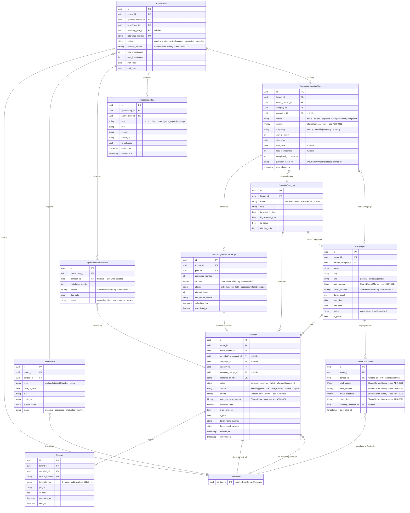
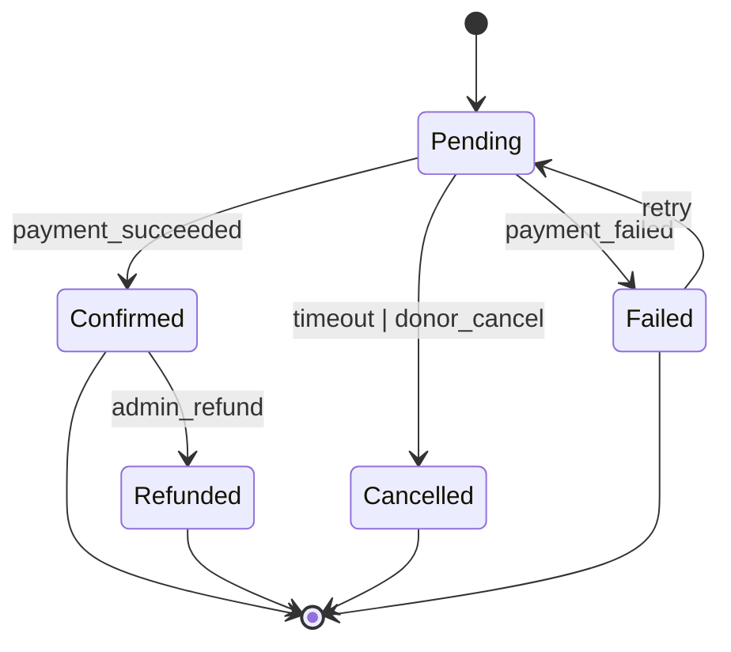
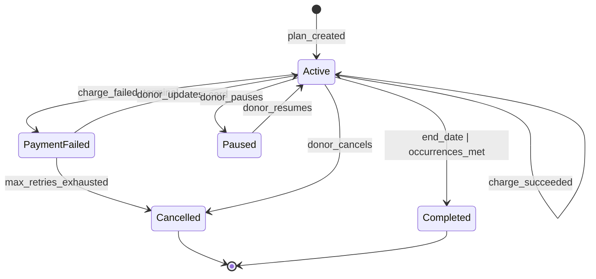
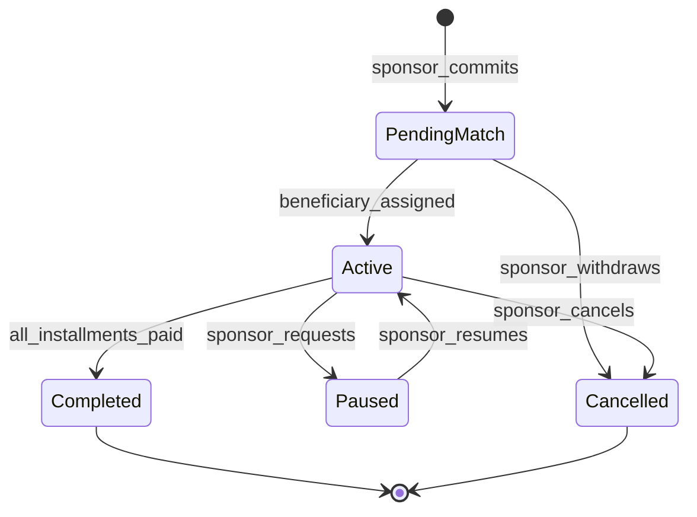

# Fundraising

**Tier:** 3a — NGO Edition
**Module ID:** `fundraising`
**Status:** In Review — Prompt 2 Agent D, 2026-04-22

## Scope

The Fundraising module is the primary revenue engine for non-profit tenants on Nexora. It
unifies three previously separate concerns — one-time donations, recurring donations, and
person-to-person sponsorships — under a single bounded context so that a donor's entire
relationship with the NGO (a one-time Ramadan gift, a monthly standing order, and an
orphan sponsorship) is visible in one module and surfaced through one portal tab.

The module owns:

- Donation capture (manual entry, portal, public website, bank-transfer import).
- A Fundraising-owned recurring charging engine.
- Sponsorship lifecycle — matching sponsor to beneficiary, installment tracking, progress
  updates.
- An opt-in Islamic / seasonal capability covering Zakat calculation, Qurban share
  tracking, and Ramadan seasonal campaigns.

## Out of scope

- Payment-provider integration code. Stripe / iyzico adapters live in
  `Nexora.Infrastructure.Payments` behind `IPaymentProvider` (SharedKernel) and are shared
  with Subscription — see [ADR-0019](../../../decisions/0019-recurring-billing-vs-recurring-donations.md).
- Invoice generation and tax invoicing — owned by Subscription.
- Tax-receipt template rendering — templates live in Reporting; Fundraising triggers
  generation with a template key.
- GL posting of confirmed donations — consumed by Finance (restricted-fund state is
  tracked here, posted there).
- Email / SMS delivery — Notifications owns transport.

## Dependencies

| Module | Type | Purpose |
|---|---|---|
| `identity` | Required | Tenant + user resolution, permissions. |
| `contacts` | Required | Donor / beneficiary / sponsor resolution. All parties are Contacts. |
| `notifications` | Required | Receipts, progress-update delivery, retry-failure emails. |
| `finance` | Required (Tier 3a bundle) | Consumes `DonationConfirmed` for GL posting. |
| `reporting` | Required | Owns receipt templates and annual donor statements. |
| `portal` | Optional | Donor self-service dashboard (extension point per ADR-0017). |
| `subscription` | **None** | Explicitly independent — see ADR-0019. |

---

## 1. Capabilities

The module exposes three core capabilities plus one opt-in extension. All four are part of
a single bounded context and a single database schema; the Islamic/seasonal extension is
gated by a tenant feature flag.

### Capability 1 — One-time donations

Single, non-recurring gifts captured from any of: public website cart, donor portal,
staff-entered manual donation (counter cash, mail cheque), or matched bank-transfer row.

Key behaviours:

- Anonymous option (`is_anonymous` flag) — donor contact is recorded for deduplication
  and statement generation, but public-facing lists suppress the name.
- Guest donations (`is_guest`) — a minimal contact is created on the fly; Contacts merges
  it later if the donor registers.
- Multi-currency per donation; base-currency exchange rate frozen at confirmation time
  per `docs/standards/multi-currency.md`.
- On `DonationConfirmed` → triggers receipt generation (Capability-shared),
  publishes to Finance, logs activity on the donor contact timeline.

### Capability 2 — Recurring donations

Fundraising-owned recurring engine. Each `RecurringDonationPlan` produces one
`RecurringDonationCharge` per cycle, which in turn materialises as a `Donation` record
when the charge succeeds.

Key differences from Subscription's recurring billing (see ADR-0019):

- Output is a **donation receipt**, not an invoice.
- Amount is donor-variable — donor may raise or lower their monthly pledge without
  cancelling; each new cycle reads the current plan amount.
- Campaign / fund attribution can be set per charge (a monthly donor who redirects a
  single month's gift to Gaza relief).
- Failure policy is independent from Subscription's dunning: retry on day 1, 3, 7; on
  exhaustion, mark plan `PaymentFailed`, notify donor, **do not** suspend any service
  (there is nothing to suspend).
- Uses the shared `IPaymentProvider` port for card charging.

### Capability 3 — Sponsorships

Long-horizon 1-to-1 (or 1-to-many, per-program configurable) commitments linking a
sponsor contact to a beneficiary contact. Each sponsorship has a schedule of installments;
each installment is satisfied by a Donation (typically from a RecurringDonationPlan, but
manual ad-hoc satisfaction is supported).

Key behaviours:

- `Beneficiary` is a Contact-linked entity with NGO-specific fields (date of birth, grade
  level, bio, photo, custom fields).
- Sponsorship states: `PendingMatch` → `Active` → (`Paused` ↔ `Active`) →
  `Completed` | `Cancelled`.
- Progress updates (photo, video, grade report, free-form message) are authored by staff
  and delivered through Notifications; sponsors view them in the portal.
- A sponsorship MAY link to a RecurringDonationPlan; the Plan produces the Donations
  which the Sponsorship matches into installments.

### Capability 4 — Islamic / Seasonal Extensions *(opt-in, tenant-togglable)*

Enabled by the tenant feature flag `fundraising.islamic_extensions.enabled` (default:
off). When off, the endpoints and entities in this capability are not exposed and no
migrations diverge — the tables exist but stay empty.

Includes:

- **Zakat calculator** — asset/liability form, dynamic Nisab threshold (fetched daily
  from configured gold/silver price source), 2.5 % calculation, one-click "donate
  calculated amount" into a Zakat category.
- **Qurban share tracking** — one beast (share of 7) per commitment, per-share
  beneficiary assignment, sacrifice-video linkage back to donors post-Eid.
- **Ramadan seasonal campaigns** — a Campaign subtype with daily-breakdown goals, iftar
  day counters, and fast-track UI for high-volume capture during peak days.

These are capability-level, not a separate module — because they reuse Donation,
Campaign, and Receipt plumbing verbatim. A non-Islamic NGO simply leaves the flag off.

---

## 2. Domain Model — Entity-Relationship Diagram

`ContactRef` is a stand-in for foreign keys into the Contacts module; Fundraising stores
only the `contact_id` and resolves display data via `IContactResolver` per module-boundary
rules.

---

## 3. Relationship to Subscription

Recurring donations are **not** a sub-case of Subscription. The two engines diverge on:

| Dimension | Subscription | Fundraising |
|---|---|---|
| Output artefact | Tax invoice | Donation receipt |
| Numbering series | `INV-...` | `REC-...` |
| Amount per cycle | Plan-defined, rarely changes | Donor-variable |
| Anonymity | N/A | First-class (`is_anonymous`) |
| Attribution | Plan | Campaign / fund per charge |
| Failure policy | Dunning → suspend service | Retry → notify; no suspension |
| Consumer module | Finance (invoicing) | Finance (GL), Reporting (annual statements) |

The **shared surface** is the `IPaymentProvider` port in `Nexora.SharedKernel.Payments`:
Stripe and iyzico adapters live in `Nexora.Infrastructure.Payments` and are consumed
identically by both modules. Webhook routing is module-local — each module exposes its
own `/webhooks/{provider}` endpoint and correlates via a metadata ID set at charge
creation.

See [ADR-0019 — Recurring Billing vs Recurring Donations](../../../decisions/0019-recurring-billing-vs-recurring-donations.md).

---

## 4. Tax receipts

Receipts are **template-based**, rendered by Reporting. Fundraising owns the trigger, the
receipt-number series, and the storage record; the template file and the PDF generator
live in Reporting.

- Templates: `tr_bagis_makbuzu` (Turkish donation receipt), `us_501c3` (US 501(c)(3)
  acknowledgement), and additional per-tenant templates.
- Receipt numbering: sequential per tenant per calendar year
  (`REC-{tenantCode}-{YYYY}-{sequence:00000}`).
- Annual donor statements: generated by Reporting reading Fundraising data; triggered at
  tenant-configurable date (typically January for the preceding tax year).

---

## 5. Lifecycles

---

## 6. Use Cases

### UC-FND-001: Capture one-time donation from public website

- Actor: Public website visitor (guest or authenticated donor).
- Flow: visitor builds cart (category + amount), optionally picks a campaign and an
  on-behalf-of contact, chooses anonymity, checks out via Stripe/iyzico. Webhook
  confirms; Fundraising marks `Confirmed`, triggers Receipt, publishes
  `DonationConfirmed`.
- Business rules: minimum amount per tenant config; guest checkout permitted; anonymous
  donations still require an email for the receipt.

### UC-FND-002: Staff records a manual (cash / cheque) donation

- Actor: Staff with `fundraising.donations.write`.
- Flow: staff searches donor (Contacts), enters amount, category, optional campaign,
  marks source = `manual`, saves. System creates a Donation already in `Confirmed` state,
  skips payment flow, triggers Receipt.

### UC-FND-003: Refund a confirmed donation

- Actor: Staff with `fundraising.donations.refund`.
- Flow: staff opens donation, clicks refund, enters reason. System calls
  `IPaymentProvider.RefundAsync`, flips status to `Refunded`, publishes
  `DonationRefunded`. Finance consumes and reverses the GL entry.

### UC-FND-004: Donor sets up a monthly recurring donation via portal

- Actor: Authenticated donor in portal.
- Flow: donor picks category, amount, frequency, day-of-month; tokenises card via
  `IPaymentProvider.TokenizePaymentMethodAsync`; Fundraising creates Plan in `Active`,
  immediately creates first `RecurringDonationCharge`, attempts charge, materialises
  Donation on success.

### UC-FND-005: Recurring charge fails, retry exhausted

- Actor: System (Hangfire recurring job `fundraising:charge-recurring`).
- Flow: day-of-month job picks due Plans, creates Charges, calls `IPaymentProvider`. On
  failure, schedules retry for +2 days, +7 days; on third failure publishes
  `RecurringChargeFailed`, marks Plan `PaymentFailed`, sends donor a card-update link via
  Notifications.

### UC-FND-006: Sponsor commits, beneficiary auto-matched, first installment paid

- Actor: Donor + System.
- Flow: donor picks program (e.g., Orphan Education $100/mo × 12), system creates
  Sponsorship (`PendingMatch`), auto-assigns next available beneficiary, generates 12
  SponsorshipInstallments, creates a linked RecurringDonationPlan, immediate first
  charge. On `DonationConfirmed`, the Charge's donation_id is correlated to installment
  #1 via `recurring_charge_id`; installment → `Paid`.

### UC-FND-007: Staff publishes quarterly progress update to all active sponsors

- Actor: Staff with `fundraising.sponsorships.progress.write`.
- Flow: staff uploads a photo + grade report, targets sponsorships by
  program + `status = Active`, system creates one ProgressUpdate per sponsorship,
  publishes `ProgressUpdateSent` per row, Notifications delivers email/SMS.
- Rule: a program with `requires_quarterly_update = true` alerts staff when a
  sponsorship has had no update in > 90 days.

### UC-FND-008: Bank-transfer import matches pending donations

- Actor: Finance staff with `fundraising.donations.import`.
- Flow: staff uploads bank statement (CSV/MT940). System parses rows; matches by
  (IBAN → known contact) and (amount + approx date → pending Donation). Staff confirms;
  matched Donations flip to `Confirmed`, triggering the full confirmation pipeline.

### UC-FND-009: Donor uses Zakat calculator, converts result to donation *(Capability 4)*

- Actor: Public visitor or portal donor.
- Flow: visitor fills assets/liabilities form; system fetches current gold/silver Nisab,
  calculates 2.5 %, displays result, offers one-click "Donate this amount to our Zakat
  fund". ZakatCalculation row persisted; on donation, `resulting_donation_id` linked.
- Gated by `fundraising.islamic_extensions.enabled`.

### UC-FND-010: Qurban season — assign shares and deliver videos *(Capability 4)*

- Actor: Staff during Eid al-Adha season.
- Flow: staff records sacrificed beasts, divides into 7 shares each, assigns shares to
  Donations in the Qurban campaign, uploads videos, bulk-sends video links to donors via
  Notifications.

---

## 7. API Endpoints

All endpoints are under `/api/v1/fundraising/...`. All list endpoints support the common
query parameters defined in `docs/standards/api-conventions.md`.

### 7.1 Donations

| Method | Path | Permission |
|---|---|---|
| POST | `/donations` | Public (rate-limited) for website; `fundraising.donations.write` for staff |
| GET | `/donations` | `fundraising.donations.read` |
| GET | `/donations/{id}` | `fundraising.donations.read` |
| POST | `/donations/{id}/refund` | `fundraising.donations.refund` |
| GET | `/donations/{id}/receipt` | `fundraising.receipts.read` |

### 7.2 Campaigns

| Method | Path | Permission |
|---|---|---|
| POST / PUT | `/campaigns`, `/campaigns/{id}` | `fundraising.campaigns.write` |
| GET | `/campaigns`, `/campaigns/{id}` | `fundraising.campaigns.read` (public for `is_public` campaigns) |
| GET | `/campaigns/{id}/progress` | Public when `is_public` |

### 7.3 Recurring plans

| Method | Path | Permission |
|---|---|---|
| POST | `/recurring-plans` | Portal (donor self) or `fundraising.recurring.write` |
| GET | `/recurring-plans`, `/{id}` | `fundraising.recurring.read` |
| POST | `/recurring-plans/{id}/pause` | Owner or `fundraising.recurring.write` |
| POST | `/recurring-plans/{id}/resume` | Owner or `fundraising.recurring.write` |
| POST | `/recurring-plans/{id}/cancel` | Owner or `fundraising.recurring.write` |

### 7.4 Sponsorships

| Method | Path | Permission |
|---|---|---|
| POST | `/sponsorships` | `fundraising.sponsorships.write` (staff) or portal-donor |
| GET | `/sponsorships`, `/{id}` | `fundraising.sponsorships.read` |
| POST | `/sponsorships/{id}/pause` `/resume` `/cancel` | `fundraising.sponsorships.write` |
| GET | `/sponsorships/{id}/installments` | `fundraising.sponsorships.read` |

### 7.5 Beneficiaries

| Method | Path | Permission |
|---|---|---|
| POST / PUT | `/beneficiaries` | `fundraising.beneficiaries.write` |
| GET | `/beneficiaries`, `/{id}` | `fundraising.beneficiaries.read` |

### 7.6 Progress updates

| Method | Path | Permission |
|---|---|---|
| POST | `/progress-updates` | `fundraising.sponsorships.progress.write` |
| POST | `/progress-updates/bulk` | `fundraising.sponsorships.progress.write` |

### 7.7 Webhooks

| Method | Path | Auth |
|---|---|---|
| POST | `/webhooks/stripe` | Stripe signature |
| POST | `/webhooks/iyzico` | iyzico signature |

### 7.8 Islamic capability *(feature-gated)*

| Method | Path | Permission |
|---|---|---|
| POST | `/zakat-calculator` | Public |
| GET | `/qurban/shares` | `fundraising.qurban.read` |
| POST | `/qurban/shares/{id}/assign` | `fundraising.qurban.write` |

---

## 8. Events

### 8.1 Produced

| Event | Payload (key fields) | Typical consumers |
|---|---|---|
| `DonationConfirmed` | donationId, tenantId, donorContactId, amount, currency, categoryId, campaignId, isAnonymous | Contacts (timeline, total-given), Finance (GL), Notifications (receipt email), Reporting |
| `DonationRefunded` | donationId, tenantId, reason, amount | Finance (reversal), Contacts |
| `RecurringDonationCreated` | planId, tenantId, donorContactId, amount, frequency | Contacts (tag `RecurringDonor`) |
| `RecurringChargeFailed` | planId, chargeId, attemptCount, lastReason | Notifications (card-update email), Reporting |
| `SponsorshipActivated` | sponsorshipId, sponsorContactId, beneficiaryId | Contacts, Notifications (welcome kit) |
| `SponsorshipEnded` | sponsorshipId, reason (`completed` \| `cancelled`) | Contacts, Notifications |
| `ProgressUpdateSent` | updateId, sponsorshipId, type | Notifications |

### 8.2 Consumed

| Event | Source | Action |
|---|---|---|
| `ContactMerged` | Contacts | Rewrite `donor_contact_id`, `sponsor_contact_id`, `on_behalf_of_contact_id`, beneficiary contact_id to the survivor id. |
| `NotificationDelivered` | Notifications | Mark Receipt `is_sent = true`; mark ProgressUpdate `is_delivered = true`. |

---

## 9. Cross-module integration

| Module | Direction | Surface |
|---|---|---|
| **Contacts** | out + in | Publishes `DonationConfirmed` → Contacts 360 tab shows total given, active recurring plans, sponsorship count. Consumes `ContactMerged`. Resolves contact display data via `IContactResolver`. |
| **Finance** | out | `DonationConfirmed` drives GL journal entries. Restricted-fund accounting is tracked **here** (per-category `is_restricted_fund` + per-campaign restricted pool) and surfaced to Finance via event payload; Finance does not own the classification. |
| **Notifications** | out | Receipt emails, progress-update delivery, recurring-failure retry emails, sponsor welcome kits. |
| **Reporting** | out + in | Reporting owns receipt templates and annual statements; Fundraising supplies data and triggers. |
| **Portal** | out | Donor dashboard (`my-donations`, `my-recurring`, `my-sponsorships`, `my-receipts`) via portal extension per ADR-0017. |
| **Subscription** | none | Shared `IPaymentProvider` only; no events, no data. |

---

## 10. Permission Matrix

Scope: Tenant.

| Resource \ Action | view | create | update | delete | export | import | approve | assign | manage | custom |
|---|:---:|:---:|:---:|:---:|:---:|:---:|:---:|:---:|:---:|---|
| donation | ✓ | ✓ | ✓ | – | ✓ | ✓ | – | – | ✓ | refund |
| campaign | ✓ | ✓ | ✓ | ✓ | – | – | – | – | ✓ | – |
| recurring-plan | ✓ | ✓ | ✓ | – | – | – | – | – | ✓ | pause, resume, cancel |
| sponsorship | ✓ | ✓ | ✓ | – | – | – | – | ✓ | ✓ | pause, resume, cancel |
| beneficiary | ✓ | ✓ | ✓ | ✓ | – | – | – | – | ✓ | – |
| receipt | ✓ | – | – | – | ✓ | – | – | – | – | regenerate |
| progress-update | ✓ | ✓ | ✓ | ✓ | – | – | – | – | – | bulk-send |
| zakat-calc *(cap-4)* | – | ✓ | – | – | – | – | – | – | – | – |
| qurban *(cap-4)* | ✓ | ✓ | ✓ | – | – | – | – | ✓ | ✓ | – |

Registered permission names follow `fundraising.{resource}.{action}`; the full list is
appended to `docs/standards/permissions.md`.

---

## 11. Non-functional requirements

| Requirement | Target |
|---|---|
| Donation submission latency (excl. provider) | < 1 s |
| Webhook processing latency | < 3 s |
| Receipt PDF generation (via Reporting) | < 5 s p95 |
| Recurring-charge job throughput | ≥ 1 000 charges / minute |
| Peak capture load (Ramadan last 10 nights) | 100 donations / minute sustained, 500 / minute burst |
| Recurring job reliability | 99.9 % (at-least-once via Hangfire retries + idempotency key) |
| Portal dashboard load | < 500 ms p95 |

---

## Status

Status: In Review — Prompt 2 Agent D, 2026-04-22

---

> Legacy appendix archived to [docs/_archive/specs-legacy/fundraising-appendix-legacy.md](../../../_archive/specs-legacy/fundraising-appendix-legacy.md).

