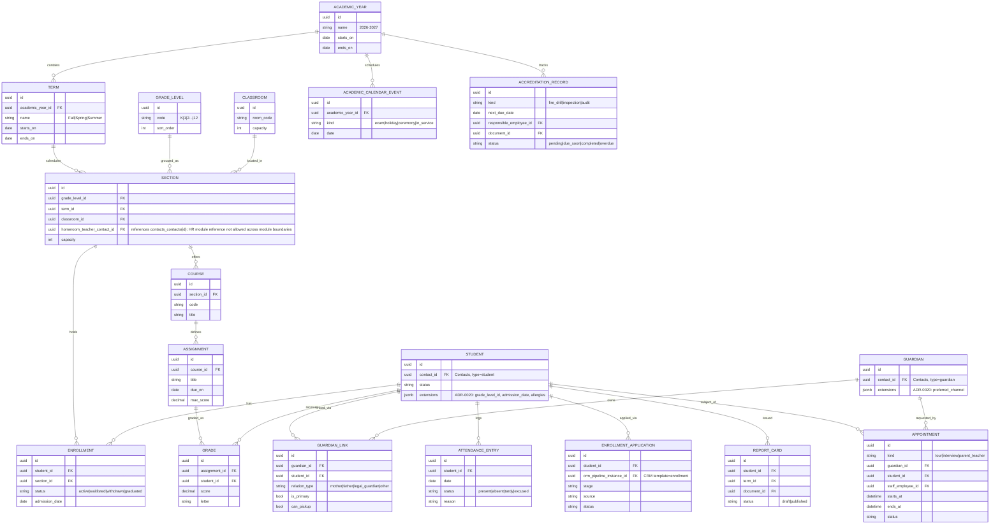
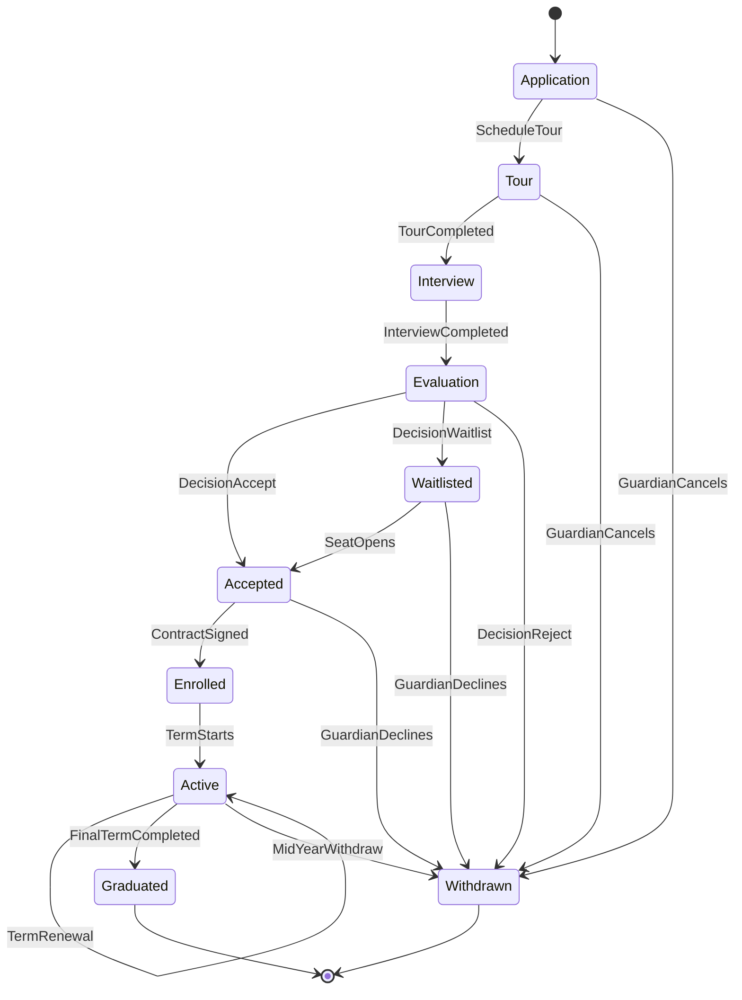

# Education

**Tier:** 3b — Education Edition
**Status:** In Review — Prompt 3 Education Agent, 2026-04-22

## Scope

The Education module is the unified Tier-3b vertical edition for **K-12 school operations**. It provides:

- **Academic structure**: academic year + term management; grade levels; classrooms; sections (`grade × term × room`).
- **Student records**: core identity via Contacts (`contact_type = student`) plus Education-specific payload in `contact_extensions` (per ADR-0020).
- **Enrollment pipeline**: `Application → Tour → Interview → Evaluation → Accepted → Enrolled → Active / Waitlisted / Withdrawn`, implemented as a **CRM pipeline with `type = custom` and template `enrollment`** — Education does **not** fork CRM.
- **Guardian/parent linking**: guardians are Contacts (`contact_type = guardian`); relation metadata (relation type, pickup permission, primary flag) lives in `GuardianLink` plus `contact_extensions` per ADR-0020.
- **Appointment system**: tours, parent-teacher meetings, interviews — uses the Events-NGO **generic event primitives** via the Tier-3a/3b compatibility note (no NGO vocabulary leaks in).
- **Staff availability calendar** (which staff can host tours / parent meetings).
- **Academic calendar**: exams, holidays, ceremonies.
- **Accreditation tracking**: fire drills, inspections, audits — modeled as scheduled records with reminders, tied to Documents for signed evidence.
- **Summer camp management** (seasonal capability).
- **Document collection**: student files, immunization records, enrollment contracts via Documents + Signatures.
- **Waitlist management** on enrollment.
- **Parent/guardian portal**: view children, submit applications, view report cards, manage appointments.
- **Attendance**: references Tier 2.5 HR's Attendance primitives when installed; otherwise owns a native `AttendanceEntry` for students.
- **Gradebook + curriculum (basic)**: courses, assignments, grades, report cards.
- **Staff**: teachers/staff are HR **Employees** with an `education.teacher` HR-compatible extension (NOT a forked entity).

## Out of scope

- **Higher education** features: credit-hours, transcripts to university registrars, degree audits, course catalog for higher-ed.
- **SIS-to-SIS transfer interop** (e.g., Common App, PowerSchool, OneRoster exports).
- **Fee collection** itself — tuition billing lives in **Subscription (Tier 2)**; scholarship giving lives in **Fundraising (Tier 3a)** if that edition is also installed. Education originates the billing event but does not process payments.
- **Bus routing / transport logistics.**
- **Religious / faith-based vocabulary** — this is the secular K-12 edition; the NGO/Islamic edition is a separate Tier-3a module.

## Dependencies

| Tier | Module | Relationship |
|------|--------|--------------|
| 1 | Contacts | Students + Guardians are Contacts; Education-specific fields via `contact_extensions` (ADR-0020) |
| 1 | Identity | Tenant, org, user, permission enforcement |
| 1 | Documents | Enrollment contracts, immunization uploads, report-card PDFs, accreditation evidence |
| 1 | Notifications | Admission decisions, absence alerts, accreditation reminders, progress reports |
| 2 | CRM | Admissions pipeline (template `enrollment`) — Education does NOT fork CRM |
| 2 | Subscription | Tuition billing keyed by grade level (optional but recommended) |
| 2.5 | HR | Teachers/staff are Employees + `education.teacher` HR extension; optional Attendance primitives |
| 3a | Fundraising | Optional — scholarship programs only (tuition is NOT a donation) |
| Cross | Portal Framework | Parent/guardian portal manifest per ADR-0017 |
| Cross | Reporting | Enrollment funnel, attendance, grade distribution, accreditation dashboards |

## Relationship to other tiers

- **Contacts (Tier 1).** Both Student and Parent/Guardian are Contact records. All Education-specific fields — grade level, admission date, allergies / medical notes, guardian relation type, pickup permission — live in `contact_extensions` keyed by `module = 'education'`, **NOT** in the Contacts core entity. This strictly follows **ADR-0020** (Contact extensions by vertical modules).
- **HR (Tier 2.5).** Teachers and school staff are normal HR **Employees**. Education adds a `teacher` extension payload (homeroom grade, subjects taught, teaching license ID) via the HR-compatible extension channel — it does not create a parallel staff table.
- **CRM (Tier 2).** The admissions pipeline is a CRM pipeline instance with `type = custom` and template identifier `enrollment`. CRM's pipeline engine, stage transition events, and lead record are reused wholesale. Education listens to CRM events and materializes Education-side artifacts (EnrollmentApplication, Enrollment).
- **Documents.** Student file, immunization record, signed enrollment contract, signed accreditation evidence.
- **Fundraising (Tier 3a).** If a tenant has both Editions enabled, **tuition-as-donation is explicitly NOT supported** — tuition is a Subscription. Fundraising only applies to scholarship programs (donation → scholarship award → discount on Subscription).

## Entities

**ADR-0020 usage notes (explicit):**
- `Student.extensions` — keyed by `module = 'education'`, stores grade level hint, admission date, dietary restrictions, allergies, medical flags.
- `Guardian.extensions` — keyed by `module = 'education'`, stores preferred comms channel, employer (for emergency), secondary pickup persons.
- `GUARDIAN_LINK` is an Education-owned join — but the relation type is ALSO surfaced on the Contact 360 via `contact_extensions` so Contacts-native queries see it.
- Teacher role on HR Employee uses the HR-compatible extension, also ADR-0020-aligned.

## Enrollment pipeline — state diagram

## Events produced

| Event | Trigger |
|-------|---------|
| `Education.ApplicationSubmitted` | EnrollmentApplication created (portal or staff) |
| `Education.ApplicationAdvanced` | Pipeline stage transition |
| `Education.ApplicationAccepted` | Evaluation → Accepted decision |
| `Education.StudentEnrolled` | Enrollment created (contract signed) |
| `Education.StudentWithdrawn` | Enrollment → Withdrawn |
| `Education.AttendanceRecorded` | AttendanceEntry persisted |
| `Education.GradePosted` | Grade persisted by teacher |
| `Education.ReportCardPublished` | ReportCard.status → published |
| `Education.GuardianLinked` | GuardianLink created |
| `Education.AccreditationDue` | AccreditationRecord crosses `due_soon` threshold |

## Events consumed

| Event | Source | Action |
|-------|--------|--------|
| `Contacts.ContactMerged` | Contacts | Rewrite `student.contact_id` / `guardian.contact_id` references; preserve extensions |
| `Documents.DocumentSigned` | Documents | If document is an enrollment contract → transition `Accepted → Enrolled` |
| `HR.EmployeeDeactivated` | HR | Unassign affected teacher from Sections + open Appointments; flag for reassignment |
| `Notifications.NotificationDelivered` | Notifications | Persist parent-communication receipt on Guardian timeline |

## Cross-module integration

- **Contacts 360.** On a Guardian contact, surface: linked students, active applications, upcoming appointments, open fees (cross-edition — only if Subscription is installed for tuition).
- **Documents.** Enrollment contract templates, immunization uploads, report card PDFs, accreditation evidence (signed inspection reports).
- **Notifications.** Admission decisions, absence alerts to guardians, accreditation reminders, progress reports — all via `lockey_` templates.
- **Portal Framework (ADR-0017).** Parent/guardian portal is declared as a portal manifest: routes `my-children`, `apply`, `my-appointments`, `report-cards`.
- **Reporting.** Enrollment funnel (by stage), attendance trends (daily / weekly / per-section), grade distributions (per course / per term), accreditation dashboard (due-soon / overdue counts).
- **Subscription (if installed).** Tuition billing uses Subscription plans keyed by **GradeLevel**; `Education.StudentEnrolled` → Subscription activation; `Education.StudentWithdrawn` → prorated cancellation.

## API endpoints (category-level)

**Admin / staff:**
- `/api/v1/education/academic-years`
- `/api/v1/education/terms`
- `/api/v1/education/grade-levels`
- `/api/v1/education/classrooms`
- `/api/v1/education/sections`
- `/api/v1/education/students`
- `/api/v1/education/guardians`
- `/api/v1/education/enrollments`
- `/api/v1/education/applications`
- `/api/v1/education/appointments`
- `/api/v1/education/courses`
- `/api/v1/education/assignments`
- `/api/v1/education/grades`
- `/api/v1/education/report-cards`
- `/api/v1/education/attendance`
- `/api/v1/education/accreditation`

**Guardian portal:**
- `/api/v1/education/portal/my-children`
- `/api/v1/education/portal/apply`
- `/api/v1/education/portal/my-appointments`
- `/api/v1/education/portal/report-cards`

## Use cases

### UC-EDU-001 — Online application via portal
Guardian submits the public application form → Contacts creates (or merges) guardian + applicant student → `contact_extensions` payloads persisted per ADR-0020 → `EnrollmentApplication` created → CRM pipeline (template `enrollment`) stage = Application → `Education.ApplicationSubmitted` emitted → Notifications sends acknowledgement.

### UC-EDU-002 — Schedule tour
Staff picks an open slot from the tour availability calendar (staff availability + classroom capacity) → `Appointment(kind=tour)` created → reminders via Notifications to guardian + staff at T-24h and T-1h → on completion, pipeline advances to Interview.

### UC-EDU-003 — Admission decision and contract
Admission committee posts Evaluation → Accepted → contract generated from Documents template → sent for signature → on `Documents.DocumentSigned`, Education auto-transitions the Application to Enrolled, creates `Enrollment` in the next Term's Section, and emits `Education.StudentEnrolled` (→ Subscription activates tuition).

### UC-EDU-004 — Daily attendance
Homeroom teacher opens the section roster → taps status per student → `AttendanceEntry` persisted → for each `absent` without `excused`, Notifications sends a templated alert to the primary guardian (per `GuardianLink.is_primary`).

### UC-EDU-005 — End-of-term grades and report cards
Teachers post grades per Assignment → term close triggers report-card generation job → ReportCard records created in `draft` → reviewer publishes → `Education.ReportCardPublished` → Documents renders PDF → available in guardian portal.

### UC-EDU-006 — Accreditation cycle
`AccreditationRecord(kind=fire_drill, next_due_date=...)` approaches threshold → `Education.AccreditationDue` → reminder to responsible employee → employee conducts drill, uploads signed inspection document → record → `completed`, `next_due_date` advances.

### UC-EDU-007 — Student withdrawal
Staff triggers withdrawal → `Enrollment.status = withdrawn` → `Education.StudentWithdrawn` → Subscription prorates and cancels tuition → student files archived per retention policy → pipeline closed.

## Non-functional

- **PII sensitivity:** **HIGH** (student minors). All student endpoints require org-scoped permissions + audit.
- **COPPA / FERPA awareness (US).** Guardian-of-record required for any consent-bearing operation on a minor student; data minimization on portal responses.
- **KVKK (TR).** Explicit purpose limitation; guardian consent recorded on application.
- **Retention:** See retention matrix below.

### Retention Matrix

| Data Category | Retention Period | Legal Basis | Deletion Method |
|---|---|---|---|
| Student academic records | 10 years post-graduation | FERPA (US), KVKK Art.7 | Soft-delete → hard-delete after retention period |
| Minor personal data (name, DOB) | Duration of enrollment + 5 years | COPPA (under-13), KVKK | Anonymize on GDPR request; hard-delete after retention |
| Parent/guardian contact data | Duration of enrollment + 2 years | KVKK Art.5 | Soft-delete → hard-delete |
| Attendance records | 5 years | FERPA, local regulations | Soft-delete → hard-delete |
| Disciplinary records | 3 years post-graduation | FERPA | Hard-delete after retention period |
| Health/medical records | As required by local law (min 10 years) | HIPAA-adjacent, KVKK | Encrypted at rest; hard-delete on request + retention met |

> Tenant configuration key: `education.retention.student_records_years` (default: 10).
> GDPR/KVKK deletion requests for minor data are processed within 30 days via GDPR Deletion flow (ADR-008).
> COPPA: parental consent required for all data collection for students under 13. Consent records retained for duration of enrollment + 5 years.
- **Localization:** all user-facing strings via `lockey_education_*` keys (per LOCALIZATION_STANDARDS.md). Backend returns keys only.
- **Multi-currency:** tuition amount inherited from Subscription plan; Education does not persist money independently.
- **Performance targets:** application submission `< 1.5s p95`; attendance entry `< 200ms p95`; report-card generation (per student) `< 2s`.

## Permissions

| Permission | Purpose |
|------------|---------|
| `education.students.read` | View student rosters / profiles |
| `education.students.write` | Create/update student records |
| `education.students.admin` | Manage all student data incl. sensitive fields |
| `education.guardians.read` | View guardian records |
| `education.guardians.write` | Create/update guardian records + links |
| `education.enrollments.read` | View enrollments |
| `education.enrollments.manage` | Transition enrollment states |
| `education.applications.read` | View applications |
| `education.applications.manage` | Advance application stages |
| `education.applications.decision` | Issue Accept / Waitlist / Reject decisions |
| `education.attendance.read` | View attendance |
| `education.attendance.record` | Post attendance entries |
| `education.grades.read` | View grades |
| `education.grades.post` | Enter grades |
| `education.grades.publish` | Publish report cards |
| `education.accreditation.read` | View accreditation records |
| `education.accreditation.manage` | Create/update/close accreditation records |
| `education.appointments.read` | View appointments |
| `education.appointments.schedule` | Create/reschedule/cancel appointments |
| `education.portal.self-view` | Guardian portal — view only their own children |

## Standards Additions

### Permissions matrix addition

The permissions listed above MUST be registered via the centralized seeding mechanism (ADR-0004). All permissions are **organization-scoped** and enforced via the standard RBAC pipeline (ADR-0006). The guardian-portal permission `education.portal.self-view` is additionally gated by **relationship scope**: the backend MUST resolve the calling user → Guardian → `GuardianLink.student_id`s and filter every response to that set.

### Audit coverage matrix

| Operation | Audit level | Notes |
|-----------|-------------|-------|
| Admission decision (Accept / Waitlist / Reject) | **MUST** | Records actor, decision, reason, timestamp; immutable |
| Enrollment state change (Enrolled / Withdrawn / Graduated) | **MUST** | With prior/new state, section, effective date |
| Grade post + Report-card publish | **MUST** | Teacher identity, assignment, score, timestamp; amendments logged separately |
| Accreditation record create / close | **MUST** | Document reference, responsible staff, outcome |
| GuardianLink create / delete | **MUST** | Relation type, pickup flag changes |
| Student extension write (ADR-0020 payload) | **MUST** | PII-sensitive fields (allergies, medical) |
| Attendance record create / edit | **SHOULD** | High volume; sampled audit acceptable with full audit on edits |
| Appointment schedule / cancel | **SHOULD** | |
| Read operations (lists / details) | **MAY** | Per tenant policy; default off; guardian-portal reads MAY be logged |

Audit events follow the standard `audit-coverage.md` envelope: `(tenant_id, org_id, actor_user_id, subject_type, subject_id, action, before, after, correlation_id, occurred_at)`.

### Localization additions

All Education-surface `lockey_` keys namespace under `lockey_education_*` — e.g., `lockey_education_application_submitted_success`, `lockey_education_validation_grade_required`. Both `en` and `tr` translations MUST exist at minimum (per LOCALIZATION_STANDARDS.md).

### Multi-currency

Education itself does not persist monetary values. Tuition amounts are owned by Subscription plans and displayed read-only on Education screens via Subscription's formatting utilities.

---

Status: In Review — 2026-04-22

---

> Legacy appendix archived to [docs/_archive/specs-legacy/education-appendix-legacy.md](../../../_archive/specs-legacy/education-appendix-legacy.md).
