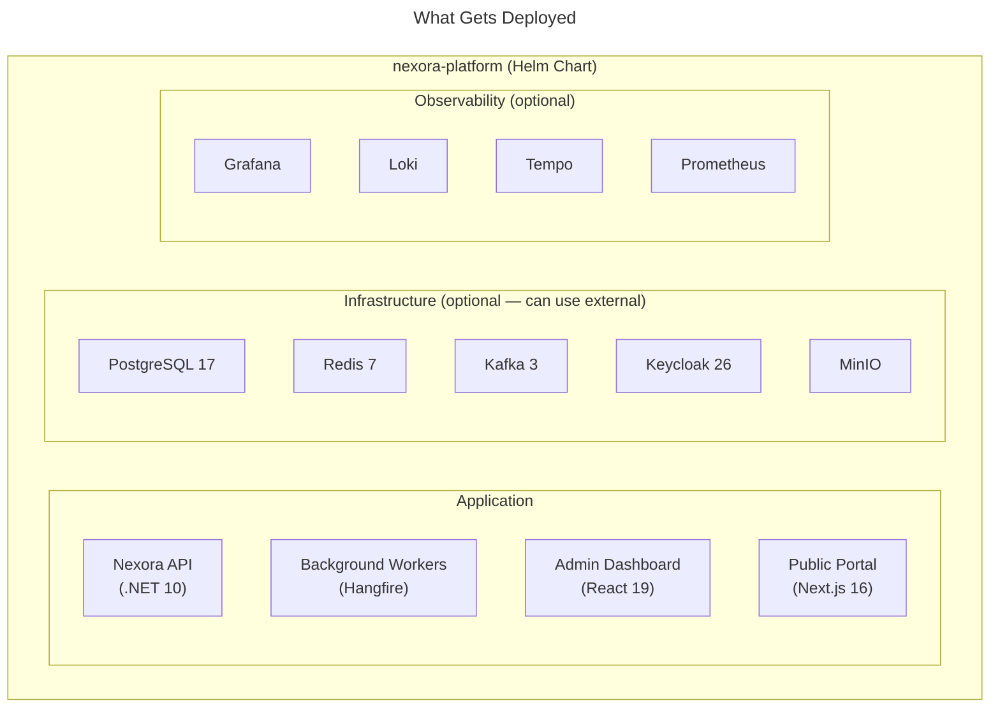
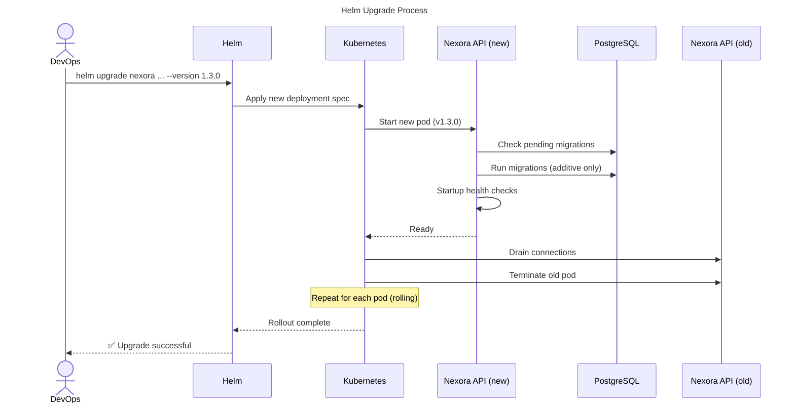

# Nexora - Helm Installation Guide

## 1. Overview

Nexora is delivered as a **Helm chart** that deploys the entire platform stack on any Kubernetes cluster. This guide covers installation from zero to a running platform.



## 2. Prerequisites

| Requirement | Minimum | Recommended |
|-------------|---------|-------------|
| Kubernetes | 1.28+ | 1.30+ |
| Helm | 3.14+ | 3.16+ |
| kubectl | Compatible with cluster | Latest |
| CPU | 4 cores | 8+ cores |
| RAM | 8 GB | 16+ GB |
| Storage | 50 GB SSD | 200+ GB SSD |
| Ingress | Any (NGINX, Traefik) | APISIX |

### Supported Kubernetes Distributions

| Distribution | Tested | Notes |
|-------------|--------|-------|
| AWS EKS | ✅ | Recommended for production |
| Azure AKS | ✅ | |
| Google GKE | ✅ | |
| DigitalOcean DOKS | ✅ | Good for small deployments |
| k3s | ✅ | Good for development / small orgs |
| Minikube | ✅ | Development only |
| Bare-metal (kubeadm) | ✅ | Requires manual storage provisioner |

## 3. Quick Start (Development)

Get Nexora running locally in under 5 minutes:

```bash
# 1. Add the Nexora Helm repository
helm repo add nexora https://charts.nexora.app
helm repo update

# 2. Install with development defaults (all-in-one, embedded infra)
helm install nexora nexora/nexora-platform \
  --namespace nexora \
  --create-namespace \
  --set global.environment=development \
  --set global.domain=localhost

# 3. Wait for all pods to be ready
kubectl -n nexora wait --for=condition=ready pod --all --timeout=300s

# 4. Access the platform
echo "Admin:  https://localhost/admin"
echo "Portal: https://localhost/portal"
echo "API:    https://localhost/api/v1"

# 5. Get the initial admin credentials
kubectl -n nexora get secret nexora-admin-credentials \
  -o jsonpath='{.data.password}' | base64 -d
```

That's it. One command installs everything.

## 4. Production Installation

### 4.1 Step 1: Prepare values.yaml

Create a `values.yaml` file tailored to your environment:

```yaml
# =============================================================================
# Nexora Platform - Production Configuration
# =============================================================================

global:
  environment: production
  domain: nexora.mycompany.com     # Your domain
  tls:
    enabled: true
    issuer: letsencrypt-prod       # cert-manager issuer name
  imageRegistry: registry.nexora.app  # or your private registry

# =============================================================================
# License
# =============================================================================
license:
  key: "LIC-XXXX-XXXX-XXXX"       # Your license key
  # Or reference a Kubernetes secret:
  # existingSecret: nexora-license

# =============================================================================
# Application
# =============================================================================
api:
  replicas: 3                       # Minimum 2 for HA
  resources:
    requests:
      cpu: 500m
      memory: 512Mi
    limits:
      cpu: 2000m
      memory: 2Gi
  autoscaling:
    enabled: true
    minReplicas: 3
    maxReplicas: 10
    targetCPUUtilization: 70

worker:
  replicas: 2
  resources:
    requests:
      cpu: 250m
      memory: 256Mi
    limits:
      cpu: 1000m
      memory: 1Gi

admin:
  replicas: 2

portal:
  replicas: 2

# =============================================================================
# Database (PostgreSQL)
# =============================================================================
# Option A: Use embedded PostgreSQL (Helm subchart)
postgresql:
  enabled: true                     # Set to false to use external DB
  auth:
    postgresPassword: "CHANGE_ME"   # Or use existingSecret
    database: nexora
  primary:
    persistence:
      size: 100Gi
      storageClass: gp3             # AWS EBS GP3
    resources:
      requests:
        cpu: 1000m
        memory: 2Gi
  readReplicas:
    replicaCount: 2                 # Read replicas for queries

# Option B: Use external PostgreSQL
# postgresql:
#   enabled: false
# externalDatabase:
#   host: your-rds-instance.region.rds.amazonaws.com
#   port: 5432
#   database: nexora
#   username: nexora
#   existingSecret: nexora-db-credentials  # Secret with 'password' key

# =============================================================================
# Cache (Redis)
# =============================================================================
redis:
  enabled: true                     # Set to false for external Redis
  auth:
    password: "CHANGE_ME"
  master:
    persistence:
      size: 10Gi
  replica:
    replicaCount: 2

# Option B: External Redis
# redis:
#   enabled: false
# externalRedis:
#   host: your-elasticache.region.cache.amazonaws.com
#   port: 6379
#   existingSecret: nexora-redis-credentials

# =============================================================================
# Message Broker (Kafka)
# =============================================================================
kafka:
  enabled: true                     # Set to false for external Kafka
  replicaCount: 3
  persistence:
    size: 50Gi

# Option B: External Kafka (e.g., Confluent Cloud, MSK)
# kafka:
#   enabled: false
# externalKafka:
#   brokers: "broker1:9092,broker2:9092,broker3:9092"
#   sasl:
#     enabled: true
#     existingSecret: nexora-kafka-credentials

# =============================================================================
# Identity Provider (Keycloak)
# =============================================================================
keycloak:
  enabled: true
  auth:
    adminUser: admin
    adminPassword: "CHANGE_ME"
  postgresql:
    enabled: false                  # Use main PostgreSQL
  externalDatabase:
    host: "postgresql"              # Internal service name
    database: keycloak
  ingress:
    enabled: true
    hostname: auth.nexora.mycompany.com

# Option B: External Keycloak
# keycloak:
#   enabled: false
# externalKeycloak:
#   url: https://your-keycloak.mycompany.com
#   adminUser: admin
#   existingSecret: nexora-keycloak-credentials

# =============================================================================
# Object Storage (MinIO)
# =============================================================================
minio:
  enabled: true
  auth:
    rootUser: nexora
    rootPassword: "CHANGE_ME"
  persistence:
    size: 200Gi

# Option B: External S3-compatible storage
# minio:
#   enabled: false
# externalStorage:
#   provider: s3                    # s3, gcs, azure-blob
#   bucket: nexora-files
#   region: us-east-1
#   existingSecret: nexora-s3-credentials

# =============================================================================
# Ingress
# =============================================================================
ingress:
  enabled: true
  className: nginx                  # or apisix, traefik
  annotations:
    cert-manager.io/cluster-issuer: letsencrypt-prod
    nginx.ingress.kubernetes.io/proxy-body-size: "100m"
  hosts:
    - host: nexora.mycompany.com
      paths:
        - path: /api
          service: nexora-api
        - path: /admin
          service: nexora-admin
        - path: /
          service: nexora-portal
    - host: auth.nexora.mycompany.com
      paths:
        - path: /
          service: nexora-keycloak
  tls:
    - secretName: nexora-tls
      hosts:
        - nexora.mycompany.com
        - auth.nexora.mycompany.com

# =============================================================================
# Observability (Optional but Recommended)
# =============================================================================
observability:
  enabled: true
  grafana:
    enabled: true
    adminPassword: "CHANGE_ME"
    ingress:
      enabled: true
      host: monitoring.nexora.mycompany.com
  prometheus:
    enabled: true
  loki:
    enabled: true
    persistence:
      size: 50Gi
  tempo:
    enabled: true

# =============================================================================
# Initial Tenant (Created on First Install)
# =============================================================================
initialTenant:
  enabled: true
  name: "My Organization"
  slug: "myorg"
  adminEmail: "admin@mycompany.com"
  locale: "en"
  timezone: "UTC"
  modules:
    - crm
    - contacts
    - documents
    - notifications
```

### 4.2 Step 2: Install

```bash
# Create namespace
kubectl create namespace nexora

# Create secrets (don't put passwords in values.yaml for production)
kubectl -n nexora create secret generic nexora-db-credentials \
  --from-literal=password='YOUR_SECURE_DB_PASSWORD'

kubectl -n nexora create secret generic nexora-redis-credentials \
  --from-literal=password='YOUR_SECURE_REDIS_PASSWORD'

kubectl -n nexora create secret generic nexora-license \
  --from-literal=key='LIC-XXXX-XXXX-XXXX'

# Install
helm install nexora nexora/nexora-platform \
  --namespace nexora \
  --values values.yaml \
  --timeout 10m \
  --wait
```

### 4.3 Step 3: Verify

```bash
# Check all pods are running
kubectl -n nexora get pods

# Expected output:
# NAME                              READY   STATUS    RESTARTS   AGE
# nexora-api-7d8f9b6c4-abc12       1/1     Running   0          5m
# nexora-api-7d8f9b6c4-def34       1/1     Running   0          5m
# nexora-api-7d8f9b6c4-ghi56       1/1     Running   0          5m
# nexora-worker-5c4d3b2a1-jkl78    1/1     Running   0          5m
# nexora-worker-5c4d3b2a1-mno90    1/1     Running   0          5m
# nexora-admin-6e5f4d3c2-pqr12     1/1     Running   0          5m
# nexora-portal-8g7h6i5j4-stu34    1/1     Running   0          5m
# nexora-postgresql-0               1/1     Running   0          5m
# nexora-redis-master-0             1/1     Running   0          5m
# nexora-kafka-0                    1/1     Running   0          5m
# nexora-keycloak-0                 1/1     Running   0          5m
# nexora-minio-0                    1/1     Running   0          5m

# Run health check
kubectl -n nexora exec deploy/nexora-api -- nexora health

# Get admin login URL and credentials
echo "Login: https://nexora.mycompany.com/admin"
kubectl -n nexora get secret nexora-admin-credentials \
  -o jsonpath='{.data.password}' | base64 -d
```

## 5. Configuration Scenarios

### 5.1 Small Organization (NGO, 10-50 users)

```yaml
# small-org-values.yaml
global:
  environment: production
  domain: nexora.myorg.org

api:
  replicas: 2
  resources:
    limits: { cpu: 1000m, memory: 1Gi }

worker:
  replicas: 1

postgresql:
  enabled: true
  primary:
    persistence: { size: 20Gi }
  readReplicas:
    replicaCount: 0                 # No read replicas needed

redis:
  enabled: true
  replica:
    replicaCount: 0                 # No replicas needed

kafka:
  enabled: true
  replicaCount: 1                   # Single node OK for small orgs

observability:
  enabled: false                    # Optional for small orgs

initialTenant:
  enabled: true
  name: "My NGO"
  slug: "myngo"
  modules: [crm, donations, documents]
```

**Resources**: ~4 CPU cores, ~8 GB RAM, ~50 GB storage

### 5.2 Medium Organization (School, 50-200 users)

```yaml
# medium-org-values.yaml
global:
  environment: production
  domain: nexora.myschool.edu

api:
  replicas: 3
  autoscaling:
    enabled: true
    maxReplicas: 6

worker:
  replicas: 2

postgresql:
  enabled: true
  primary:
    persistence: { size: 100Gi }
  readReplicas:
    replicaCount: 1

redis:
  enabled: true
  replica:
    replicaCount: 1

kafka:
  enabled: true
  replicaCount: 3

observability:
  enabled: true

initialTenant:
  enabled: true
  name: "My School"
  slug: "myschool"
  modules: [crm, education, subscription, documents, events, surveys]
```

**Resources**: ~8 CPU cores, ~16 GB RAM, ~200 GB storage

### 5.3 Large Multi-Tenant (SaaS Provider)

```yaml
# large-saas-values.yaml
global:
  environment: production
  domain: app.nexora.com

api:
  replicas: 5
  autoscaling:
    enabled: true
    maxReplicas: 20
  resources:
    limits: { cpu: 4000m, memory: 4Gi }

worker:
  replicas: 4
  autoscaling:
    enabled: true
    maxReplicas: 10

# Use managed external services for production SaaS
postgresql:
  enabled: false
externalDatabase:
  host: nexora-prod.cluster-xyz.us-east-1.rds.amazonaws.com
  port: 5432
  database: nexora
  existingSecret: nexora-rds-credentials

redis:
  enabled: false
externalRedis:
  host: nexora-prod.abc123.ng.0001.use1.cache.amazonaws.com
  port: 6379

kafka:
  enabled: false
externalKafka:
  brokers: "b-1.nexora.abc.kafka.us-east-1.amazonaws.com:9092,..."
  sasl:
    enabled: true
    existingSecret: nexora-msk-credentials

minio:
  enabled: false
externalStorage:
  provider: s3
  bucket: nexora-prod-files
  region: us-east-1
  existingSecret: nexora-s3-credentials

observability:
  enabled: true
  grafana:
    ingress:
      host: monitoring.nexora.com

initialTenant:
  enabled: false                    # Tenants created via API
```

**Resources**: ~20 CPU cores, ~40 GB RAM, managed database/cache/storage

## 6. Upgrading

### 6.1 Standard Upgrade

```bash
# 1. Check available versions
helm search repo nexora/nexora-platform --versions

# 2. Review release notes
helm show readme nexora/nexora-platform --version 1.3.0

# 3. Upgrade (rolling update, zero downtime)
helm upgrade nexora nexora/nexora-platform \
  --namespace nexora \
  --values values.yaml \
  --version 1.3.0 \
  --timeout 10m \
  --wait

# 4. Verify
kubectl -n nexora get pods
kubectl -n nexora exec deploy/nexora-api -- nexora health
```

### 6.2 Upgrade Flow



### 6.3 Rollback

```bash
# If something goes wrong
helm rollback nexora --namespace nexora

# Or to a specific revision
helm history nexora --namespace nexora
helm rollback nexora 3 --namespace nexora
```

## 7. Uninstalling

```bash
# Remove Nexora (preserves PVCs by default)
helm uninstall nexora --namespace nexora

# To also delete persistent data (DESTRUCTIVE):
kubectl -n nexora delete pvc --all

# Delete namespace
kubectl delete namespace nexora
```

## 8. Troubleshooting

### Common Issues

| Symptom | Cause | Fix |
|---------|-------|-----|
| Pods in CrashLoopBackOff | Database connection failed | Check DB credentials in secret, verify DB is accessible |
| 502 Bad Gateway | API pods not ready yet | Wait for readiness probe, check `kubectl logs` |
| Keycloak login fails | Realm not created | Check Keycloak logs, verify initial tenant config |
| "Module not licensed" | License key issue | Run `nexora license info`, verify key in secret |
| Slow queries | Missing read replicas | Enable PostgreSQL read replicas |
| Storage full | MinIO/PG disk full | Increase PVC size, add retention policies |

### Diagnostic Commands

```bash
# Pod logs
kubectl -n nexora logs deploy/nexora-api --tail=100 -f
kubectl -n nexora logs deploy/nexora-worker --tail=100 -f

# Database connectivity
kubectl -n nexora exec deploy/nexora-api -- \
  nexora health --component database

# Full system health
kubectl -n nexora exec deploy/nexora-api -- nexora health --verbose

# Resource usage
kubectl -n nexora top pods

# Events (for scheduling/startup issues)
kubectl -n nexora get events --sort-by='.lastTimestamp'
```

## 9. Air-Gapped Installation

For environments with no internet access:

```bash
# On a machine with internet access:

# 1. Pull all container images
nexora-cli images export --version 1.3.0 --output nexora-images.tar.gz

# 2. Download Helm chart
helm pull nexora/nexora-platform --version 1.3.0

# Transfer files to air-gapped environment

# On the air-gapped machine:

# 3. Load images into local registry
nexora-cli images import --from nexora-images.tar.gz \
  --registry registry.internal.mycompany.com

# 4. Install from local chart
helm install nexora ./nexora-platform-1.3.0.tgz \
  --namespace nexora \
  --create-namespace \
  --values values.yaml \
  --set global.imageRegistry=registry.internal.mycompany.com

# 5. Activate offline license
nexora license activate --offline LICENSE_KEY
```
