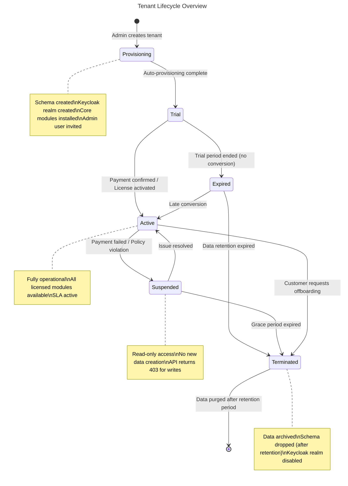
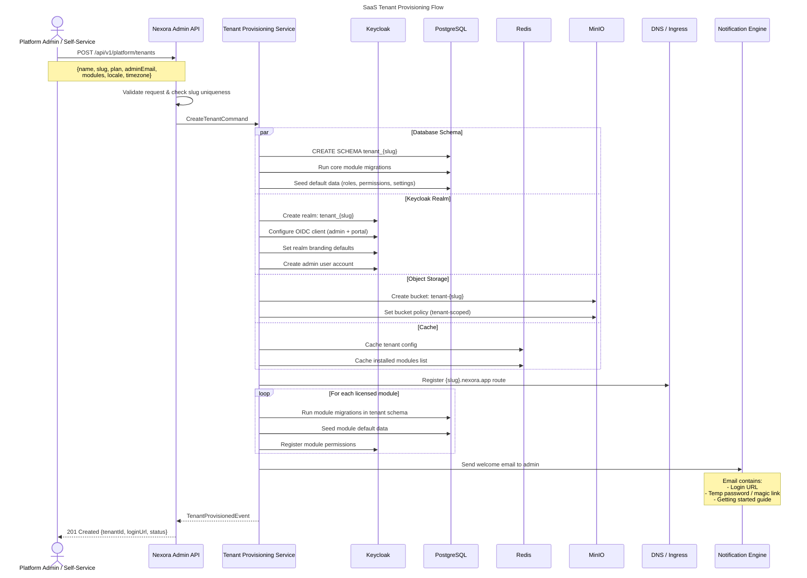
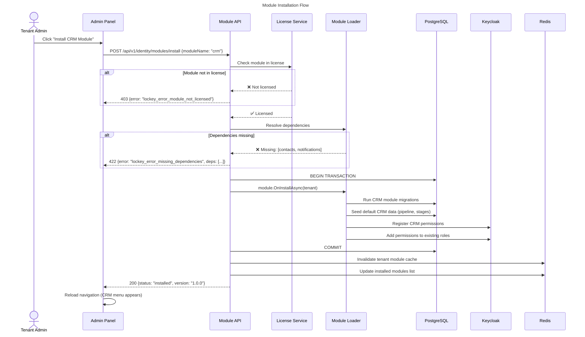
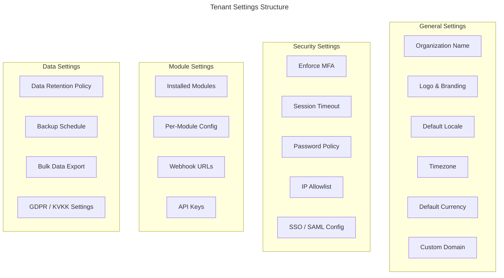
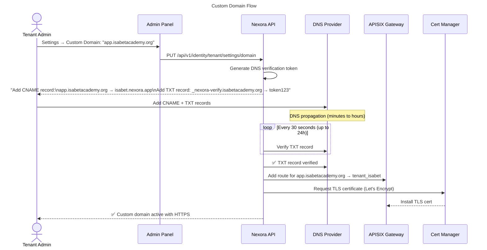
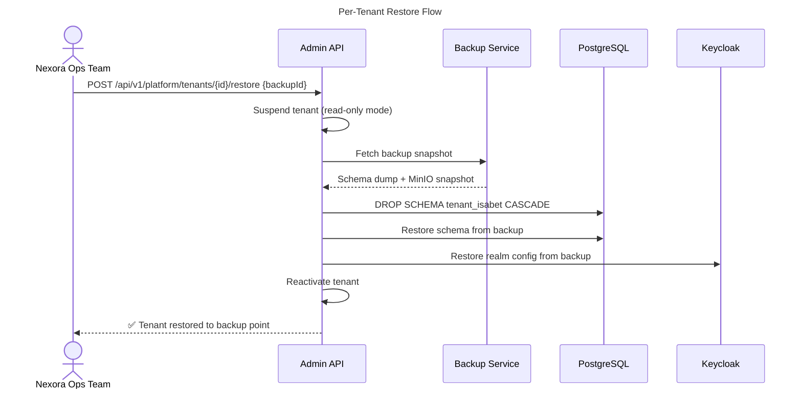
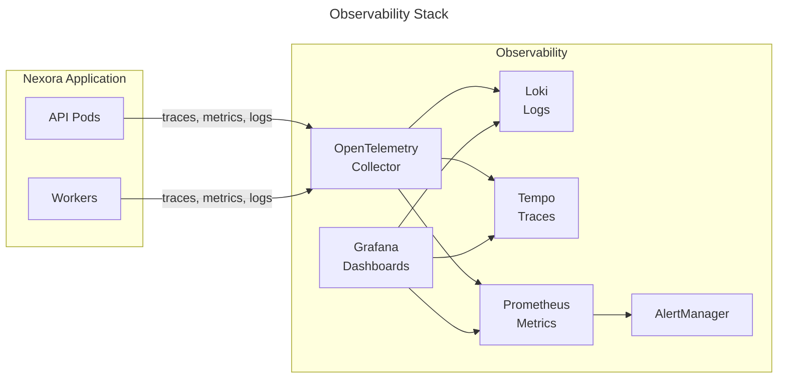
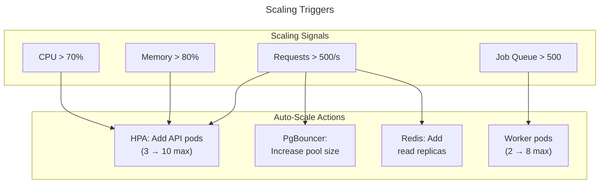
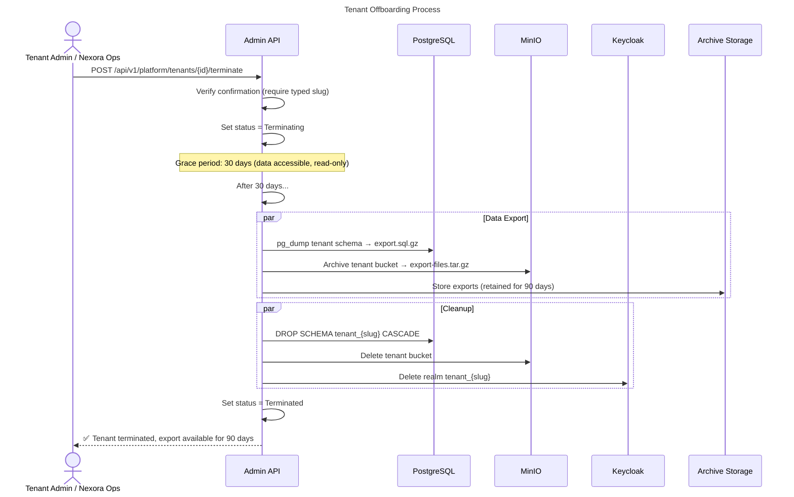

# Nexora - Tenant Provisioning & Operations

## 1. Overview

This document covers the complete lifecycle of a tenant in Nexora — from initial provisioning to eventual offboarding. It applies to all deployment models (Cloud, Dedicated, Self-Hosted) with model-specific differences noted.



## 2. Tenant Provisioning Flow

### 2.1 Cloud (SaaS) — Automated Provisioning

End-to-end provisioning happens automatically when a new organization signs up or a platform admin creates a tenant.



### 2.2 Provisioning Steps in Detail

#### Step 1: Database Schema Creation

```sql
-- 1. Create isolated schema for tenant
CREATE SCHEMA IF NOT EXISTS tenant_isabet;

-- 2. Set search path for migration context
SET search_path TO tenant_isabet;

-- 3. Core module tables (always created)
-- Identity tables
CREATE TABLE identity_users (...);
CREATE TABLE identity_roles (...);
CREATE TABLE identity_permissions (...);
CREATE TABLE identity_organizations (...);
CREATE TABLE identity_user_organizations (...);

-- Contact tables
CREATE TABLE contacts_contacts (...);
CREATE TABLE contacts_addresses (...);
CREATE TABLE contacts_tags (...);

-- Notification tables
CREATE TABLE notifications_templates (...);
CREATE TABLE notifications_notifications (...);

-- Document tables
CREATE TABLE documents_folders (...);
CREATE TABLE documents_documents (...);

-- 4. Module-specific tables (based on license)
-- Only if CRM module is licensed:
CREATE TABLE crm_leads (...);
CREATE TABLE crm_pipelines (...);
-- etc.
```

#### Step 2: Keycloak Realm Setup

```json
{
  "realm": "tenant_isabet",
  "displayName": "Isabet Academy",
  "enabled": true,
  "loginTheme": "nexora",
  "internationalizationEnabled": true,
  "supportedLocales": ["en", "tr", "ar"],
  "defaultLocale": "en",
  "clients": [
    {
      "clientId": "nexora-admin",
      "protocol": "openid-connect",
      "publicClient": true,
      "redirectUris": ["https://isabet.nexora.app/*"],
      "webOrigins": ["https://isabet.nexora.app"]
    },
    {
      "clientId": "nexora-portal",
      "protocol": "openid-connect",
      "publicClient": true,
      "redirectUris": ["https://isabet.nexora.app/portal/*"],
      "webOrigins": ["https://isabet.nexora.app"]
    }
  ],
  "roles": {
    "realm": [
      { "name": "tenant-admin", "description": "Full tenant administration" },
      { "name": "org-admin", "description": "Organization-level administration" }
    ]
  }
}
```

#### Step 3: Default Data Seeding

```csharp
public sealed class TenantSeedService(
    ITenantContext tenant,
    IIdentityDbContext identityDb)
{
    public async Task SeedDefaultsAsync(TenantProvisioningRequest request, CancellationToken ct)
    {
        // 1. Create default organization
        var org = Organization.Create(
            request.OrganizationName,
            request.Locale,
            request.Timezone);
        identityDb.Organizations.Add(org);

        // 2. Create default roles
        var adminRole = Role.CreateSystemRole("Admin", Permissions.All);
        var viewerRole = Role.CreateSystemRole("Viewer", Permissions.ReadOnly);
        identityDb.Roles.AddRange(adminRole, viewerRole);

        // 3. Create admin user (linked to Keycloak)
        var adminUser = User.CreateFromKeycloak(
            request.AdminEmail,
            request.KeycloakUserId,
            org.Id);
        adminUser.AssignRole(adminRole);
        identityDb.Users.Add(adminUser);

        // 4. Create default notification templates
        await SeedNotificationTemplates(tenant, ct);

        // 5. Seed module-specific defaults
        foreach (var moduleName in request.Modules)
        {
            var module = _moduleLoader.GetModule(moduleName);
            await module.OnInstallAsync(tenant.AsTenantContext(), ct);
        }

        await identityDb.SaveChangesAsync(ct);
    }
}
```

### 2.3 Self-Hosted — CLI-Based Provisioning

Self-hosted customers use the `nexora-cli` tool or admin API:

```bash
# Option 1: Interactive CLI
nexora tenant create \
  --name "Isabet Academy" \
  --slug isabet \
  --admin-email admin@isabet.org \
  --modules crm,donations,sponsorship,education \
  --locale tr \
  --timezone "Europe/Istanbul"

# Option 2: From YAML configuration
nexora tenant create --from-file tenant-config.yaml

# Option 3: Bulk provisioning (for migrations)
nexora tenant create --from-file tenants-batch.yaml --batch
```

**tenant-config.yaml**:
```yaml
tenant:
  name: "Isabet Academy"
  slug: "isabet"
  plan: "enterprise"
  locale: "tr"
  timezone: "Europe/Istanbul"

admin:
  email: "admin@isabet.org"
  firstName: "Admin"
  lastName: "User"
  temporaryPassword: true  # or use magic link

organizations:
  - name: "Isabet Academy"
    type: "education"
  - name: "Isabet Knowledge Foundation"
    type: "ngo"

modules:
  - crm
  - donations
  - sponsorship
  - education
  - subscription
  - documents
  - events

branding:
  primaryColor: "#1e3a5f"
  logo: "./assets/isabet-logo.png"
  favicon: "./assets/favicon.ico"

customDomain: "app.isabetacademy.org"  # optional
```

## 3. Module Installation Per Tenant

After initial provisioning, tenant admins can install/remove modules via the admin panel.



## 4. Tenant Configuration

### 4.1 Tenant Settings (Admin Panel)



### 4.2 Configuration Hierarchy

```
Platform Defaults (hardcoded / env vars)
  └── Deployment Config (Helm values / appsettings.json)
       └── Tenant Config (stored in tenant schema)
            └── Organization Config (per org within tenant)
                 └── User Preferences (per user)
```

Each level overrides the one above it. Example:
- Platform default: `sessionTimeout = 30min`
- Tenant config: `sessionTimeout = 60min` (overrides platform)
- User preference: `language = tr` (overrides tenant default of `en`)

## 5. Custom Domain Setup

### 5.1 Cloud — CNAME + Automatic TLS



### 5.2 Self-Hosted — Manual Ingress

```yaml
# Customer adds to their values.yaml
ingress:
  enabled: true
  hosts:
    - host: nexora.mycompany.com
      paths:
        - path: /
          pathType: Prefix
  tls:
    - secretName: nexora-tls
      hosts:
        - nexora.mycompany.com
```

## 6. Backup & Disaster Recovery

### 6.1 Cloud — Automated Backups

| Component | Backup Strategy | Frequency | Retention |
|-----------|----------------|-----------|-----------|
| PostgreSQL | pg_dump per tenant schema + WAL archiving | Every 6 hours + continuous WAL | 30 days |
| MinIO | Cross-region replication + daily snapshots | Continuous + daily | 90 days |
| Keycloak | Realm export (JSON) | Daily | 30 days |
| Redis | RDB snapshots | Every 1 hour | 7 days |
| Kafka | Topic replication (factor=3) | Continuous | Per retention policy |

### 6.2 Tenant-Level Restore



### 6.3 Self-Hosted — Customer Responsibility

```bash
# Backup script (provided by Nexora)
nexora backup create \
  --tenant isabet \
  --output /backups/isabet-$(date +%Y%m%d).tar.gz \
  --include-files  # includes MinIO data

# Restore
nexora backup restore \
  --tenant isabet \
  --from /backups/isabet-20260319.tar.gz
```

## 7. Monitoring & Observability

### 7.1 Per-Tenant Monitoring



### 7.2 Key Dashboards

| Dashboard | Metrics | Alert Threshold |
|-----------|---------|----------------|
| Tenant Health | Request latency, error rate, active users | P99 > 2s, error rate > 1% |
| Module Usage | Installs, API calls per module per tenant | — |
| Database | Schema size, query latency, connection pool | Schema > 10GB, P95 > 500ms |
| Auth | Login success/failure, token issuance rate | Failed logins > 50/min |
| Background Jobs | Queue depth, processing time, failure rate | Queue > 1000, failure > 5% |
| Storage | Bucket size, upload/download rate | Bucket > 50GB |

### 7.3 Tenant Admin Dashboard

Tenant admins see their own operational metrics (filtered to their tenant) via the admin panel:
- Active users (daily/weekly/monthly)
- Module usage statistics
- Storage consumption
- API usage (if API access is licensed)
- Notification delivery rates

## 8. Scaling Strategy

### 8.1 Horizontal Scaling



### 8.2 Tenant Isolation Under Load

- **Noisy neighbor protection**: Rate limiting per tenant at APISIX layer
- **Database connection pooling**: PgBouncer with per-tenant connection limits
- **Background job priority**: Fair scheduling across tenants (no single tenant can starve others)
- **Large tenant migration**: If a tenant exceeds thresholds, migrate to dedicated PostgreSQL instance

## 9. Tenant Offboarding



## 10. Operations Runbook

### 10.1 Common Operations

| Operation | Cloud | Self-Hosted |
|-----------|-------|-------------|
| Create tenant | Admin API / self-service | `nexora tenant create` CLI |
| Install module | Admin panel → Modules | Admin panel or CLI |
| Custom domain | Admin panel → Settings | Ingress YAML |
| Backup tenant | Automatic | `nexora backup create` |
| Restore tenant | Support ticket / API | `nexora backup restore` |
| Suspend tenant | Admin API | `nexora tenant suspend` |
| Scale up | Automatic (HPA) | Manual: increase replicas in values.yaml |
| Update platform | Automatic (rolling) | `helm upgrade nexora ...` |
| View logs | Grafana/Loki | `nexora logs --tenant isabet` or own Grafana |
| Health check | Status page | `nexora health` |

### 10.2 CLI Reference

```bash
# Tenant management
nexora tenant list
nexora tenant create --from-file config.yaml
nexora tenant info isabet
nexora tenant suspend isabet --reason "payment overdue"
nexora tenant activate isabet
nexora tenant terminate isabet --confirm

# Module management
nexora module list --tenant isabet
nexora module install crm --tenant isabet
nexora module uninstall surveys --tenant isabet

# Backup & restore
nexora backup create --tenant isabet --output ./backup.tar.gz
nexora backup restore --tenant isabet --from ./backup.tar.gz
nexora backup list --tenant isabet

# Diagnostics
nexora health
nexora health --tenant isabet
nexora logs --tenant isabet --module donations --since 1h
nexora metrics --tenant isabet

# License
nexora license info
nexora license activate LICENSE_KEY
nexora license modules  # list available modules per license
```
