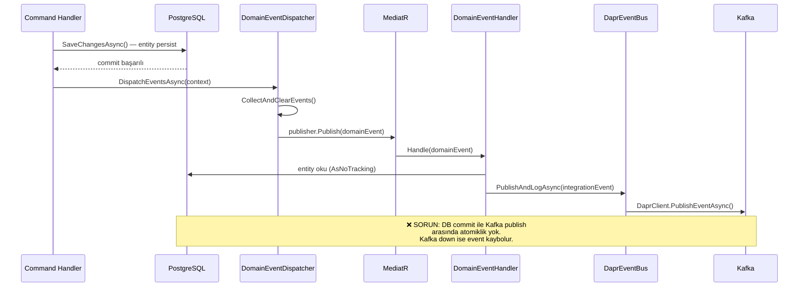
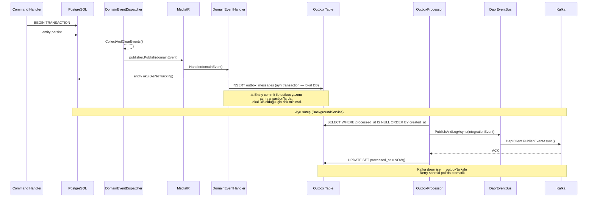
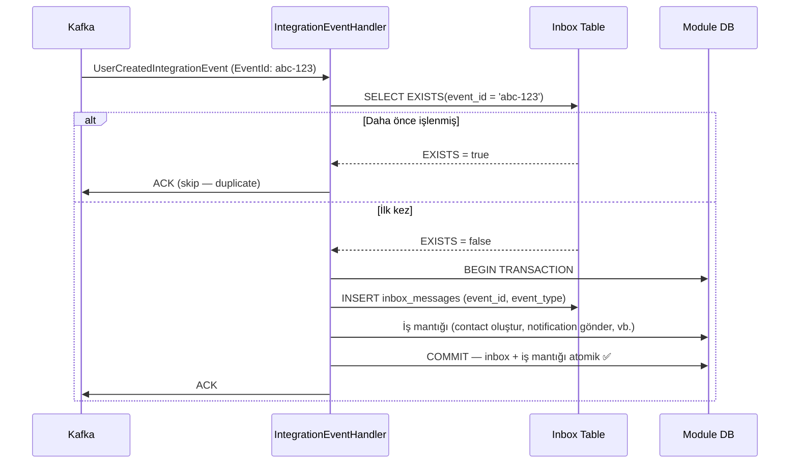

# Transactional Outbox & Inbox Pattern — Uygulama Planı

## 1. Özet

Nexora'nın event-driven mimarisinde **domain event → integration event** akışında iki kritik güvenilirlik açığı var:

1. **Outbox (Gönderim Garantisi):** Event publish işlemi DB transaction dışında gerçekleşiyor — publish başarısız olursa event kaybolur
2. **Inbox (Alım Garantisi):** Integration event handler'larda dedup mekanizması yok — Kafka retry'larında aynı event birden fazla kez işlenebilir

Bu doküman her iki pattern'in Nexora'ya nasıl entegre edileceğini, etki analizini ve uygulama planını detaylandırır.

---

## 2. Mevcut Mimari Analizi

### 2.1 Event Akış Diyagramı (Mevcut)



### 2.2 Sorunlu Senaryolar

#### Senaryo A: Kafka Unavailable (Outbox Gerekli)

```
1. CreateContactHandler → DB'ye contact yazıldı ✅
2. ContactCreatedEvent → entity'den toplandı, temizlendi
3. ContactCreatedDomainEventHandler → DaprEventBus.PublishAsync() → Kafka down ❌
4. Exception → DomainEventDispatcher'da yakalandı → LogError
5. SONUÇ: Contact DB'de var ama ContactCreatedIntegrationEvent hiç yayınlanmadı
   → Notifications modülü "hoş geldin" e-postası göndermedi
   → Contacts modülündeki UserCreated handler tetiklenmedi
```

#### Senaryo B: Uygulama Crash (Outbox Gerekli)

```
1. MergeContacts → DB'ye merge yazıldı ✅
2. ContactMergedEvent → handler çalışmaya başladı
3. Uygulama crash (OOM, deploy, node failure)
4. SONUÇ: Merge DB'de tamamlandı ama ContactMergedIntegrationEvent yayınlanmadı
   → Diğer modüller eski contact ID'leri kullanmaya devam ediyor
```

#### Senaryo C: Kafka Consumer Rebalance (Inbox Gerekli)

```
1. Kafka'dan UserCreatedIntegrationEvent geldi
2. Contacts modülü: otomatik contact oluşturdu, DB'ye yazdı ✅
3. Kafka ACK göndermeden önce consumer rebalance oldu
4. Kafka aynı event'i tekrar gönderdi
5. Contacts modülü: AYNI contact'ı tekrar oluşturdu → DUPLİKASYON
```

#### Senaryo D: Handler Başarısız + Retry (Inbox Gerekli)

```
1. ConsentChangedIntegrationEvent geldi
2. Notifications modülü: scheduled notification'ları iptal etmeye çalıştı
3. DB timeout → handler başarısız → Kafka NACK
4. Kafka retry → handler tekrar çalıştı → bu sefer başarılı ✅
5. Kafka bir kez daha retry → handler TEKRAR çalıştı → zaten iptal edilmiş olanları tekrar iptal etmeye çalıştı
   → idempotent olmayan handler'da veri tutarsızlığı
```

### 2.3 Etkilenen Modüller ve Event'ler

#### Domain → Integration Event Akışı (Outbox Kapsamı)

| Modül | Domain Event | Integration Event | Handler | Risk |
|-------|-------------|-------------------|---------|------|
| Contacts | ContactCreatedEvent | ContactCreatedIntegrationEvent | ContactCreatedDomainEventHandler | Orta |
| Contacts | ContactUpdatedEvent | ContactUpdatedIntegrationEvent | ContactUpdatedDomainEventHandler | Düşük |
| Contacts | ContactArchivedEvent | ContactArchivedIntegrationEvent | ContactArchivedDomainEventHandler | Düşük |
| Contacts | ContactMergedEvent | ContactMergedIntegrationEvent | ContactMergedDomainEventHandler | **Yüksek** |
| Contacts | ConsentChangedEvent | ConsentChangedIntegrationEvent | ConsentChangedDomainEventHandler | Orta |
| Documents | DocumentCreatedEvent | DocumentUploadedIntegrationEvent | DocumentCreatedDomainEventHandler | Düşük |
| Documents | DocumentArchivedEvent | DocumentArchivedIntegrationEvent | DocumentArchivedDomainEventHandler | Düşük |
| Documents | DocumentSignedEvent | DocumentSignedIntegrationEvent | DocumentSignedDomainEventHandler | **Yüksek** |
| Documents | SignatureCompletedEvent | SignatureCompletedIntegrationEvent | SignatureCompletedDomainEventHandler | **Yüksek** |
| Notifications | NotificationSentEvent | NotificationSentIntegrationEvent | NotificationSentDomainEventHandler | Düşük |
| Notifications | NotificationDeliveredEvent | NotificationDeliveredIntegrationEvent | NotificationDeliveredDomainEventHandler | Düşük |
| Notifications | NotificationBouncedEvent | NotificationBouncedIntegrationEvent | NotificationBouncedDomainEventHandler | Orta |

**Toplam: 12 domain→integration akışı, 4 yüksek riskli**

#### Integration Event Tüketicileri (Inbox Kapsamı)

| Tüketici Modül | Event | Handler | Yan Etki | Duplikasyon Riski |
|---------------|-------|---------|----------|-------------------|
| Contacts | UserCreatedIntegrationEvent | UserCreatedIntegrationEventHandler | Contact oluşturma | **Yüksek** — aynı user için 2 contact |
| Contacts | OrganizationCreatedIntegrationEvent | OrganizationCreatedIntegrationEventHandler | Default tag oluşturma | Orta — duplicate tag |
| Notifications | UserCreatedIntegrationEvent | UserCreatedIntegrationEventHandler | Hoş geldin e-postası | **Yüksek** — 2x e-posta |
| Notifications | ConsentChangedIntegrationEvent | ConsentChangedIntegrationEventHandler | Schedule iptal | Düşük — idempotent |

**Toplam: 4 tüketici, 2 yüksek duplikasyon riski**

---

## 3. Outbox Pattern Tasarımı

### 3.1 Mimari Diyagramı



### 3.2 Outbox Tablosu

```sql
-- Platform schema'da (public) — tenant-agnostik
CREATE TABLE public.outbox_messages (
    id              UUID PRIMARY KEY DEFAULT gen_random_uuid(),
    event_type      VARCHAR(500)  NOT NULL,  -- "ContactCreatedIntegrationEvent"
    event_payload   JSONB         NOT NULL,  -- Serialized integration event
    tenant_id       VARCHAR(100)  NOT NULL,  -- Tenant isolation for queries
    created_at      TIMESTAMPTZ   NOT NULL DEFAULT NOW(),
    processed_at    TIMESTAMPTZ,             -- NULL = pending, SET = published
    error           TEXT,                     -- Son hata mesajı (retry için)
    retry_count     INT           NOT NULL DEFAULT 0,

    -- Performans index'leri
    INDEX ix_outbox_pending (created_at) WHERE processed_at IS NULL,
    INDEX ix_outbox_tenant (tenant_id, created_at) WHERE processed_at IS NULL
);
```

**Neden platform schema'da?**
- Tüm modüller aynı outbox'u kullanır — tek bir processor yeterli
- Tenant schema'larına tablo eklemeye gerek yok
- `tenant_id` kolonu ile filtreleme mümkün
- Migration tek seferde uygulanır

### 3.3 OutboxMessage Entity

```csharp
// src/Nexora.Infrastructure/Persistence/Outbox/OutboxMessage.cs
public sealed class OutboxMessage
{
    public Guid Id { get; private set; } = Guid.NewGuid();
    public string EventType { get; private set; } = default!;
    public string EventPayload { get; private set; } = default!;  // JSON
    public string TenantId { get; private set; } = default!;
    public DateTimeOffset CreatedAt { get; private set; } = DateTimeOffset.UtcNow;
    public DateTimeOffset? ProcessedAt { get; private set; }
    public string? Error { get; private set; }
    public int RetryCount { get; private set; }

    private OutboxMessage() { }

    public static OutboxMessage Create(string eventType, string payload, string tenantId) =>
        new() { EventType = eventType, EventPayload = payload, TenantId = tenantId };

    public void MarkProcessed() => ProcessedAt = DateTimeOffset.UtcNow;

    public void RecordFailure(string error)
    {
        Error = error;
        RetryCount++;
    }
}
```

### 3.4 Akış Değişikliği

**Mevcut handler pattern:**
```csharp
// ContactCreatedDomainEventHandler.cs (ŞİMDİKİ)
public async Task Handle(ContactCreatedEvent notification, CancellationToken ct)
{
    var contact = await dbContext.Contacts.AsNoTracking()
        .FirstOrDefaultAsync(c => c.Id == notification.ContactId, ct);

    var integrationEvent = new ContactCreatedIntegrationEvent { ... };
    await eventBus.PublishAndLogAsync(integrationEvent, logger, ct);  // ← Doğrudan Kafka'ya
}
```

**Outbox pattern sonrası:**
```csharp
// ContactCreatedDomainEventHandler.cs (OUTBOX İLE)
public async Task Handle(ContactCreatedEvent notification, CancellationToken ct)
{
    var contact = await dbContext.Contacts.AsNoTracking()
        .FirstOrDefaultAsync(c => c.Id == notification.ContactId, ct);

    var integrationEvent = new ContactCreatedIntegrationEvent { ... };
    await outbox.EnqueueAsync(integrationEvent, ct);  // ← Outbox tablosuna yaz (aynı transaction)
}
```

`IOutbox` servisi handler'a inject edilir, `EnqueueAsync` event'i JSON olarak `outbox_messages` tablosuna yazar. Bu yazma, `SaveChangesAsync` ile aynı transaction'da gerçekleşir çünkü aynı DbContext scope'undadır.

### 3.5 OutboxProcessor (BackgroundService)

```csharp
// Polling-based processor
// Her 5 saniyede outbox_messages tablosundan pending event'leri okur
// Her event için: deserialize → IEventBus.PublishAsync → mark processed
// Başarısız olursa: error kaydı + retry_count artışı
// Max retry aşılırsa: LogError + event outbox'ta kalır (manual müdahale)
```

**Polling aralığı:** 5 saniye (configurable via `OutboxOptions.PollingIntervalSeconds`)
**Batch size:** 100 event/poll (configurable)
**Max retry:** 10 (configurable)
**Cleanup:** 7 gün sonra processed event'ler silinir (Hangfire job)

---

## 4. Inbox Pattern Tasarımı

### 4.1 Inbox Tablosu

```sql
-- Her modülün kendi schema'sında (tenant-scoped)
CREATE TABLE {schema}.inbox_messages (
    event_id        UUID PRIMARY KEY,        -- IntegrationEvent.EventId
    event_type      VARCHAR(500)  NOT NULL,
    processed_at    TIMESTAMPTZ   NOT NULL DEFAULT NOW(),

    -- Cleanup için
    INDEX ix_inbox_processed (processed_at)
);
```

**Neden modül schema'sında?**
- Her modül kendi inbox'unu yönetir
- Tenant isolation otomatik (schema-per-tenant)
- Modül uninstall edildiğinde inbox da temizlenir

### 4.2 Dedup Akışı



### 4.3 IInboxGuard Servisi

```csharp
// Handler'da kullanım:
public async Task HandleAsync(UserCreatedIntegrationEvent @event, CancellationToken ct)
{
    if (await inboxGuard.IsAlreadyProcessedAsync(@event.EventId, ct))
        return;  // Duplicate — skip

    // İş mantığı...
    var contact = Contact.Create(...);
    dbContext.Contacts.Add(contact);

    // Inbox kaydı + entity persist aynı transaction'da
    inboxGuard.MarkAsProcessed(@event.EventId, @event.GetType().Name);
    await dbContext.SaveChangesAsync(ct);
}
```

---

## 5. Etki Analizi

### 5.1 Değişecek Dosyalar

#### Yeni Dosyalar (Outbox)

| Dosya | Açıklama |
|-------|----------|
| `Infrastructure/Persistence/Outbox/OutboxMessage.cs` | Entity |
| `Infrastructure/Persistence/Outbox/OutboxDbContext.cs` | DbContext (public schema) |
| `Infrastructure/Persistence/Outbox/OutboxMessageConfiguration.cs` | EF Configuration |
| `Infrastructure/Persistence/Outbox/IOutbox.cs` | Interface (SharedKernel'a da eklenebilir) |
| `Infrastructure/Persistence/Outbox/OutboxService.cs` | EnqueueAsync implementasyonu |
| `Infrastructure/Persistence/Outbox/OutboxProcessor.cs` | BackgroundService — polling |
| `Infrastructure/Persistence/Outbox/OutboxOptions.cs` | Configurable polling/retry/batch |
| `Infrastructure/Persistence/Outbox/OutboxCleanupJob.cs` | Hangfire — eski kayıt temizleme |
| `Infrastructure/Persistence/Outbox/OutboxEventDeserializer.cs` | JSON → IIntegrationEvent |

#### Yeni Dosyalar (Inbox)

| Dosya | Açıklama |
|-------|----------|
| `SharedKernel/Abstractions/Messaging/IInboxGuard.cs` | Interface |
| `Infrastructure/Persistence/Inbox/InboxMessage.cs` | Entity |
| `Infrastructure/Persistence/Inbox/InboxGuard.cs` | Implementation |
| `Infrastructure/Persistence/Inbox/InboxCleanupJob.cs` | Hangfire — eski kayıt temizleme |

#### Değişecek Mevcut Dosyalar

| Dosya | Değişiklik |
|-------|-----------|
| 12× DomainEventHandler (Contacts/Documents/Notifications) | `eventBus.PublishAndLogAsync` → `outbox.EnqueueAsync` |
| 4× IntegrationEventHandler (Contacts/Notifications) | `inboxGuard.IsAlreadyProcessedAsync` + `MarkAsProcessed` ekleme |
| `InfrastructureServiceRegistration.cs` | Outbox + Inbox DI kayıtları |
| 5× Module DbContext (her modül) | `inbox_messages` tablo mapping |
| `DomainEventDispatcher.cs` | Değişmez — MediatR dispatch aynı kalır |
| `BaseDbContext.cs` | Değişmez — SaveChanges akışı aynı kalır |

**Toplam: ~14 yeni dosya, ~21 değişen dosya**

### 5.2 Olası Problemler

#### Problem 1: Transaction Sınırı ve Yaklaşım Seçimi

**Sorun:** `DomainEventHandler` şu an `SaveChanges` **sonrası** çalışıyor. Bu noktada orijinal transaction zaten commit edilmiş. Outbox yazımı farklı bir transaction'da olur.

İki olası yaklaşım değerlendirilmiştir:

**A) SaveChanges İçinde Outbox Yazımı (Tam Atomik)**
```
SaveChangesAsync() {
    ConvertDeletesAndSetAuditFields()
    CollectDomainEvents → serialize → outbox_messages INSERT
    base.SaveChangesAsync()  ← entity + outbox aynı transaction
}
```
- ✅ Tam atomiklik — entity + event tek transaction'da
- ❌ Domain event handler'lar kaldırılmalı (büyük refactoring)
- ❌ Clean Architecture ihlali — domain event → integration event dönüşümü SaveChanges sırasında yapılamaz (entity okuma, DTO mapping gerektirir)
- ❌ Handler'lardaki iş mantığı (tenant context okuma, entity lookup) SaveChanges'e taşınamaz

**B) Handler İçinde Outbox Yazımı (Seçilen Yaklaşım)**
```
SaveChangesAsync() → entity commit
DispatchEventsAsync() → handler'lar çalışır
Handler: outbox.EnqueueAsync() → outbox'a yaz (ayrı transaction)
```
- ✅ Mevcut handler mimarisini korur — minimum refactoring
- ✅ Clean Architecture uyumlu — dönüşüm mantığı handler'larda kalır
- ⚠️ Tam atomik değil — entity commit ile outbox yazımı arasında küçük bir pencere var

**Karar: B yaklaşımı uygulanacaktır.**

**Gerekçe:** A yaklaşımının gerektirdiği mimari değişiklik (12 handler'ın kaldırılması, SaveChanges içinde integration event serialize edilmesi, Clean Architecture ihlali) faydaya göre orantısız büyüktür. B yaklaşımı Kafka'ya doğrudan publish yerine **lokal PostgreSQL'e yazma** yaptığı için risk büyük ölçüde azalır:

| Hata noktası | Mevcut (doğrudan Kafka) | B yaklaşımı (lokal DB) |
|-------------|------------------------|----------------------|
| Harici servis down | Event kaybolur | Outbox'a yazılır (lokal DB) |
| Uygulama crash (publish sırasında) | Event kaybolur | Event kaybolur (ama pencere çok küçük — ms) |
| DB down | Entity de yazılamaz | Entity de yazılamaz (tutarlı) |

**Bu, "Reliable Event Publishing" (Güvenilir Event Yayınlama) olarak tanımlanabilir** — tam Transactional Outbox'ın atomiklik garantisi olmasa da, harici servis bağımlılığını ortadan kaldırarak event kaybı riskini büyük ölçüde azaltır.

> **Not:** Mimari diyagram (Bölüm 3.1) bu seçilen yaklaşımı yansıtacak şekilde güncellenmiştir.

#### Problem 2: Event Serialization/Deserialization

**Sorun:** Handler'lar integration event oluşturmak için entity okuma ve tenant context erişimi yapıyor. Bu işlemler SaveChanges sonrası gerçekleşmelidir.

**Çözüm (B yaklaşımı ile uyumlu):**
- SaveChanges sonrası domain event handler'lar çalışır (mevcut akış korunur)
- Handler'lar `IOutbox.EnqueueAsync()` çağırır (`IEventBus.PublishAsync()` yerine)
- Outbox tablosu `OutboxDbContext` ile yönetilir (public schema, ayrı bağlantı)
- Handler'daki entity okuma ve tenant context erişimi aynen devam eder

#### Problem 3: Event Sıralama (Ordering)

**Sorun:** Outbox processor batch olarak okur. Aynı entity için birden fazla event varsa sıralama önemli (Created → Updated → Archived).

**Çözüm:** `created_at` + `id` sıralaması ile FIFO garanti edilir. Aynı tenant'ın event'leri sıralı işlenir.

#### Problem 4: Multi-Tenant Outbox Sorgusu

**Sorun:** Tüm tenant'ların event'leri tek tabloda. Yoğun sistemde tablo büyür.

**Çözüm:**
- `processed_at IS NULL` partial index — sadece pending event'ler sorgulanır
- `tenant_id` index — tenant bazlı sorgulama
- 7 günlük cleanup job — eski kayıtlar silinir
- Gerekirse partitioning (PostgreSQL native) eklenebilir

### 5.3 Performans Etkisi

| Metrik | Mevcut | Outbox/Inbox Sonrası | Değişim |
|--------|--------|---------------------|---------|
| SaveChanges süresi | ~5ms | ~6ms (+1 outbox INSERT) | +20% |
| Event publish latency | ~50ms (sync Kafka) | ~5s (polling) | +5s (max) |
| DB table sayısı | N | N + 1 (outbox) + M×T (inbox per module×tenant) | Artış |
| Background service | 1 (DomainEventBackgroundProcessor) | 2 (+OutboxProcessor) | +1 |
| Hangfire job | Mevcut | +2 (outbox cleanup + inbox cleanup) | +2 |

**Kritik trade-off:** Event publish latency 50ms'den 5 saniyeye çıkar. Bu "eventual consistency" süresini artırır. Gerçek zamanlı gereksinimi olan event'ler için (ör. webhook callback) bu kabul edilemeyebilir — bunlar outbox bypass edip doğrudan publish edebilir.

---

## 6. Uygulama Planı

### Adım 1: Outbox Altyapısı

1. `OutboxMessage` entity + EF configuration
2. `OutboxDbContext` (public schema)
3. `IOutbox` interface + `OutboxService` implementation
4. `OutboxProcessor` BackgroundService (polling)
5. `OutboxOptions` (polling interval, batch size, max retry)
6. `OutboxEventDeserializer` (JSON → IIntegrationEvent)
7. DI registration
8. DB migration

### Adım 2: Domain Event Handler'ları Güncelle

12 handler'da `eventBus.PublishAndLogAsync()` → `outbox.EnqueueAsync()` değişikliği:
- 5 Contacts handler
- 4 Documents handler
- 3 Notifications handler

### Adım 3: Inbox Altyapısı

1. `InboxMessage` entity
2. `IInboxGuard` interface + implementation
3. Her modül DbContext'ine `inbox_messages` mapping
4. DI registration
5. DB migration (tüm tenant schema'ları)

### Adım 4: Integration Event Handler'ları Güncelle

4 handler'a inbox dedup kontrolü ekleme:
- Contacts: UserCreatedIntegrationEventHandler, OrganizationCreatedIntegrationEventHandler
- Notifications: UserCreatedIntegrationEventHandler, ConsentChangedIntegrationEventHandler

### Adım 5: Cleanup Job'ları

1. `OutboxCleanupJob` — 7 gün sonra processed event'leri sil
2. `InboxCleanupJob` — 30 gün sonra eski inbox kayıtlarını sil

### Adım 6: Testler

1. OutboxService testleri (enqueue, serialize/deserialize)
2. OutboxProcessor testleri (polling, retry, max retry, cleanup)
3. InboxGuard testleri (first time, duplicate, concurrent)
4. Integration testleri (SaveChanges → outbox → publish → inbox → handler)

### Adım 7: Monitoring

1. Outbox queue depth metric (pending event sayısı)
2. Outbox processing latency metric (created_at → processed_at farkı)
3. Inbox duplicate hit rate metric
4. Grafana dashboard paneli

---

## 7. Zaman Çizelgesi

| Adım | Tahmini Süre | Bağımlılık |
|------|-------------|------------|
| Outbox altyapısı | 2-3 gün | — |
| Handler güncellemeleri (12 dosya) | 1 gün | Adım 1 |
| Inbox altyapısı | 1-2 gün | — |
| Handler güncellemeleri (4 dosya) | 0.5 gün | Adım 3 |
| Cleanup job'ları | 0.5 gün | Adım 1+3 |
| Testler | 2 gün | Adım 1-5 |
| Monitoring | 1 gün | Adım 1-5 |
| **Toplam** | **~8-10 gün** | |

---

## 8. Ne Zaman Uygulanmalı?

### Öneri: Phase 2 Başlangıcında (CRM Modülünden Önce)

**Nedenler:**
1. Phase 2'de finansal modüller gelecek (Donations) — event kaybı kabul edilemez
2. CRM modülü yoğun cross-module event akışı getirecek
3. Phase 1'de production'a çıkılmadan önce altyapı hazır olmalı
4. Mevcut 12 handler + 4 tüketici ile scope yönetilebilir — Phase 2'de sayı artacak

### Alternatif Zamanlamalar

| Zamanlama | Avantaj | Dezavantaj |
|-----------|---------|-----------|
| **Phase 2 başı** (önerilen) | CRM/Donations'tan önce hazır | Phase 1 kapanışını geciktirebilir |
| Phase 1 kapanışında | En erken koruma | Phase 1'de henüz production yok |
| Phase 2 ortası | Gerçek ihtiyaç görüldüğünde | Donations modülü riskli başlar |
| Phase 3 | Tüm modüller hazır olunca | Çok geç — refactoring maliyeti artar |

---

## 9. Riskler ve Dikkat Edilecekler

1. **Atomiklik penceresi (B yaklaşımı):** Seçilen yaklaşımda entity commit ile outbox yazımı ayrı transaction'lardadır. Entity commit başarılı olup outbox yazımı başarısız olursa (lokal DB'ye yazma — çok düşük olasılık) event kaybolabilir. Bu risk Kafka'ya doğrudan publish'e göre büyük ölçüde azaltılmıştır ancak tam atomik değildir. Eğer gelecekte bu pencere kabul edilemez hale gelirse (ör. finansal işlemler), A yaklaşımına geçiş değerlendirilmelidir.

2. **Eventual consistency penceresi:** Outbox polling aralığı (varsayılan 5s) kadar gecikme olacak. Real-time gereksinimi olan akışlar (webhook callback gibi) için outbox bypass mekanizması düşünülmeli.

3. **Outbox tablosu büyümesi:** Yoğun sistemde tablo hızla büyüyebilir. Cleanup job'un düzenli çalışması ve partial index'lerin varlığı kritik.

4. **Serialization uyumluluğu:** Event sınıflarında property eklendiğinde/kaldırıldığında outbox'taki eski event'lerin deserialize edilebilmesi gerekir. Geriye dönük uyumlu serialization politikası belirlenmeli.

5. **Inbox tablosu tenant migration'ı:** Her tenant schema'sına `inbox_messages` tablosu eklenecek. Mevcut tenant'lar için migration gerekli.

6. **Test karmaşıklığı:** Integration testlerde outbox processor'un event'i işlemesini beklemek gerekir. Test setup'ı daha karmaşık hale gelir.

7. **DomainEventDispatcher ile etkileşim:** Mevcut `DomainEventDispatcher` + `DomainEventChannel` + `DomainEventBackgroundProcessor` yapısı outbox ile birlikte gereksiz hale gelebilir. Geçiş döneminde her ikisi de aktif olabilir, sonra eski yapı kaldırılabilir.

---

## 10. Bağımlılıklar

- PostgreSQL JSONB desteği (mevcut ✅)
- EF Core migration altyapısı (mevcut ✅)
- Hangfire job altyapısı (mevcut ✅)
- DaprEventBus (mevcut ✅ — OutboxProcessor bunu kullanacak)
- System.Text.Json serialization (mevcut ✅)
- Grafana + Prometheus metrikleri (mevcut ✅)
