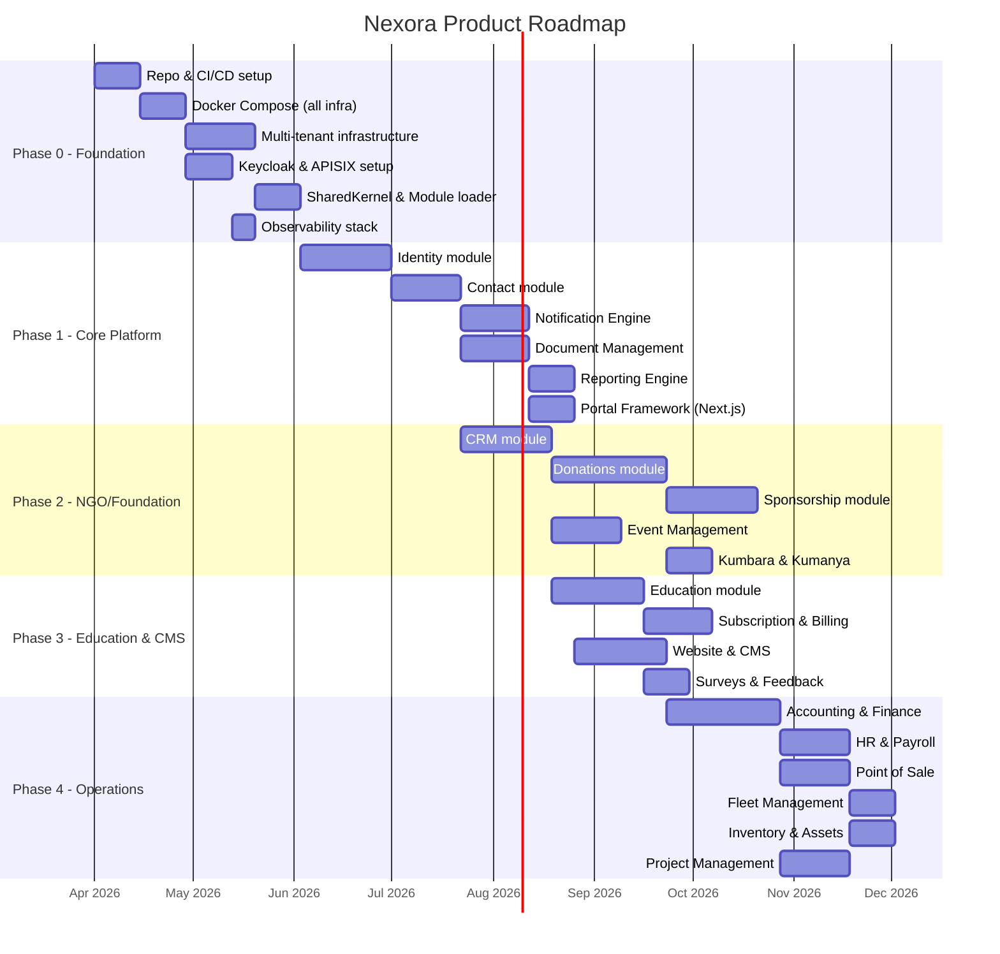

# Nexora - Product Roadmap

## Phase Overview

### Module Dependency Diagram
See [Module Dependencies](../diagrams/module-dependencies.md) for the full dependency graph.

---

## Phase 0: Foundation & Infrastructure
> **Goal**: Development environment, CI/CD, core architecture, database design

### Deliverables
- [x] Repository structure (solution, projects, folder conventions)
- [x] Development environment setup (Docker Compose for all infra)
- [ ] CI/CD pipeline (GitHub Actions: build, test, lint, security scan)
- [x] PostgreSQL multi-tenant infrastructure (schema management, migrations)
- [x] Keycloak setup — Admin API integration (realm-per-tenant, user provisioning via KeycloakAdminService)
- [ ] APISIX gateway configuration (routing, rate limiting, JWT validation)
- [x] Dapr sidecar setup (pub/sub, state store, secret store bindings)
- [x] Redis configuration (caching layer, session management)
- [x] Kafka topic design and cluster setup
- [ ] HashiCorp Vault integration (secret management)
- [x] MinIO setup (object storage, bucket-per-tenant)
- [x] Observability standards & foundation (OBSERVABILITY_STANDARDS.md, GlobalExceptionHandler, structured logging)
- [ ] Observability stack deployment (OpenTelemetry collectors, Grafana dashboards, Loki, Tempo)
- [x] Shared kernel library (common types, base entities, multi-tenant middleware)
- [x] Module loader & plugin architecture
- [x] API documentation infrastructure (OpenAPI/Swagger)
- [x] Coding standards enforcement (EditorConfig, analyzers, pre-commit hooks)

### Technical Milestones
1. [x] `docker compose up` brings entire stack online
2. [ ] A request flows: APISIX → .NET App → Dapr → PostgreSQL → Response
3. [x] Tenant A and Tenant B have isolated schemas
4. [ ] Keycloak issues JWT, APISIX validates it, .NET resolves tenant

### Completed Work
- **Solution structure**: 14 projects (Host, SharedKernel, Infrastructure, Identity module, Contacts module, Notifications module, Documents module, plus 7 test projects)
- **SharedKernel**: Entity/AuditableEntity base classes, strongly-typed IDs, Result<T> pattern, PagedResult<T>, LocalizedMessage (lockey_ enforcement), DomainException, value objects (Money, DateRange, EmailAddress, PhoneNumber), CQRS interfaces, ICacheService, ISecretProvider (generic overload), IJobScheduler, IModule, IModuleAvailability, ITenantContext, ITenantSchemaManager, IModuleMigration, JobQueues, ApiEnvelope<T>
- **Infrastructure**: BaseDbContext with DomainEventDispatcher, TenantMiddleware (401 for missing tenant, public path skip), DaprCacheService (L1+L2 with prefix invalidation + key tracking), DaprEventBus, DaprSecretProvider, HangfireJobScheduler, TenantJobFilter (tenant context capture/restore), TenantSchemaManager (PostgreSQL schema lifecycle), ValidationBehavior (all errors in Error.Details), LoggingBehavior, DatabaseTenantConfiguration, HangfireAuthFilters
- **Host**: Program.cs with Serilog, Dapr, module discovery, Hangfire dashboard (/admin/hangfire with role-based auth)
- **Identity module**: Domain entities (Tenant, Organization, User, Role, Permission, Department + join entities), strongly-typed IDs, domain events, EF configurations, PlatformDbContext (public schema), IdentityModuleMigration (seed 16 permissions + Platform Admin role)
- **Identity CQRS Commands**: CreateTenant (schema + KC realm), CreateUser (KC user sync), CreateRole, CreateOrganization, UpdateOrganization, DeleteOrganization (soft), AddOrganizationMember, RemoveOrganizationMember, UpdateTenantStatus, UpdateUserProfile (KC sync), UpdateUserStatus (KC sync), RecordAuditLog, InstallModule (dependency check), UninstallModule (OnUninstallAsync) — all with validators + lockey_ keys
- **Identity Queries**: GetTenants, GetTenantById, GetUsers, GetUserById (org memberships), GetCurrentUser (/me from JWT), GetRoles (with permissions), GetPermissions (module filter), GetOrganizations, GetOrganizationById (member count), GetOrganizationMembers (paginated), GetAuditLogs (filterable: user, action, date range), GetTenantModules
- **Identity API**: TenantEndpoints, UserEndpoints (profile, status, /me), RoleEndpoints, OrganizationEndpoints (CRUD + members), AuditEndpoints, ModuleEndpoints — all with ApiEnvelope<T> response format
- **Keycloak Integration**: KeycloakAdminService (HttpClient + token cache + ISecretProvider), realm-per-tenant provisioning, user create/update/enable/disable sync
- **Docker Compose**: PostgreSQL 17, Redis 7, Kafka (KRaft), Keycloak 26, MinIO, Dapr
- **Observability foundation**: OBSERVABILITY_STANDARDS.md (logging, tracing, metrics, exception handling, health checks), GlobalExceptionHandler middleware (DomainException→422, Validation→400, NotFound→404, HttpRequest→502, Cancelled→499, Default→500), structured logging in all Identity command handlers (ILogger<T>, LogWarning for failures, LogInformation for success)
- **Standards compliance**: 7 rounds of audit — all violations found and fixed (LocalizedMessage in all query handlers, XML docs on all public types, test naming conventions, HTTP status codes, structured logging)
- **Tests**: 1186 tests passing (Contacts: 394, Notifications: 239, Documents: 237, Identity: 157, SharedKernel: 64, Architecture: 62, Infrastructure: 33)
- **Contact Management module**: 11 domain entities (Contact, ContactAddress, Tag, ContactTag, ContactRelationship, CommunicationPreference, ContactNote, CustomFieldDefinition, ContactCustomField, ConsentRecord, ContactActivity), strongly-typed IDs, 9 domain events, EF configurations, ContactsDbContext
- **Contact CQRS Commands**: CreateContact, UpdateContact, ArchiveContact, RestoreContact, CreateTag, UpdateTag, DeleteTag, AddTagToContact, RemoveTagFromContact, AddContactAddress, UpdateContactAddress, RemoveContactAddress, AddContactRelationship, RemoveContactRelationship, UpdateCommunicationPreferences, AddContactNote, UpdateContactNote, DeleteContactNote, PinContactNote, RecordConsent, LogContactActivity, CreateCustomFieldDefinition, UpdateCustomFieldDefinition, DeleteCustomFieldDefinition, SetContactCustomField, MergeContacts, StartContactImport, StartContactExport, RequestGdprExport, RequestGdprDelete — all with validators + lockey_ keys
- **Contact Queries**: GetContacts (paginated, filtered), GetContactById, GetContact360 (aggregated view), GetTags, GetContactAddresses, GetContactRelationships, GetCommunicationPreferences, GetContactNotes, GetContactConsents, GetContactActivities, GetCustomFieldDefinitions, GetContactCustomFields, GetDuplicateContacts, GetImportJobStatus
- **Contact API**: ContactEndpoints (CRUD + archive/restore + 360-view), TagEndpoints, ContactAddressEndpoints, ContactRelationshipEndpoints, CommunicationPreferenceEndpoints, ContactNoteEndpoints, ConsentEndpoints, ContactActivityEndpoints, CustomFieldEndpoints, DuplicateEndpoints, ImportExportEndpoints, GdprEndpoints
- **Contact Domain Services**: DuplicateDetectionService (email/phone/name/company scoring), ContactMergeService (relationship/tag/preference/field transfer)
- **Contact Infrastructure**: ContactQueryService (IContactQueryService impl), ContactActivityContributorAggregator, Integration events (5 types), Domain event handlers (5), Identity event handlers (UserCreated → contact, OrgCreated → tags), Background jobs (ContactImportJob, ContactExportJob)
- **Cross-module contracts**: IContactQueryService, IContactActivityContributor (SharedKernel)
- **Architecture tests**: 10 ContactsModule layer dependency tests + updated ModuleBoundaryTests
- **Tests after Phase 1.2**: 664 tests passing (Contacts: 394, Identity: 150, SharedKernel: 64, Architecture: 30, Infrastructure: 26)
- **Document Management module (Phase 1 + Phase 2)**: 7 domain entities (Folder, Document, DocumentVersion, DocumentAccess, SignatureRequest, SignatureRecipient, DocumentTemplate), 7 strongly-typed IDs, 10 domain events, 7 EF configurations (documents_ prefix), DocumentsDbContext (7 DbSets), DocumentsModuleMigration
- **Document CQRS Commands (Phase 1)**: CreateFolder, RenameFolder, DeleteFolder, UploadDocument, UpdateDocumentMetadata, ArchiveDocument, RestoreDocument, MoveDocument, LinkDocumentToEntity, UnlinkDocumentFromEntity, AddDocumentVersion, GrantDocumentAccess, RevokeDocumentAccess — all with validators + lockey_ keys
- **Document CQRS Commands (Phase 2)**: GenerateUploadUrl, ConfirmUpload, CreateSignatureRequest, SendSignatureRequest, RecordSignature, DeclineSignature, CancelSignatureRequest, CreateDocumentTemplate, UpdateDocumentTemplate, ActivateDocumentTemplate, DeactivateDocumentTemplate, RenderDocumentTemplate — all with validators + lockey_ keys
- **Document Queries (Phase 1)**: GetFolders (filtered), GetFolderById, GetDocumentVersions, GetDocumentAccess
- **Document Queries (Phase 2)**: GetDocuments (paginated + access-filtered), GetDocumentById (access-checked), GetDocumentDownloadUrl, GetSignatureRequests (paginated + status/document filter), GetSignatureRequestById (detail + recipients), GetDocumentTemplates (paginated + category/active filter), GetDocumentTemplateById (detail + variables)
- **Document API**: FolderEndpoints (CRUD), DocumentEndpoints (CRUD + archive/restore/move/link/unlink + upload-url/confirm-upload/download), DocumentVersionEndpoints (list/add), DocumentAccessEndpoints (list/grant/revoke), SignatureEndpoints (create/send/sign/decline/cancel/list/get), TemplateEndpoints (CRUD + activate/deactivate/render)
- **Document Infrastructure**: 4 integration events (DocumentUploaded, DocumentArchived, DocumentSigned, SignatureCompleted), 5 domain event handlers (4 integration + 1 archival), IFileStorageService (MinIO presigned URLs), IDocumentAccessChecker (owner/user/role 3-tier), IDocumentArchivalService (signed doc archival), IDocumentService (cross-module), TemplateVariableRenderer (domain service), 2 recurring jobs (SignatureExpiryJob, SignatureReminderJob)
- **Document Architecture tests**: 10 Phase 1 + 10 Phase 2 layer dependency/sealed tests + updated ModuleBoundaryTests
- **Bruno API collection**: 34 requests for Documents module (Folders: 5, Documents: 10, Versions: 2, Access: 3, Storage: 3, Signatures: 7, Templates: 4) with auto-populated env vars
- **Notification Engine module (Phase 1.3)**: 6 domain entities (NotificationTemplate, NotificationTemplateTranslation, Notification, NotificationRecipient, NotificationProvider, NotificationSchedule), 6 strongly-typed IDs, 8 domain events, 7 enums/value objects (NotificationChannel, NotificationStatus, RecipientStatus, ScheduleStatus, TemplateFormat, ProviderName, TriggerSource), 6 EF configurations (notifications_ prefix), NotificationsDbContext, NotificationsModuleMigration (6 permissions)
- **Notification CQRS Commands**: CreateNotificationTemplate, UpdateNotificationTemplate, DeleteNotificationTemplate, AddTemplateTranslation, CreateNotificationProvider, UpdateNotificationProvider, TestNotificationProvider, SendNotification (template or inline), SendBulkNotification (batch + throttle), ScheduleNotification, CancelScheduledNotification, UpdateDeliveryStatus (webhook) — all with validators + lockey_ keys
- **Notification Queries**: GetNotificationTemplates (paginated + channel filter), GetNotificationTemplateById (with translations), GetNotificationProviders (channel filter), GetNotifications (paginated + status/channel filter), GetNotificationById (detail + recipients), GetScheduledNotifications
- **Notification API**: TemplateEndpoints (CRUD + translations), ProviderEndpoints (CRUD + test), NotificationEndpoints (send + list + detail), BulkEndpoints, ScheduleEndpoints, WebhookEndpoints (SendGrid + Twilio callback)
- **Notification Domain Services**: TemplateRenderer (variable substitution, language selection, HTML escaping, inline rendering)
- **Notification Infrastructure**: INotificationService implementation (cross-module contract), DeliveryJobHelper (shared provider lookup + capacity + recipient processing), EmailDeliveryJob, SmsDeliveryJob, BulkNotificationJob (batched), ScheduledNotificationDispatcherJob, DailyProviderResetJob, NotificationCleanupJob, WebhookPayloadParser (SendGrid + Twilio)
- **Notification Integration Events**: 3 domain-to-integration handlers (Sent, Delivered, Bounced) using PublishAndLogAsync, IdentityEventHandlers (welcome notification), ContactEventHandlers (consent revocation → cancel schedules)
- **Cross-module contracts**: INotificationService (SendAsync, SendBulkAsync, ScheduleAsync), BulkNotificationRecipient, 3 integration events (NotificationSent, NotificationDelivered, NotificationBounced) in SharedKernel
- **Architecture tests**: 10 NotificationsModule layer dependency tests + updated ModuleBoundaryTests
- **Bruno API collection**: 16 requests for Notifications module (Templates: 6, Providers: 4, Notifications: 3, Bulk: 1, Schedule: 3)
- **Standards compliance (cross-module)**: One-type-per-file enforcement (Identity events, Contacts handlers/events split, Documents handlers split), XML documentation on all public types/methods across all modules, EventBusExtensions.PublishAndLogAsync for consistent event publishing, TriggerSource constants, PermissionAction/TenantStatus enums for type-safe domain events, Guid.TryParse in integration event handlers, AsNoTracking on read-only queries, TenantContextExtensions.TryGetCurrent null guard, catch(InvalidOperationException) instead of bare catch, redundant debug logs removed from Notification handlers
- **Domain hardening**: Tenant state machine (Trial→Active/Terminated, Active→Suspended/Terminated, Suspended→Active/Terminated, Terminated is terminal), SetRealmId validation (null/empty → DomainException), ArchiveDocumentHandler pre-check (Result.Failure instead of DomainException for already-archived), CreateFolder/UploadDocument UserId validation (Result.Failure instead of Guid.Empty fallback), DocumentSignedDomainEventHandler recipient scoped by RequestId, DocumentArchivedDomainEventHandler reads TenantId from entity (no tenant context fallback), SignatureCompletedDomainEventHandler reads TenantId from entity (same fix), Role.Create explicit IsActive=true, RoleConfiguration explicit IsSystemRole/IsActive EF mappings
- **Tests after Phase 1.3**: 1012 tests passing (Contacts: 394, Notifications: 239, Identity: 157, Documents: 80, SharedKernel: 64, Architecture: 52, Infrastructure: 26)
- **Document Management Phase 2**: MinIO presigned URL integration (IFileStorageService, GenerateUploadUrl, ConfirmUpload, GetDocumentDownloadUrl), Digital signature workflow CQRS/API (CreateSignatureRequest, Send, RecordSignature, Decline, Cancel, GetSignatureRequests, GetSignatureRequestById — full lifecycle with validators), Document templates CQRS/API (Create, Update, Activate/Deactivate, Render with TemplateVariableRenderer), Access control enforcement (IDocumentAccessChecker — owner/user/role 3-tier, injected into GetDocuments + GetDocumentById), Signature jobs (SignatureExpiryJob, SignatureReminderJob — NexoraJob, recurring daily), Automatic archival (SignatureCompletedArchivalHandler → IDocumentArchivalService → "Signed Documents" system folder), Cross-module IDocumentService (GenerateFromTemplateAsync, GetDocumentsByEntityAsync in SharedKernel), Domain event handler fixes (SignatureCompletedDomainEventHandler + DocumentArchivedDomainEventHandler — entity-based TenantId, no tenant context fallback), Architecture tests (10 Phase 2 checks), Bruno collection (Storage: 3, Signatures: 7, Templates: 4)
- **Cross-module contracts**: IDocumentService (GenerateFromTemplateAsync, GetDocumentsByEntityAsync), DocumentSummary, GenerateFromTemplateRequest/Result in SharedKernel
- **Tests after Phase 1.4-P2**: 1186 tests passing (Contacts: 394, Notifications: 239, Documents: 237, Identity: 157, SharedKernel: 64, Architecture: 62, Infrastructure: 33)

---

## Phase 1: Core Platform Modules
> **Goal**: Modules that every tenant needs regardless of their business type

### 1.1 Identity & Access Management
**Spec**: [modules/identity/SPEC.md](../modules/identity/SPEC.md)
- [x] Tenant management — domain model (create, activate, suspend, terminate + domain events)
- [x] Organization management — domain model + CQRS (create, update, activate/deactivate + API endpoints)
- [x] User management — domain model (create, update profile, activate/deactivate, record login + domain events)
- [x] Role-based access control — domain model (Role, Permission, RolePermission with assign/revoke + domain events)
- [x] Permission system — module.resource.action format
- [x] Tenant management — CQRS (CreateTenant with schema provisioning, UpdateTenantStatus, GetTenants, GetTenantById) + API endpoints
- [x] User management — CQRS (CreateUser with email uniqueness, GetUsers with tenant isolation) + API endpoints
- [x] Role management — CQRS (CreateRole with permission assignment, GetRoles, GetPermissions) + API endpoints
- [x] Platform DbContext — public schema for tenant + module management
- [x] Module migration system — IdentityModuleMigration (seed permissions + Platform Admin role)
- [x] Keycloak Admin Service (IKeycloakAdminService, HttpClient + token cache + ISecretProvider)
- [x] Keycloak realm provisioning (tenant create → realm create, SetRealmId)
- [x] Keycloak user sync (user create → KC user create, profile/status sync)
- [x] Organization management — full CRUD (update, soft-delete, add/remove members, get by id, paginated members)
- [x] User profile update (with KC sync), user status (activate/deactivate with KC sync)
- [x] User detail query (with org memberships), /me endpoint (JWT sub → user resolve)
- [x] Login audit trail (AuditLog entity, record command, filterable query — user, action, date range)
- [x] Module install/uninstall management API (dependency check, OnUninstallAsync callback)

### 1.2 Contact Management (Unified)
**Spec**: [modules/contacts/SPEC.md](../modules/contacts/SPEC.md)
- [x] Contact CRUD (individuals & organizations)
- [x] Contact types & tags (donor, parent, volunteer, vendor — multiple)
- [x] 360-degree view (aggregated from all modules via IContactActivityContributor)
- [x] Address management (multiple addresses per contact)
- [x] Communication preferences (email, SMS, WhatsApp opt-in/out)
- [x] Contact merge & deduplication
- [x] Import/Export (CSV, Excel)
- [x] Custom fields (tenant-configurable)
- [x] KVKK/GDPR compliance (consent tracking, data export, right to delete)

### 1.3 Notification Engine
**Spec**: [modules/notifications/SPEC.md](../modules/notifications/SPEC.md)
- [x] Email sending (SendGrid/Mailgun integration via Dapr)
- [x] SMS sending (Twilio/Netgsm integration)
- [x] WhatsApp Business API integration
- [x] Notification templates (with variable substitution)
- [x] Notification preferences per contact
- [x] Delivery tracking (sent, delivered, opened, failed)
- [x] Bulk sending with throttling
- [x] Scheduled notifications
- [ ] Translation resolution (only backend component that resolves lockey_ keys)

### 1.4 Document Management
**Spec**: [modules/documents/SPEC.md](../modules/documents/SPEC.md)

**Phase 1 (complete):**
- [x] Folder structure (hierarchical, module-scoped, system folders)
- [x] Document CRUD (upload tracking, metadata, archive/restore, entity linking)
- [x] Version control (add versions, version history, max 100 versions)
- [x] Access control records (grant/revoke per user or role — View/Edit/Manage)
- [x] Integration events (DocumentUploaded, DocumentArchived, DocumentSigned, SignatureCompleted)
- [x] Phase 2 domain shells modeled (SignatureRequest, SignatureRecipient, DocumentTemplate — domain model and tables created)

**Phase 2 (complete):**
- [x] MinIO file storage integration (presigned upload/download URLs, confirm upload flow, IFileStorageService abstraction)
- [x] Digital signature workflow (CreateSignatureRequest, Send, RecordSignature, Decline, Cancel + full lifecycle CQRS/API)
- [x] Document templates with variable substitution (CRUD, activate/deactivate, TemplateVariableRenderer, render-to-document)
- [x] Access control enforcement in query filters (IDocumentAccessChecker — owner/user/role-based, enforced in GetDocuments + GetDocumentById)
- [x] Signature jobs (SignatureExpiryJob — daily at 01:00 UTC, SignatureReminderJob — daily at 08:00 UTC)
- [x] Automatic archival (SignatureCompletedEvent → archive to "Signed Documents" system folder via IDocumentArchivalService)
- [x] Cross-module document service (IDocumentService in SharedKernel — GenerateFromTemplateAsync, GetDocumentsByEntityAsync)
- [x] Architecture tests (Phase 2 entity/handler/service sealed checks, layer dependencies)
- [x] Bruno API collection (14 new requests — Storage: 3, Signatures: 7, Templates: 4)

### 1.5 Portal Framework
- [ ] Portal authentication (separate from admin auth)
- [ ] Portal page builder infrastructure
- [ ] Tenant-specific branding (logo, colors, domain)
- [ ] Multi-language support (runtime language switching)
- [ ] Multi-currency display
- [ ] Module-aware navigation (only show installed module pages)

### 1.6 Reporting Engine
- [ ] Report definition (SQL-based + LINQ-based)
- [ ] Dashboard builder (widgets, charts, KPIs)
- [ ] Cross-module data aggregation
- [ ] Export (PDF, Excel, CSV)
- [ ] Scheduled reports (email delivery)
- [ ] Tenant-specific custom reports

---

## Phase 2: NGO & Foundation Modules
> **Goal**: Complete solution for non-profit/foundation organizations

### 2.1 CRM Module
**Spec**: [modules/crm/SPEC.md](../modules/crm/SPEC.md)
- [ ] Lead management (create, assign, qualify)
- [ ] Pipeline / Funnel (customizable stages per organization)
- [ ] Activities (calls, meetings, tasks linked to leads)
- [ ] Lead sources tracking (web form, referral, event)
- [ ] Contact segmentation (tags, filters, saved segments)
- [ ] Email marketing integration
- [ ] SMS marketing integration
- [ ] Campaign management
- [ ] Call center integration (click-to-call)
- [ ] Mobile-optimized views (field staff)
- [ ] CRM analytics & reports

### 2.2 Donation & Fundraising Module
**Spec**: [modules/donations/SPEC.md](../modules/donations/SPEC.md)
- [ ] Donation categories (Zakat, Orphan Fund, General, etc.)
- [ ] One-time donations (online payment)
- [ ] Recurring donations (standing orders, card-on-file)
- [ ] Donation cart (multiple items in one transaction)
- [ ] Stripe integration (international)
- [ ] iyzico/Param integration (Turkey)
- [ ] Multi-currency support (TL, USD, EUR with conversion)
- [ ] Automatic receipt generation
- [ ] Donor matching (auto-match bank transfers to donors)
- [ ] Donor portal (history, receipts, active subscriptions)
- [ ] Donation on behalf of others
- [ ] Guest donations (no account required)
- [ ] Bank transaction import & reconciliation
- [ ] Donation video linking (send video SMS to donor)
- [ ] Zakat calculator (web widget)
- [ ] Public donation page builder
- [ ] Campaign/fund tracking (% funded, goal progress)
- [ ] Donation reports (monthly, daily, YoY comparison, top campaigns)

### 2.3 Sponsorship Module
**Spec**: [modules/sponsorship/SPEC.md](../modules/sponsorship/SPEC.md)
- [ ] Sponsorship programs (student, orphan, classroom, construction)
- [ ] Sponsor-beneficiary matching
- [ ] Installment plans (monthly payments)
- [ ] Payment tracking & reminders
- [ ] Progress updates to sponsors (photos, reports, videos)
- [ ] Sponsor portal (view beneficiary, track payments, watch videos)
- [ ] Integration with donation module (auto-link payments)
- [ ] Sponsorship reports

### 2.4 Event Management Module
**Spec**: [modules/events/SPEC.md](../modules/events/SPEC.md)
- [ ] Event creation (Iftar, Sahur, Qurban, Fundraiser Dinners, Bazaars)
- [ ] Event categories and templates (seasonal reuse)
- [ ] Event registration and ticketing
- [ ] QR-based check-in and attendance tracking
- [ ] Venue and speaker management
- [ ] Sponsor history tracking ("who sponsored what, when")
- [ ] Annual organizational calendar (religious dates, holidays, fundraising events)
- [ ] Calendar sync (Outlook, Google Calendar, iCal)
- [ ] Event-based reporting
- [ ] Public event pages (portal integration)

### 2.5 Collection Box (Kumbara) Management
- [ ] Box registration (location, region, address)
- [ ] Collection tracking (amounts, dates)
- [ ] Region/area management
- [ ] Collection route planning
- [ ] Collection reports

### 2.6 Aid Package (Kumanya) Distribution
- [ ] Package donation management
- [ ] Distribution tracking
- [ ] Beneficiary management
- [ ] Distribution reports

---

## Phase 3: Education & CMS Modules
> **Goal**: Complete solution for educational institutions + multi-site CMS

### 3.1 Website & CMS Module
**Spec**: [modules/cms/SPEC.md](../modules/cms/SPEC.md)
- [ ] Multi-site support (each org gets its own site with branding)
- [ ] Page builder (block-based visual editor)
- [ ] Blog / News with editorial workflow
- [ ] SEO management (meta tags, sitemaps, structured data, Core Web Vitals)
- [ ] Form builder (contact, enrollment, volunteer forms → CRM integration)
- [ ] Theme engine (white-label per org)
- [ ] Media library (images, videos, documents)
- [ ] Navigation/menu management
- [ ] Redirect management
- [ ] Multi-language content (i18n per page)
- [ ] Mobile responsive (Next.js 16 SSR/ISR)
- [ ] Live chat / WhatsApp integration

### 3.2 Education Management Module
**Spec**: [modules/education/SPEC.md](../modules/education/SPEC.md)
- [ ] Academic year & term management
- [ ] Grade levels, classrooms, student records
- [ ] Enrollment pipeline (Application → Tour → Interview → Evaluation → Accepted → Enrolled)
- [ ] Guardian/parent linking to students
- [ ] Appointment system (school tours, parent-teacher meetings)
- [ ] Staff availability calendar
- [ ] Academic calendar (exams, holidays, special events)
- [ ] Accreditation tracking (fire drills, inspections, audits)
- [ ] Summer camp management
- [ ] Student document collection (via Documents/Sign)
- [ ] Waitlist management

### 3.3 Subscription & Billing Module
**Spec**: [modules/subscription/SPEC.md](../modules/subscription/SPEC.md)
- [ ] Subscription plans (tuition, recurring service fees)
- [ ] Billing cycles (monthly, quarterly, annual, semester)
- [ ] Automatic invoice generation on schedule
- [ ] Payment processing (Stripe, iyzico integration)
- [ ] Payment reminders (email, SMS — escalation tiers)
- [ ] Overdue tracking & late fee management
- [ ] Scholarship / discount management
- [ ] Payment portal for parents/clients
- [ ] Multi-currency billing
- [ ] Proration and plan changes
- [ ] Revenue recognition reports

### 3.4 Surveys & Feedback Module
**Spec**: [modules/surveys/SPEC.md](../modules/surveys/SPEC.md)
- [ ] Survey builder (multiple question types: single/multi choice, rating, NPS, matrix, open text)
- [ ] Survey sections and branching logic
- [ ] Distribution channels (email, SMS, portal link, QR code)
- [ ] Anonymous vs. identified responses
- [ ] Real-time response collection
- [ ] Graphical analytics and reporting
- [ ] Survey templates (reusable)
- [ ] Scheduled/recurring surveys
- [ ] Export results (PDF, Excel)

---

## Phase 4: Operations & Back-Office Modules
> **Goal**: Complete the platform with operational modules

### 4.1 Accounting & Finance Module
**Spec**: [modules/accounting/SPEC.md](../modules/accounting/SPEC.md)
- [ ] Chart of accounts (per organization, customizable)
- [ ] Double-entry journal entries
- [ ] Fiscal years and periods
- [ ] Bank account management & transaction import
- [ ] Bank reconciliation (auto-matching)
- [ ] Expense management (photo upload, multi-level approval workflow)
- [ ] Budget management & variance tracking
- [ ] Multi-currency accounting with exchange rates
- [ ] Tax rate management
- [ ] Consolidated reports (cross-organization P&L, balance sheet)
- [ ] Integration with Donations, Subscription, POS for auto-journaling

### 4.2 HR & Payroll Module
**Spec**: [modules/hr/SPEC.md](../modules/hr/SPEC.md)
- [ ] Employee records (personal info, emergency contacts, bank details)
- [ ] Department & position management
- [ ] Contract management (start/end dates, renewal alerts, digital signing)
- [ ] Payroll processing (monthly runs, deductions, benefits, four-eyes approval)
- [ ] Leave management (types, requests, approval workflow, balance tracking)
- [ ] Attendance tracking
- [ ] Shift scheduling and assignment
- [ ] Personnel document management
- [ ] Employee self-service portal

### 4.3 Point of Sale (POS) Module
**Spec**: [modules/pos/SPEC.md](../modules/pos/SPEC.md)
- [ ] Touch-friendly sales screen (tablet/phone optimized)
- [ ] Terminal and session management
- [ ] Product catalog with categories and price lists
- [ ] Cash and card payment support
- [ ] Receipt generation and printing
- [ ] Cash movement tracking (float, in/out)
- [ ] End-of-day cash reconciliation
- [ ] Event-specific POS sessions (bazaar, fundraiser)
- [ ] Offline capability (IndexedDB sync)
- [ ] Inventory integration (auto stock deduction)
- [ ] Accounting integration (auto journal entries)

### 4.4 Fleet Management Module
**Spec**: [modules/fleet/SPEC.md](../modules/fleet/SPEC.md)
- [ ] Vehicle records (plate, model, VIN, registration details)
- [ ] Vehicle assignment tracking (who has which vehicle)
- [ ] Insurance policy tracking (expiry alerts, renewal workflow)
- [ ] Maintenance scheduling (km-based and time-based)
- [ ] Maintenance record keeping
- [ ] Fuel consumption logging (with anomaly detection)
- [ ] Vehicle inspection tracking
- [ ] Vehicle document management
- [ ] Cost tracking per vehicle (fuel, maintenance, insurance, tolls)
- [ ] Fleet dashboard and reports

### 4.5 Inventory & Asset Management Module
**Spec**: [modules/inventory/SPEC.md](../modules/inventory/SPEC.md)
- [ ] Warehouse management (per organization)
- [ ] Location hierarchy within warehouses
- [ ] Product catalog with categories
- [ ] Stock movements (receive, transfer, ship — with approval workflow)
- [ ] Fixed asset tracking (barcode/QR scanning)
- [ ] Asset assignment and accountability
- [ ] Stocktaking / inventory count with variance reconciliation
- [ ] Low stock alerts
- [ ] Supplier management
- [ ] Stock reports and dashboards

### 4.6 Project Management Module
**Spec**: [modules/projects/SPEC.md](../modules/projects/SPEC.md)
- [ ] Project creation with milestones
- [ ] Task management (Kanban board with WIP limits)
- [ ] Task comments and attachments
- [ ] Time tracking (per task, per member)
- [ ] Project team / member management
- [ ] Project budgeting and cost tracking
- [ ] Construction cost center tracking (materials, labor, subcontractors)
- [ ] Meeting notes with action item conversion to tasks
- [ ] Subcontractor contract management (Documents/Sign integration)
- [ ] Labels and filtering
- [ ] Project dashboard and Gantt views
- [ ] Accounting integration (cost journal entries)

---

## Cross-Phase: Continuous Improvements
> These run throughout all phases

- [ ] Performance optimization & load testing
- [ ] Security audits & penetration testing
- [ ] Accessibility (WCAG 2.1 AA)
- [ ] Documentation (user guides, API docs, developer docs)
- [ ] Automated testing (unit, integration, e2e)
- [ ] Mobile app (React Native — Phase 3+)
- [ ] Marketplace (3rd party module publishing — Phase 4+)

---

## Module Summary Matrix

| Module | Phase | Dependencies (Required) | Dependencies (Optional) | Key Integration Points |
|--------|-------|------------------------|------------------------|----------------------|
| Identity & Access | Core | — | — | Keycloak, APISIX |
| Contact Management | Core | identity | — | 360-view contributors |
| Notification Engine | Core | identity, contacts | — | All modules (event-driven) |
| Document Management | Core | identity | contacts | MinIO, Sign |
| CRM | Phase 2 | contacts, notifications | — | Web forms, Events |
| Donations | Phase 2 | contacts, notifications, documents | — | Stripe, iyzico, Bank import |
| Sponsorship | Phase 2 | contacts, donations, notifications | — | Donor portal |
| Events | Phase 2 | identity, contacts, notifications | documents, crm, donations | Calendar sync, QR check-in |
| Education | Phase 3 | crm, contacts, documents, notifications | subscription | Enrollment pipeline |
| Subscription | Phase 3 | identity, contacts, notifications | — | Stripe, iyzico |
| Website & CMS | Phase 3 | identity, notifications | contacts, crm, donations | Next.js 16 SSR |
| Surveys | Phase 3 | identity, contacts, notifications | — | Distribution channels |
| Accounting | Phase 4 | identity, contacts | hr, documents, notifications | Donations, Subscription, POS |
| HR & Payroll | Phase 4 | identity, contacts, notifications, documents | accounting | Contract Sign |
| Point of Sale | Phase 4 | identity, contacts, notifications | inventory, accounting | Offline sync |
| Fleet | Phase 4 | identity, contacts, notifications, documents | — | Maintenance alerts |
| Inventory | Phase 4 | identity, contacts, notifications | documents | POS, barcode scan |
| Projects | Phase 4 | identity, contacts, notifications | documents, accounting | Cost tracking |
