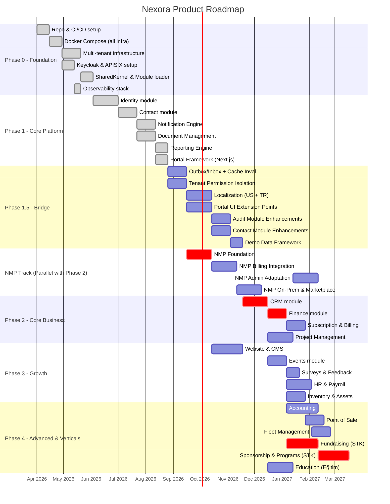
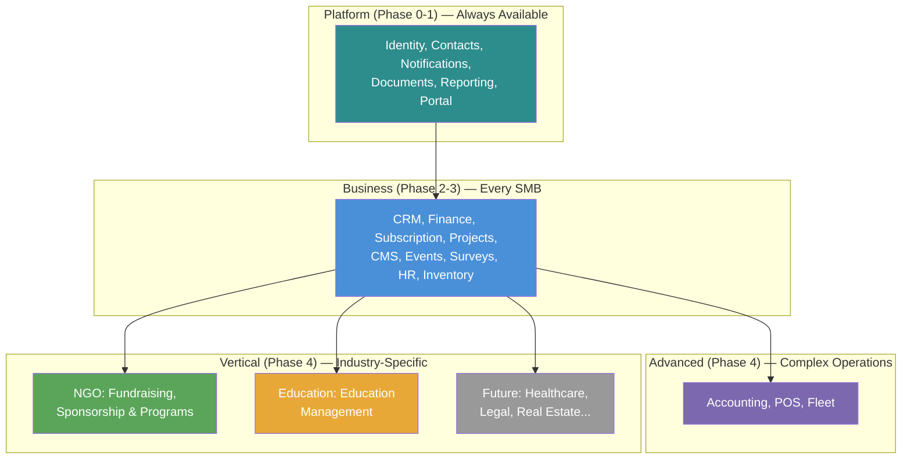

# Nexora - Product Roadmap

## Phase Overview

```mermaid
gantt
    title Nexora Product Roadmap
    dateFormat YYYY-MM-DD
    axisFormat %b %Y

    section Phase 0 - Foundation
    Repo & CI/CD setup           :done, p0a, 2026-04-01, 2w
    Docker Compose (all infra)   :done, p0b, after p0a, 2w
    Multi-tenant infrastructure  :done, p0c, after p0b, 3w
    Keycloak & APISIX setup      :done, p0d, after p0b, 2w
    SharedKernel & Module loader :done, p0e, after p0c, 2w
    Observability stack          :done, p0f, after p0d, 1w

    section Phase 1 - Core Platform
    Identity module              :done, p1a, after p0e, 4w
    Contact module               :done, p1b, after p1a, 3w
    Notification Engine          :done, p1c, after p1b, 3w
    Document Management          :done, p1d, after p1b, 3w
    Reporting Engine             :done, p1e, after p1c, 2w
    Portal Framework (Next.js)   :done, p1f, after p1d, 2w

    section Phase 1.5 - Bridge
    Outbox/Inbox + Cache Inval   :p15a, after p1e, 3w
    Tenant Permission Isolation  :p15b, after p1e, 3w
    Localization (US + TR)       :p15c, after p15a, 4w
    Portal UI Extension Points   :p15d, after p15b, 4w
    Audit Module Enhancements    :p15e, after p15c, 3w
    Contact Module Enhancements  :p15f, after p15d, 3w
    Demo Data Framework          :p15g, after p15e, 2w

    section NMP Track (Parallel with Phase 2)
    NMP Foundation               :crit, nmp1, after p15b, 4w
    NMP Billing Integration      :nmp2, after nmp1, 4w
    NMP Admin Adaptation         :nmp3, after p2d, 4w
    NMP On-Prem & Marketplace    :nmp4, after nmp2, 4w

    section Phase 2 - Core Business
    CRM module                   :crit, p2a, after p15g, 4w
    Finance module               :crit, p2b, after p2a, 3w
    Subscription & Billing       :p2c, after p2b, 3w
    Project Management           :p2d, after p2a, 4w

    section Phase 3 - Growth
    Website & CMS                :p3a, after p15d, 5w
    Events module                :p3b, after p2a, 3w
    Surveys & Feedback           :p3c, after p3b, 2w
    HR & Payroll                 :p3d, after p2b, 4w
    Inventory & Assets           :p3e, after p2b, 3w

    section Phase 4 - Advanced & Verticals
    Accounting                   :p4a, after p2b, 5w
    Point of Sale                :p4b, after p3e, 3w
    Fleet Management             :p4c, after p3d, 3w
    Fundraising (STK)            :crit, p4d, after p2b, 5w
    Sponsorship & Programs (STK) :crit, p4e, after p4d, 5w
    Education (Eğitim)           :p4f, after p2a, 4w
```

### Module Dependency Diagram
See [Module Dependencies](../diagrams/module-dependencies.md) for the full dependency graph.

---

## Phase 0: Foundation & Infrastructure
> **Goal**: Development environment, CI/CD, core architecture, database design

### Deliverables
- [x] Repository structure (solution, projects, folder conventions)
- [x] Development environment setup (Docker Compose for all infra)
- [x] CI/CD pipeline (GitHub Actions: build, test, lint — `ci.yml` with backend, admin-frontend, portal-frontend, docker-build jobs)
- [x] PostgreSQL multi-tenant infrastructure (schema management, migrations)
- [x] Keycloak setup — Admin API integration (realm-per-tenant, user provisioning via KeycloakAdminService)
- [x] APISIX gateway configuration — standalone mode (no etcd dependency), route definitions in `apisix.yaml` with hot-reload, `openid-connect` plugin for gateway-level JWT validation via Keycloak OIDC discovery, CORS (`localhost:3000` + `localhost:3001`), rate limiting (`limit-req`), correlation ID injection (`request-id` → `X-Correlation-Id`), Prometheus metrics export
- [x] APISIX ↔ Keycloak issuer alignment — `KC_HOSTNAME=http://localhost:8080` + `KC_HOSTNAME_BACKCHANNEL_DYNAMIC=true` (frontend issuer matches JWT `iss`, backchannel URLs use Docker-internal hostname for JWKS fetch)
- [x] `nexora-gateway` Keycloak client — confidential client for APISIX openid-connect plugin OIDC discovery
- [x] Frontend API routing via APISIX — both `nexora-admin` and `nexora-portal` route all API calls through `localhost:9080` (APISIX gateway), not directly to backend
- [x] Development tenant provisioning (`DevelopmentSeed.cs`) — idempotent startup seed: platform tables, dev tenant record, tenant schema, Identity/Contacts/Documents/Notifications/Reporting module tables (generic `EnsureModuleTablesAsync<T>`), permissions (63), Platform Admin role, Keycloak admin user sync, tenant module registration
- [x] Dapr sidecar setup (pub/sub, state store, secret store bindings)
- [x] Redis configuration (caching layer, session management)
- [x] Kafka topic design and cluster setup
- [x] HashiCorp Vault integration (dev mode Docker Compose, KV v2 secret seeding, Dapr secretstore-vault component, appsettings Vault config)
- [x] MinIO setup (object storage, bucket-per-tenant)
- [x] Observability standards & foundation (OBSERVABILITY_STANDARDS.md, GlobalExceptionHandler, structured logging)
- [x] Observability stack deployment (OTel Collector → Grafana Tempo + Loki + Prometheus, Grafana dashboards with auto-provisioned datasources, Serilog → OTel sink, .NET OTel traces + metrics + EF Core instrumentation)
- [x] Grafana dashboard auto-provisioning — "Nexora — Overview" dashboard (Application Logs, HTTP Request Rate, Latency p95, Error Rate 5xx, Recent Traces, Logs by Level)
- [x] Dev tools stack — pgAdmin (`:5051`), RedisInsight (`:5541`), Kafka UI Provectus (`:8085`), MinIO Console (`:9001`), Keycloak Admin (`:8080`), Vault UI (`:8200`)
- [x] Frontend ErrorBoundary → OTel integration for admin & portal (OpenTelemetry `WebTracerProvider` + `OTLPTraceExporter`, `reportError()` called from `componentDidCatch`)
- [x] Shared kernel library (common types, base entities, multi-tenant middleware)
- [x] Module loader & plugin architecture
- [x] API documentation infrastructure (OpenAPI/Swagger)
- [x] Communication flow architecture documentation (`docs/architecture/COMMUNICATION_FLOW.md` — Mermaid diagrams: service topology, auth flows, APISIX request pipeline, TenantMiddleware, schema-per-tenant, Dapr sidecar, observability, port map)
- [x] Coding standards enforcement (EditorConfig, analyzers, pre-commit hooks)
- [x] TraceId in error responses — `ApiEnvelope<T>.TraceId` property (null on success, `Activity.Current?.TraceId` on errors), `GlobalExceptionHandler` sets TraceId on all unhandled exceptions, `TraceIdEndpointFilter` injects TraceId into endpoint-level business errors (handler `Result.Failure`), applied to all module route groups via `ModuleExtensions`
- [x] Backend localization key coverage — all `lockey_` framework error keys (`lockey_error_validation_failed`, `lockey_error_request_cancelled`, `lockey_error_resource_not_found`, `lockey_error_external_service_unavailable`, `lockey_localization_key_not_found`) added to admin frontend `error.json` (en + tr)
- [x] End-to-end development flow verified — `docker compose up` → DevelopmentSeed → Keycloak login → APISIX JWT validation → API response with tenant isolation

### Technical Milestones
1. [x] `docker compose up` brings entire stack online (18 services + 3 init containers, DevelopmentSeed auto-provisions dev tenant)
2. [x] A request flows: Browser → APISIX (JWT ✓, CORS ✓, Rate Limit ✓, X-Correlation-Id) → .NET App (TenantMiddleware → schema) → PostgreSQL → Response *(standalone mode, upstream `nexora-api:5000` via Docker DNS)*
3. [x] Tenant A and Tenant B have isolated schemas (verified: `tenant_0000...0001` schema with Identity + Contacts + Documents + Notifications tables)
4. [x] Keycloak issues JWT, APISIX validates it (openid-connect plugin + `KC_HOSTNAME_BACKCHANNEL_DYNAMIC` for issuer alignment), .NET resolves tenant from `tenant_id` claim *(defense in depth: gateway + backend both validate)*
5. [x] Frontend clients (`nexora-admin`, `nexora-portal`) authenticate via Keycloak, route API calls through APISIX gateway (`localhost:9080`), receive CORS headers and correlation IDs
6. [x] Global soft delete infrastructure — `ISoftDeletable` interface, `AuditableEntity<T>` with IsDeleted/DeletedAt/DeletedBy, BaseDbContext auto-converts `Remove()` to soft delete, global query filters exclude deleted records, 23 unique indexes with partial filters, module lifecycle (activate/deactivate/uninstall with table rename)

### Completed Work
- **Solution structure**: 16 projects (Host, SharedKernel, Infrastructure, Identity module, Contacts module, Notifications module, Documents module, Reporting module, plus 8 test projects)
- **SharedKernel**: Entity/AuditableEntity base classes, strongly-typed IDs, Result<T> pattern, PagedResult<T>, LocalizedMessage (lockey_ enforcement), DomainException, value objects (Money, DateRange, EmailAddress, PhoneNumber), CQRS interfaces, ICacheService, ISecretProvider (generic overload), IJobScheduler, IModule, IModuleAvailability, ITenantContext, ITenantSchemaManager, IModuleMigration, JobQueues, ApiEnvelope<T> (with `TraceId` — `JsonIgnore` WhenWritingNull, `Fail()` + `ValidationFail()` accept optional `traceId`)
- **Infrastructure**: BaseDbContext with DomainEventDispatcher, TenantMiddleware (401 for missing tenant, public path skip, reads `tenant_id` + `organization_id` + `sub` claims), DaprCacheService (L1+L2 with prefix invalidation + key tracking), DaprEventBus, DaprSecretProvider, HangfireJobScheduler, TenantJobFilter (tenant context capture/restore), TenantSchemaManager (PostgreSQL schema lifecycle), ValidationBehavior (all errors in Error.Details), LoggingBehavior, DatabaseTenantConfiguration, HangfireAuthFilters
- **Host**: Program.cs with Serilog, Dapr, module discovery, Hangfire dashboard (/admin/hangfire with role-based auth), `TraceIdEndpointFilter` (auto-injects TraceId into all error responses via `ModuleExtensions`)
- **Identity module**: Domain entities (Tenant, Organization, User, Role, Permission, Department + join entities), strongly-typed IDs, domain events, EF configurations, PlatformDbContext (public schema), IdentityModuleMigration (seed 16 permissions + Platform Admin role)
- **Identity CQRS Commands**: CreateTenant (schema + KC realm), CreateUser (KC user sync), CreateRole, CreateOrganization, UpdateOrganization, DeleteOrganization (soft), AddOrganizationMember, RemoveOrganizationMember, UpdateTenantStatus, UpdateUserProfile (KC sync), UpdateUserStatus (KC sync), RecordAuditLog, InstallModule (dependency check), UninstallModule (OnUninstallAsync + RolePermission cleanup) — all with validators + lockey_ keys
- **Identity Queries**: GetTenants, GetTenantById, GetUsers, GetUserById (org memberships), GetCurrentUser (/me from JWT), GetRoles (with permissions), GetPermissions (module filter), GetOrganizations, GetOrganizationById (member count), GetOrganizationMembers (paginated), GetAuditLogs (filterable: user, action, date range), GetTenantModules
- **Identity API**: TenantEndpoints, UserEndpoints (profile, status, /me), RoleEndpoints, OrganizationEndpoints (CRUD + members), AuditEndpoints, ModuleEndpoints — all with ApiEnvelope<T> response format
- **Keycloak Integration**: KeycloakAdminService (HttpClient + token cache + ISecretProvider, `password` grant for `admin-cli` client), realm-per-tenant provisioning, user create/update/enable/disable sync, JWT claim mappers (upsert pattern: delete + create), `organization_id` claim mapping (was `org_id` → fixed to match TenantMiddleware + frontend expectations), init script idempotent with legacy mapper cleanup
- **Docker Compose**: PostgreSQL 17, Redis 7, Kafka (KRaft), Keycloak 26 (`KC_HOSTNAME` + `KC_HOSTNAME_BACKCHANNEL_DYNAMIC`), MinIO, Dapr, APISIX (standalone), HashiCorp Vault (dev mode), OTel Collector, Grafana Tempo, Grafana Loki, Grafana, pgAdmin, RedisInsight, Kafka UI (18 services total + 3 init containers)
- **APISIX API Gateway**: Standalone mode (no etcd dependency, `apisix.yaml` hot-reload), `openid-connect` plugin for JWT validation (Keycloak OIDC discovery, `bearer_only`, `nexora-gateway` client), CORS (`localhost:3000` + `localhost:3001`), rate limiting (`limit-req` — API: 100/s, health: 10/s, localization: 50/s), correlation ID injection (`request-id` → `X-Correlation-Id`), Prometheus metrics. Route priority: specific routes (health, localization, openapi, hangfire) > catch-all `/api/v1/*` (JWT + CORS + rate limit + request-id). etcd service removed from Docker Compose (no longer needed in standalone mode)
- **Development Tenant Provisioning**: `DevelopmentSeed.cs` — idempotent startup seed (Development env only): ensures platform tables (PlatformDbContext), dev tenant record, tenant schema (`tenant_0000...0001`), module tables (Identity, Contacts, Documents, Notifications via generic `EnsureModuleTablesAsync<T>`), 56 permissions, Platform Admin role, org, Keycloak admin user sync (queries KC Admin API for UUID), tenant module registration. Frontend i18n namespace resolution (`fallbackNS` + `registerModuleLocales`), permission format alignment (Keycloak ↔ manifest ↔ backend), `useAuth` token claims fallback when `/me` fails
- **HashiCorp Vault**: Dev mode in Docker Compose, KV v2 engine with seeded nexora/* secrets (postgres, redis, keycloak, minio, kafka), Dapr secretstore-vault component (renamed to `secretstore-vault`), Dapr local file secretstore as primary `secretstore` for development (nested JSON with `/` separator — avoids Vault KV v2 prefix/path mismatch), AppRole auth prep for production
- **Observability stack**: OTel Collector (OTLP gRPC/HTTP → Tempo traces + Loki logs + Prometheus metrics), Grafana with auto-provisioned datasources (Tempo/Loki/Prometheus with trace-to-log correlation) + auto-provisioned "Nexora — Overview" dashboard, Serilog → OpenTelemetry sink, .NET OTel SDK (ASP.NET Core + HttpClient + EF Core + Runtime instrumentation, custom ActivitySource "Nexora.*"), health endpoints (/health/live, /health/ready, /health/startup)
- **Dev Tools Port Map**: Nexora API `:5100`, APISIX Gateway `:9080`, APISIX Metrics `:9091`, Keycloak `:8080`, PostgreSQL `:5433`, Redis `:6380`, Kafka `:9092`, MinIO API `:9000`, MinIO Console `:9001`, Vault `:8200`, Grafana `:3300`, Tempo `:3200`, Loki `:3100`, OTel gRPC `:4327`, OTel HTTP `:4328`, Prometheus `:8889`, pgAdmin `:5051`, RedisInsight `:5541`, Kafka UI `:8085`, Dapr Placement `:50006`, Admin Dashboard `:3001` (dev), Portal `:3000` (dev)
- **Observability foundation**: OBSERVABILITY_STANDARDS.md (logging, tracing, metrics, exception handling, health checks), GlobalExceptionHandler middleware (DomainException→422, Validation→400, NotFound→404, HttpRequest→502, Cancelled→499, Default→500 — all with `TraceId` in response + log message), TraceIdEndpointFilter (endpoint-level business errors get TraceId via reflection), OTel Collector Loki exporter with `default_labels_enabled` (job label), structured logging in all Identity command handlers (ILogger<T>, LogWarning for failures, LogInformation for success)
- **Standards compliance**: 7 rounds of audit + PR-39 code review (61 inline comments, 8 critical/4 major/11 minor fixes) + PR-39 follow-up review (ValidationException instead of InvalidOperationException, Guid.TryParse + ILogger in ReportingDbContext, descriptive ArgumentException message, 14 new SqlQueryValidator tests) + PR-39 final review (11 verified fixes: LogWarning before all Result.Failure returns in Reporting commands, DomainException with lockey_ in TenantModule, LocalizedMessage on Result.Success in TestReportQueryHandler, SaveChangesAsync(bool) override + domain event dispatch in sync SaveChanges in BaseDbContext, SELECT INTO + FOR UPDATE/SHARE clause checks in SqlQueryValidator, duplicate query param in Bruno, widgets JSON interpolation fix, error logging in Bruno post-response scripts, Dockerfile comment correction, ReportingDbContext exception logging) — all violations found and fixed
- **Tests**: 1,808 backend tests passing (Contacts: 397, Notifications: 239, Documents: 281, Identity: 213, Reporting: 70, SharedKernel: 64, Architecture: 62, Infrastructure: 48, Audit: 67, Platform: 11, plus Phase 1.5 additions) + 358 admin frontend tests (47 suites) + 65 portal frontend tests (9 suites)
- **Contact Management module**: 11 domain entities (Contact, ContactAddress, Tag, ContactTag, ContactRelationship, CommunicationPreference, ContactNote, CustomFieldDefinition, ContactCustomField, ConsentRecord, ContactActivity), strongly-typed IDs, 9 domain events, EF configurations, ContactsDbContext
- **Contact CQRS Commands**: CreateContact, UpdateContact, ArchiveContact, RestoreContact, CreateTag, UpdateTag, DeleteTag, AddTagToContact, RemoveTagFromContact, AddContactAddress, UpdateContactAddress, RemoveContactAddress, AddContactRelationship, RemoveContactRelationship, UpdateCommunicationPreferences, AddContactNote, UpdateContactNote, DeleteContactNote, PinContactNote, RecordConsent, LogContactActivity, CreateCustomFieldDefinition, UpdateCustomFieldDefinition, DeleteCustomFieldDefinition, SetContactCustomField, MergeContacts, StartContactImport, StartContactExport, RequestGdprExport, RequestGdprDelete — all with validators + lockey_ keys
- **Contact Queries**: GetContacts (paginated, filtered), GetContactById, GetContact360 (aggregated view), GetTags, GetContactAddresses, GetContactRelationships, GetCommunicationPreferences, GetContactNotes, GetContactConsents, GetContactActivities, GetCustomFieldDefinitions, GetContactCustomFields, GetDuplicateContacts, GetImportJobStatus
- **Contact API**: ContactEndpoints (CRUD + archive/restore + 360-view), TagEndpoints, ContactAddressEndpoints, ContactRelationshipEndpoints, CommunicationPreferenceEndpoints, ContactNoteEndpoints, ConsentEndpoints, ContactActivityEndpoints, CustomFieldEndpoints, DuplicateEndpoints, ImportExportEndpoints, GdprEndpoints
- **Contact Domain Services**: DuplicateDetectionService (email/phone/name/company scoring), ContactMergeService (relationship/tag/preference/field transfer)
- **Contact Infrastructure**: ContactQueryService (IContactQueryService impl), ContactActivityContributorAggregator, Integration events (5 types), Domain event handlers (5), Identity event handlers (UserCreated → contact, OrgCreated → tags), Background jobs (ContactImportJob, ContactExportJob)
- **Cross-module contracts**: IContactQueryService, IContactActivityContributor (SharedKernel)
- **Architecture tests**: 10 ContactsModule layer dependency tests + updated ModuleBoundaryTests
- **Tests after Phase 1.2**: 664 tests passing (Contacts: 394, Identity: 150, SharedKernel: 64, Architecture: 30, Infrastructure: 26)
- **Document Management module (Phase 1 + Phase 2)**: 7 domain entities (Folder, Document, DocumentVersion, DocumentAccess, SignatureRequest, SignatureRecipient, DocumentTemplate), 7 strongly-typed IDs, 10 domain events, 7 EF configurations (documents_ prefix), DocumentsDbContext (7 DbSets), DocumentsModuleMigration
- **Document CQRS Commands (Phase 1)**: CreateFolder, RenameFolder, DeleteFolder, UploadDocument, UpdateDocumentMetadata, ArchiveDocument, RestoreDocument, MoveDocument, LinkDocumentToEntity, UnlinkDocumentFromEntity, AddDocumentVersion, GrantDocumentAccess, RevokeDocumentAccess — all with validators + lockey_ keys
- **Document CQRS Commands (Phase 2)**: GenerateUploadUrl, ConfirmUpload, CreateSignatureRequest, SendSignatureRequest, RecordSignature, DeclineSignature, CancelSignatureRequest, CreateDocumentTemplate, UpdateDocumentTemplate, ActivateDocumentTemplate, DeactivateDocumentTemplate, RenderDocumentTemplate — all with validators + lockey_ keys
- **Document Queries (Phase 1)**: GetFolders (filtered), GetFolderById, GetDocumentVersions, GetDocumentAccess
- **Document Queries (Phase 2)**: GetDocuments (paginated + access-filtered), GetDocumentById (access-checked), GetDocumentDownloadUrl, GetSignatureRequests (paginated + status/document filter), GetSignatureRequestById (detail + recipients), GetDocumentTemplates (paginated + category/active filter), GetDocumentTemplateById (detail + variables)
- **Document API**: FolderEndpoints (CRUD), DocumentEndpoints (CRUD + archive/restore/move/link/unlink + upload-url/confirm-upload/download), DocumentVersionEndpoints (list/add), DocumentAccessEndpoints (list/grant/revoke), SignatureEndpoints (create/send/sign/decline/cancel/list/get), TemplateEndpoints (CRUD + activate/deactivate/render)
- **Document Infrastructure**: 4 integration events (DocumentUploaded, DocumentArchived, DocumentSigned, SignatureCompleted), 5 domain event handlers (4 integration + 1 archival), IFileStorageService (MinIO presigned URLs), IDocumentAccessChecker (owner/user/role 3-tier), IDocumentArchivalService (signed doc archival), IDocumentService (cross-module), TemplateVariableRenderer (domain service), 2 recurring jobs (SignatureExpiryJob, SignatureReminderJob)
- **Document Architecture tests**: 10 Phase 1 + 10 Phase 2 layer dependency/sealed tests + updated ModuleBoundaryTests
- **Bruno API collection**: 34 requests for Documents module (Folders: 5, Documents: 10, Versions: 2, Access: 3, Storage: 3, Signatures: 7, Templates: 4) with auto-populated env vars
- **Notification Engine module (Phase 1.3)**: 6 domain entities (NotificationTemplate, NotificationTemplateTranslation, Notification, NotificationRecipient, NotificationProvider, NotificationSchedule), 6 strongly-typed IDs, 8 domain events, 7 enums/value objects (NotificationChannel, NotificationStatus, RecipientStatus, ScheduleStatus, TemplateFormat, ProviderName, TriggerSource), 6 EF configurations (notifications_ prefix), NotificationsDbContext, NotificationsModuleMigration (6 permissions)
- **Notification CQRS Commands**: CreateNotificationTemplate, UpdateNotificationTemplate, DeleteNotificationTemplate, AddTemplateTranslation, CreateNotificationProvider, UpdateNotificationProvider, TestNotificationProvider, SendNotification (template or inline), SendBulkNotification (batch + throttle), ScheduleNotification, CancelScheduledNotification, UpdateDeliveryStatus (webhook) — all with validators + lockey_ keys
- **Notification Queries**: GetNotificationTemplates (paginated + channel filter), GetNotificationTemplateById (with translations), GetNotificationProviders (channel filter), GetNotifications (paginated + status/channel filter), GetNotificationById (detail + recipients), GetScheduledNotifications
- **Notification API**: TemplateEndpoints (CRUD + translations), ProviderEndpoints (CRUD + test), NotificationEndpoints (send + list + detail), BulkEndpoints, ScheduleEndpoints, WebhookEndpoints (SendGrid + Twilio callback)
- **Notification Domain Services**: TemplateRenderer (variable substitution, language selection, HTML escaping, inline rendering)
- **Notification Infrastructure**: INotificationService implementation (cross-module contract), DeliveryJobHelper (shared provider lookup + capacity + recipient processing), EmailDeliveryJob, SmsDeliveryJob, BulkNotificationJob (batched), ScheduledNotificationDispatcherJob, DailyProviderResetJob, NotificationCleanupJob, WebhookPayloadParser (SendGrid + Twilio)
- **Notification Integration Events**: 3 domain-to-integration handlers (Sent, Delivered, Bounced) using PublishAndLogAsync, IdentityEventHandlers (welcome notification), ContactEventHandlers (consent revocation → cancel schedules)
- **Cross-module contracts**: INotificationService (SendAsync, SendBulkAsync, ScheduleAsync), BulkNotificationRecipient, 3 integration events (NotificationSent, NotificationDelivered, NotificationBounced) in SharedKernel
- **Architecture tests**: 10 NotificationsModule layer dependency tests + updated ModuleBoundaryTests
- **Bruno API collection**: 16 requests for Notifications module (Templates: 6, Providers: 4, Notifications: 3, Bulk: 1, Schedule: 3)
- **Bug fixes (E2E testing session)**: (1) Double route prefix fix — `ContactsModule`, `DocumentsModule`, `NotificationsModule` had `endpoints.MapGroup("/api/v1/{module}")` inside `MapEndpoints()` creating `/api/v1/contacts/api/v1/contacts/contacts`; removed redundant `MapGroup` (Identity was correct pattern), (2) Keycloak JWT `organization_id` claim — mapper was creating `org_id` claim but `TenantMiddleware` + frontend expected `organization_id`; fixed init script mapper name + added legacy `org_id` mapper cleanup, (3) `KeycloakAdminService` auth grant type — was using `client_credentials` with `admin-cli` (which only supports `password` grant); switched to `password` grant with `admin-username` + `admin-password` from Dapr secret store, (4) Dapr secret store — `secretstore` name pointed to Vault component with prefix mismatch; swapped names so `secretstore` = local JSON file (correct for dev), `secretstore-vault` = Vault (for production path)
- **Standards compliance (cross-module)**: One-type-per-file enforcement (Identity events, Contacts handlers/events split, Documents handlers split), XML documentation on all public types/methods across all modules, EventBusExtensions.PublishAndLogAsync for consistent event publishing, TriggerSource constants, PermissionAction/TenantStatus enums for type-safe domain events, Guid.TryParse in integration event handlers, AsNoTracking on read-only queries, TenantContextExtensions.TryGetCurrent null guard, catch(InvalidOperationException) instead of bare catch, redundant debug logs removed from Notification handlers
- **Domain hardening**: Tenant state machine (Trial→Active/Terminated, Active→Suspended/Terminated, Suspended→Active/Terminated, Terminated is terminal), SetRealmId validation (null/empty → DomainException), ArchiveDocumentHandler pre-check (Result.Failure instead of DomainException for already-archived), CreateFolder/UploadDocument UserId validation (Result.Failure instead of Guid.Empty fallback), DocumentSignedDomainEventHandler recipient scoped by RequestId, DocumentArchivedDomainEventHandler reads TenantId from entity (no tenant context fallback), SignatureCompletedDomainEventHandler reads TenantId from entity (same fix), Role.Create explicit IsActive=true, RoleConfiguration explicit IsSystemRole/IsActive EF mappings
- **Tests after Phase 1.3**: 1012 tests passing (Contacts: 394, Notifications: 239, Identity: 157, Documents: 80, SharedKernel: 64, Architecture: 52, Infrastructure: 26)
- **Document Management Phase 2**: MinIO presigned URL integration (IFileStorageService, GenerateUploadUrl, ConfirmUpload, GetDocumentDownloadUrl), Digital signature workflow CQRS/API (CreateSignatureRequest, Send, RecordSignature, Decline, Cancel, GetSignatureRequests, GetSignatureRequestById — full lifecycle with validators), Document templates CQRS/API (Create, Update, Activate/Deactivate, Render with TemplateVariableRenderer), Access control enforcement (IDocumentAccessChecker — owner/user/role 3-tier, injected into GetDocuments + GetDocumentById), Signature jobs (SignatureExpiryJob, SignatureReminderJob — NexoraJob, recurring daily), Automatic archival (SignatureCompletedArchivalHandler → IDocumentArchivalService → "Signed Documents" system folder), Cross-module IDocumentService (GenerateFromTemplateAsync, GetDocumentsByEntityAsync in SharedKernel), Domain event handler fixes (SignatureCompletedDomainEventHandler + DocumentArchivedDomainEventHandler — entity-based TenantId, no tenant context fallback), Architecture tests (10 Phase 2 checks), Bruno collection (Storage: 3, Signatures: 7, Templates: 4)
- **Cross-module contracts**: IDocumentService (GenerateFromTemplateAsync, GetDocumentsByEntityAsync), DocumentSummary, GenerateFromTemplateRequest/Result in SharedKernel
- **Tests after Phase 1.4-P2**: 1186 tests passing (Contacts: 394, Notifications: 239, Documents: 281, Identity: 162, SharedKernel: 64, Architecture: 62, Infrastructure: 48)
- **Translation Resolution (Phase 1.3 completion)**: ILocalizationService interface (SharedKernel — GetAsync, GetManyAsync, GetByModuleAsync, GetAllAsync), LocalizationResource entity (public schema — language_code, key, value, module), LocalizationOverride entity (public schema — tenant-specific overrides), LocalizationDbContext (public schema, unique indexes), DatabaseLocalizationService (DB queries + ICacheService L1=5min/L2=30min, tenant override merge), LocalizationEndpoints (GET /api/v1/localization/{lang} with module filter, GET /api/v1/localization/{lang}/{key} — AllowAnonymous), DI registration in InfrastructureServiceRegistration, 15 unit tests (base resolution, tenant overrides, module filtering, language normalization, empty/missing key handling)
- **Portal Framework (Phase 1.5)**: Next.js 16 portal application (nexora-portal) with complete infrastructure — NextAuth.js v5 + Keycloak OIDC authentication (httpOnly cookie, JWT token refresh with validation, tenant_id/permissions extraction, RefreshAccessTokenError propagation across middleware/server/client), next-intl locale-based routing (en/tr with runtime language switching), middleware using getToken() from next-auth/jwt (eliminates NextAuthRequest type cast, checks token.error for expired refresh), TanStack Query v5 + Zustand state management, Axios API client with ApiEnvelope<T> unwrapping (get/post/put/delete) and 401 redirect and locale-aware Accept-Language header, module manifest registry with useModules() hook and RequirePermission guard (empty permissions = allow), tenant-specific branding (BrandingProvider with CSS custom properties + cleanup on tenant change, TenantLogo with isSafeUrl validation + fallback initials), multi-currency display (Intl.NumberFormat-based formatMoney + useCurrency hook with useCallback), page builder section infrastructure (SectionRenderer compositing module-contributed widgets by position/order/permission), responsive PortalLayout with CSS custom properties for sidebar widths (--sidebar-width-open/closed), full RTL support (logical CSS properties: ms/me/start/end throughout Sidebar/Topbar/PortalLayout/Footer), direction-aware root layout with generateMetadata and generateStaticParams, ErrorBoundary with type="button", LoadingSkeleton with role="status" + aria-label, locale-aware auth redirects (useAuth signOut + login page callbackUrl), translated toast messages, TypeScript strict mode with noUncheckedIndexedAccess, 47 frontend tests (8 test files: api, authStore, useAuth, useModules, currency, SectionRenderer, RequireAuth, RequirePermission), zero build errors
- **Code Review Standards**: docs/standards/CODE_REVIEW_STANDARDS.md — 9 sections, 65+ checklist items across 10 categories (SEC, ARCH, L10N, TS, TEST, OBS, CQ, PERF, CFG, DOC), severity classification (Critical/High/Medium/Low) with decision guide, zero-tolerance rules table, review process workflow, artifact format template, common patterns tables, review efficiency guidelines. Developed from 3 rounds of actual code review findings across 30+ files

---

## Phase 1: Core Platform Modules
> **Goal**: Modules that every tenant needs regardless of their business type

### 1.1 Identity & Access Management
**Spec**: [modules/identity/SPEC.md](../modules/identity/SPEC.md)
- [x] Tenant management — domain model (create, activate, suspend, terminate + domain events)
- [x] Organization management — domain model + CQRS (create, update, activate/deactivate + API endpoints)
- [x] User management — domain model (create, update profile, activate/deactivate, record login + domain events)
- [x] Role-based access control — domain model (Role, Permission, RolePermission with assign/revoke + domain events)
- [x] Permission system — module.resource.action format
- [x] Tenant management — CQRS (CreateTenant with schema provisioning, UpdateTenantStatus, GetTenants, GetTenantById) + API endpoints
- [x] User management — CQRS (CreateUser with email uniqueness, GetUsers with tenant isolation) + API endpoints
- [x] Role management — CQRS (CreateRole with permission assignment, GetRoles, GetPermissions) + API endpoints
- [x] Platform DbContext — public schema for tenant + module management
- [x] Module migration system — IdentityModuleMigration (seed permissions + Platform Admin role)
- [x] Keycloak Admin Service (IKeycloakAdminService, HttpClient + token cache + ISecretProvider)
- [x] Keycloak realm provisioning (tenant create → realm create, SetRealmId)
- [x] Keycloak user sync (user create → KC user create, profile/status sync)
- [x] Organization management — full CRUD (update, soft-delete, add/remove members, get by id, paginated members)
- [x] User profile update (with KC sync), user status (activate/deactivate with KC sync)
- [x] User detail query (with org memberships), /me endpoint (JWT sub → user resolve)
- [x] Login audit trail (AuditLog entity, record command, filterable query — user, action, date range)
- [x] Module install/uninstall management API (dependency check, OnUninstallAsync callback, RolePermission cleanup for uninstalled module's permissions)

### 1.2 Contact Management (Unified)
**Spec**: [modules/contacts/SPEC.md](../modules/contacts/SPEC.md)
- [x] Contact CRUD (individuals & organizations)
- [x] Contact types & tags (donor, parent, volunteer, vendor — multiple)
- [x] 360-degree view (aggregated from all modules via IContactActivityContributor)
- [x] Address management (multiple addresses per contact)
- [x] Communication preferences (email, SMS, WhatsApp opt-in/out)
- [x] Contact merge & deduplication
- [x] Import/Export (CSV, Excel) — presigned URL upload pattern (3-step: upload-url → MinIO → confirm-import)
- [x] Custom fields (tenant-configurable)
- [x] KVKK/GDPR compliance (consent tracking, data export, right to delete)
- [x] Permission seed — resolved per ADR-004: all 21 Contacts permissions centralized in `IdentityModuleMigration.SeedAsync()`, module `OnStartupAsync()` intentionally empty ✅

### 1.3 Notification Engine
**Spec**: [modules/notifications/SPEC.md](../modules/notifications/SPEC.md)
- [x] Email sending (SendGrid/Mailgun integration via Dapr)
- [x] SMS sending (Twilio/Netgsm integration)
- [x] WhatsApp Business API integration
- [x] Notification templates (with variable substitution)
- [x] Notification preferences per contact
- [x] Delivery tracking (sent, delivered, opened, failed)
- [x] Bulk sending with throttling
- [x] Scheduled notifications
- [x] Translation resolution (ILocalizationService — DB-backed key→string resolution with tenant override + caching, API endpoint for frontend)

### 1.4 Document Management
**Spec**: [modules/documents/SPEC.md](../modules/documents/SPEC.md)

**Phase 1 (complete):**
- [x] Folder structure (hierarchical, module-scoped, system folders)
- [x] Document CRUD (upload tracking, metadata, archive/restore, entity linking)
- [x] Version control (add versions, version history, max 100 versions)
- [x] Access control records (grant/revoke per user or role — View/Edit/Manage)
- [x] Integration events (DocumentUploaded, DocumentArchived, DocumentSigned, SignatureCompleted)
- [x] Phase 2 domain shells modeled (SignatureRequest, SignatureRecipient, DocumentTemplate — domain model and tables created)

**Phase 2 (complete):**
- [x] MinIO file storage integration (presigned upload/download URLs, confirm upload flow, IFileStorageService abstraction)
- [x] Digital signature workflow (CreateSignatureRequest, Send, RecordSignature, Decline, Cancel + full lifecycle CQRS/API)
- [x] Document templates with variable substitution (CRUD, activate/deactivate, TemplateVariableRenderer, render-to-document)
- [x] Access control enforcement in query filters (IDocumentAccessChecker — owner/user/role-based, enforced in GetDocuments + GetDocumentById)
- [x] Signature jobs (SignatureExpiryJob — daily at 01:00 UTC, SignatureReminderJob — daily at 08:00 UTC)
- [x] Automatic archival (SignatureCompletedEvent → archive to "Signed Documents" system folder via IDocumentArchivalService)
- [x] Cross-module document service (IDocumentService in SharedKernel — GenerateFromTemplateAsync, GetDocumentsByEntityAsync)
- [x] Architecture tests (Phase 2 entity/handler/service sealed checks, layer dependencies)
- [x] Bruno API collection (14 new requests — Storage: 3, Signatures: 7, Templates: 4)
- [x] Permission seed — resolved per ADR-004: all 11 Documents permissions centralized in `IdentityModuleMigration.SeedAsync()`, module `OnStartupAsync()` intentionally empty ✅

### 1.5 Portal Framework
- [x] Portal authentication (separate from admin auth)
- [x] Portal page builder infrastructure
- [x] Tenant-specific branding (logo, colors, domain)
- [x] Multi-language support (runtime language switching)
- [x] Multi-currency display
- [x] Module-aware navigation (only show installed module pages)
- [x] Stabilization — 3 rounds of code review (security, RTL, TypeScript strict, test coverage)
- [x] Middleware refactor — getToken() pattern eliminating type cast issues (NextAuth v5 + next-intl)
- [x] 47 frontend tests (8 test files: api, authStore, useAuth, useModules, currency, SectionRenderer, RequireAuth, RequirePermission)
- [x] CODE_REVIEW_STANDARDS.md — 65+ checklist items, 10 categories, severity classification
- [x] Refactor portal profile & dashboard pages to pass user data from server layout — server component page → client child component pattern (DashboardContent, ProfileContent), `serverUser` prop with Zustand fallback
- [x] Switch portal i18n to namespace-keyed messages (`{ common, error, validation, navigation }`) — already implemented via next-intl with 4 namespaces
- [x] Integrate ErrorBoundary with OpenTelemetry for frontend error reporting to observability stack
- [x] Portal auth stability fixes — server-side `accessToken` passed to PortalShell via `serverAccessToken` prop, `setAuthToken` called in `useEffect` on mount, `useAuth` defensive refactor (no `clearSession` when user exists in store, `hasInitialized` guard for unauthenticated state), `api.ts` 401 interceptor skips redirect when no token is set (race condition fix)
- [x] Tests: 9 test files, 65 portal tests passing

### 1.6 Admin Dashboard (nexora-admin)

- [x] Scaffold: Vite 6 + React 19 + React Router v7 + TypeScript strict
- [x] Auth: Keycloak JS adapter (PKCE S256, token in memory via Zustand)
- [x] i18n: react-i18next + registerModuleLocales() pattern (en/tr)
- [x] UI: shadcn/ui (11 components), AppLayout, Sidebar, Topbar, Breadcrumbs
- [x] Shared: DataTable, SearchInput, ErrorBoundary, ConfirmDialog, LoadingSkeleton
- [x] Guards: RequireAuth, RequirePermission, RequireModule
- [x] Identity Module UI: 12 pages, 6 hooks, 2 components, manifest (11 routes, 16 permissions)
- [x] Contacts Module UI: 7 pages, 11 hooks, 10 components, manifest (7 routes, 15 permissions)
- [x] Presigned URL import: 3-step flow (upload-url → MinIO direct upload → confirm-import)
- [x] Backend: GenerateImportUploadUrlCommand, IFileStorageService.GetObjectAsync, StartContactImport with StorageKey
- [x] Code review fixes: 12+ rounds, ~120 findings resolved (3 batch commits)
- [x] Permission guards on all mutation actions (ContactDetailPage, CustomFieldManagementPage)
- [x] React Hook Form + Zod migration (ContactDetailPage forms, CustomFieldManagementPage)
- [x] ContactListPage filters persisted in URL search params
- [x] shadcn/ui Select component (ExportPage, ImportPage — replaced native select)
- [x] Backend import pipeline: Hangfire enqueue (IBackgroundJobClient) + CSV/XLSX parsers (CsvHelper, ClosedXML)
- [x] Code review fix (round 13): URL param whitelist validation (ContactListPage), `useModules` empty-string token guard, `useNotes` missing `onError` handlers, `htmlFor`/`id` pairs (CustomFieldManagementPage), ContactImportJob null-safety (`LastCellUsed`, `Enum.TryParse`), StartContactImport Hangfire job ID capture, test type-safety (`as never` → proper types across 10 test files)
- [x] Documents Module UI: 8 pages, 6 hooks, 4 components, manifest (8 routes, 11 permissions) — folder tree, document browser, version history, access control, signature workflow (create/send/sign/decline/cancel), template management (CRUD + activate/deactivate + render)
- [x] Notifications Module UI: 7 pages, 4 hooks, 4 components, manifest (7 routes, 8 permissions) — notification list/detail, send/bulk send, template editor (CRUD + translations), provider config (CRUD + test), schedule management
- [x] ADR-004: Centralized permission seeding — all module permissions (63 total: Identity 16, Contacts 21, Documents 11, Notifications 8, Reporting 7) seeded in `IdentityModuleMigration.SeedAsync`
- [x] Standards audit (all 85 files): eliminated all `as never` casts (22 occurrences in 16 test files), added `onError: handleApiError` to all mutation hooks (21 hooks across 7 files + 6 page-level call sites), replaced string concat with `cn()`, added URL param whitelist validation (3 pages), removed hardcoded `defaultValue` strings, added `aria-label` to all `SelectTrigger`/`table` elements, added `htmlFor`/`id` to all label/input groups, centralized duplicated badge constants, replaced `catch(Exception)` with specific types, added `ILogger` to `IdentityModuleMigration`, fixed test naming conventions
- [x] 47 test suites, 358 frontend tests + 1360 backend tests passing, 0 TS errors, Vite build OK

**Completed TODO (Admin Dashboard) — all resolved:**
- [x] Integrate ErrorBoundary with OpenTelemetry for frontend error reporting to observability stack
- [x] Connect `GetImportJobStatusQuery` to Hangfire — ImportJob entity with HangfireJobId mapping, state transition guards, idempotency in ContactImportJob
- [x] Replace native `<select>`, `<input type="checkbox">`, `<textarea>` in CustomFieldRenderer with shadcn/ui components
- [x] Migrate DocumentDetailPage dialog forms (Add Version, Grant Access) and SignatureCreatePage recipient form and TemplateDetailPage render dialog from raw `useState` to React Hook Form + Zod
- [x] Accessibility: add `DialogDescription` (sr-only) to all 10 dialogs missing it (Radix a11y compliance)
- [x] APISIX CORS preflight fix — dedicated OPTIONS route without auth, fix env var syntax incompatibility with standalone mode
- [x] useAuth resilience — fallback to token claims on network/5xx errors, only redirect on 401/403
- [x] Performance: migrate `form.watch()` calls to `useWatch` / `Controller` pattern in ContactDetailPage forms ✅
- [x] Performance: extract Zod schema factories from render functions to module-level constants or `useMemo` (CustomFieldManagementPage, ContactForm, UserForm, FolderManagementPage, ProviderListPage) ✅
- [x] Performance: optimize FolderTree `onSelect` callback to prevent unnecessary re-renders ✅
- [x] Cleanup: handle permission locale key removal when a module is uninstalled (UninstallModuleHandler cleans up RolePermission associations) ✅
- [x] Fix: `usePagination.test.ts` — verified: no `items` access exists, test is already safe ✅

### 1.7 Reporting Engine

- [x] Report definition (SQL-based, parameterized, cross-module SQL joins on tenant schema)
- [x] Report execution + result caching (Dapper SQL execution, MinIO storage, Hangfire job)
- [x] Export (CSV via CsvHelper, Excel via ClosedXML, PDF via QuestPDF, JSON)
- [x] Scheduled reports (cron-based schedules, email delivery via INotificationService, ScheduledReportDispatcherJob)
- [x] Dashboard builder (widgets: Chart/KPI/Table, position/size grid, JSON config)
- [x] Cross-module data aggregation (SQL joins across module tables in tenant schema, SET search_path isolation)
- [x] Tenant-specific custom reports (organization-scoped ReportDefinition, parameterized queries)
- [x] SQL query security (SELECT/WITH whitelist, DDL/DML block, semicolon guard, READ ONLY transaction, 30s timeout)
- [x] Backend: 4 domain entities, 10 commands, 11 queries, 5 API endpoint groups, 2 Hangfire jobs, 7 permissions (total: 63)
- [x] Frontend: 6 pages (ReportList, ReportDetail, ScheduleList, DashboardList, DashboardView), 6 hooks, 10 components (ChartWidget with Recharts Bar/Line/Area/Pie, KpiWidget, TableWidget, DashboardGrid, SqlEditor, SqlTestResult)
- [x] Localization: 65 translation keys (en + tr)
- [x] Tests: 56 backend tests (domain: 19, application: 37) + 358 frontend tests passing
- [x] Report download & preview (API-proxied file streaming, in-page PDF iframe, CSV/JSON text preview)
- [x] Report definition CRUD UI (edit dialog, delete confirmation on detail page)
- [x] SQL validation on create/update (SqlQueryValidator enforced at handler level, not just execution)
- [x] SqlQueryValidator Clean Architecture refactor (ISqlQueryValidator interface in Application layer, compiled [GeneratedRegex] patterns)
- [x] PR-39 code review fixes: 8 critical (secrets gitignore, SaveChanges overloads, Clean Architecture, ReportingDbContext org filters, type safety, accessibility), 4 major (ILogger injection, SPEC diagrams, Dockerfile), 11 minor (duplicate lockey keys, query optimization, compiled regex, doc fixes, inline mutation extraction)
- [x] PR-39 missing tests: 47 new backend tests (ActivateModule, DeactivateModule, UpdateRole, DeleteRole, DeleteUser, AssignUserRoles, GetRoleById, GetUserRoles, 6 validators), 17 new frontend tests (useRoles, useUsers, portal api)

- [x] SQL syntax highlighting in query editor (CodeMirror with PostgreSQL dialect, create & edit forms)
- [x] "Test Query" button (POST /test-query endpoint, execute SQL with LIMIT 10, show preview table in form)

#### Code Review Fixes (Phase 1 completion)

- [x] All 121 code review findings resolved across entire Phase 1 codebase
- [x] New test projects: `Nexora.Api.ContractTests`, `Nexora.Modules.Identity.IntegrationTests`
- [x] Test coverage: +46 test files, ~289 new tests added
- [x] Key improvements: cache tenant isolation (DaprCacheService auto-prefixes tenant ID via ITenantContextAccessor), HangfireJobScheduler refactor (expression-based `job => job.RunAsync(params, ct)` pattern), ApiEnvelope TraceId on all responses (included when `Activity` is active, omitted otherwise), `.AsNoTracking()` on all query handlers, Entity Equals null safety, AuditableEntity.MarkAsDeleted parameter validation, DELETE endpoints return 200 OK with message

### 1.8 Audit Module (new standalone module)

- [x] SharedKernel: IAuditStore, IAuditContext, IAuditConfigService, AuditEntry record, IAuditable, OperationType enum (Create/Update/Delete/Action/Read)
- [x] Infrastructure: AuditLogBehavior MediatR pipeline (commands + queries), HttpAuditContext, IOperationResult interface
- [x] Backend: AuditModule with domain entities (AuditEntry, AuditSetting), DbContext, EF configurations, PostgresAuditStore, AuditConfigService (cached, tenant-scoped)
- [x] API: GET/PUT audit settings, PUT bulk settings, GET settings/operations (auto-discovery), GET audit logs (paginated + filtered), GET log detail
- [x] Query audit support: queries auditable when explicitly enabled (disabled by default), "Query." prefix for operation names
- [x] Dynamic operation discovery: scans all module assemblies for ICommand/IQuery implementations
- [x] Frontend: manifest, 3 pages (log list, log detail, settings), 4 hooks, 3 components (StatusBadge, OperationTypeBadge, EntityDiffViewer)
- [x] Audit Settings UX: accordion per module, toggle switches, bulk save, search/filter, module-level toggle
- [x] Permissions: audit.logs.read, audit.logs.export, audit.settings.read, audit.settings.manage
- [x] Tests: 67 backend tests (domain, commands, queries, services, store)
- [x] Cache key centralization: AuditCacheKeys helper, tenant-scoped, normalized inputs

### 1.9 Platform Job Architecture

- [x] PlatformJob<TParams> base class: cross-tenant job execution (iterates all active tenants, fresh DI scope per tenant)
- [x] IActiveTenantProvider + PlatformTenantProvider: platform-level tenant query (module-filtered)
- [x] TenantModelCacheKeyFactory: EF Core per-tenant model caching fix (prevents schema corruption in multi-tenant)
- [x] 6 recurring jobs migrated from NexoraJob to PlatformJob (3 Notification, 2 Document, 1 Reporting)
- [x] NexoraJob: restored to purely tenant-scoped (removed system workaround)
- [x] Tests: PlatformJob (6 tests), TenantModelCacheKeyFactory (5 tests), AuditLogBehavior (14 tests)

### 1.10 Admin UI/UX Improvements

- [x] Relative time formatting: formatRelativeTime utility (<1h→minutes, today→hours, <30d→days, older→date) + en/tr translations
- [x] DataTable: onRowClick (clickable rows), page size selector (20/50/100 configurable), keyboard accessibility (tabIndex, Enter/Space), useId() for unique IDs, cn() utility
- [x] All list pages: row click navigation, formatRelativeTime on date columns (10 pages updated)
- [x] Users: search input, organization/role filters, shadcn/ui Select components
- [x] Roles: card grid → DataTable list view with pagination
- [x] Role detail: assigned users modal (add/remove with search), assignment date
- [x] Organization detail: member join date, trash icon remove button, add member dialog
- [x] Contact detail: address CRUD (add/edit/delete with dialog forms), relationship contact search combobox
- [x] Sidebar: permission-based menu filtering (hide modules user has no access to)
- [x] Identity audit-logs nav removed from sidebar (standalone Audit module)
- [x] Module install: dynamic module list from backend (replaces hardcoded AVAILABLE_MODULES)
- [x] Keycloak user delete: GET→modify→PUT full representation (400 fix)
- [x] LastLoginAt: updated on /me endpoint, fire-and-forget with try-catch
- [x] Permission resolution: /me returns DB permissions (fallback to JWT), sub claim fallback

### 1.11 Documents Module Enhancements

- [x] Upload UX: FileDropZone component (drag-drop, validation), DocumentUploadPage (3-phase presigned URL flow), useFileUpload hook
- [x] Duplicate detection: same name+folder → auto adds new version (ConfirmUploadResultDto.IsVersionUpdate)
- [x] Document detail tabs: Overview, Versions, Signatures, Access Control
- [x] Inline preview: PDF (iframe), images (img tag), fallback message for other types
- [x] Add Version dialog: FileDropZone replaces raw storageKey/fileSize inputs
- [x] Access tab: user/role names resolved (not raw UUIDs), default access info banner, document owner display
- [x] Document list: row click, status/folder/search filters, delete action with confirmation
- [x] Folder access control: FolderAccess entity with temporal permissions (ExpiresAt), grant/revoke API, FolderAccessExpiryJob
- [x] Folder access dialog: user search combobox + role dropdown + expiry options (Permanent/1h/1d/1w/1m/Custom)
- [x] Template editors: VariableDefinitionsEditor (structured schema), VariableEditor (typed inputs from schema)
- [x] Signature create: document search combobox, recipient contact search combobox
- [x] Upload security: MIME type whitelist, 100MB max, path traversal guard, unique index (TenantId, FolderId, Name)
- [x] Kafka healthcheck: start_period 30s, timeout 10s, retries 12

### 1.12 Comprehensive Code Reviews

- [x] Phase 1 comprehensive review (2026-03-29): 63 findings (10 CRITICAL, 25 MAJOR, 28 MINOR) — all resolved
- [x] Test coverage: +159 new tests across 22 files (Audit 67, Identity 14, Infrastructure 20, SharedKernel 6, Frontend 52)
- [x] Total backend tests: 1683, all passing
- [x] Security fixes: cache tenant isolation, Keycloak token thread-safety, PII compliance, input validation
- [x] Architecture: IOperationResult interface, ExceptionDispatchInfo for stack traces, EF.Functions.ILike, correlated query filters

### 1.13 Deep Code Review & Architecture Hardening (2026-03-31)

> 105 findings from detailed code review + ~40 inline comments — all resolved except CR-01 (deferred to Phase 1.5.2).

**Critical Bug Fixes:**
- [x] AuditCacheKeys double tenant prefix: removed manual tenantId from cache keys (DaprCacheService auto-prefixes)
- [x] DaprCacheService GetOrSetAsync value-type bug: etag-based existence check for bool/int caching
- [x] ReportExecutionJob exception swallowing: re-throw after MarkFailed + CancellationToken.None on error path

**Security & Authorization:**
- [x] Permission-based authorization infrastructure: PermissionRequirement, PermissionPolicyProvider, PermissionAuthorizationHandler, UserPermissionService (cached, Identity module)
- [x] All audit + identity endpoints: granular permission policies (audit.logs.read, audit.settings.manage, identity.users.read/manage, identity.roles.read/manage, identity.modules.manage)
- [x] Documents OrganizationId isolation: added to GetDocumentsQuery, GetFoldersQuery, GrantFolderAccessCommand, RevokeFolderAccessCommand
- [x] JWT typed extensions: ClaimsPrincipalExtensions (GetKeycloakUserId, GetEmail, GetTenantId, GetOrganizationId) — eliminated all raw FindFirstValue strings
- [x] Docker credentials: .env pattern with ${VAR:-default} syntax, .env.example created, password masking in init script
- [x] KeycloakAdminService PII: removed username/keycloakUserId from log messages
- [x] KeycloakAdminService thread-safety: EnsureAuthenticatedAsync returns token, per-request HttpRequestMessage Authorization headers

**Architecture & Clean Code:**
- [x] Audit module repository pattern: IAuditEntryRepository, IAuditSettingRepository — Application layer zero Infrastructure dependency
- [x] KeycloakAdminService ActivitySource: OpenTelemetry spans on all 5 HTTP methods (Nexora.Identity.Keycloak)
- [x] SharedKernel AuditEntry strongly-typed ID: AuditEntryId replaces raw Guid
- [x] AuditOperationDiscovery: extracted from endpoint to testable service class
- [x] CreateRoleHandler N+1 fix: batch permission load, eliminated duplicate DB query
- [x] AsNoTracking: added to 7 query handlers (6 Documents + 1 Identity)
- [x] ILogger injection: added to 5 query handlers with slow-query warnings (>500ms)
- [x] FluentValidation validators: GetAuditLogsQuery, GetAuditLogDetailQuery
- [x] Upload size constant: unified to DocumentConstants.MaxFileSizeBytes (50MB)
- [x] AuditLogBehavior: ADR exemption comments, sentence-case logs, removed redundant ex.Message
- [x] 400→422: audit settings business rule failures return UnprocessableEntity
- [x] SQL LIKE wildcards: escaped in GetUsersQuery search
- [x] TenantMiddleware: PathString comparison instead of string.StartsWith

**Domain Model Fixes:**
- [x] Folder.GrantAccess: updates expiresAt even when permission unchanged
- [x] FolderAccess DateTime→DateTimeOffset: ExpiresAt, DTOs, API contracts, job
- [x] FolderAccessConfiguration: unique filtered indexes (IsDeleted=false)
- [x] FolderAccessExpiryJob: batched soft-delete (100 per batch)
- [x] ConfirmUploadCommand: MimeType passed to AddVersion on duplicate upload
- [x] AuditSetting: DomainException instead of ArgumentNullException in NormalizeKey, Update validation
- [x] AuditEntry.Create: operationType guard clause added
- [x] BulkUpdate validator: normalized keys before duplicate check
- [x] GDPR contact deletion: soft-delete (IsDeleted=true) instead of Archive — excluded from default queries, IgnoreQueryFilters for export

**Frontend Fixes:**
- [x] Hardcoded strings: AuditLogDetailPage (User ID, Entity ID), AuditLogListPage (module names) → lockey_ keys
- [x] Turkish locale: Unicode escapes → UTF-8 characters in documents.json
- [x] api.ts: null+undefined check in unwrapEnvelope
- [x] VariableDefinitionsEditor: stable crypto.randomUUID() keys, type guard, parseDefinitions validation
- [x] VariableEditor: string-only parseValues, useEffect comparison optimization
- [x] FolderAccessDialog: shadcn Input, aria-labels, proper onBlur (relatedTarget)
- [x] FileDropZone: aria-label on clear button
- [x] DocumentUploadPage: React Hook Form + Zod, useWatch for reactive disabled
- [x] DocumentDetailPage: separate user lookup for access list, upload error keeps dialog open
- [x] DocumentListPage: handleApiError in archive onError, version prefix localized
- [x] SignatureCreatePage: ARIA combobox pattern, keyboard navigation, email null handling
- [x] ContactDetailPage: handleToggleForm clears search state
- [x] useFileUpload: error type discrimination (API/network/unexpected), JSDoc
- [x] staleTime: DEFAULT_LIST_STALE_TIME constant (30s), shared across hooks
- [x] AuditOperationTypeBadge: type guard against invalid cast
- [x] Missing locale keys: lockey_contacts_export_status_queued, lockey_contacts_error_tag_name_duplicate, lockey_error_api, lockey_documents_upload_clear, lockey_documents_version_prefix

**UX/UI Standardization:**
- [x] UX/UI Design Standards document: docs/standards/UX_UI_STANDARDS.md
- [x] Custom underline tab pattern standardized (border-b-2, useState — not Radix Tabs)
- [x] Identity module: UserDetailPage, RoleDetailPage, OrganizationDetailPage, TenantDetailPage → tab-based layout
- [x] Notifications TemplateDetailPage → tab-based (Details + Translations)
- [x] Reporting ReportDetailPage → tab-based (Overview + Executions + Parameters)
- [x] Header layout: font-semibold, badges grouped with name, actions right-aligned
- [x] Unused shadcn tabs.tsx component removed

**Documentation:**
- [x] CHANGELOG.md created (Keep a Changelog format)
- [x] 5 module SPECs: 20+ Mermaid diagrams added (sequence, component, integration, state)
- [x] Identity SPEC: stale AuditLog references removed, Version field added
- [x] Contacts SPEC: Version field added
- [x] Audit SPEC: diagrams updated for repository abstraction
- [x] MANAGEMENT_PORTAL.md: MD022/MD040 fixes, permission scope examples aligned
- [x] ROADMAP.md: MD022/MD028 fixes, duplicate NMP Parallel Track removed
- [x] MODULE_SYSTEM.md, OVERVIEW.md, INFRASTRUCTURE_STANDARDS.md: code block language tags
- [x] CR-01 deferred to Phase 1.5.2 with documentation

**Testing:**
- [x] DiscoverAuditableOperations: 13 tests (module extraction, operation names, type mapping)
- [x] FolderAccessExpiryJob: 4 tests (expired, non-expired, empty, mixed)
- [x] ConfirmUploadTests: IsVersionUpdate assertion
- [x] GetCurrentUserHandler: 6 tests (not found, success, orgs, tenant isolation)
- [x] Keycloak failure-path: 2 tests (exception propagation, no persist on failure)
- [x] All existing tests updated for: repository pattern, ILogger injection, strongly-typed IDs
- [x] Tests: 1,808 total, 0 failures, 1 skipped (SlowQuery in-memory DB limitation)

### 1.14 UX Standards Enforcement & Test Hardening (2026-04-01)

> 22 implementation batches (B1–B22) — UX/UI standards, test quality, and infrastructure improvements applied across all modules.

**UX/UI Standards — Detail Pages:**
- [x] AuditLogDetailPage: tab layout (Overview + Changes), breadcrumb path set
- [x] SignatureDetailPage: tab layout (Overview + Recipients), breadcrumb path set
- [x] RoleDetailPage: `isPending` (TanStack Query v5), TabContentSkeleton, `useUnsavedChangesGuard(isDirty)`
- [x] UserDetailPage: `useUnsavedChangesGuard(isDirty)` on edit forms
- [x] TenantDetailPage: `TabContentSkeleton`, `EmptyState` for modules tab, `handleTabChange` with scroll reset
- [x] OrganizationDetailPage: `TabContentSkeleton`, `useUnsavedChangesGuard`, `handleTabChange` with scroll reset
- [x] DocumentDetailPage: breadcrumb path fixed (`/documents` link)

**UX/UI Standards — List Pages (SearchInput):**
- [x] UserListPage: `SearchInput` replaces raw `<Input>` (built-in debounce, `onChange: (value: string) => void`)
- [x] AuditLogListPage: `SearchInput` + `search` URL param wired to `useAuditLogs` hook
- [x] SignatureListPage: `SearchInput` + `search` URL param, `EmptyState` with filtered/empty CTA
- [x] TemplateListPage: `SearchInput` + `search` URL param, `EmptyState` with filtered/empty CTA
- [x] NotificationListPage: `SearchInput` + `search` URL param
- [x] ScheduleListPage: status Select filter added (no text search — `NotificationScheduleDto` has no searchable text field)
- [x] TenantListPage: `SearchInput` + `EmptyState` (filtered reset CTA / empty create CTA), removed raw JS error display
- [x] All filter bars: `flex flex-wrap` (responsive at narrow widths)

**UX/UI Standards — Components & Hooks:**
- [x] FolderManagementPage: `LoadingSkeleton`, `EmptyState` with icon+CTA, shadcn `<Input>` replaces raw `<input>`
- [x] FolderAccessDialog: `SearchableDropdown` replaces custom combobox (keyboard nav, outside-click, `role="listbox"`)
- [x] FolderAccessDialog: `grid-cols-1 sm:grid-cols-2` / `sm:grid-cols-3` responsive grids
- [x] DocumentUploadPage: progress bar via CSS custom property (`--upload-progress`) + `[width:var(--upload-progress)]` (no inline style)
- [x] DocumentUploadPage: `{t(error)}` — error key translated before display
- [x] AuditSettingsPage: `t('lockey_audit_operation_...')` replaces regex capitalization; `t('lockey_audit_module_...')` replaces CSS capitalize
- [x] DashboardListPage: `isPending` (TanStack v5), `LoadingSkeleton` replaces loading `
`
- [x] `useFileUpload`: `import type { AxiosError }` (type-only), duck-typed `.isAxiosError === true` check

**Test Quality:**
- [x] `QueryHandlerTests.cs` split: 5 individual files (`GetTenantsQueryTests`, `GetTenantByIdQueryTests`, `GetUsersQueryTests`, `GetRolesQueryTests`, `GetPermissionsQueryTests`) with correct using-directive order (`Microsoft.*` first)
- [x] `// Arrange / // Act / // Assert` comments added to `GetAuditLogsQueryTests` (9 tests), `GetAuditLogDetailQueryTests` (4 tests), `KeycloakAdminServiceTests` (8 tests)
- [x] `useImportExport.test.tsx`: all `it('should ...')` renamed to `Method_Scenario_ExpectedResult` format

**Infrastructure — OutboxProcessorTests → Testcontainers:**
- [x] `Testcontainers.PostgreSql`, `Microsoft.Extensions.Configuration.InMemory`, `NSubstitute.ExceptionExtensions` added to `Nexora.Infrastructure.Tests.csproj`
- [x] `TestIntegrationEvent` + `TestProcessorEvent` merged into shared `OutboxTestDbContext.cs`; private duplicate removed from `OutboxServiceTests.cs`
- [x] `OutboxProcessorTests` rewritten: `PostgreSqlContainer` + `IAsyncLifetime`, proper `IActiveTenantProvider` mock (schema "public"), `IConfiguration` with real connection string, `WaitUntilProcessedAsync` / `WaitUntilRetryIncrementedAsync` poll helpers replace fixed `Task.Delay`

---

## Phase 1.5: Bridge

> **Goal**: Critical infrastructure and tooling needed before business modules.
> Items are ordered by priority and NMP-independence — all Phase 1.5 items can be built without waiting for NMP.

### 1.5.1 Transactional Outbox/Inbox + Cache Cross-Instance Invalidation (Weeks 1-3)

**Plan**: [OUTBOX_INBOX_PATTERN_PLAN.md](OUTBOX_INBOX_PATTERN_PLAN.md)

Phase 2 introduces financial modules (Finance) and heavy cross-module event flows (CRM). Event reliability infrastructure must be completed before Phase 2.

- [x] **Transactional Outbox Pattern** — Domain event → integration event publish atomically with DB transaction. Prevents event loss (Kafka down, app crash). 12 domain event handlers migrated to outbox (`IOutbox.EnqueueAsync`). OutboxProcessor BackgroundService (polling-based, configurable via `Outbox:PollingIntervalSeconds`).
- [x] **Inbox Pattern (Idempotent Consumer)** — EventId-based dedup in integration event handlers. Prevents duplication during Kafka consumer rebalance and retries. 4 integration event handlers protected with `IInboxGuard`.
- [x] **Outbox/Inbox Monitoring** — Outbox health check, OpenTelemetry metrics (queue depth, processing latency), admin status API endpoint.
- [x] **Cleanup Jobs** — OutboxCleanupJob (7 days), InboxCleanupJob (30 days) recurring Hangfire jobs.
- [x] **Cache Cross-Instance Invalidation** — Dapr pub/sub invalidation: `RemoveByPrefixAsync` publishes prefix-invalidation event, all instances subscribe and remove matching keys from local `memoryCache` and `_trackedKeys`. Ready for horizontal scaling.
- [x] **Email/SMS Kafka Migration** — Email and SMS delivery via Kafka replaces per-notification Hangfire jobs.
- [x] **5 New Integration Events** — UserRolesChangedIntegrationEvent, ContactImportCompletedIntegrationEvent, ReportExecutedIntegrationEvent, FolderAccessGranted/RevokedIntegrationEvent, ModuleInstalled/UninstalledIntegrationEvent.
- [x] **Permission Cache Invalidation** — Inline + event-driven permission cache invalidation on role changes via UserRolesChangedIntegrationEvent.

**Summary**: Outbox/Inbox pattern provides reliable, at-least-once event delivery with idempotent consumption. All domain event handlers now use `IOutbox.EnqueueAsync` instead of `IEventBus.PublishAsync`. The OutboxProcessor polls the outbox table and publishes to Kafka. Consumers use `IInboxGuard` for deduplication. Monitoring via health check, OTel metrics, and admin API. Cache cross-instance invalidation ensures L1 cache consistency across pods via Dapr pub/sub.

**Implementation details:**
- Outbox infrastructure: `OutboxService<TContext>` (generic, per-module DbContext), `OutboxProcessor` BackgroundService, `OutboxMessage` entity in tenant schema
- Inbox infrastructure: `InboxGuard<TContext>` (generic), `InboxMessage` entity
- 12 domain event handlers migrated to outbox (`IOutbox.EnqueueAsync`)
- 4 integration event handlers protected with inbox guard (`IInboxGuard`)
- Email/SMS delivery migrated to Kafka via `NotificationDeliveryRequestedIntegrationEvent`
- 5 new integration events: `UserRolesChanged`, `ContactImportCompleted`, `ReportExecuted`, `FolderAccessGranted`/`Revoked`, `ModuleInstalled`/`Uninstalled`
- Cache cross-instance invalidation via Dapr pub/sub (prefix invalidation broadcast)
- Outbox monitoring: health check, OpenTelemetry metrics (queue depth, processing latency), admin status API, cleanup jobs (OutboxCleanupJob 7d, InboxCleanupJob 30d)
- OutboxService atomicity fix: `EnqueueAsync` no longer calls `SaveChangesAsync` — outbox messages are saved in the caller's transaction via the generic per-module `DbContext` pattern, ensuring true atomicity
- PR-69 review: 57 files reviewed, outbox performance optimizations (reflection caching, immediate retry on full batch, tenant-schema iteration), UI consistency fixes
- `ContactGdprDeletedIntegrationEvent` for cross-module PII cleanup
- ADR-005 through ADR-012 documenting architectural decisions

### 1.5.2 Tenant Permission Isolation — Backend Only (Weeks 2-4)

Platform-level vs tenant-level permission separation is required before multi-tenant production deployment and is a prerequisite for NMP.

> **Note**: No admin UI refinement for tenant CRUD — NMP will replace it entirely. This section focuses on backend permission infrastructure only.

**Permission Tier System:**
- `PermissionScope` enum: `Platform` | `Tenant`
- Platform-scope permissions (`platform.tenants.*`, `platform.modules.*`) — accessible only to Nexora staff (SaaS) or local Platform Admin (on-prem)
- Tenant-scope permissions (`identity.users.*`, `contacts.*` etc.) — accessible to tenant admins
- Current `identity.tenants.*` permissions are incorrectly exposed to all roles — must be isolated to Platform Admin scope

**License Verification Foundation:**
- `ILicenseVerifier` interface in SharedKernel — `VerifyAsync(tenantId, moduleName)` returns license status
- `NullLicenseVerifier` implementation — always allows (development, pre-NMP)
- `platform_license_cache` table (see [MANAGEMENT_PORTAL.md](../architecture/MANAGEMENT_PORTAL.md) for schema)

**Implementation items:**
- [ ] Separate Platform Admin role from tenant-scoped roles
- [ ] `PermissionScope` enum (`Platform` | `Tenant`) on Permission entity
- [ ] `ILicenseVerifier` interface + `NullLicenseVerifier` (SharedKernel)
- [ ] `platform_license_cache` table (PlatformDbContext)
- [ ] `SaaS` vs `OnPrem` deployment flag in configuration (`DeploymentMode` setting)
- [ ] Platform-scope permissions hidden from tenant admin UI
- [ ] Tenant admin can manage users/orgs/roles within their tenant but cannot see other tenants
- [ ] License-based limits (max users, max organizations per tenant)
- [ ] **CR-01 (SEC-12)**: Refactor `ModuleEndpoints` to source tenant ID from `ITenantContextAccessor` (JWT claim) instead of route parameter. Currently `tenantId` comes from URL `/tenants/{tenantId:guid}/modules` — must be scoped through PermissionScope (Platform operators can manage any tenant, tenant users can only manage their own). Deferred from Phase 1 code review because it depends on the Platform vs Tenant permission separation.

### 1.5.3 Localization (Weeks 3-6)

- [ ] US locale support (USD currency, US date format, US tax receipt template)
- [ ] TR locale support (TL currency, TR date format, Turkish bağış makbuzu)
- [ ] Locale-aware number/currency/date formatting in both admin and portal
- [ ] Translation coverage audit for all existing modules (en + tr files)

### 1.5.4 Portal UI Extension Points (Weeks 4-7)

Modules need to register portal-facing pages, widgets, and navigation items dynamically. This mechanism must be in place before Phase 2 modules ship their portal UIs.

- [ ] Module extension point registry (modules register tabs, widgets, navigation items to other modules' UIs)
- [ ] Portal page registration system (modules declare their portal routes via manifest)
- [ ] Portal navigation builder (aggregates navigation from all installed modules)
- [ ] Cross-module UI contribution (e.g., Finance adds "Payment History" tab to Contact 360° view)

### 1.5.5 Audit Module Enhancements (Weeks 5-7)

- [ ] **Entity Change Tracking (Before/After State)** — AuditLogBehavior Phase 2: capture entity state before and after command execution using EF Core ChangeTracker. Populate `BeforeState`, `AfterState`, and `Changes` JSONB fields in audit entries. Required for compliance audit trails.
- [ ] **Auth Event Auditing** — Capture Login, Logout, PasswordChange, TokenRefresh events. Requires either Keycloak Event Listener (webhook → backend endpoint → audit entry) or frontend post-login/logout audit API call.
- [ ] **Audit Log Retention & Partitioning** — PostgreSQL table partitioning by month on `audit_entries.timestamp`. Monthly partition creation job + weekly cleanup job. Configurable retention per module via audit settings.

### 1.5.6 Contact Module Enhancements (Weeks 6-8)

- [ ] **User ↔ Contact Linking** — Optional `ContactId?` FK on User entity. Admin can link a user to an existing contact for 360° view. Not automatic — system users (API, bot) should not create contacts. To be designed alongside CRM module (Phase 2) where "Staff" contact type will be introduced.
- [ ] **Contact Import Field Mapping** — CSV/Excel import wizard: (1) file upload → preview first 5 rows, (2) user maps each column to a Contact field via dropdowns, (3) validation → import. Current implementation assumes fixed column order.
- [ ] **Contact Export Improvements** — Export with custom field selection, date range filter, format options (CSV, Excel, vCard).
- [ ] **GDPR Hard Delete (Right to Erasure)** — Current GDPR delete only anonymizes PII and soft-deletes the contact. GDPR Article 17 requires physical removal. Implementation: `ExecuteDeleteAsync()` for all 9 child entities (ContactAddress, ContactNote, ContactCustomField, ContactTag, ContactRelationship, CommunicationPreference, ContactActivity, ConsentRecord, Contact) in FK-safe order. ConsentRecord'lar anonymize edilir (yasal delil olarak tutulur, Madde 17(3)(e)). Cross-module cleanup via `ContactGdprDeletedIntegrationEvent`: Documents (LinkedEntityId nullify, SignatureRecipient PII anonymize), Notifications (RecipientAddress anonymize), Audit (BeforeState/AfterState PII scrub). Tests: SQLite InMemory provider (ExecuteDeleteAsync desteği). GDPR Export'a CommunicationPreference ve ContactRelationship verileri eklenmeli. Plan: `.claude/plans/gdpr-hard-delete.md`

### 1.5.7 Demo Data Framework (Weeks 7-8)

- [ ] `SeedDemoData()` method in `IModule` interface
- [ ] Demo tenant provisioning command (`nexora demo:load`)
- [ ] Pre-built demo scenarios: General business (CRM, Finance, Projects) + NGO vertical (Fundraising, Sponsorship)
- [ ] Admin UI "Create Demo Environment" button
- [ ] Demo data cleanup command

---

## Phase 2: Core Business Modules

> **Goal**: Essential modules that every small and medium-sized business needs, regardless of industry. A restaurant, consultancy, NGO, or school can all start using Nexora from this phase.
> See [NMP Track](#nmp-track-parallel-with-phase-2) for the parallel NMP timeline.

### 2.1 CRM Module
**Spec**: [modules/crm/SPEC.md](../modules/crm/SPEC.md)

Generic CRM with configurable pipeline templates. Works for sales, donor management, enrollment tracking, or any lead-to-conversion process.

- [ ] Lead management (create, assign, qualify)
- [ ] Pipeline / Funnel (customizable stages per organization)
- [ ] **Pipeline templates** (pre-built: General Sales, Donor Pipeline, Enrollment Pipeline, Volunteer Pipeline, Real Estate, Consulting)
- [ ] Activities (calls, meetings, tasks linked to leads)
- [ ] Lead sources tracking (web form, referral, event, import)
- [ ] Contact segmentation (tags, filters, saved segments)
- [ ] Email marketing integration (via Notifications module)
- [ ] SMS marketing integration (via Notifications module)
- [ ] Campaign management (campaigns with goals, tracking, attribution)
- [ ] Call center integration (click-to-call)
- [ ] Mobile-optimized views (field staff)
- [ ] CRM analytics & reports
- [ ] **Portal**: Public lead capture forms

### 2.2 Finance Module
**Spec**: TBD

Financial tracking for every business — income, expenses, bank accounts, budgets. Standalone for small businesses, prerequisite for full Accounting module.

- [ ] Income tracking (payments, invoices, manual entries — categorized)
- [ ] Expense tracking (receipts, photo upload, approval workflow)
- [ ] Bank account management (add accounts, track balances)
- [ ] Bank transaction import (CSV, OFX)
- [ ] Basic bank reconciliation (match transactions to records)
- [ ] Budget management (set budgets per category, track actuals vs. planned)
- [ ] Multi-currency support (exchange rates, conversion)
- [ ] Financial reports (income vs. expense, cash flow, budget variance)
- [ ] Auto-record from other modules (Subscription payments, Fundraising donations, POS sales)
- [ ] **3rd party integration**: QuickBooks Online / Xero sync (bi-directional)
- [ ] **Portal**: Financial summary for stakeholders

### 2.3 Subscription & Billing Module
**Spec**: [modules/subscription/SPEC.md](../modules/subscription/SPEC.md)

Recurring payments for any business model — SaaS subscriptions, membership dues, tuition fees, service retainers.

- [ ] Subscription plans (configurable: service fees, memberships, tuition, retainers)
- [ ] Billing cycles (monthly, quarterly, annual, semester, custom)
- [ ] Automatic invoice generation on schedule
- [ ] Payment processing (Stripe, iyzico integration)
- [ ] Payment reminders (email, SMS — escalation tiers)
- [ ] Overdue tracking & late fee management
- [ ] Discount / scholarship / coupon management
- [ ] Multi-currency billing
- [ ] Proration and plan changes
- [ ] Revenue recognition reports
- [ ] **Portal**: Payment portal (view invoices, make payments, download receipts)

### 2.4 Project Management Module
**Spec**: [modules/projects/SPEC.md](../modules/projects/SPEC.md)

Task and project tracking for internal teams — works for any industry.

- [ ] Project creation with milestones
- [ ] Task management (Kanban board with WIP limits)
- [ ] Task comments and attachments
- [ ] Time tracking (per task, per member)
- [ ] Project team / member management
- [ ] Project budgeting and cost tracking
- [ ] Cost center tracking (materials, labor, subcontractors)
- [ ] Meeting notes with action item conversion to tasks
- [ ] Subcontractor contract management (Documents/Sign integration)
- [ ] Labels and filtering
- [ ] Project dashboard and Gantt views
- [ ] Finance/Accounting integration (cost journal entries)
- [ ] **Portal**: Project stakeholder view (progress, milestones, documents)

### 2.5 Reporting Enhancements

> **Prerequisite**: Reporting Engine stable (Phase 1) + CRM module exists (Phase 2.1)

**Core enhancements (after CRM exists):**
- [ ] Report templates (pre-built SQL for common reports per module: contact list, donation summary, etc.)
- [ ] Email delivery for on-demand reports (send completed report as attachment via Notifications module)

**Editor & collaboration enhancements:**
- [ ] Table/column autocomplete in SQL editor (fetch tenant schema metadata, suggest in editor)
- [ ] Visual query builder — Metabase-style UI (select table → pick columns → add filters → group by)
- [ ] Report sharing (generate public link with token-based access, no auth required)
- [ ] Report versioning (track query changes, rollback to previous version)

---

## Phase 3: Growth Modules

> **Goal**: Modules that growing businesses need as they scale — website, events, hiring, inventory, feedback.

### 3.1 Website & CMS Module
**Spec**: [modules/cms/SPEC.md](../modules/cms/SPEC.md)
- [ ] Multi-site support (each org gets its own site with branding)
- [ ] Page builder (block-based visual editor)
- [ ] Blog / News with editorial workflow
- [ ] SEO management (meta tags, sitemaps, structured data, Core Web Vitals)
- [ ] Form builder (contact, application, volunteer forms → CRM integration)
- [ ] Theme engine (white-label per org)
- [ ] Media library (images, videos, documents)
- [ ] Navigation/menu management
- [ ] Redirect management
- [ ] Multi-language content (i18n per page)
- [ ] Mobile responsive (Next.js 16 SSR/ISR)
- [ ] Live chat / WhatsApp integration
- [ ] **Portal**: Self-service website management per organization

### 3.2 Event Management Module
**Spec**: [modules/events/SPEC.md](../modules/events/SPEC.md)

Generic event management — conferences, workshops, fundraiser dinners, product launches, seasonal events.

- [ ] Event creation (generic: conferences, dinners, bazaars, fundraisers, workshops)
- [ ] Event categories and templates (seasonal reuse)
- [ ] Event registration and ticketing
- [ ] QR-based check-in and attendance tracking
- [ ] Venue and speaker management
- [ ] Sponsor history tracking ("who sponsored what, when")
- [ ] Annual organizational calendar (configurable special dates, holidays, recurring events)
- [ ] Calendar sync (Outlook, Google Calendar, iCal)
- [ ] Event-based reporting
- [ ] **Portal**: Public event pages, registration forms, event calendar

### 3.3 Surveys & Feedback Module
**Spec**: [modules/surveys/SPEC.md](../modules/surveys/SPEC.md)
- [ ] Survey builder (multiple question types: single/multi choice, rating, NPS, matrix, open text)
- [ ] Survey sections and branching logic
- [ ] Distribution channels (email, SMS, portal link, QR code)
- [ ] Anonymous vs. identified responses
- [ ] Real-time response collection
- [ ] Graphical analytics and reporting
- [ ] Survey templates (reusable)
- [ ] Scheduled/recurring surveys
- [ ] Export results (PDF, Excel)

### 3.4 HR & Payroll Module
**Spec**: [modules/hr/SPEC.md](../modules/hr/SPEC.md)
- [ ] Employee records (personal info, emergency contacts, bank details)
- [ ] Department & position management
- [ ] Contract management (start/end dates, renewal alerts, digital signing)
- [ ] Payroll processing (monthly runs, deductions, benefits, four-eyes approval)
- [ ] Leave management (types, requests, approval workflow, balance tracking)
- [ ] Attendance tracking
- [ ] Shift scheduling and assignment
- [ ] Personnel document management
- [ ] **Portal**: Employee self-service (view payslips, request leave, update personal info)
- [ ] **3rd party integration**: Gusto / ADP / BambooHR sync

### 3.5 Inventory & Asset Management Module
**Spec**: [modules/inventory/SPEC.md](../modules/inventory/SPEC.md)
- [ ] Warehouse management (per organization)
- [ ] Location hierarchy within warehouses
- [ ] Product catalog with categories
- [ ] Stock movements (receive, transfer, ship — with approval workflow)
- [ ] Fixed asset tracking (barcode/QR scanning)
- [ ] Asset assignment and accountability
- [ ] Stocktaking / inventory count with variance reconciliation
- [ ] Low stock alerts
- [ ] Supplier management
- [ ] Stock reports and dashboards

---

## Phase 4: Advanced Operations & Vertical Modules

> **Goal**: Advanced operational modules + industry-specific vertical solutions. Each module is built to production quality.
>
> **Module tiers**: This phase contains two types of modules:
> - **Advanced Operations** — Full-featured modules for complex business needs (Accounting, POS, Fleet)
> - **Vertical Modules** — Industry-specific solutions that differentiate Nexora (Fundraising, Sponsorship, Education)
>
> **Integration note**: Optional third-party integrations available for organizations already using external tools.

### Advanced Operations

#### 4.1 Accounting & Finance Module
**Spec**: [modules/accounting/SPEC.md](../modules/accounting/SPEC.md)

Extends Finance module with full double-entry accounting for organizations that need it.
- [ ] Chart of accounts (per organization, customizable)
- [ ] Double-entry journal entries
- [ ] Fiscal years and periods
- [ ] Bank account management & transaction import
- [ ] Bank reconciliation (auto-matching)
- [ ] Expense management (photo upload, multi-level approval workflow)
- [ ] Budget management & variance tracking
- [ ] Multi-currency accounting with exchange rates
- [ ] Tax rate management
- [ ] Consolidated reports (cross-organization P&L, balance sheet)
- [ ] Integration with Fundraising, Subscription, POS for auto-journaling
- [ ] **3rd party integration**: QuickBooks Online / Xero advanced sync

#### 4.2 Point of Sale (POS) Module
**Spec**: [modules/pos/SPEC.md](../modules/pos/SPEC.md)
- [ ] Touch-friendly sales screen (tablet/phone optimized)
- [ ] Terminal and session management
- [ ] Product catalog with categories and price lists
- [ ] Cash and card payment support
- [ ] Receipt generation and printing
- [ ] Cash movement tracking (float, in/out)
- [ ] End-of-day cash reconciliation
- [ ] Event-specific POS sessions (bazaar, fundraiser, pop-up shop)
- [ ] Offline capability (IndexedDB sync)
- [ ] Inventory integration (auto stock deduction)
- [ ] Accounting integration (auto journal entries)
- [ ] **3rd party integration**: Square POS sync

#### 4.3 Fleet Management Module
**Spec**: [modules/fleet/SPEC.md](../modules/fleet/SPEC.md)
- [ ] Vehicle records (plate, model, VIN, registration details)
- [ ] Vehicle assignment tracking (who has which vehicle)
- [ ] Insurance policy tracking (expiry alerts, renewal workflow)
- [ ] Maintenance scheduling (km-based and time-based)
- [ ] Maintenance record keeping
- [ ] Fuel consumption logging (with anomaly detection)
- [ ] Vehicle inspection tracking
- [ ] Vehicle document management
- [ ] Cost tracking per vehicle (fuel, maintenance, insurance, tolls)
- [ ] Fleet dashboard and reports

### Vertical: Non-Profit / Foundation

#### 4.4 Fundraising Module
**Spec**: [modules/donations/SPEC.md](../modules/donations/SPEC.md)

> **Note**: Module ID is `fundraising`. Spec directory retained at `donations/` for backward compatibility. Collection Box (Kumbara) management absorbed as "Collection Points" feature.

Purpose-built donation and fundraising management for non-profit organizations.

- [ ] Donation categories (configurable per organization — e.g., Zakat, Orphan Fund, General)
- [ ] One-time donations (online payment)
- [ ] Recurring donations (standing orders, card-on-file)
- [ ] Donation cart (multiple items in one transaction)
- [ ] Stripe integration (international)
- [ ] iyzico/Param integration (Turkey)
- [ ] Multi-currency support (configurable currencies with conversion)
- [ ] Automatic receipt generation (locale-aware templates)
- [ ] Donor matching (auto-match bank transfers to donors)
- [ ] Donation on behalf of others
- [ ] Guest donations (no account required)
- [ ] Bank transaction import & reconciliation
- [ ] Donation video/media linking (send video SMS/email to donor)
- [ ] Zakat calculator (embeddable web widget)
- [ ] Public donation page builder (embeddable forms)
- [ ] **Campaign/Crowdfunding** — Campaign creation with funding goals, progress tracking (% funded), public campaign pages, multi-currency campaign support
- [ ] **Collection Points** (formerly Kumbara) — Physical collection point registration (location, region, address), collection tracking (amounts, dates, collector), region/area management, collection route planning, collection reports
- [ ] Donation reports (monthly, daily, YoY comparison, top campaigns, collection point performance)
- [ ] Finance integration (auto-record donations as income)
- [ ] **Portal**: Donor dashboard (history, receipts, active subscriptions, donation videos)

#### 4.5 Sponsorship & Programs Module
**Spec**: [modules/sponsorship/SPEC.md](../modules/sponsorship/SPEC.md)

> **Note**: Aid Package (Kumanya) distribution absorbed as "Programs & Aid Distribution" feature.

Sponsor-beneficiary matching, installment tracking, and aid distribution for non-profit organizations.

- [ ] **Program management** — Define program types (student sponsorship, orphan care, classroom building, construction project, aid distribution)
- [ ] Sponsor-beneficiary matching (manual and rule-based)
- [ ] Installment plans (monthly, quarterly, custom payment schedules)
- [ ] Payment tracking & reminders (integration with Fundraising module)
- [ ] Progress updates to sponsors (photos, reports, videos)
- [ ] **Programs & Aid Distribution** (formerly Kumanya) — Aid package definition (contents, cost), distribution campaign creation, beneficiary registration and eligibility tracking, distribution tracking (who received what, when, where), distribution reports
- [ ] Integration with Fundraising module (auto-link donations to sponsorships/programs)
- [ ] Sponsorship & program reports (active sponsorships, payment status, distribution coverage)
- [ ] **Portal**: Sponsor dashboard (view beneficiary, track payments, watch progress videos, installment management)

### Vertical: Education

#### 4.6 Education Management Module
**Spec**: [modules/education/SPEC.md](../modules/education/SPEC.md)

Complete enrollment and academic management for schools, academies, and educational institutions.

- [ ] Academic year & term management
- [ ] Grade levels, classrooms, student records
- [ ] Enrollment pipeline (Application → Tour → Interview → Evaluation → Accepted → Enrolled)
- [ ] Guardian/parent linking to students
- [ ] Appointment system (school tours, parent-teacher meetings)
- [ ] Staff availability calendar
- [ ] Academic calendar (exams, holidays, special events)
- [ ] Accreditation tracking (fire drills, inspections, audits)
- [ ] Summer camp management
- [ ] Student document collection (via Documents/Sign)
- [ ] Waitlist management
- [ ] **Portal**: Parent/guardian portal (enrollment application, document upload, student info, appointment booking)

---

## Cross-Phase: Continuous Improvements
> These run throughout all phases

- [ ] Performance optimization & load testing
- [ ] Security audits & penetration testing
- [ ] Accessibility (WCAG 2.1 AA)
- [ ] Documentation (user guides, API docs, developer docs)
- [ ] Automated testing (unit, integration, e2e)
- [ ] Portal UI paired with each module release (donor, sponsor, parent, employee portals)
- [ ] Localization expansion (additional locales based on customer demand)
- [ ] 3rd party integration connectors (per module, as needed)
- [ ] Remove Infrastructure dependency from Contacts unit tests — replace `TestTenantAccessor` with lightweight fake
- [ ] Mobile app (React Native — Phase 3+)
- [ ] Marketplace (3rd party module publishing — Phase 4+)

---

## Module Summary Matrix

| Module | Phase | Tier | Dependencies (Required) | Key Integration Points | Portal UI |
|--------|-------|------|------------------------|----------------------|-----------|
| Identity & Access | Core | Platform | — | Keycloak, APISIX | — |
| Contact Management | Core | Platform | identity | 360-view contributors | — |
| Notification Engine | Core | Platform | identity, contacts | All modules (event-driven) | — |
| Document Management | Core | Platform | identity | MinIO, Sign | — |
| Reporting Engine | Core | Platform | identity | Dapper SQL, Recharts | — |
| Portal Framework | Core | Platform | identity | Next.js 16, Keycloak OIDC | — |
| CRM | Phase 2 | Business | contacts, notifications | Web forms, pipeline templates | Lead capture forms |
| Finance | Phase 2 | Business | contacts, notifications | QuickBooks/Xero sync | Financial summary |
| Subscription & Billing | Phase 2 | Business | contacts, notifications | Stripe, iyzico | Payment portal |
| Project Management | Phase 2 | Business | contacts, notifications | Gantt, cost tracking | Stakeholder view |
| Website & CMS | Phase 3 | Business | notifications | Next.js 16 SSR/ISR | Site management |
| Events | Phase 3 | Business | contacts, notifications | Calendar sync, QR | Event registration |
| Surveys | Phase 3 | Business | contacts, notifications | Distribution channels | Survey responses |
| HR & Payroll | Phase 3 | Business | contacts, notifications, documents | Gusto/ADP sync | Employee self-service |
| Inventory & Assets | Phase 3 | Business | contacts, notifications | POS, barcode scan | — |
| Accounting | Phase 4 | Advanced | contacts, finance | QuickBooks/Xero | — |
| Point of Sale | Phase 4 | Advanced | contacts, notifications | Square sync, offline | — |
| Fleet | Phase 4 | Advanced | contacts, notifications, documents | Maintenance alerts | — |
| **Fundraising** | Phase 4 | Vertical: NGO | contacts, notifications, documents | Stripe, iyzico, collection points | Donor dashboard |
| **Sponsorship & Programs** | Phase 4 | Vertical: NGO | contacts, fundraising, notifications | Aid distribution | Sponsor dashboard |
| **Education** | Phase 4 | Vertical: Education | crm, contacts, documents, notifications | Enrollment pipeline | Parent portal |

### Module Tiers

```mermaid
graph TD
    subgraph "Platform (Phase 0-1) — Always Available"
        P["Identity, Contacts, Notifications,\nDocuments, Reporting, Portal"]
    end

    subgraph "Business (Phase 2-3) — Every SMB"
        B["CRM, Finance, Subscription, Projects,\nCMS, Events, Surveys, HR, Inventory"]
    end

    subgraph "Advanced (Phase 4) — Complex Operations"
        A["Accounting, POS, Fleet"]
    end

    subgraph "Vertical (Phase 4) — Industry-Specific"
        V1["NGO: Fundraising,\nSponsorship & Programs"]
        V2["Education: Education\nManagement"]
        V3["Future: Healthcare,\nLegal, Real Estate..."]
    end

    P --> B --> A
    B --> V1
    B --> V2
    B --> V3

    style P fill:#2D8C8C,color:#fff
    style B fill:#4A90D9,color:#fff
    style A fill:#7B68AE,color:#fff
    style V1 fill:#5BA55B,color:#fff
    style V2 fill:#E8A838,color:#fff
    style V3 fill:#999,color:#fff
```

---

## NMP Track (Parallel with Phase 2)

> **Goal**: Centralized platform management — tenant lifecycle, licensing, billing, marketplace. Replaces tenant management in admin panel with a dedicated operator portal.
> **Timeline**: Starts at Phase 1.5 week 4 (after Permission Tier System from Phase 1.5.2 is complete) and runs concurrently with Phase 2 module development.
> **Requires**: Permission Tier System from Phase 1.5.2 (`PermissionScope` enum, `ILicenseVerifier`, `platform_license_cache`)

**Architecture Document**: [MANAGEMENT_PORTAL.md](../architecture/MANAGEMENT_PORTAL.md)

> **Note**: `ILicenseVerifier` interface, `NullLicenseVerifier`, and `platform_license_cache` table are created
> in Phase 1.5.2 (not in NMP.1) so that Phase 2 modules can use `ILicenseVerifier` from day 1.
> Admin tenant CRUD UI will NOT be improved — NMP will replace it entirely.

### NMP.1 Foundation (Weeks 1-4 of NMP track)

**Prerequisite**: Phase 1.5.2 (Permission Tier System) complete
- [ ] Create Nexora.Management solution (separate codebase)
- [ ] Keycloak `nexora-management` realm for platform operators
- [ ] Subscription, LicenseKey, ModuleCatalog domain entities
- [ ] Tenant lifecycle API (create, list, status management)
- [ ] License verification internal endpoint (`POST /internal/license/verify`)
- [ ] `NmpLicenseVerifier` implementation (calls NMP API, replaces `NullLicenseVerifier` in SaaS)

### NMP.2 Billing Integration (Weeks 5-8 of NMP track)
- [ ] Stripe subscription management (create, update, cancel)
- [ ] Invoice entity + payment webhook handlers
- [ ] Plan upgrade/downgrade flows
- [ ] NMP frontend (tenant dashboard, subscription management)

### NMP.3 Admin Panel Adaptation (After Phase 2 modules exist)

**Prerequisite**: Phase 2 modules exist (so license tab has content to display)
- [ ] Remove tenant CRUD from admin panel
- [ ] License-aware module installation (verify before install)
- [ ] License tab in admin settings (plan, limits, modules, renewal)
- [ ] Purchase/upgrade redirect flow
- [ ] Usage metric collection Hangfire job

### NMP.4 On-Prem & Marketplace (Weeks 13-16 of NMP track)
- [ ] RSA-signed license key generation
- [ ] CRM license activation wizard (initial setup)
- [ ] `LicenseKeyVerifier` implementation (validates RSA-signed key, on-prem)
- [ ] Hybrid license model: phone-home (default) + manual key (fallback)
- [ ] Air-gapped mode support
- [ ] Module marketplace catalog UI
- [ ] 30-day grace period on license expiry → read-only mode

---

> **Design Philosophy:**
> - **Platform** modules are always available — they form the foundation for every Nexora installation
> - **Business** modules serve any SMB — a restaurant, consultancy, or NGO can all use CRM + Finance + Projects
> - **Advanced** modules add specialized operational capabilities for businesses with complex needs
> - **Vertical** modules provide industry-specific solutions — this is where Nexora differentiates from generic ERPs like Odoo
> - Verticals are built **on top of** business modules, not instead of them. An NGO uses CRM + Finance + Fundraising + Sponsorship together
