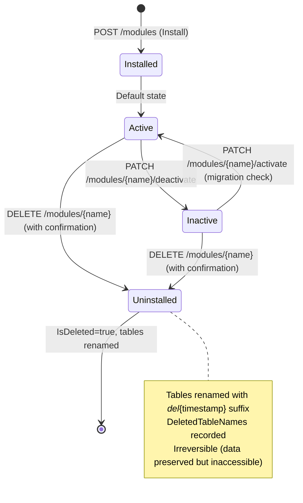
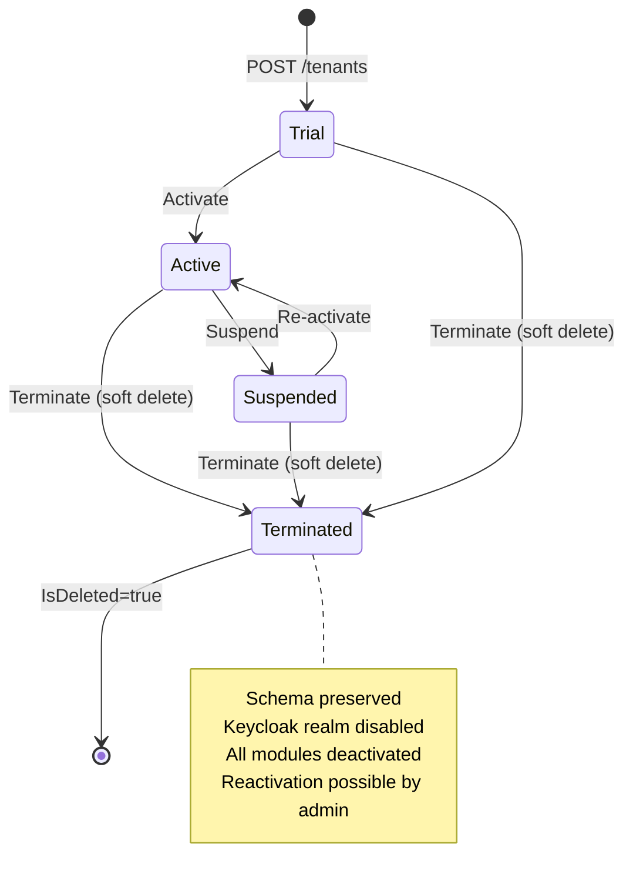

# Soft Delete Migration Plan

## Overview

Nexora platformunda tüm silme işlemlerini hard delete'ten soft delete'e geçirme planı. Bu değişiklik uygulama genelinde tutarlı bir silme stratejisi sağlar, veri kaybını önler ve audit trail bütünlüğünü korur.

## Mevcut Durum

### Karışık Silme Stratejileri

| Strateji | Entity'ler | Sorun |
|----------|-----------|-------|
| **Hard Delete** | Folder, ReportSchedule, ReportDefinition, Dashboard, ContactAddress, ContactNote, ContactTag, ContactRelationship, Role, User, OrganizationUser, UserRole, RolePermission | Veri kalıcı olarak kaybediliyor, geri alınamaz |
| **Status/IsActive** | Contact (Archived), Document (Archived), User (Inactive), Tenant (Suspended), Organization (IsActive), Tag (IsActive), NotificationTemplate (IsActive), Role (IsActive), ReportSchedule (IsActive) | Tutarsız pattern, bazıları Status enum bazıları bool |
| **GDPR Hard Delete** | Contact + ilişkili veriler | Yasal zorunluluk — hard delete kalacak |

### Unique Index Envanteri (23 index)

Soft delete sonrası duplicate key hatası riski taşıyan index'ler:

| Tablo | Index | Risk |
|-------|-------|------|
| `identity_users` | `(TenantId, Email)` | Silinen user ile aynı email tekrar eklenemez |
| `identity_users` | `(TenantId, KeycloakUserId)` | Silinen KC user tekrar bağlanamaz |
| `identity_roles` | `(TenantId, Name)` | Silinen rol adı tekrar kullanılamaz |
| `identity_organizations` | `(TenantId, Slug)` | Silinen org slug'ı tekrar kullanılamaz |
| `identity_organization_users` | `(UserId, OrganizationId)` | Silinen üyelik tekrar eklenemez |
| `identity_user_roles` | `(OrganizationUserId, RoleId)` | Silinen rol ataması tekrar yapılamaz |
| `identity_role_permissions` | `(RoleId, PermissionId)` | Silinen izin tekrar atanamaz |
| `contacts_tags` | `(TenantId, Name)` | Silinen tag adı tekrar kullanılamaz |
| `contacts_custom_field_definitions` | `(TenantId, FieldName)` | Silinen alan adı tekrar kullanılamaz |
| `contacts_contact_tags` | `(ContactId, TagId, OrganizationId)` | Silinen tag ataması tekrar yapılamaz |
| `contacts_contact_custom_fields` | `(ContactId, FieldDefinitionId)` | Silinen alan tekrar atanamaz |
| `contacts_communication_preferences` | `(ContactId, Channel)` | Silinen tercih tekrar eklenemez |
| `documents_document_versions` | `(DocumentId, VersionNumber)` | Düşük risk — versiyon numaraları artar |
| `notifications_templates` | `(TenantId, Code, Channel)` | Silinen template kodu tekrar kullanılamaz |
| `notifications_providers` | `(TenantId, Channel, ProviderName)` | Silinen provider tekrar eklenemez |
| `notifications_template_translations` | `(TemplateId, LanguageCode)` | Silinen çeviri tekrar eklenemez |
| `platform_tenants` | `(Slug)` | Silinen tenant slug'ı tekrar kullanılamaz |
| `platform_tenant_modules` | `(TenantId, ModuleName)` | Silinen modül tekrar yüklenemez |
| `identity_permissions` | `(Module, Resource, Action)` | Düşük risk — izinler seed edilir |

**Çözüm:** Tüm unique index'lere `WHERE "IsDeleted" = false` partial filter eklenmeli.

---

## Uygulama Planı

### Adım 1: SharedKernel — ISoftDeletable Interface ve Base Class

**Dosya:** `src/Nexora.SharedKernel/Domain/Base/ISoftDeletable.cs` (yeni)

```csharp
public interface ISoftDeletable
{
    bool IsDeleted { get; }
    DateTimeOffset? DeletedAt { get; }
    string? DeletedBy { get; }
}
```

**Dosya:** `src/Nexora.SharedKernel/Domain/Base/AuditableEntity.cs` (güncelleme)

```csharp
public abstract class AuditableEntity<TId> : Entity<TId>, ISoftDeletable
    where TId : notnull
{
    // Mevcut audit alanları
    public DateTimeOffset CreatedAt { get; private set; }
    public string? CreatedBy { get; private set; }
    public DateTimeOffset? UpdatedAt { get; private set; }
    public string? UpdatedBy { get; private set; }

    // Yeni soft delete alanları
    public bool IsDeleted { get; private set; }
    public DateTimeOffset? DeletedAt { get; private set; }
    public string? DeletedBy { get; private set; }

    internal void SetCreated(DateTimeOffset at, string? by) { ... }
    internal void SetUpdated(DateTimeOffset at, string? by) { ... }

    /// <summary>Marks entity as soft-deleted.</summary>
    /// <exception cref="ArgumentException">Thrown when <paramref name="at"/> is default.</exception>
    public void MarkAsDeleted(DateTimeOffset at, string? by)
    {
        if (at == default)
            throw new ArgumentException("Timestamp cannot be default.", nameof(at));

        IsDeleted = true;
        DeletedAt = at;
        DeletedBy = by;
    }

    /// <summary>Restores a soft-deleted entity.</summary>
    public void UndoDelete()
    {
        IsDeleted = false;
        DeletedAt = null;
        DeletedBy = null;
    }
}
```

**Etki:** Tüm `AuditableEntity<T>` alt sınıfları otomatik olarak `IsDeleted`, `DeletedAt`, `DeletedBy` alanlarını alır.

### Adım 2: BaseDbContext — Global Query Filter + SaveChanges

**Dosya:** `src/Nexora.Infrastructure/Persistence/BaseDbContext.cs` (güncelleme)

```csharp
protected override void OnModelCreating(ModelBuilder modelBuilder)
{
    base.OnModelCreating(modelBuilder);

    // Tüm ISoftDeletable entity'ler için global query filter
    foreach (var entityType in modelBuilder.Model.GetEntityTypes())
    {
        if (typeof(ISoftDeletable).IsAssignableFrom(entityType.ClrType))
        {
            modelBuilder.Entity(entityType.ClrType)
                .HasQueryFilter(CreateSoftDeleteFilter(entityType.ClrType));
        }
    }
}

// Lambda expression builder for HasQueryFilter
private static LambdaExpression CreateSoftDeleteFilter(Type entityType)
{
    var parameter = Expression.Parameter(entityType, "e");
    var property = Expression.Property(parameter, nameof(ISoftDeletable.IsDeleted));
    var condition = Expression.Equal(property, Expression.Constant(false));
    return Expression.Lambda(condition, parameter);
}
```

**SaveChangesAsync güncellemesi:**

```csharp
// Mevcut audit field handling'e ek:
foreach (var entry in ChangeTracker.Entries())
{
    // Entity Deleted state'e geçtiğinde soft delete'e çevir
    if (entry.State == EntityState.Deleted && entry.Entity is ISoftDeletable)
    {
        entry.State = EntityState.Modified;
        entry.Property("IsDeleted").CurrentValue = true;
        entry.Property("DeletedAt").CurrentValue = now;
        entry.Property("DeletedBy").CurrentValue = userId;
    }
}
```

> **Not:** Bu yaklaşımla `dbContext.Remove()` çağrıları otomatik olarak soft delete'e dönüşür. Handler'larda kod değişikliği minimum olur.

**PlatformDbContext** için de aynı pattern uygulanacak.

### Adım 3: Unique Index'leri Güncelle — Partial Filter

**Tüm EF Configuration dosyaları güncellenecek:**

Her `IsUnique()` çağrısına `.HasFilter("\"IsDeleted\" = false")` eklenmeli:

```csharp
// Önce:
e.HasIndex(u => new { u.TenantId, u.Email }).IsUnique();

// Sonra:
e.HasIndex(u => new { u.TenantId, u.Email }).IsUnique()
    .HasFilter("\"IsDeleted\" = false");
```

**Etkilenen dosyalar (23 index, ~18 configuration dosyası):**

| Modül | Configuration | Index Sayısı |
|-------|--------------|-------------|
| Identity | UserConfiguration | 2 |
| Identity | RoleConfiguration | 1 |
| Identity | OrganizationConfiguration | 1 |
| Identity | OrganizationUserConfiguration | 1 |
| Identity | UserRoleConfiguration | 1 |
| Identity | RolePermissionConfiguration | 1 |
| Identity | PermissionConfiguration | 1 |
| Identity | PlatformDbContext (inline) | 2 |
| Contacts | TagConfiguration | 1 |
| Contacts | CustomFieldDefinitionConfiguration | 1 |
| Contacts | ContactTagConfiguration | 1 |
| Contacts | ContactCustomFieldConfiguration | 1 |
| Contacts | CommunicationPreferenceConfiguration | 1 |
| Documents | DocumentVersionConfiguration | 1 |
| Notifications | NotificationTemplateConfiguration | 1 |
| Notifications | NotificationProviderConfiguration | 1 |
| Notifications | NotificationTemplateTranslationConfiguration | 1 |

### Adım 4: Delete Handler'ları Dönüştürme

**Otomatik dönüşüm (Adım 2'deki SaveChanges interceptor sayesinde):**

`dbContext.Remove(entity)` çağrıları zaten soft delete'e dönüşecek. Ancak bazı handler'larda ek mantık var:

| Handler | Mevcut | Sonra | Not |
|---------|--------|-------|-----|
| `DeleteRoleCommand` | `dbContext.Roles.Remove(role)` | Otomatik soft delete | Assigned user kontrolü kalacak |
| `DeleteUserCommand` | `Remove(user)` + `RemoveRange(orgUsers)` | `Remove(user)` yeterli, cascade soft delete | OrganizationUser + UserRole da soft delete olmalı |
| `DeleteOrganizationCommand` | `org.Deactivate()` | `dbContext.Remove(org)` ile soft delete | Mevcut Deactivate pattern kaldırılabilir veya korunabilir |
| `DeleteFolderCommand` | `dbContext.Folders.Remove(folder)` | Otomatik soft delete | Non-empty folder kontrolü kalacak |
| `DeleteReportDefinitionCommand` | `dbContext.Remove(definition)` | Otomatik soft delete | — |
| `DeleteReportScheduleCommand` | `dbContext.Remove(schedule)` | Otomatik soft delete | — |
| `DeleteDashboardCommand` | `dbContext.Remove(dashboard)` | Otomatik soft delete | — |
| `RemoveContactAddressCommand` | `dbContext.Remove(address)` | Otomatik soft delete | — |
| `DeleteContactNoteCommand` | `dbContext.Remove(note)` | Otomatik soft delete | — |
| `RemoveTagFromContactCommand` | `dbContext.Remove(contactTag)` | Otomatik soft delete | — |
| `RemoveContactRelationshipCommand` | `dbContext.Remove(relationship)` | Otomatik soft delete | — |
| `RemoveOrganizationMemberCommand` | `dbContext.Remove(membership)` | Otomatik soft delete | — |
| `AssignUserRolesCommand` | `dbContext.UserRoles.Remove(ur)` (reconciliation) | Hard delete OK burada (role reassignment) | **İstisna:** Rol ataması reconciliation'da hard delete mantıklı |

**İstisnalar (Hard delete kalacak):**

| Handler | Neden |
|---------|-------|
| `RequestGdprDeleteCommand` | KVKK/GDPR yasal zorunluluk — kişisel veri kalıcı silinmeli |
| `AssignUserRolesCommand` (reconciliation) | Role reassignment, eski atamalar gereksiz |
| `UninstallModuleCommand` (RolePermission cleanup) | Modül kaldırıldığında orphan permission'lar temizlenmeli |

### Adım 5: Modül Lifecycle Yeniden Tasarımı

**TenantModule entity güncellemesi:**

```csharp
public sealed class TenantModule : AuditableEntity<TenantModuleId>
{
    public TenantId TenantId { get; private set; }
    public string ModuleName { get; private set; }
    public bool IsActive { get; private set; }
    // Yeni: Soft delete ile gelen alanlar (AuditableEntity'den)
    // IsDeleted, DeletedAt, DeletedBy

    // Yeni: Uninstall metadata
    public string? DeletedTableNames { get; private set; }  // CSV: "contacts_contacts_del_20260325, ..."

    public void Activate() { IsActive = true; }
    public void Deactivate() { IsActive = false; }

    public void RecordUninstall(string deletedTableNames)
    {
        DeletedTableNames = deletedTableNames;
    }
}
```

**Lifecycle akışı:**



**Uninstall süreci (detay):**

1. Kullanıcıdan onay al (frontend confirmation dialog — "Bu işlem geri alınamaz")
2. Tenant schema'daki modül tablolarını rename et: `contacts_contacts` → `contacts_contacts_del_20260325_143022`
3. `DeletedTableNames`'e rename edilen tablo isimlerini kaydet
4. `MarkAsDeleted()` çağır (IsDeleted=true, DeletedAt set)
5. Modülün `OnUninstallAsync()` callback'ini çağır
6. Orphan RolePermission'ları temizle

### Adım 6: Tenant Lifecycle

Tenant silme de soft delete olacak:



### Adım 7: Database Migration

Tüm tablolara `IsDeleted`, `DeletedAt`, `DeletedBy` kolonları eklenecek:

```sql
-- Her modül tablosu için:
ALTER TABLE identity_users ADD COLUMN "IsDeleted" boolean NOT NULL DEFAULT false;
ALTER TABLE identity_users ADD COLUMN "DeletedAt" timestamptz;
ALTER TABLE identity_users ADD COLUMN "DeletedBy" varchar(200);

-- Platform tabloları için:
ALTER TABLE platform_tenants ADD COLUMN "IsDeleted" boolean NOT NULL DEFAULT false;
ALTER TABLE platform_tenants ADD COLUMN "DeletedAt" timestamptz;
ALTER TABLE platform_tenants ADD COLUMN "DeletedBy" varchar(200);

-- TenantModule için ek:
ALTER TABLE platform_tenant_modules ADD COLUMN "DeletedTableNames" text;
```

**Not:** EF Core Code-First migration ile otomatik üretilecek.

---

## Uygulama Durumu

> **Durum: TAMAMLANDI** — Tüm adımlar uygulandı ve 1360 backend test geçiyor.

| Sıra | Adım | Durum | Notlar |
|------|------|-------|--------|
| 1 | `ISoftDeletable` interface | ✅ Tamamlandı | `SharedKernel/Domain/Base/ISoftDeletable.cs` |
| 2 | `AuditableEntity` güncelle | ✅ Tamamlandı | IsDeleted, DeletedAt, DeletedBy + MarkAsDeleted(), UndoDelete() |
| 3 | `BaseDbContext` güncelle | ✅ Tamamlandı | SaveChanges interceptor (Deleted → Modified), ApplySoftDeleteFilters() helper |
| 4 | `PlatformDbContext` güncelle | ✅ Tamamlandı | Inline query filters + audit fields + soft delete columns |
| 5 | EF Configurations güncelle | ✅ Tamamlandı | 18 dosya, 23 unique index → `HasFilter("\"IsDeleted\" = false")` |
| 6 | `TenantModule` entity güncelle | ✅ Tamamlandı | AuditableEntity'ye yükseltildi, DeletedTableNames + Activate() eklendi |
| 7 | Delete handler'lar | ✅ Otomatik | SaveChanges interceptor sayesinde Remove() → soft delete otomatik |
| 8 | Module lifecycle | ✅ Tamamlandı | Activate/Deactivate/Uninstall 3 akış, tablo rename + DeletedTableNames |
| 9 | Tenant lifecycle | ✅ Tamamlandı | Terminate → tüm modüller deactivate |
| 10 | DB Migration | ✅ Tamamlandı | ALTER TABLE ile IsDeleted, DeletedAt, DeletedBy eklendi |
| 11 | Testler | ✅ Geçiyor | 1360 backend test, IgnoreQueryFilters() test'te kullanıldı |

### İstisnalar (Hard Delete Kalan)

| Handler | Neden |
|---------|-------|
| `RequestGdprDeleteCommand` | KVKK/GDPR yasal zorunluluk |
| `AssignUserRolesCommand` (reconciliation) | Role reassignment join kayıtları |
| `UninstallModuleCommand` (RolePermission cleanup) | Orphan permission temizliği |

## Riskler ve Dikkat Edilecekler

1. **Cascade soft delete:** Bir entity soft delete edildiğinde ilişkili entity'ler de soft delete edilmeli mi? Örnek: User silinince OrganizationUser ve UserRole da silinmeli mi?
   - **Öneri:** Evet, parent entity silinince child'lar da soft delete olmalı. Bu handler'da yapılmalı, EF cascade delete kullanılmamalı.

2. **Query filter bypass:** Admin "silinen kayıtları gör" isterse `IgnoreQueryFilters()` kullanılabilir. Ancak bu dikkatli kullanılmalı.

3. **GDPR uyumluluk:** `RequestGdprDeleteCommand` hard delete kalacak — bu yasal zorunluluk. `IgnoreQueryFilters()` ile erişilip gerçekten silinecek.

4. **Performance:** `IsDeleted = false` filtresi her sorguya ekleniyor. PostgreSQL partial index'ler ile performans korunur.

5. **Mevcut veriler:** Migration sırasında tüm mevcut kayıtlar `IsDeleted = false` olarak set edilecek (DEFAULT false).

6. **Deactivate vs Delete:** Bazı entity'lerde hem `IsActive` hem `IsDeleted` olacak. Bu kasıtlı:
   - `IsActive = false`: Geçici olarak devre dışı, tekrar aktif edilebilir
   - `IsDeleted = true`: Kalıcı olarak silinmiş, UI'da görünmez, geri alınamaz (admin hariç)

## Bağımlılıklar

- Bu değişiklik **Phase 2'ye başlamadan önce** tamamlanmalı
- Tüm mevcut testler güncellenmeli
- Migration'lar tüm mevcut tenant schema'larına uygulanmalı
