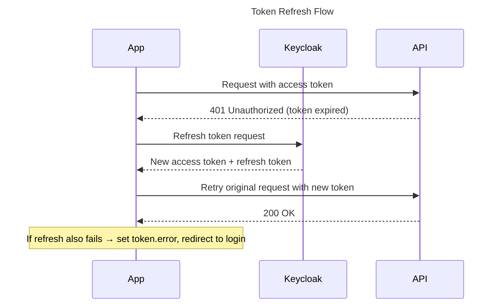
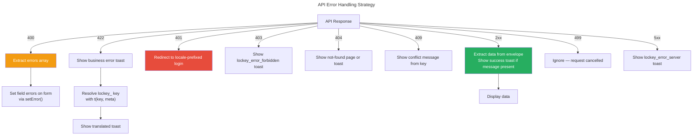
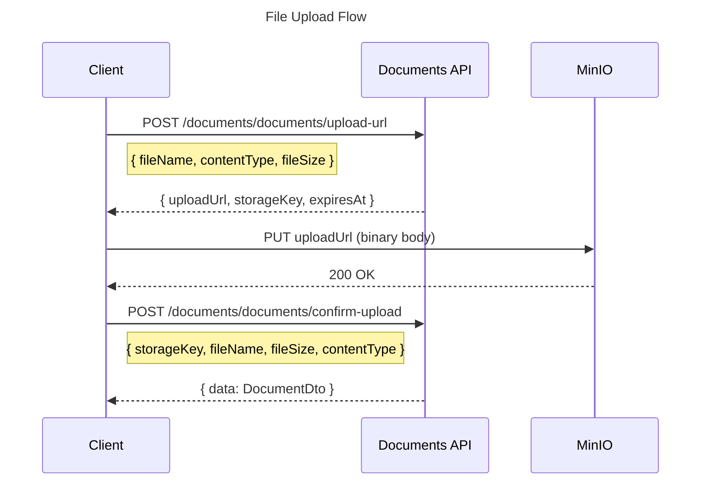

# Nexora - API Integration Standards

## 1. Purpose & Scope

This standard defines the **mandatory contract** between Nexora backend APIs and frontend applications (nexora-admin, nexora-portal). All rules use MUST/MUST NOT/SHOULD language per RFC 2119.

**Applies to**:
- Backend: All API endpoint responses, error shapes, and status codes
- Frontend: All API client code, TanStack Query hooks, error handling, and file upload flows

**Companion documents**:
- `FRONTEND_STANDARDS.md` — component and state management patterns
- `LOCALIZATION_STANDARDS.md` — `lockey_` key rules for API messages
- `OBSERVABILITY_STANDARDS.md` — error model and logging

---

## 2. URL & Versioning Contract

### 2.1 URL Pattern

All API endpoints MUST follow this pattern:

```text
/api/v{version}/{module}/{resource}
```

| Method | URL | Action |
|--------|-----|--------|
| `GET` | `/api/v1/contacts/contacts` | List (paginated) |
| `POST` | `/api/v1/contacts/contacts` | Create |
| `GET` | `/api/v1/contacts/contacts/{id}` | Get by ID |
| `PUT` | `/api/v1/contacts/contacts/{id}` | Full update |
| `PATCH` | `/api/v1/contacts/contacts/{id}` | Partial update |
| `DELETE` | `/api/v1/contacts/contacts/{id}` | Delete |
| `POST` | `/api/v1/contacts/contacts/{id}/archive` | Custom action |

### 2.2 Rules

- Endpoints MUST be versioned. New breaking changes require a new version (`v2`)
- Frontend MUST read the base URL from environment variables — never hardcoded:

```typescript
// Admin (Vite)
const API_BASE = import.meta.env.VITE_API_BASE_URL;   // e.g. "http://localhost:5000/api/v1"

// Portal (Next.js)
const API_BASE = process.env.NEXT_PUBLIC_API_URL;      // e.g. "http://localhost:5000/api/v1"
```

---

## 3. Response Envelope — `ApiEnvelope<T>`

### 3.1 Contract

All backend API responses MUST be wrapped in `ApiEnvelope<T>`. Backend MUST NOT return bare objects.

```typescript
// shared/types/api.ts

/** Standard API response wrapper — ALL responses MUST use this shape */
interface ApiEnvelope<T> {
  data?: T;
  message?: string;                // Always a lockey_ key — NEVER a translated string
  meta?: Record<string, string>;   // Message interpolation parameters
  errors?: ApiValidationError[];   // Only present on 400 responses
}

/** Single validation error */
interface ApiValidationError {
  key: string;                     // lockey_ error key
  params?: Record<string, string>; // Interpolation params (e.g. { field: "Email" })
}

/** Paginated list response — used for all list endpoints */
interface PagedResult<T> {
  items: T[];
  totalCount: number;
  page: number;
  pageSize: number;
  totalPages: number;
  hasNextPage: boolean;
  hasPreviousPage: boolean;
}
```

### 3.2 Response Shape Examples

**Success — single entity (201)**:

```json
{
  "data": {
    "id": "3fa85f64-5717-4562-b3fc-2c963f66afa6",
    "firstName": "Ali",
    "lastName": "Yılmaz",
    "email": "ali@example.com",
    "createdAt": "2026-03-21T10:30:00Z"
  },
  "message": "lockey_contacts_contact_created"
}
```

**Success — paginated list (200)**:

```json
{
  "data": {
    "items": [
      { "id": "...", "firstName": "Ali", "lastName": "Yılmaz" }
    ],
    "totalCount": 142,
    "page": 1,
    "pageSize": 20,
    "totalPages": 8,
    "hasNextPage": true,
    "hasPreviousPage": false
  }
}
```

**Error (4xx/5xx)**:

```json
{
  "message": "lockey_contacts_error_contact_not_found",
  "meta": { "contactId": "3fa85f64-..." }
}
```

**Validation error (400)**:

```json
{
  "message": "lockey_validation_failed",
  "errors": [
    {
      "key": "lockey_contacts_validation_email_required",
      "params": { "field": "Email" }
    }
  ]
}
```

### 3.3 Message Key Rules

- `message` field MUST always be a `lockey_` key — backend MUST NEVER return translated text
- Frontend MUST resolve `message` and `errors[].key` via the translation function before displaying
- `meta` contains interpolation parameters passed directly to `t(key, meta)`

---

## 4. HTTP Status Codes

Backend MUST use these status codes consistently. Frontend MUST handle each as described.

| Status | Meaning | Frontend Action | Example |
|--------|---------|----------------|---------|
| **200** | Success (GET, PUT, PATCH) | Display data | List loaded |
| **201** | Created (POST) | Navigate to detail or show success toast | Contact created |
| **204** | Deleted (DELETE) | Invalidate query, navigate back | Contact deleted |
| **400** | Validation error | Set field-level errors on form via `setError()` | Missing required field |
| **401** | Not authenticated | Redirect to locale-prefixed login page | Expired token |
| **403** | Not authorized | Show `lockey_error_forbidden` toast | Missing permission |
| **404** | Not found | Show not-found page or toast | Entity ID doesn't exist |
| **409** | Conflict / duplicate | Show conflict message from `message` key | Duplicate email |
| **422** | Business rule violation | Show error toast with resolved `message` | Insufficient balance |
| **499** | Request cancelled | Ignore — user navigated away | Abort signal fired |
| **500** | Server error | Show `lockey_error_server` toast | Unhandled exception |
| **502** | External service unavailable | Show `lockey_error_service_unavailable` toast | Keycloak unreachable |

---

## 5. Authentication

### 5.1 JWT Structure

Nexora uses Keycloak with realm-per-tenant. Every authenticated request MUST include the JWT as a Bearer token. The JWT contains:

```typescript
interface JwtClaims {
  sub: string;               // User ID (UUID)
  tenant_id: string;         // Tenant identifier — MUST be sourced from here, never from request body
  organization_id?: string;  // Current organization (if selected)
  permissions: string[];     // e.g. ["contacts.contacts.read", "contacts.contacts.write"]
  preferred_username: string;
  email: string;
  exp: number;               // Expiry timestamp
}
```

### 5.2 Token Usage

Every authenticated request MUST include:

```text
Authorization: Bearer <access_token>
Content-Type: application/json
```

### 5.3 Session Error State

Frontend auth gates MUST check both token presence AND session error state. Checking only `!token` is insufficient — an expired, un-refreshable Keycloak token leaves `token.error` set while the token itself is still present.

```typescript
// ✅ CORRECT — required pattern
if (!token || token.error === 'RefreshAccessTokenError') {
  redirect(loginUrl);
}

// ❌ FORBIDDEN — does not catch expired refresh token
if (!token) {
  redirect(loginUrl);
}
```

### 5.4 Token Refresh Flow



---

## 6. Required API Client Pattern

### 6.1 Canonical Implementation

Frontend MUST use a centralized API client. Direct `fetch`/`axios` calls in components or hooks are forbidden.

```typescript
// shared/lib/api.ts
import axios, { type AxiosError, type InternalAxiosRequestConfig } from 'axios';
import type { ApiEnvelope } from '@/shared/types/api';
import { useAuthStore } from '@/shared/lib/stores/authStore';
import { getKeycloak } from '@/shared/lib/auth';
import { setAuthToken } from '@/shared/lib/api';

const apiClient = axios.create({
  baseURL: import.meta.env.VITE_API_BASE_URL ?? process.env.NEXT_PUBLIC_API_URL,
  headers: { 'Content-Type': 'application/json' },
});

// Request interceptor — inject auth token on every request
apiClient.interceptors.request.use((config) => {
  const token = useAuthStore.getState().token;
  if (token) config.headers.Authorization = `Bearer ${token}`;
  return config;
});

// Response interceptor — handle 401 with refresh-then-retry
let refreshPromise: Promise<boolean> | null = null;

apiClient.interceptors.response.use(
  (response) => response,
  async (error: AxiosError<ApiEnvelope<unknown>>) => {
    const originalRequest = error.config as
      | (InternalAxiosRequestConfig & { _retry?: boolean })
      | undefined;

    if (
      error.response?.status === 401 &&
      originalRequest &&
      !originalRequest._retry
    ) {
      originalRequest._retry = true;

      const kc = getKeycloak();
      if (kc) {
        try {
          // Queue concurrent requests behind a single refresh attempt
          if (!refreshPromise) {
            refreshPromise = kc
              .updateToken(5)
              .then(() => true)
              .catch(() => false)
              .finally(() => { refreshPromise = null; });
          }

          const refreshed = await refreshPromise;

          if (refreshed && kc.token) {
            // Retry original request with fresh token
            setAuthToken(kc.token);
            originalRequest.headers['Authorization'] = `Bearer ${kc.token}`;
            return apiClient(originalRequest);
          }
        } catch {
          // fall through to logout
        }
      }

      // Refresh failed — clear session and redirect
      setAuthToken(null);
      useAuthStore.getState().clearSession();
      if (window.location.pathname !== '/login') {
        window.location.href = '/login';
      }
    }
    return Promise.reject(error);
  },
);

/** Typed API helper — always returns unwrapped T, never the raw envelope */
export const api = {
  async get<T>(url: string, params?: Record<string, unknown>): Promise<T> {
    const { data } = await apiClient.get<ApiEnvelope<T>>(url, { params });
    if (data.data === undefined || data.data === null) {
      throw new Error(`API response missing data for GET ${url}`);
    }
    return data.data;
  },
  async post<T>(url: string, body?: unknown): Promise<T> {
    const { data } = await apiClient.post<ApiEnvelope<T>>(url, body);
    if (data.data === undefined || data.data === null) {
      throw new Error(`API response missing data for POST ${url}`);
    }
    return data.data;
  },
  async put<T>(url: string, body?: unknown): Promise<T> {
    const { data } = await apiClient.put<ApiEnvelope<T>>(url, body);
    if (data.data === undefined || data.data === null) {
      throw new Error(`API response missing data for PUT ${url}`);
    }
    return data.data;
  },
  async patch<T>(url: string, body?: unknown): Promise<T> {
    const { data } = await apiClient.patch<ApiEnvelope<T>>(url, body);
    if (data.data === undefined || data.data === null) {
      throw new Error(`API response missing data for PATCH ${url}`);
    }
    return data.data;
  },
  async delete(url: string): Promise<void> {
    await apiClient.delete(url);
  },
};
```

### 6.2 Forbidden Patterns

```typescript
// ❌ FORBIDDEN: Direct fetch in component
useEffect(() => {
  fetch('/api/v1/contacts/contacts').then(r => r.json()).then(setData);
}, []);

// ❌ FORBIDDEN: Direct axios call in hook bypassing api client
const { data } = await axios.get('/api/v1/contacts/contacts');

// ✅ CORRECT: Always via api helper
const data = await api.get<PagedResult<ContactDto>>('/contacts/contacts', params);
```

---

## 7. Required Error Handling Pattern

### 7.1 Error Extraction Hook

Frontend MUST use `useApiError` for all API error handling. Manual error parsing is forbidden.

```typescript
// shared/hooks/useApiError.ts
import { type AxiosError } from 'axios';
import { useTranslation } from 'react-i18next'; // or useTranslations for portal
import type { ApiEnvelope, ApiValidationError } from '@/shared/types/api';
import { toast } from 'sonner';

interface ApiErrorInfo {
  message: string;                          // Resolved (translated) message
  key: string;                              // Original lockey_ key
  meta?: Record<string, string>;
  validationErrors?: ApiValidationError[];
  status?: number;
}

export function useApiError() {
  const { t } = useTranslation(['error', 'validation']);

  function extractError(error: unknown): ApiErrorInfo {
    const axiosError = error as AxiosError<ApiEnvelope<unknown>>;
    const envelope = axiosError.response?.data;
    const status = axiosError.response?.status;

    if (!envelope?.message) {
      return { message: t('lockey_error_unexpected'), key: 'lockey_error_unexpected', status };
    }

    const key = envelope.message;
    const ns = key.startsWith('lockey_validation_') ? 'validation' : 'error';

    return {
      message: t(key, { ns, ...envelope.meta }),
      key,
      meta: envelope.meta ?? undefined,
      validationErrors: envelope.errors,
      status,
    };
  }

  function handleApiError(
    error: unknown,
    setFieldError?: (field: string, error: { message: string }) => void,
  ) {
    const info = extractError(error);

    // Validation errors → set field-level errors on form
    if (info.validationErrors?.length && setFieldError) {
      for (const ve of info.validationErrors) {
        const field = ve.params?.field;
        if (field) setFieldError(field, { message: t(ve.key, ve.params ?? {}) });
      }
      return;
    }

    toast.error(info.message);
  }

  return { extractError, handleApiError };
}
```

### 7.2 Error Handling Flowchart



---

## 8. Required TanStack Query Patterns

### 8.1 Query Client Configuration

`QueryClient` MUST be created inside a factory function — never at module scope. Creating at module scope causes SSR state leakage across requests.

```typescript
// shared/lib/query.ts
import { QueryClient } from '@tanstack/react-query';

// ✅ CORRECT — factory function, safe for SSR
export function makeQueryClient(): QueryClient {
  return new QueryClient({
    defaultOptions: {
      queries: {
        staleTime: 30 * 1000,        // 30 seconds
        retry: 1,
        refetchOnWindowFocus: false,
      },
      mutations: {
        retry: 0,                     // Never retry mutations
      },
    },
  });
}

// ❌ FORBIDDEN — module-scope instantiation leaks state across SSR requests
export const queryClient = new QueryClient({ ... });
```

### 8.2 Query Key Convention

Query keys MUST follow the array pattern `[module, resource, action?, params?]`. String keys are forbidden.

```typescript
// ✅ CORRECT — structured array keys
['contacts', 'list']                                      // All contacts
['contacts', 'list', { page: 1, search: 'Ali' }]         // Filtered list
['contacts', 'detail', 'uuid-123']                        // Single entity
['contacts', 'detail', 'uuid-123', 'addresses']           // Related resource
['documents', 'detail', 'uuid-456', 'versions']           // Nested resource

// ❌ FORBIDDEN — string keys lose hierarchy benefits
['contacts-list']
['getContactById-uuid-123']
```

### 8.3 Query Key Factory Pattern

All modules MUST define a query key factory object. Ad-hoc key construction in individual hooks is forbidden.

```typescript
// modules/contacts/hooks/queryKeys.ts

export const contactKeys = {
  all: ['contacts'] as const,
  lists: () => [...contactKeys.all, 'list'] as const,
  list: (params?: ContactListParams) => [...contactKeys.lists(), params] as const,
  details: () => [...contactKeys.all, 'detail'] as const,
  detail: (id: string) => [...contactKeys.details(), id] as const,
  addresses: (id: string) => [...contactKeys.detail(id), 'addresses'] as const,
};
```

### 8.4 CRUD Hook Pattern

Every module MUST expose typed hooks following this pattern. TanStack Query v5 API MUST be used (`isPending` for mutations, not `isLoading`).

```typescript
// modules/contacts/hooks/useContacts.ts

/** List with optional filters */
export function useContacts(params?: ContactListParams) {
  return useQuery({
    queryKey: contactKeys.list(params),
    queryFn: () => api.get<PagedResult<ContactDto>>('/contacts/contacts', params),
  });
}

/** Single entity — disabled when id is empty */
export function useContact(id: string) {
  return useQuery({
    queryKey: contactKeys.detail(id),
    queryFn: () => api.get<ContactDto>(`/contacts/contacts/${id}`),
    enabled: !!id,
  });
}

/** Create — invalidates list on success */
export function useCreateContact() {
  const queryClient = useQueryClient();
  return useMutation({
    mutationFn: (data: CreateContactRequest) =>
      api.post<ContactDto>('/contacts/contacts', data),
    onSuccess: () => queryClient.invalidateQueries({ queryKey: contactKeys.lists() }),
  });
}

/** Update — invalidates detail AND list on success */
export function useUpdateContact(id: string) {
  const queryClient = useQueryClient();
  return useMutation({
    mutationFn: (data: UpdateContactRequest) =>
      api.put<ContactDto>(`/contacts/contacts/${id}`, data),
    onSuccess: () => {
      queryClient.invalidateQueries({ queryKey: contactKeys.detail(id) });
      queryClient.invalidateQueries({ queryKey: contactKeys.lists() });
    },
  });
}

/** Delete — invalidates list on success */
export function useDeleteContact() {
  const queryClient = useQueryClient();
  return useMutation({
    mutationFn: (id: string) => api.delete(`/contacts/contacts/${id}`),
    onSuccess: () => queryClient.invalidateQueries({ queryKey: contactKeys.lists() }),
  });
}
```

---

## 9. Pagination Contract

### 9.1 Request Parameters

All list endpoints MUST accept these query parameters:

| Parameter | Type | Default | Description |
|-----------|------|---------|-------------|
| `page` | `number` | `1` | 1-based page number |
| `pageSize` | `number` | `20` | Items per page (max: `100`) |
| `search` | `string` | — | Free-text search (module-specific fields) |
| `sortBy` | `string` | — | Field name to sort by |
| `sortDir` | `asc\|desc` | `asc` | Sort direction |

### 9.2 Pagination Hook

```typescript
// shared/hooks/usePagination.ts
import { useSearchParams } from 'react-router-dom'; // or next/navigation for portal

export function usePagination(defaultPageSize = 20) {
  const [searchParams, setSearchParams] = useSearchParams();

  const page = Number(searchParams.get('page')) || 1;
  const pageSize = Number(searchParams.get('pageSize')) || defaultPageSize;

  const setPage = (newPage: number) =>
    setSearchParams((prev) => { prev.set('page', String(newPage)); return prev; });

  return { page, pageSize, setPage };
}
```

---

## 10. Module Availability & Permissions

### 10.1 Checking Installed Modules

Frontend MUST NOT render module UI without verifying the module is installed for the tenant.

```typescript
// shared/hooks/useModules.ts
export function useInstalledModules() {
  return useQuery({
    queryKey: ['identity', 'modules'],
    queryFn: () => api.get<ModuleInfo[]>('/identity/modules'),
    staleTime: 5 * 60 * 1000, // 5 minutes — module list changes rarely
  });
}

export function useHasModule(moduleName: string): boolean {
  const { data } = useInstalledModules();
  return data?.some((m) => m.name === moduleName) ?? false;
}
```

### 10.2 Permission Format

Permissions MUST use the format `{module}.{resource}.{action}`:

```text
contacts.contacts.read
contacts.contacts.write
documents.documents.manage
identity.users.invite
```

UI permission checks are for UX only — backend enforces the real authorization.

---

## 11. File Upload — Presigned URL Pattern

All file uploads MUST use the presigned URL pattern. Direct multipart uploads to the backend are forbidden.



### 11.1 Required Implementation Pattern

```typescript
// modules/documents/hooks/useUploadDocument.ts

export function useUploadDocument() {
  const queryClient = useQueryClient();

  return useMutation({
    mutationFn: async (file: File) => {
      // Step 1: Request presigned URL from backend
      const { uploadUrl, storageKey } = await api.post<UploadUrlDto>(
        '/documents/documents/upload-url',
        { fileName: file.name, contentType: file.type, fileSize: file.size },
      );

      // Step 2: Upload directly to MinIO (bypasses backend for performance)
      const uploadResponse = await fetch(uploadUrl, {
        method: 'PUT',
        body: file,
        headers: { 'Content-Type': file.type },
      });

      if (!uploadResponse.ok) {
        throw new Error('lockey_documents_error_upload_failed');
      }

      // Step 3: Confirm upload and persist document record
      return api.post<DocumentDto>('/documents/documents/confirm-upload', {
        storageKey,
        fileName: file.name,
        contentType: file.type,
        fileSize: file.size,
      });
    },
    onSuccess: () => queryClient.invalidateQueries({ queryKey: ['documents', 'list'] }),
  });
}
```

---

## 12. Localization of API Messages

### 12.1 Rules

- Backend MUST NEVER return translated text in `message` or `errors[].key`
- All backend string outputs are `lockey_` keys
- Frontend MUST resolve keys before displaying — NEVER show raw `lockey_` strings to users

### 12.2 Resolution Pattern

```typescript
// Success message
const { data, message } = responseEnvelope;
if (message) toast.success(t(message)); // message = "lockey_contacts_contact_created"

// Error with parameters
// message = "lockey_contacts_error_duplicate_email"
// meta = { "email": "ali@example.com" }
toast.error(t(message, meta));
// Resolved: "Email ali@example.com is already in use"
```

### 12.3 Translation File Placement

API-sourced message keys MUST live in the module's locale file:

```text
locales/en/contacts.json   → lockey_contacts_*
locales/en/documents.json  → lockey_documents_*
locales/en/error.json      → lockey_error_* (cross-module errors)
locales/en/validation.json → lockey_validation_* (field validation)
```

---

## 13. Checklist Summary

Use this as a fast-reference during self-review and code review.

| # | Rule | Scope |
|---|------|-------|
| API-1 | All responses wrapped in `ApiEnvelope<T>` | [B] |
| API-2 | `message` field always a `lockey_` key, never translated text | [B] |
| API-3 | HTTP status codes match the table in §4 exactly | [B] |
| API-4 | URL pattern follows `/api/v{version}/{module}/{resource}` | [B] |
| API-5 | Breaking changes to response shape require a version bump | [B] |
| API-6 | Auth gates check `!token \|\| token.error === 'RefreshAccessTokenError'` | [F] |
| API-7 | All API calls go through `api.ts` client — no direct fetch/axios | [F] |
| API-8 | `QueryClient` created via factory function, not at module scope | [F] |
| API-9 | Query keys follow array pattern and use per-module factory | [F] |
| API-10 | TanStack Query v5 API: `isPending` for mutations, not `isLoading` | [F] |
| API-11 | All errors handled via `useApiError` — no manual error parsing | [F] |
| API-12 | Validation errors set as field-level errors on form, not toast | [F] |
| API-13 | File uploads use presigned URL pattern, not multipart to backend | [F] |
| API-14 | Module UI only rendered after confirming module is installed | [F] |
| API-15 | `lockey_` keys resolved before display — never shown raw | [F] |
