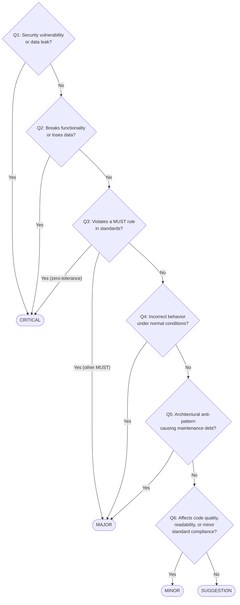
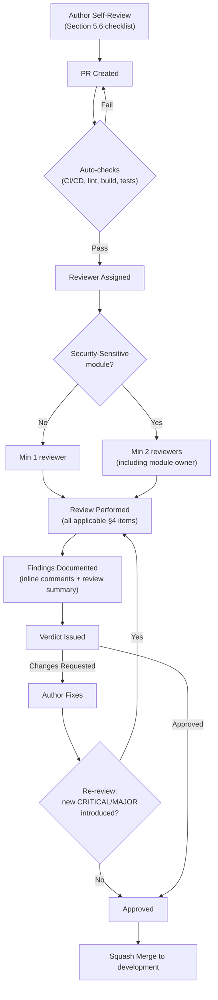

# Nexora - Code Review Standards

## 1. Purpose and Scope

Code reviews are the primary quality gate before code enters `main`. Every pull request MUST be reviewed before merging. This document defines what reviewers check, how findings are classified, and how review artifacts are structured.

**Applies to**: All Nexora codebases — backend (.NET), frontend (React, Next.js), infrastructure (Docker, CI/CD), and documentation.

---

## 2. Review Principles

1. **Standards First**: Every finding MUST reference a specific standard, not personal preference
2. **Severity Accuracy**: Classify findings by impact, not effort to fix
3. **Actionable Fixes**: Every finding MUST include a concrete fix or clear direction
4. **No False Positives**: Verify each finding against the actual code — do not flag already-correct code
5. **Regression Awareness**: When reviewing fix commits, treat fixes as potential sources of new bugs
6. **Completeness**: Review ALL changed files, not just the ones that look interesting

---

## 3. Severity Classification

Every finding MUST be assigned exactly one severity level:

| Severity | Label | Criteria | Merge Blocker |
|----------|-------|----------|---------------|
| **CRITICAL** | `[CRITICAL]` | Security vulnerability, data integrity risk, deployment blocker, zero-tolerance standards violation | Yes |
| **MAJOR** | `[MAJOR]` | Architectural problem, business logic error, clear standards deviation, missing test coverage for critical paths | Yes |
| **MINOR** | `[MINOR]` | Code quality issue, minor standards deviation, missing optimization, incomplete accessibility | No |
| **SUGGESTION** | `[SUGGESTION]` | Best practice note, optional improvement, future consideration | No |

### Severity Decision Guide



### Zero-Tolerance Rules (Always CRITICAL)

These rules, defined across Nexora standards, are **always** CRITICAL when violated:

| Rule | Source Standard | Example Violation |
|------|---------------|-------------------|
| Hardcoded user-facing string (no `lockey_` key) | `LOCALIZATION_STANDARDS.md` | `<p>Welcome back</p>` instead of `{t('lockey_common_welcome')}` |
| Secret in source code or config | `INFRASTRUCTURE_STANDARDS.md` | API key in `appsettings.json` |
| Token stored in localStorage | `FRONTEND_STANDARDS.md` | `localStorage.setItem('token', jwt)` |
| `dangerouslySetInnerHTML` usage | `FRONTEND_STANDARDS.md` | `<div dangerouslySetInnerHTML={{__html: data}} />` |
| `any` type usage in TypeScript | `FRONTEND_STANDARDS.md` | `function parse(data: any)` |
| `catch(Exception)` in module code | `OBSERVABILITY_STANDARDS.md` | `catch (Exception ex) { }` in handler |
| Cross-module direct reference | `CODING_STANDARDS.md` | Module A importing Module B's internal types |
| Missing tenant isolation in cache/query | `INFRASTRUCTURE_STANDARDS.md` | Cache key without tenant ID |
| PII/secret in log output | `OBSERVABILITY_STANDARDS.md` | `logger.LogInformation("Token: {Token}", jwt)` |
| API endpoint without `[Authorize]` or explicit `[AllowAnonymous]` | `CODING_STANDARDS.md` §Authorization | New controller action with no auth attribute |
| Tenant ID sourced from request body or query param | `CODING_STANDARDS.md` §Multi-Tenancy | `TenantId = request.TenantId` instead of JWT claim |
| `NEXT_PUBLIC_` env var containing a secret | `FRONTEND_STANDARDS.md` §Security | `NEXT_PUBLIC_STRIPE_SECRET_KEY=sk_live_...` |
| Auth gate not checking session error state | `FRONTEND_STANDARDS.md` §Auth | Middleware checking only `!token` without `token.error` check |
| Double type erasure cast (`as unknown as T`) | `FRONTEND_STANDARDS.md` §General | `return value as unknown as MyType` to bypass type system |
| Raw SQL string concatenation (SQL injection) | `CODING_STANDARDS.md` §Security | `$"SELECT * FROM users WHERE id = '{id}'"` |
| Destructive database migration in production path | `RELEASE_STANDARDS.md` §Migrations | `DROP COLUMN`, `DROP TABLE`, `ALTER COLUMN` (rename) without blue-green strategy |

---

## 4. Review Checklist

Every review MUST check the following areas. Items marked **[B]** apply to backend, **[F]** to frontend, **[*]** to both.

### 4.1 Security

| # | Check | Scope | Standard Reference |
|---|-------|-------|-------------------|
| SEC-1 | No hardcoded secrets, tokens, or API keys in source | [*] | `INFRASTRUCTURE_STANDARDS.md` §Secrets |
| SEC-2 | No PII or secrets in log output | [B] | `OBSERVABILITY_STANDARDS.md` §Logging |
| SEC-3 | No `dangerouslySetInnerHTML` usage | [F] | `FRONTEND_STANDARDS.md` §Security |
| SEC-4 | No tokens in `localStorage` — httpOnly cookies or secure memory only | [F] | `FRONTEND_STANDARDS.md` §Security |
| SEC-5 | SQL queries use parameterized statements (no string interpolation) | [B] | `CODING_STANDARDS.md` §Security |
| SEC-6 | User input validated at system boundaries (API endpoints, form submissions) | [*] | `CODING_STANDARDS.md` §Validation |
| SEC-7 | External URLs validated before use (SSRF prevention) | [F] | `FRONTEND_STANDARDS.md` §Security |
| SEC-8 | Tenant isolation enforced in queries, cache keys, and API calls | [*] | `INFRASTRUCTURE_STANDARDS.md` §Cache |
| SEC-9 | Permission checks on both frontend (UX) and backend (enforcement) | [*] | `CODING_STANDARDS.md` §Authorization |
| SEC-10 | No `--no-verify` or security bypass flags in commits | [*] | `RELEASE_STANDARDS.md` §Git |
| SEC-11 | Every API endpoint has `[Authorize]` or explicit `[AllowAnonymous]` with justification comment | [B] | `CODING_STANDARDS.md` §Authorization |
| SEC-12 | Tenant ID always sourced from JWT claim (`ITenantContext`), never from request body/query | [B] | `CODING_STANDARDS.md` §Multi-Tenancy |
| SEC-13 | Keycloak JWT claims accessed via typed extension methods, not raw string keys | [B] | `CODING_STANDARDS.md` §Auth |
| SEC-14 | `NEXT_PUBLIC_` env vars contain no secrets — they are bundled into client JavaScript | [F] | `FRONTEND_STANDARDS.md` §Security |
| SEC-15 | Middleware and auth gates check both token presence AND `token.error` (e.g. `RefreshAccessTokenError`) | [F] | `FRONTEND_STANDARDS.md` §Auth |
| SEC-16 | New npm/NuGet packages reviewed — no known CVEs, license compatible with commercial use | [*] | `INFRASTRUCTURE_STANDARDS.md` §Dependencies |

### 4.2 Architecture

| # | Check | Scope | Standard Reference |
|---|-------|-------|-------------------|
| ARCH-1 | Module boundaries respected (no cross-module direct imports) | [*] | `CODING_STANDARDS.md` §Module Rules |
| ARCH-2 | CQRS pattern followed (commands vs queries, FluentValidation) | [B] | `CODING_STANDARDS.md` §CQRS |
| ARCH-3 | Result pattern for expected failures, exceptions for unexpected | [B] | `OBSERVABILITY_STANDARDS.md` §Error Handling |
| ARCH-4 | Server vs client components correctly separated | [F] | `FRONTEND_STANDARDS.md` §Components |
| ARCH-5 | State management hierarchy respected (TanStack Query > Zustand > URL) | [F] | `FRONTEND_STANDARDS.md` §State |
| ARCH-6 | API responses use `ApiEnvelope<T>` with `lockey_` message keys | [B] | `CODING_STANDARDS.md` §API |
| ARCH-7 | No direct database access outside repository layer | [B] | `CODING_STANDARDS.md` §Architecture |
| ARCH-8 | Correct use of `'use client'` directive — only where actually needed | [F] | `FRONTEND_STANDARDS.md` §Components |
| ARCH-9 | Background jobs extend `NexoraJob<T>` and are idempotent | [B] | `INFRASTRUCTURE_STANDARDS.md` §Jobs |
| ARCH-10 | Module tables prefixed: `{module}_{table}` | [B] | `CODING_STANDARDS.md` §Database |
| ARCH-11 | Domain events raised via `AddDomainEvent()` on aggregate root, not dispatched directly in handlers | [B] | `CODING_STANDARDS.md` §Domain |
| ARCH-12 | API endpoints follow versioning convention `/api/v{version}/{module}/{resource}` | [B] | `CODING_STANDARDS.md` §API |
| ARCH-13 | EF Core queries use `AsNoTracking()` in read-only paths (query handlers, GET endpoints) | [B] | `CODING_STANDARDS.md` §Database |
| ARCH-14 | New Next.js route segments have co-located `loading.tsx` and `error.tsx` files | [F] | `FRONTEND_STANDARDS.md` §Components |
| ARCH-15 | Server Actions not used — all API calls go through the `api.ts` client layer | [F] | `FRONTEND_STANDARDS.md` §Architecture |
| ARCH-16 | `QueryClient` instantiated inside a factory function, not at module scope (SSR safety) | [F] | `FRONTEND_STANDARDS.md` §State |
| ARCH-17 | Integration event handlers implement idempotency (duplicate message safe) | [B] | `CODING_STANDARDS.md` §Events |
| ARCH-18 | Delete operations use soft delete (`dbContext.Remove()` auto-converts for `AuditableEntity<T>`) — hard delete only for GDPR/join cleanup | [B] | `CODING_STANDARDS.md` §Soft Delete |
| ARCH-19 | New unique indexes include `HasFilter` for soft-delete-safe uniqueness | [B] | `CODING_STANDARDS.md` §Soft Delete |
| ARCH-20 | `IsActive` (temporary deactivation) never confused with `IsDeleted` (permanent soft delete) | [B] | `CODING_STANDARDS.md` §Soft Delete |
### 4.3 Localization

| # | Check | Scope | Standard Reference |
|---|-------|-------|-------------------|
| L10N-1 | **Zero hardcoded user-facing strings** — all use `lockey_` keys | [*] | `LOCALIZATION_STANDARDS.md` §Golden Rule |
| L10N-2 | Keys follow format: `lockey_{scope}_{context}_{descriptor}` | [*] | `LOCALIZATION_STANDARDS.md` §Convention |
| L10N-3 | Keys exist in ALL supported language files (en, tr minimum) | [*] | `LOCALIZATION_STANDARDS.md` §Files |
| L10N-4 | FluentValidation `.WithMessage()` uses `lockey_` keys | [B] | `LOCALIZATION_STANDARDS.md` §Backend |
| L10N-5 | `DomainException` uses `lockey_` keys | [B] | `LOCALIZATION_STANDARDS.md` §Backend |
| L10N-6 | `Result.Failure/Success` uses `LocalizedMessage.Of("lockey_...")` | [B] | `LOCALIZATION_STANDARDS.md` §Backend |
| L10N-7 | Frontend uses `useTranslations()` (portal) or `useTranslation()` (admin) | [F] | `LOCALIZATION_STANDARDS.md` §Frontend |
| L10N-8 | Locale-aware redirects (include `/{locale}/` prefix in URLs) | [F] | `LOCALIZATION_STANDARDS.md` §Frontend |
| L10N-9 | RTL support: logical properties (`ms-`, `me-`, `start-`, `end-`) not physical (`ml-`, `mr-`, `left-`, `right-`) | [F] | `FRONTEND_STANDARDS.md` §Styling |

### 4.4 Type Safety

| # | Check | Scope | Standard Reference |
|---|-------|-------|-------------------|
| TS-1 | No `any` type usage | [F] | `FRONTEND_STANDARDS.md` §General |
| TS-2 | No unsafe type assertions (`as T`) hiding real type mismatches | [F] | `FRONTEND_STANDARDS.md` §General |
| TS-3 | Strongly-typed IDs (no raw `Guid`/`int` in domain layer) | [B] | `CODING_STANDARDS.md` §Domain |
| TS-4 | DTOs use `record` types | [B] | `CODING_STANDARDS.md` §CQRS |
| TS-5 | External data validated before use (API responses, JSON parse results) | [*] | `CODING_STANDARDS.md` §Validation |
| TS-6 | Configuration values not hardcoded — use central config or env vars | [*] | `INFRASTRUCTURE_STANDARDS.md` §Config |
| TS-7 | Enum/constant values not duplicated across files | [*] | `CODING_STANDARDS.md` §General |
| TS-8 | API response shapes validated at runtime boundary (Zod schema or equivalent) before use | [F] | `FRONTEND_STANDARDS.md` §API |
| TS-9 | No `as unknown as T` double cast — indicates genuine type mismatch that must be resolved | [F] | `FRONTEND_STANDARDS.md` §General |
| TS-10 | Value objects use strongly-typed record structs with private constructors and factory methods | [B] | `CODING_STANDARDS.md` §Domain |

### 4.5 Testing

| # | Check | Scope | Standard Reference |
|---|-------|-------|-------------------|
| TEST-1 | Test naming follows `Method_Scenario_ExpectedResult` pattern | [B] | `CODING_STANDARDS.md` §Testing |
| TEST-2 | Tests follow AAA structure (Arrange, Act, Assert) | [*] | `CODING_STANDARDS.md` §Testing |
| TEST-3 | Critical paths have test coverage (auth, permissions, business logic) | [*] | `CODING_STANDARDS.md` §Testing |
| TEST-4 | No test duplication (same scenario tested multiple times) | [*] | `CODING_STANDARDS.md` §Testing |
| TEST-5 | Tests are deterministic — no environment dependency or flaky timing | [*] | `CODING_STANDARDS.md` §Testing |
| TEST-6 | Mocks are minimal — prefer real implementations where feasible | [*] | `CODING_STANDARDS.md` §Testing |
| TEST-7 | Assertions are specific (not just "truthy" — assert exact values) | [*] | `CODING_STANDARDS.md` §Testing |
| TEST-8 | Test files co-located with source: `Component.test.tsx` next to `Component.tsx` | [F] | `FRONTEND_STANDARDS.md` §Testing |
| TEST-9 | Guard/hook tests cover edge cases: empty arrays, null values, error states | [F] | `FRONTEND_STANDARDS.md` §Testing |
| TEST-10 | DOM queries use stable selectors (`data-testid`, `role`, text) not DOM structure | [F] | `FRONTEND_STANDARDS.md` §Testing |
| TEST-11 | Auth-gated endpoints have tests for both authenticated and unauthenticated (401) scenarios | [B] | `CODING_STANDARDS.md` §Testing |
| TEST-12 | Integration event handlers have idempotency tests (duplicate message processed twice, side effects once) | [B] | `CODING_STANDARDS.md` §Testing |
| TEST-13 | Middleware/auth gate tests cover `token.error` path (expired/unrefreshable session) | [F] | `FRONTEND_STANDARDS.md` §Testing |
| TEST-14 | Permission-restricted components/routes tested with both authorized and unauthorized users | [F] | `FRONTEND_STANDARDS.md` §Testing |
| TEST-15 | Command handlers with external service calls have failure path tests (service returns error) | [B] | `CODING_STANDARDS.md` §Testing |

### 4.6 Observability

| # | Check | Scope | Standard Reference |
|---|-------|-------|-------------------|
| OBS-1 | Structured logging with `ILogger<T>` (no string interpolation) | [B] | `OBSERVABILITY_STANDARDS.md` §Logging |
| OBS-2 | Correct log levels: Info for success, Warning for business failures, Error for external failures | [B] | `OBSERVABILITY_STANDARDS.md` §Logging |
| OBS-3 | Command handlers log both success and failure paths | [B] | `OBSERVABILITY_STANDARDS.md` §Logging |
| OBS-4 | CorrelationId propagated in cross-service calls | [B] | `OBSERVABILITY_STANDARDS.md` §Correlation |
| OBS-5 | Error boundaries wrap component trees for isolation | [F] | `FRONTEND_STANDARDS.md` §Components |
| OBS-6 | API errors use `extractApiError()` and show translated messages | [F] | `FRONTEND_STANDARDS.md` §API |
| OBS-7 | Custom `ActivitySource` spans created for external service calls (Keycloak, MinIO, payment) | [B] | `OBSERVABILITY_STANDARDS.md` §Tracing |
| OBS-8 | Module-specific metrics updated on key business operations (counters, histograms) | [B] | `OBSERVABILITY_STANDARDS.md` §Metrics |
| OBS-9 | `console.error`/`console.log` not used in production frontend code — errors handled via Error boundary or toast | [F] | `FRONTEND_STANDARDS.md` §Observability |

### 4.7 Code Quality

| # | Check | Scope | Standard Reference |
|---|-------|-------|-------------------|
| CQ-1 | Naming conventions followed (PascalCase classes, camelCase variables, `lockey_` keys) | [*] | `CODING_STANDARDS.md` / `FRONTEND_STANDARDS.md` |
| CQ-2 | No dead code, unused imports, or commented-out blocks | [*] | `CODING_STANDARDS.md` §General |
| CQ-3 | DRY principle: shared values extracted (no magic numbers/strings duplicated) | [*] | `CODING_STANDARDS.md` §General |
| CQ-4 | Functions/hooks have stable references (`useCallback`/`useMemo` where needed) | [F] | `FRONTEND_STANDARDS.md` §Performance |
| CQ-5 | Side effects in `useEffect`, not during render | [F] | `FRONTEND_STANDARDS.md` §Components |
| CQ-6 | Buttons have explicit `type="button"` (prevents form submission) | [F] | `FRONTEND_STANDARDS.md` §Components |
| CQ-7 | Accessibility: ARIA attributes on interactive/loading elements | [F] | `FRONTEND_STANDARDS.md` §Accessibility |
| CQ-8 | File-scoped namespaces, sealed classes by default, primary constructors for DI | [B] | `CODING_STANDARDS.md` §C# |
| CQ-9 | XML documentation on all public types and methods | [B] | `CODING_STANDARDS.md` §Documentation |
| CQ-10 | No inline `style={}` — use Tailwind utilities only | [F] | `FRONTEND_STANDARDS.md` §Styling |

### 4.8 Performance

| # | Check | Scope | Standard Reference |
|---|-------|-------|-------------------|
| PERF-1 | Queries use pagination, not unbounded selects | [B] | `CODING_STANDARDS.md` §Database |
| PERF-2 | Cache used appropriately with correct TTL and tenant-scoped keys | [B] | `INFRASTRUCTURE_STANDARDS.md` §Cache |
| PERF-3 | TanStack Query configured with appropriate `staleTime` | [F] | `FRONTEND_STANDARDS.md` §API |
| PERF-4 | Lazy loading for module components and routes | [F] | `FRONTEND_STANDARDS.md` §Performance |
| PERF-5 | No unnecessary re-renders (stable callbacks, memoized values) | [F] | `FRONTEND_STANDARDS.md` §Performance |
| PERF-6 | N+1 query patterns avoided (use Include/projection) | [B] | `CODING_STANDARDS.md` §Database |
| PERF-7 | `next/image` used for all images — no raw `` tags | [F] | `FRONTEND_STANDARDS.md` §Performance |
| PERF-8 | `next/font` used for font loading — no `@import` in CSS | [F] | `FRONTEND_STANDARDS.md` §Performance |
| PERF-9 | New npm packages assessed for bundle size impact (`bundlephobia` check for packages > 10kB) | [F] | `FRONTEND_STANDARDS.md` §Performance |

### 4.9 Configuration & Infrastructure

| # | Check | Scope | Standard Reference |
|---|-------|-------|-------------------|
| CFG-1 | Environment variables documented in `.env.example` | [*] | `INFRASTRUCTURE_STANDARDS.md` §Config |
| CFG-2 | Config values validated at startup (`IValidateOptions<T>`) | [B] | `INFRASTRUCTURE_STANDARDS.md` §Config |
| CFG-3 | Secrets accessed via `ISecretProvider` only | [B] | `INFRASTRUCTURE_STANDARDS.md` §Secrets |
| CFG-4 | Docker images follow naming convention | [*] | `RELEASE_STANDARDS.md` §Docker |
| CFG-5 | Database migrations are additive-only (no destructive changes in production) | [B] | `RELEASE_STANDARDS.md` §Migrations |
| CFG-6 | New environment variables documented in `.env.example` with description and example value | [*] | `INFRASTRUCTURE_STANDARDS.md` §Config |
| CFG-7 | Configuration validated at startup with `IValidateOptions<T>` — no missing required values fail silently | [B] | `INFRASTRUCTURE_STANDARDS.md` §Config |

### 4.10 API Contract Safety

Changes to API shape, event schema, or module interface affect downstream consumers (other modules, frontend, external clients). These checks are **mandatory** when any endpoint, DTO, or integration event is modified.

| # | Check | Scope | Standard Reference |
|---|-------|-------|-------------------|
| ACS-1 | No breaking changes to existing API response shapes — new fields are additive and nullable; removed/renamed fields require version bump | [B] | `CODING_STANDARDS.md` §API |
| ACS-2 | New required fields in request DTOs are backwards compatible or introduced under a new API version | [B] | `CODING_STANDARDS.md` §API |
| ACS-3 | Integration event schema changes are backwards compatible — consumers must tolerate unknown fields | [B] | `CODING_STANDARDS.md` §Events |
| ACS-4 | Removed or renamed endpoints have a deprecation notice on the prior version before removal | [B] | `RELEASE_STANDARDS.md` §Breaking Changes |
| ACS-5 | Frontend TypeScript types for API responses kept in sync with actual backend DTO shape | [*] | `FRONTEND_STANDARDS.md` §API |
| ACS-6 | `ApiEnvelope<T>` wrapper used on all responses — no bare object returns | [B] | `CODING_STANDARDS.md` §API |

### 4.11 Database & Migration Safety

EF Core migrations run automatically and are irreversible in production. These checks prevent data loss, downtime, and schema corruption.

| # | Check | Scope | Standard Reference |
|---|-------|-------|-------------------|
| DB-1 | Migration contains no `DROP COLUMN`, `DROP TABLE`, or column rename — additive-only | [B] | `RELEASE_STANDARDS.md` §Migrations |
| DB-2 | New non-nullable columns have a `DEFAULT` value in the migration to handle existing rows | [B] | `RELEASE_STANDARDS.md` §Migrations |
| DB-3 | Index additions on large tables use `CREATE INDEX CONCURRENTLY` via raw SQL to avoid lock | [B] | `RELEASE_STANDARDS.md` §Migrations |
| DB-4 | Data migrations (`UPDATE` statements in migration) have an explicit rollback strategy documented | [B] | `RELEASE_STANDARDS.md` §Migrations |
| DB-5 | Strongly-typed ID value converters registered in `DbContext.OnModelCreating()` | [B] | `CODING_STANDARDS.md` §Database |
| DB-6 | Global query filters for tenant isolation and soft-delete applied on all tenant-scoped entities | [B] | `CODING_STANDARDS.md` §Database |
| DB-7 | Foreign keys reference the correct tenant schema — no cross-tenant relationships | [B] | `CODING_STANDARDS.md` §Database |
| DB-8 | Migration file name follows convention and timestamp is unique | [B] | `CODING_STANDARDS.md` §Database |

### 4.12 Documentation & Markdown

| # | Check | Scope | Standard Reference |
|---|-------|-------|-------------------|
| DOC-1 | PR description includes summary, test plan, and breaking changes | [*] | `RELEASE_STANDARDS.md` §PR |
| DOC-2 | Markdown passes linting (MD022, MD031, MD040 — blank lines, language tags) | [*] | `DOCUMENTATION_STANDARDS.md` |
| DOC-3 | Diagrams use Mermaid (no external image files) | [*] | `DOCUMENTATION_STANDARDS.md` §Diagrams |
| DOC-4 | ADRs are immutable once accepted | [*] | `DOCUMENTATION_STANDARDS.md` §ADR |
| DOC-5 | Summary tables consistent with detailed findings | [*] | This document §Review Artifact |
| DOC-6 | Module spec updated if new endpoints, entities, or events added | [B] | `DOCUMENTATION_STANDARDS.md` §Module Spec |
| DOC-7 | `CHANGELOG.md` updated when feature or fix is user-visible | [*] | `RELEASE_STANDARDS.md` §Changelog |

---

## 5. Review Process

### 5.1 Workflow



### 5.2 Verdicts

| Verdict | Meaning | Criteria |
|---------|---------|----------|
| `APPROVED` | Ready to merge | Zero CRITICAL, zero MAJOR findings |
| `CHANGES_REQUESTED` | Fixes required before merge | Any CRITICAL or MAJOR finding exists |
| `COMMENT` | Feedback only | Only MINOR/SUGGESTION findings |

### 5.3 Review Scope Rules

- **Changed files**: Review every file in the diff, not just the "interesting" ones
- **Context files**: Check files that import or are imported by changed files for breakage
- **Test coverage**: If a source file changed, its test file should have corresponding changes
- **Standards cross-check**: When a standards document is referenced, verify the code against the actual rule text
- **Regression check**: On fix commits, verify the fix doesn't introduce new issues

### 5.4 Reviewer Responsibilities

1. Read the PR description and linked issue/ticket before reviewing code
2. Run the code locally when the change is non-trivial (especially auth, payments, database)
3. Check every item in the Review Checklist (Section 4) relevant to changed files
4. Classify findings accurately — do not inflate severity for attention
5. Provide working code examples in fixes, not just descriptions
6. Respond to author questions within 1 business day
7. Re-review fix commits with regression awareness

### 5.5 Author Responsibilities

1. Self-review before requesting review (run the §5.6 checklist yourself first)
2. PR size: target < 400 lines changed (exclude generated files). Split large features
3. Include test plan in PR description
4. Respond to findings with code changes, not just comments
5. Do not resolve reviewer comments — let the reviewer verify and resolve
6. Request re-review after pushing fixes
7. On API/schema changes: explicitly note in PR description whether the change is breaking and which consumers are affected

### 5.6 Author Self-Review Gate

Before requesting review, the author MUST verify every applicable item below. Skipping this gate is a process violation.

**Backend (.NET)**

- [ ] All new API endpoints have `[Authorize]` or `[AllowAnonymous]` with justification
- [ ] Tenant ID sourced from `ITenantContext`, not from request input
- [ ] No `catch (Exception)` in module code
- [ ] Every command has a `FluentValidation` validator with `lockey_` messages
- [ ] All `Result.Failure()` / `DomainException` / `.WithMessage()` use `lockey_` keys
- [ ] `ILogger<T>` injected and used in command handlers (success + failure paths)
- [ ] No string interpolation in log calls
- [ ] `AsNoTracking()` on all read-only EF queries
- [ ] Domain events raised via `AddDomainEvent()`, not dispatched directly
- [ ] Migration file: no `DROP`, no non-nullable column without `DEFAULT`
- [ ] New NuGet packages checked for CVEs and license compatibility

**Frontend (React / Next.js)**

- [ ] No `any` type, no `as unknown as T` cast
- [ ] No hardcoded user-facing strings — all use `t('lockey_...')`
- [ ] `lockey_` keys exist in both `en` and `tr` locale files
- [ ] No `dangerouslySetInnerHTML`
- [ ] No tokens in `localStorage`
- [ ] No `NEXT_PUBLIC_` variable containing a secret
- [ ] Auth gate checks `!token || token.error === 'RefreshAccessTokenError'`
- [ ] `'use client'` only on components that actually use browser APIs or hooks
- [ ] `next/image` used for all images — no raw `` tags
- [ ] `QueryClient` created inside factory function, not at module scope
- [ ] No `console.log` / `console.error` left in committed code
- [ ] `loading.tsx` and `error.tsx` exist for new route segments
- [ ] TanStack Query v5 API used (`isPending` not `isLoading` for mutations)
- [ ] New npm packages checked for bundle size and known vulnerabilities

### 5.7 Security-Sensitive Modules

The following modules require **2 reviewers** (including the module owner) and a full security checklist pass before merge:

| Module | Reason |
|--------|--------|
| `Identity` | Auth, Keycloak integration, JWT, RBAC |
| `Payments` / `Donations` | Financial transactions, PCI scope |
| `Infrastructure` (secrets, cache, config) | Platform-wide security primitives |
| `Middleware` (portal/admin) | Auth gate — bypass = full platform compromise |
| Any migration touching `public` schema | Affects all tenants simultaneously |

---

## 6. Review Artifact Format

Every formal code review MUST produce a structured document following this template.

### 6.1 Document Structure

```markdown
# Code Review: [Feature/PR Title]

## Metadata
- **Date**: YYYY-MM-DD
- **Reviewer**: [Name]
- **Branch**: [branch-name]
- **Commit**: [short hash]
- **Scope**: [Brief description of what changed]

## Summary

| Category | Total | Critical | Major | Minor | Suggestion |
|----------|-------|----------|-------|-------|------------|
| Security | N | N | N | N | N |
| Architecture | N | N | N | N | N |
| ... | ... | ... | ... | ... | ... |
| **Total** | **N** | **N** | **N** | **N** | **N** |

**Verdict**: `APPROVED` | `CHANGES_REQUESTED` | `COMMENT`

## Changed Files

| File | Description |
|------|-------------|
| `path/to/file.ts` | Brief description of change |

## Findings

### [SEVERITY] CATEGORY-# — File: Brief Title

**File**: `path/to/file.ext`
**Lines**: NN-MM
**Checklist Item**: [Reference from Section 4, e.g., SEC-7, L10N-1]

**Current code**:

```language
// problematic code
```

**Problem**: Clear explanation of the issue and its impact.

**Required fix**:

```language
// corrected code
```

**Standard reference**: `STANDARD_NAME.md` §Section

---

[Repeat for each finding]

## Verification Checklist

**Build & Tests**
- [ ] `next build` / `dotnet build` passes with zero errors
- [ ] All tests pass (`vitest run` / `dotnet test`)
- [ ] TypeScript strict: `tsc --noEmit` passes with zero errors
- [ ] ESLint: zero errors (warnings acceptable)

**Findings**
- [ ] All CRITICAL findings resolved
- [ ] All MAJOR findings resolved
- [ ] No new CRITICAL/MAJOR introduced by fixes (regression check)
- [ ] Prior review tracking table updated (§6.3 format)

**Security**
- [ ] Auth gates check both `!token` and `token.error`
- [ ] No secrets in source, config, or `NEXT_PUBLIC_` vars
- [ ] All new endpoints have `[Authorize]` or `[AllowAnonymous]`
- [ ] Tenant isolation verified in new queries and cache keys

**Standards**
- [ ] Zero hardcoded user-facing strings (all `lockey_` keys)
- [ ] `lockey_` keys present in en + tr locale files
- [ ] No `any` type, no `as unknown as T`
- [ ] Migration safety: additive-only, non-nullable columns have DEFAULT
```

### 6.2 Artifact Rules

1. **Summary table MUST match finding count**: If the detailed section lists 6 criticals, the summary table must show 6. Discrepancies mislead readers
2. **Line numbers MUST be accurate**: Reference the actual lines in the reviewed commit
3. **Checklist item MUST be cited**: Every finding references which checklist item (Section 4) it violates
4. **Prior review tracking**: When reviewing fix commits, include a "Prior Findings Status" section showing which items are resolved, which remain, and which are new
5. **Appendix consistency**: If a "No Action Required" appendix exists, it MUST NOT list files that have findings in the main report
6. **Markdown quality**: The review document itself must pass markdownlint (blank lines around headings/fences, language tags on code blocks)

### 6.3 Prior Review Tracking Format

For follow-up reviews on fix commits:

```markdown
## Prior Review Status

| ID | Severity | Status | Notes |
|----|----------|--------|-------|
| SEC-1 | CRITICAL | Resolved | Fixed in commit abc123 |
| ARCH-2 | MAJOR | Partially resolved | Auth fixed, but redirect missing locale |
| L10N-3 | MAJOR | Regression | Fix introduced new hardcoded string |
| CQ-5 | MINOR | Open | Not addressed |
```

---

## 7. Common Patterns and Anti-Patterns

### 7.1 Backend (.NET) Common Issues

| Pattern | Category | What to Look For |
|---------|----------|-----------------|
| String interpolation in logging | OBS-1 | `logger.LogInformation($"User {userId}")` — use named parameters |
| Anemic domain model | ARCH-7 | Business logic in handlers instead of entities |
| Missing validator | ARCH-2 | Command without a corresponding `AbstractValidator<T>` |
| Raw exception in handler | ARCH-3 | `throw new Exception()` instead of `Result.Failure()` |
| Hardcoded connection string | SEC-1 | Connection strings in `appsettings.json` |
| Missing org filter | SEC-8 | Query without `organization_id` filter in multi-tenant context |
| `catch (Exception)` | OBS-1 | Generic catch in module code (only GlobalExceptionHandler should do this) |
| Missing `[Authorize]` | SEC-11 | Controller action with no auth attribute and no `[AllowAnonymous]` justification |
| Tenant ID from request | SEC-12 | `tenantId = command.TenantId` instead of `_tenantContext.TenantId` |
| `Guid.Parse` without try | ARCH-3 | `Guid.Parse(str)` throws on bad input — use `Guid.TryParse` |
| Missing `AsNoTracking()` | ARCH-13 | Query handler loading entities that are never modified |
| Domain event in handler | ARCH-11 | `await _mediator.Publish(new SomethingHappened())` in handler instead of `entity.AddDomainEvent()` |
| Non-idempotent event handler | ARCH-17 | Handler has no duplicate-message guard (no `Processed` check or upsert pattern) |
| Missing `DEFAULT` in migration | DB-2 | `AddColumn` with `nullable: false` and no `defaultValue` |
| Validator missing property | ARCH-2 | New DTO property not covered by any `RuleFor()` |
| Repository bypassed | ARCH-7 | `DbContext` injected directly into API endpoint or command handler |

### 7.2 Frontend (React/Next.js) Common Issues

| Pattern | Category | What to Look For |
|---------|----------|-----------------|
| Physical CSS properties | L10N-9 | `ml-4`, `left-0`, `border-r` instead of `ms-4`, `start-0`, `border-e` |
| Missing `type="button"` | CQ-6 | `<button onClick={...}>` without explicit type inside or near forms |
| Render-time side effects | CQ-5 | `router.push()` or state mutations during render instead of in `useEffect` |
| Unstable callback references | CQ-4 | Inline functions passed to `useMemo`/`useEffect` deps without `useCallback` |
| Hardcoded locale values | TS-6 | `['en', 'tr']` instead of importing from `routing.locales` |
| Missing loading/error states | ARCH-5 | Component returns `null` when data is loading instead of skeleton/spinner |
| `useEffect` for data fetching | ARCH-5 | `useEffect` + `fetch` instead of TanStack Query |
| Inline styles | CQ-10 | `style={{ width: 100 }}` instead of Tailwind classes |
| Unvalidated external data | TS-5 | `response.json()` result used without shape validation |
| Duplicate state | ARCH-5 | `useState` mirroring server data that should be in TanStack Query |
| Raw `` tag | PERF-7 | `` instead of `<Image>` from `next/image` |
| Hook in Server Component | ARCH-4 | `useTranslations()`, `useSession()` called in a file without `'use client'` |
| Client component accessing server env | SEC-14 | `process.env.DATABASE_URL` in a `'use client'` component |
| `isLoading` (TanStack v5) | CQ-2 | `isLoading` flag used — TanStack Query v5 uses `isPending` for mutations |
| Incomplete auth gate | SEC-15 | `if (!token)` redirect without also checking `token.error === 'RefreshAccessTokenError'` |
| `console.log` in production code | OBS-9 | Debug `console.log` left in committed code |
| Missing `Suspense` boundary | ARCH-14 | Async server component tree without wrapping `<Suspense>` |
| `QueryClient` at module scope | ARCH-16 | `const queryClient = new QueryClient()` outside of a factory (breaks SSR) |
| Hydration mismatch source | CQ-5 | `Date.now()`, `Math.random()`, or `window` accessed during render in shared component |
| Invalid Tailwind class | CQ-1 | Class like `pt-22`, `mt-18` that doesn't exist in Tailwind v3/v4 scale |

### 7.3 Testing Common Issues

| Pattern | Category | What to Look For |
|---------|----------|-----------------|
| Fragile DOM queries | TEST-10 | `container.querySelector('.some-class')` instead of `getByRole`/`getByTestId` |
| Missing edge cases | TEST-9 | Only happy path tested, no empty/null/error scenarios |
| Duplicate test scenarios | TEST-4 | Two `it` blocks testing the same behavior |
| Over-mocking | TEST-6 | Mocking internals instead of testing behavior |
| No assertion on key state | TEST-7 | `clearSession` test doesn't verify all state fields are reset |

---

## 8. Review Efficiency

### 8.1 Prioritization

When reviewing a large PR, prioritize in this order:

1. **Security** (SEC-*) — scan for secrets, injection, auth bypass first
2. **Zero-tolerance rules** — `lockey_`, `any`, `dangerouslySetInnerHTML`, secrets
3. **Architecture** (ARCH-*) — wrong patterns are expensive to fix later
4. **Business logic** — correctness of the feature
5. **Type safety** (TS-*) — catches bugs the compiler should catch
6. **Testing** (TEST-*) — ensures correctness is maintained
7. **Code quality** (CQ-*) — readability and maintainability
8. **Performance** (PERF-*) — unless the change is performance-critical
9. **Documentation** (DOC-*) — markdown quality, PR description

### 8.2 When to Stop

- If you find 3+ CRITICAL findings, stop and request changes immediately — no need to catalog every MINOR issue
- If a PR is > 800 lines, ask the author to split before reviewing in detail
- If the same pattern repeats across many files, note it once with "and N other occurrences"

### 8.3 Automated Checks

These should be caught by CI, not manual review:

| Check | Tool | Should Not Appear in Manual Review |
|-------|------|------------------------------------|
| TypeScript compilation | `tsc --noEmit` | Type errors |
| Lint errors | ESLint / dotnet format | Formatting issues |
| Markdown lint | markdownlint | MD022, MD031, MD040 |
| Test failures | Vitest / xUnit | Failing tests |
| Build errors | `next build` / `dotnet build` | Compilation errors |

If these appear in a manual review, note the CI gap as a finding.

---

## 9. Review Templates

### 9.1 Inline Comment Template

```
**[SEVERITY]** [CHECKLIST-ID]

**Problem**: [Brief description]

**Fix**:
```language
// corrected code
```

**Ref**: `STANDARD.md` §Section
```

### 9.2 Quick Approval Comment

```
Reviewed: [# files], [# lines changed]

Checklist: Security ✅ | Architecture ✅ | L10N ✅ | Types ✅ | Tests ✅ | Quality ✅

No blocking findings. LGTM.
```

### 9.3 Changes Requested Comment

```
Reviewed: [# files], [# lines changed]

**Verdict**: CHANGES_REQUESTED

| Severity | Count |
|----------|-------|
| CRITICAL | N |
| MAJOR | N |
| MINOR | N |

See inline comments for details. Please fix CRITICAL and MAJOR items before re-review.
```
