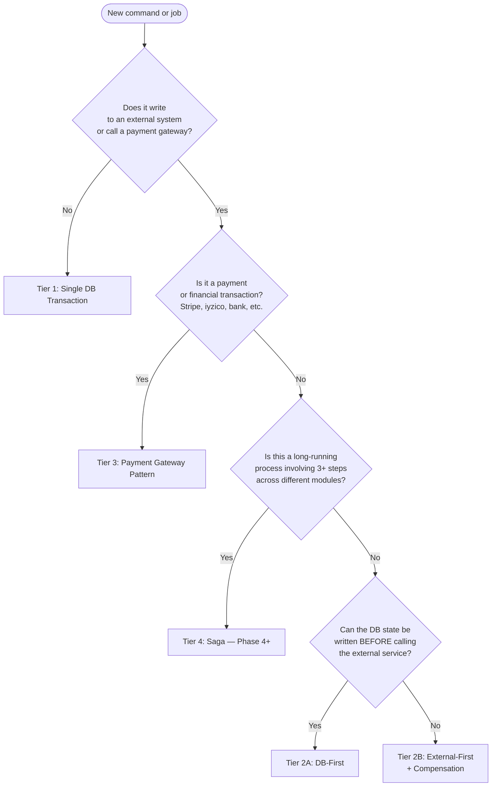

# Nexora — Distributed Consistency Standards

> **Status**: Accepted · **Owner**: Architecture · **Last updated**: 2026-04-01
>
> This document defines mandatory patterns for writing command handlers and background jobs that
> span multiple systems. Before writing any command that touches more than one data store or
> external service, you **must** identify which tier applies and follow its implementation rules.

---

## 1. Why This Exists

Nexora operates across multiple consistency boundaries:

| Boundary | Examples |
|---|---|
| Local DB (single transaction) | EF Core `SaveChangesAsync` within one `DbContext` |
| IAM service | Keycloak Admin API — realm, user lifecycle |
| Object storage | MinIO — file uploads, presigned URLs |
| Payment gateways | Stripe, iyzico — charges, subscriptions, refunds |
| Accounting integrations | QuickBooks Online, Xero — journal entries, sync |
| Cross-module events | Outbox → Kafka → event handler in another module |

A failure at any boundary without a defined consistency strategy produces **orphaned records**,
**double charges**, or **silent data divergence** that is difficult to detect and expensive to
correct. This standard mandates the right pattern for each scenario.

---

## 2. Consistency Tier Model



---

## 3. Tier 1 — Single DB Transaction

**Applies when**: All reads and writes stay within a single `DbContext`. No external HTTP calls,
no payment providers, no object storage mutations.

**Pattern**: Standard EF Core. One `SaveChangesAsync` call at the end of the handler. Domain
events dispatched after the commit.

**Examples**: `RecordSignatureCommand`, `CreateSignatureRequestCommand`, `SendNotificationCommand`,
all pure-CRUD handlers.

**Rules**:
- One `SaveChangesAsync` per handler (not counting domain-event-triggered saves in sub-handlers).
- Domain entities raise `IDomainEvent`; the dispatcher publishes to MediatR *after* the DB commit.
- Integration events must be written to the outbox in the *same* `SaveChangesAsync` call as the
  business data.

No additional consistency work required.

---

## 4. Tier 2A — DB-First (External Service After)

**Applies when**: The external service call does **not** provide data (like an ID) that the
DB record depends on. The DB is our system of record; the external service is an infrastructure
mirror.

**When to use**: Keycloak enable/disable/delete, MinIO deletes, notification delivery triggers,
status syncs where local state drives the truth.

**Rationale**: If the DB write succeeds but the external call fails, the system is in a
*locally consistent, remotely stale* state. This is tolerable because:
- Our authorization checks read the DB — a deactivated user is blocked at our API regardless of
  Keycloak state.
- A background reconciliation job (see §7) can repair the external service asynchronously.

If the DB write fails, the external call is never made — no orphan.

### Pattern

```csharp
public async Task<Result> Handle(MyCommand request, CancellationToken ct)
{
    // 1. Load entity
    var entity = await dbContext.Entities.FindAsync(..., ct);
    if (entity is null) return Result.Failure(...);

    // 2. Apply domain state change
    entity.Deactivate();   // mutates in memory, no DB write yet

    // 3. Persist DB first — this is the commit point
    await dbContext.SaveChangesAsync(ct);

    // 4. Mirror to external service — failure is non-fatal
    if (externalServiceConfigured)
    {
        try
        {
            await externalService.DisableAsync(entity.ExternalId, ct);
        }
        catch (HttpRequestException ex)
        {
            // Log as Warning — state will diverge until reconciled
            logger.LogWarning(ex,
                "External service sync failed for {EntityId}; state will be reconciled",
                entity.Id);
            // Do NOT return failure — local state is correct
        }
    }

    return Result.Success(...);
}
```

**Mandatory logging**:
- `Warning` when the external call fails (never `Error` — the command itself succeeded).
- Message **must** contain the entity ID so a reconciliation job can identify it.

---

## 5. Tier 2B — External-First + Compensation

**Applies when**: The external service call **returns data** (an ID, token, or resource name)
that must be stored in the DB record. The DB write cannot happen first.

**When to use**: Keycloak `CreateUser` (returns `keycloakUserId`), Keycloak `CreateRealm`
(returns realm name), MinIO object uploads confirmed by the client.

**Rationale**: The external service is called first (unavoidable). If the subsequent DB write
fails, the external resource is orphaned. A **compensating call** to the external service
undoes the creation.

### Pattern

```csharp
public async Task<Result<MyDto>> Handle(MyCommand request, CancellationToken ct)
{
    // 1. Pre-conditions (pure DB reads) — fail fast before touching external service
    var exists = await dbContext.Entities
        .AnyAsync(e => e.Email == request.Email, ct);
    if (exists) return Result<MyDto>.Failure(...);

    // 2. Call external service — it returns an ID we need
    string externalId;
    try
    {
        externalId = await externalService.CreateAsync(..., ct);
    }
    catch (HttpRequestException ex) when (ex.StatusCode == HttpStatusCode.Conflict)
    {
        // Idempotent conflict — treat as success or map to business error
        return Result<MyDto>.Failure(LocalizedMessage.Of("lockey_error_already_exists"));
    }

    // 3. Persist to DB — if this fails, compensate
    try
    {
        var entity = MyEntity.Create(externalId, ...);
        dbContext.Entities.Add(entity);
        await dbContext.SaveChangesAsync(ct);

        return Result<MyDto>.Success(MapToDto(entity), ...);
    }
    catch (Exception dbEx)
    {
        // 4. Compensation — undo the external service call
        logger.LogError(dbEx,
            "DB write failed after external service call for {ExternalId}; compensating",
            externalId);

        try
        {
            await externalService.DeleteAsync(externalId, ct);
            logger.LogInformation(
                "Compensation succeeded: {ExternalId} removed from external service", externalId);
        }
        catch (Exception compEx)
        {
            // Compensation also failed — this is a critical alert situation
            // The orphaned external resource requires manual cleanup
            logger.LogCritical(compEx,
                "COMPENSATION FAILED for {ExternalId}. Manual cleanup required in external service.",
                externalId);
        }

        return Result<MyDto>.Failure(LocalizedMessage.Of("lockey_error_create_failed"));
    }
}
```

**Rules**:
- Compensation is always attempted on DB failure. Never silently swallow.
- If compensation also fails → `LogCritical`. This is an **alertable condition**. In Phase 2+,
  a dead-letter alert must fire.
- Make external calls **idempotent** where possible: check for `Conflict (409)` and treat as
  success or a known business error, not a system error.
- The compensation catch must **not** re-throw — the command already failed; crashing the caller
  doesn't help and prevents the critical log.

---

## 6. Tier 3 — Payment Gateway Pattern

**Applies when**: A charge, refund, or subscription operation is performed via Stripe, iyzico,
or any external payment processor. These operations involve **real money** and require the
strongest consistency guarantees.

**Active from**: Phase 2.3 (Subscription & Billing), Phase 4.4 (Fundraising/Donations).

### The Three-Component Pattern

Payment consistency is achieved through three complementary mechanisms working together:

```
┌──────────────────────────────────────────────────────────┐
│  Component 1: Idempotency Key                            │
│  Prevent duplicate charges on retries                    │
├──────────────────────────────────────────────────────────┤
│  Component 2: Pending-First Write                        │
│  Record intent in DB before calling payment gateway      │
├──────────────────────────────────────────────────────────┤
│  Component 3: Webhook Confirmation + Inbox Guard         │
│  Gateway confirms async; Inbox deduplicates replays      │
└──────────────────────────────────────────────────────────┘
```

#### Component 1 — Idempotency Key

Generate a stable, deterministic key before the gateway call. Store it in the `PaymentAttempt`
record. Pass it as the gateway's idempotency header on every attempt.

```csharp
// Key must survive process restart — derive from business data, not random UUID
var idempotencyKey = $"charge_{subscriptionId}_{billingPeriodStart:yyyyMMdd}";

var chargeResult = await stripeClient.Charges.CreateAsync(
    new ChargeCreateOptions { Amount = amountCents, Currency = "usd", ... },
    new RequestOptions { IdempotencyKey = idempotencyKey });
```

**Rules**:
- Key must be deterministic from domain data (subscription ID + billing cycle, not `Guid.NewGuid()`).
- Key must be stored in the DB before the gateway call so it survives restarts.
- On retry, pass the **same** key — the gateway returns the original result, not a new charge.

#### Component 2 — Pending-First Write

Write a `PaymentAttempt` record with `Status = Pending` **before** calling the gateway.
This ensures there is always a local record even if the process crashes between the charge
and the DB commit.

```csharp
// 1. Write intent — status = Pending
var attempt = PaymentAttempt.Create(subscriptionId, amountCents, idempotencyKey);
dbContext.PaymentAttempts.Add(attempt);
await dbContext.SaveChangesAsync(ct);   // committed — crash-safe from here

// 2. Call gateway
ChargeResponse charge;
try
{
    charge = await stripeClient.Charges.CreateAsync(...,
        new RequestOptions { IdempotencyKey = idempotencyKey });
}
catch (StripeException ex) when (ex.StripeError?.Type == "card_error")
{
    attempt.MarkFailed(ex.StripeError.Code);
    await dbContext.SaveChangesAsync(ct);
    return Result.Failure(LocalizedMessage.Of("lockey_payment_card_declined"));
}

// 3. Mark as processing — webhook will confirm
attempt.MarkProcessing(charge.Id);
await dbContext.SaveChangesAsync(ct);

return Result.Success(...);
```

#### Component 3 — Webhook Confirmation + Inbox Guard

The gateway confirms successful payment asynchronously via webhook.
Use the existing `IInboxGuard` to prevent duplicate processing of retried webhooks.

```csharp
public sealed class StripeChargeSucceededHandler(
    IInboxGuard inboxGuard,
    PaymentsDbContext dbContext) : IIntegrationEventHandler<StripeChargeSucceeded>
{
    public async Task Handle(StripeChargeSucceeded @event, CancellationToken ct)
    {
        // Inbox guard — Stripe retries webhooks; this prevents double-confirmation
        if (await inboxGuard.IsAlreadyProcessedAsync(@event.StripeEventId, ct))
            return;

        var attempt = await dbContext.PaymentAttempts
            .FirstOrDefaultAsync(a => a.GatewayChargeId == @event.ChargeId, ct);

        if (attempt is null)
        {
            logger.LogWarning(
                "Received charge.succeeded for unknown charge {ChargeId}", @event.ChargeId);
            return;
        }

        attempt.MarkConfirmed(@event.PaidAt);
        inboxGuard.MarkAsProcessed(@event.StripeEventId, nameof(StripeChargeSucceeded));
        await dbContext.SaveChangesAsync(ct);
    }
}
```

### Reconciliation Job (Phase 2.3+)

Even with the above, edge cases occur (process crash between gateway response and DB write).
A daily reconciliation job **must** be implemented alongside any payment feature:

```
ReconcilePaymentsJob (runs nightly):
  1. Query PaymentAttempts WHERE Status = Pending AND CreatedAt < UtcNow - 1 hour
  2. For each: call gateway.Retrieve(GatewayChargeId)
  3. If gateway says Paid → MarkConfirmed
  4. If gateway says Failed → MarkFailed
  5. Alert on Status = Pending AND CreatedAt < UtcNow - 24 hours (stuck forever)
```

### Webhook Signature Verification

All incoming payment webhooks must verify the gateway signature before processing:

```csharp
// Stripe example
var payload = await request.Body.ReadAsStringAsync();
var signature = request.Headers["Stripe-Signature"];

try
{
    var stripeEvent = EventUtility.ConstructEvent(payload, signature, webhookSecret);
    // process event
}
catch (StripeException)
{
    return Results.Unauthorized();
}
```

---

## 7. Tier 4 — Saga Pattern (Phase 4+)

**Applies when**: An operation spans **3 or more distinct external systems or modules**, runs
over an extended period, and requires individual step compensation on failure.

**Examples (planned)**:
- Student enrollment pipeline: Contacts → CRM (lead) → Education (application) → Subscription (fee)
- Tenant offboarding: Identity → all modules → storage cleanup → billing cancellation

**Status**: **Deferred to Phase 4.** The infrastructure (Outbox, Inbox, domain events) is
already in place to support saga choreography. A dedicated ADR will precede implementation.

**Interim rule**: If a new feature appears to need a saga before Phase 4, escalate to an
architecture review. Do not implement ad-hoc saga-like code without an ADR.

---

## 8. External Service Tier Reference

This table classifies all current and planned external integrations.

| Service | Tier | Reason |
|---|---|---|
| **Keycloak — CreateRealm** | 2B (External-First + Comp.) | Returns realm name needed by DB record |
| **Keycloak — CreateUser** | 2B (External-First + Comp.) | Returns `keycloakUserId` needed by DB record |
| **Keycloak — UpdateUser** | 2A (DB-First) | DB is source of truth; Keycloak is mirror |
| **Keycloak — EnableUser / DisableUser** | 2A (DB-First) | DB status drives auth; Keycloak is mirror |
| **Keycloak — DeleteUser** | 2A (DB-First) | Soft-delete DB first; Keycloak hard-delete after |
| **MinIO — GeneratePresignedUrl** | 1 (no mutation) | Read-only; idempotent by nature |
| **MinIO — ObjectExists** | 1 (no mutation) | Read-only verification only |
| **MinIO — Upload / Delete** | 2A (DB-First) | DB record drives intent; storage mirrors it |
| **SendGrid / Twilio (Email/SMS)** | 2A (DB-First) | Notification entity status drives delivery |
| **Hangfire — Enqueue** | 1 (enqueue before 1st save, use job ID in same commit) | See §9 |
| **Stripe / iyzico — CreateCharge** | 3 (Payment Gateway Pattern) | Financial; must use idempotency + pending-first |
| **Stripe / iyzico — Webhook** | 3 (Inbox guard required) | Stripe retries webhooks; guard prevents duplicates |
| **QuickBooks / Xero** | 3 (reconciliation required) | Bi-directional financial sync |
| **Bank APIs / Import** | 3 + dedup hash | Bank files can be uploaded multiple times |
| **Calendar services** | 2A (DB-First) | Non-financial; local state drives truth |

---

## 9. Background Job Consistency Rules

Background jobs (Hangfire `NexoraJob<T>`) have the same consistency requirements as command
handlers. Additional rules:

### Enqueue-in-Same-Transaction

When a command creates an entity **and** enqueues a Hangfire job, the Hangfire job ID must be
stored in the same `SaveChangesAsync` call as the entity creation:

```csharp
// CORRECT — single SaveChanges
var job = ImportJob.Create(...);
dbContext.ImportJobs.Add(job);

// Hangfire.Enqueue is synchronous and returns the ID immediately
var hangfireJobId = backgroundJobClient.Enqueue<MyJob>(j => j.RunAsync(
    new MyJobParams { ImportJobId = job.Id.Value }, CancellationToken.None));

job.SetHangfireJobId(hangfireJobId);       // attach before SaveChanges
await dbContext.SaveChangesAsync(ct);       // single commit — entity + jobId

// WRONG — two SaveChanges splits atomicity
await dbContext.SaveChangesAsync(ct);       // job created without jobId
var id = backgroundJobClient.Enqueue(...);
job.SetHangfireJobId(id);
await dbContext.SaveChangesAsync(ct);       // jobId added in second commit
```

### Job Idempotency

All Hangfire jobs **must** be idempotent. When a job fetches a record to process, it must check
the record's current status before acting:

```csharp
public override async Task ExecuteAsync(MyJobParams p, CancellationToken ct)
{
    var job = await dbContext.ImportJobs.FindAsync(p.ImportJobId, ct);

    // Guard: already processed or cancelled — skip
    if (job?.Status is not ImportJobStatus.Pending)
    {
        logger.LogDebug("Job {JobId} skipped — status is {Status}", p.ImportJobId, job?.Status);
        return;
    }
    // ... continue
}
```

### Re-throw for Hangfire Retries

Jobs must **re-throw** after marking themselves failed so Hangfire retries the job:

```csharp
catch (Exception ex)
{
    job.MarkFailed(ex.Message);
    await dbContext.SaveChangesAsync(ct);
    throw;   // Re-throw — Hangfire will retry according to the retry policy
}
```

---

## 10. Decision Checklist for New Handlers

Before submitting a PR containing a new command handler or background job, answer:

- [ ] Does this handler call an external service or payment gateway?
  - If **no**: Tier 1 applies. Ensure single `SaveChangesAsync`.
  - If **yes**: continue below.
- [ ] Is it a payment gateway (Stripe, iyzico, bank, QuickBooks, Xero)?
  - If **yes**: Tier 3 — idempotency key, pending-first, webhook inbox guard, reconciliation job.
- [ ] Does the external call return an ID or resource I must store in the DB?
  - If **yes**: Tier 2B — external-first + compensation on DB failure.
  - If **no**: Tier 2A — DB-first, external call after.
- [ ] Is the external call failure **fatal** or **non-fatal** to the command?
  - Tier 2A calls are **non-fatal** (log Warning, continue).
  - Tier 2B DB failures trigger compensation but the command returns failure.
- [ ] If compensation fails (Tier 2B): is there a `LogCritical` with enough context for manual recovery?
- [ ] Background job: is it idempotent? Does it re-throw after marking failed?
- [ ] Have you added the service to the **External Service Tier Reference** table above?

---

## 11. Known Implementations

| Handler / Job | Tier | File |
|---|---|---|
| `CreateUserCommand` | 2B | `Identity/Application/Commands/CreateUserCommand.cs` |
| `CreateTenantCommand` | 2B | `Identity/Application/Commands/CreateTenantCommand.cs` |
| `UpdateUserStatusCommand` | 2A | `Identity/Application/Commands/UpdateUserStatusCommand.cs` |
| `DeleteUserCommand` | 2A | `Identity/Application/Commands/DeleteUserCommand.cs` |
| `UpdateUserProfileCommand` | 2A | `Identity/Application/Commands/UpdateUserProfileCommand.cs` |
| `StartContactImportCommand` | 1 (Hangfire enqueue-in-same-tx) | `Contacts/Application/Commands/StartContactImportCommand.cs` |
| `ContactImportJob` | 1 (MinIO read before batch writes) | `Contacts/Infrastructure/Jobs/ContactImportJob.cs` |
| `ConfirmUploadCommand` | 1 (MinIO read-only check) | `Documents/Application/Commands/ConfirmUploadCommand.cs` |
| `ReportExecutionJob` | 1 + MinIO upload | `Reporting/Infrastructure/Jobs/ReportExecutionJob.cs` |
| `ProcessRecurringChargeJob` *(planned)* | 3 | Subscription module — Phase 2.3 |
| `MakeDonationCommand` *(planned)* | 3 | Donations module — Phase 4.4 |
| `SyncToQuickBooksJob` *(planned)* | 3 | Finance module — Phase 2.2 |

---

## 12. Related Documents

| Document | Description |
|---|---|
| [ADR-005](../decisions/ADR-005-transactional-outbox-pattern.md) | Transactional Outbox pattern — cross-module event delivery |
| [ADR-011](../decisions/ADR-011-outbox-service-atomicity.md) | Outbox service atomicity guarantee |
| [ADR-014](../decisions/ADR-014-distributed-consistency-patterns.md) | Decision record for this standards document |
| [CODING_STANDARDS.md](./CODING_STANDARDS.md) | General coding conventions |
| [INFRASTRUCTURE_STANDARDS.md](./INFRASTRUCTURE_STANDARDS.md) | Cache, jobs, secrets |
| [OBSERVABILITY_STANDARDS.md](./OBSERVABILITY_STANDARDS.md) | Logging and tracing rules |
