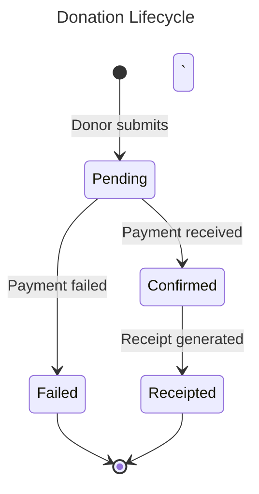

# Nexora - Documentation Standards

## 1. Documentation Types

| Type | Location | Audience | Format |
|------|----------|----------|--------|
| Architecture Decisions | `docs/decisions/ADR-NNN-*.md` | Developers, Architects | ADR template |
| Module Specifications | `docs/modules/{module}/` | Product, Dev, QA | Spec template |
| API Documentation | Auto-generated from code | Frontend devs, Integrators | OpenAPI 3.1 |
| User Guides | `docs/guides/` | End users, Admins | Markdown + screenshots |
| Developer Guide | `docs/dev/` | New developers | Markdown |
| Runbooks | `docs/runbooks/` | DevOps, SRE | Markdown |

## 2. Architecture Decision Records (ADR)

### Template
```markdown
# ADR-NNN: Title

## Status
Proposed | Accepted | Deprecated | Superseded by ADR-XXX

## Date
YYYY-MM-DD

## Context
What is the issue we're seeing that motivates this decision?

## Decision
What is the change we're proposing?

## Consequences
### Positive
- ...

### Negative
- ...

### Risks
- ...

## Alternatives Considered
| Alternative | Pros | Cons | Why Rejected |
|------------|------|------|-------------|
| ... | ... | ... | ... |
```

### Rules
- ADRs are **immutable** once accepted — don't edit, create a new one that supersedes
- Number sequentially: ADR-001, ADR-002, ...
- Every significant technical decision gets an ADR
- "Significant" = affects multiple modules, is hard to reverse, or team disagrees on approach

## 3. Module Specification

### Template
```markdown
# Module: {Module Name}

## Overview
One paragraph describing the module's purpose and business value.

## Domain Model
### Entities
- Entity diagram (Mermaid or PlantUML)

### Value Objects
- List with descriptions

### Domain Events
- List with triggers and consumers

## Use Cases
### UC-{MOD}-001: {Use Case Name}
- **Actor**: Who initiates
- **Preconditions**: What must be true before
- **Flow**: Step-by-step
- **Postconditions**: What is true after
- **Business Rules**: Constraints and validations
- **Exceptions**: What can go wrong

## API Endpoints
| Method | Path | Description | Auth |
|--------|------|-------------|------|
| GET | /api/v1/... | ... | Role: ... |

## Integration Points
- Which modules does this consume events from?
- Which events does this produce?

## Data Model
- ER diagram (Mermaid)
- Key tables and relationships

## UI/UX
- Wireframes or mockup references
- Key screens and flows

## Non-Functional Requirements
- Performance targets
- Data volume expectations
- Compliance requirements
```

## 4. API Documentation

- **Source of truth**: Code annotations → auto-generated OpenAPI spec
- Use `/// <summary>` XML docs on all public API endpoints
- Every endpoint must specify:
  - Request/response schemas
  - All possible HTTP status codes
  - Authentication requirements
  - Example request/response
- Swagger UI available at `/swagger` in development
- ReDoc available at `/docs/api` in all environments

```csharp
/// <summary>
/// Creates a new donation record.
/// </summary>
/// <param name="command">Donation details</param>
/// <returns>Created donation</returns>
/// <response code="201">Donation created successfully</response>
/// <response code="400">Invalid input</response>
/// <response code="404">Donor not found</response>
[HttpPost]
[ProducesResponseType(typeof(DonationResponse), StatusCodes.Status201Created)]
[ProducesResponseType(typeof(ProblemDetails), StatusCodes.Status400BadRequest)]
public async Task<IActionResult> Create([FromBody] CreateDonationCommand command)
```

## 5. Code Documentation

### When to Comment
- **DO** comment "why", not "what"
- **DO** document public API contracts (XML docs)
- **DO** document non-obvious business rules
- **DON'T** comment self-explanatory code
- **DON'T** leave commented-out code

### XML Documentation
Required on:
- All public types (classes, records, interfaces, enums)
- All public methods and properties
- Domain entities and value objects (business meaning)

## 6. Changelog

Maintained per release in `CHANGELOG.md` at repo root.

### Format (Keep a Changelog)
```markdown
## [1.2.0] - 2026-04-15

### Added
- Sponsorship installment payment tracking (#234)
- Bulk SMS sending from CRM (#245)

### Changed
- Donation receipt template now includes QR code (#250)

### Fixed
- Multi-currency rounding error in donation reports (#248)

### Security
- Updated Keycloak to 26.x to fix CVE-XXXX-XXXXX (#252)
```

## 7. Diagrams

### Mermaid (Primary)
**Mermaid is the primary and preferred diagramming tool** for all Nexora documentation. It renders natively in GitHub, is version-controllable, and lives alongside the documentation.

#### Rules
- **All diagrams MUST be written in Mermaid** unless the diagram type is not supported by Mermaid
- Diagrams MUST be embedded inline in the relevant markdown document (not as separate image files)
- Additionally, complex/shared diagrams should be stored in `docs/diagrams/` for reuse
- Naming convention: `{module}-{diagram-type}.md` (e.g., `crm-entity-relationship.md`)

#### Supported Diagram Types & When to Use

| Diagram Type | Mermaid Syntax | Use Case |
|-------------|---------------|----------|
| Entity Relationship | `erDiagram` | Domain models, database schemas |
| State Machine | `stateDiagram-v2` | Entity lifecycle (Lead stages, Donation status) |
| Sequence | `sequenceDiagram` | API flows, authentication flows, payment flows |
| Flowchart | `flowchart TD/LR` | Business processes, decision trees |
| Class Diagram | `classDiagram` | Domain model relationships, module structure |
| C4 Context | `C4Context` | System context, container, component views |
| Gantt | `gantt` | Roadmap, project timelines |
| Pie Chart | `pie` | Distribution visualizations |
| Git Graph | `gitGraph` | Branching strategy visualization |

#### Style Guidelines
```markdown
<!-- Always use a title -->


- Use descriptive labels on transitions/edges
- Keep diagrams focused — one concept per diagram
- Use notes/comments for complex flows
- For large entity models, split into sub-domain diagrams rather than one giant ER

### PlantUML (Secondary)
Use PlantUML only when Mermaid does not support the required diagram type (e.g., advanced deployment diagrams, complex activity diagrams with swim lanes).

### Required Diagrams Per Module
1. **Entity Relationship diagram** (`erDiagram`) — all entities and their relationships
2. **State machine diagram** (`stateDiagram-v2`) — for entities with status/lifecycle
3. **Sequence diagram** (`sequenceDiagram`) — for key use cases (at least 3 per module)
4. **Component diagram** (`flowchart` or `classDiagram`) — module's internal structure
5. **Integration diagram** (`sequenceDiagram`) — how this module interacts with other modules
