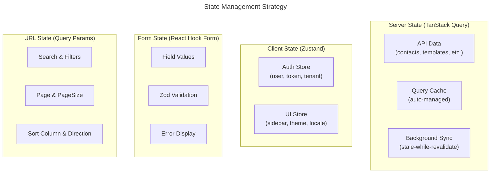
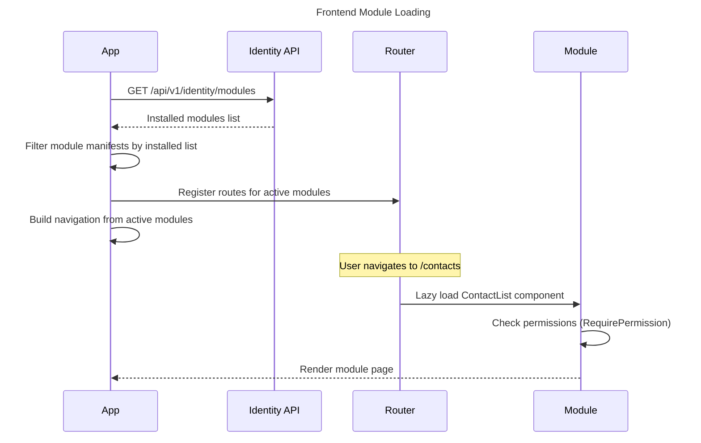

# Nexora - Frontend Coding Standards

## 1. General Principles

- **TypeScript strict mode** — `strict: true`, no `any` usage
- **Functional components** only — no class components
- **ZERO hardcoded user-facing strings** — all text via `t('lockey_...')`
- **Composition over inheritance** — compose components, don't extend
- **Single Responsibility** — one component per file, one concern per hook
- **Minimal dependencies** — prefer platform APIs over third-party libraries
- **All code in English** — identifiers, comments, documentation

## 2. Technology Stack

| Concern | Admin (nexora-admin) | Portal (nexora-portal) |
|---------|---------------------|----------------------|
| Framework | React 19 | Next.js 16 (App Router) |
| Language | TypeScript 5+ | TypeScript 5+ |
| Styling | Tailwind CSS 4 + shadcn/ui | Tailwind CSS 4 + shadcn/ui |
| Server State | TanStack Query v5 | TanStack Query v5 |
| Client State | Zustand | Zustand |
| Forms | React Hook Form + Zod | React Hook Form + Zod |
| i18n | react-i18next | next-intl |
| Routing | React Router v7 | Next.js App Router |
| Testing | Vitest + React Testing Library | Vitest + React Testing Library |
| Build | Vite | Turbopack (Next.js built-in) |
| Linting | ESLint + Prettier | ESLint + Prettier |
| E2E | Playwright (Phase 2+) | Playwright (Phase 2+) |

## 3. Project Structure

### 3.1 Admin (React 19)

```
nexora-admin/
├── public/
├── src/
│   ├── app/                        # Application shell
│   │   ├── App.tsx                 # Root component, providers
│   │   ├── Router.tsx              # Route definitions
│   │   └── providers/              # Context providers (auth, theme, i18n)
│   ├── modules/                    # Feature modules (mirrors backend)
│   │   ├── identity/
│   │   │   ├── components/         # Module-specific components
│   │   │   ├── hooks/              # Module-specific hooks (useUsers, useRoles)
│   │   │   ├── pages/              # Route page components
│   │   │   ├── types/              # Module DTOs and types
│   │   │   └── manifest.ts         # ModuleManifest (routes, nav, permissions)
│   │   ├── contacts/
│   │   ├── notifications/
│   │   ├── documents/
│   │   └── ...
│   ├── shared/                     # Shared across all modules
│   │   ├── components/             # shadcn/ui + custom shared components
│   │   │   ├── ui/                 # shadcn/ui primitives (Button, Input, Dialog...)
│   │   │   ├── data-table/         # Reusable data table with pagination
│   │   │   ├── forms/              # Form field wrappers
│   │   │   └── feedback/           # Toast, Alert, ErrorBoundary
│   │   ├── hooks/                  # Shared hooks
│   │   │   ├── useAuth.ts
│   │   │   ├── usePermissions.ts
│   │   │   ├── useModules.ts
│   │   │   └── usePagination.ts
│   │   ├── lib/                    # Utilities & configuration
│   │   │   ├── api.ts              # API client (axios/fetch wrapper)
│   │   │   ├── auth.ts             # Token management, Keycloak
│   │   │   ├── i18n.ts             # i18next configuration
│   │   │   ├── query.ts            # TanStack Query client config
│   │   │   └── utils.ts            # cn(), formatDate, etc.
│   │   └── types/                  # Shared TypeScript types
│   │       ├── api.ts              # ApiEnvelope, PagedResult, ApiError
│   │       └── auth.ts             # User, Permission, TenantContext
│   ├── layouts/                    # Application layouts
│   │   ├── AppLayout.tsx           # Main layout (sidebar + topbar + content)
│   │   ├── Sidebar.tsx
│   │   └── Topbar.tsx
│   └── locales/                    # Translation files
│       ├── en/
│       │   ├── common.json
│       │   ├── identity.json
│       │   ├── contacts.json
│       │   └── ...
│       └── tr/
│           ├── common.json
│           └── ...
├── index.html
├── vite.config.ts
├── tailwind.config.ts
├── tsconfig.json
└── package.json
```

### 3.2 Portal (Next.js 16)

```
nexora-portal/
├── src/
│   ├── app/
│   │   ├── [locale]/               # Locale-based routing
│   │   │   ├── layout.tsx          # Root layout with providers
│   │   │   ├── page.tsx            # Home page
│   │   │   ├── donations/          # Donation pages (if module installed)
│   │   │   ├── sponsorships/       # Sponsorship pages
│   │   │   └── events/             # Event pages
│   │   └── api/                    # API routes (if needed for SSR)
│   ├── modules/                    # Same module structure as admin
│   ├── shared/                     # Same shared structure
│   ├── locales/                    # Translation files (same structure)
│   └── middleware.ts               # Locale detection, auth redirect
├── next.config.ts
├── tailwind.config.ts
├── tsconfig.json
└── package.json
```

## 4. Naming Conventions

| Element | Convention | Example |
|---------|-----------|---------|
| Component file | `PascalCase.tsx` | `ContactList.tsx` |
| Page component | `PascalCase.tsx` | `ContactDetail.tsx` |
| Hook file | `use{Name}.ts` | `useContacts.ts` |
| Utility file | `camelCase.ts` | `formatDate.ts` |
| Type/Interface | `PascalCase` | `ContactDto` |
| Constant | `UPPER_SNAKE_CASE` | `MAX_PAGE_SIZE` |
| CSS class | Tailwind utility | `className="flex items-center gap-2"` |
| Translation key | `lockey_{scope}_{descriptor}` | `lockey_contacts_page_title` |
| Query key | `[module, resource, ...params]` | `['contacts', 'list', { page: 1 }]` |
| Store name | `use{Name}Store` | `useAuthStore` |
| Test file | `{name}.test.tsx` | `ContactList.test.tsx` |
| Directory | `kebab-case` | `data-table/` |

### DTO Naming

Backend'den gelen DTO'lar frontend'de aynı isimle kullanılır:

```typescript
// Backend: ContactDto.cs → Frontend: ContactDto
interface ContactDto {
  id: string;
  firstName: string;
  lastName: string;
  email: string;
  status: string;
  createdAt: string;
}

// List response type
type ContactListResponse = PagedResult<ContactDto>;

// Create/Update request type
interface CreateContactRequest {
  firstName: string;
  lastName: string;
  email: string;
}
```

## 5. Component Patterns

### 5.1 Component Structure

```tsx
// shared/components/ContactCard.tsx
import { useTranslation } from 'react-i18next';
import { Card, CardContent, CardHeader, CardTitle } from '@/shared/components/ui/card';
import type { ContactDto } from '@/modules/contacts/types';

interface ContactCardProps {
  contact: ContactDto;
  onEdit?: (id: string) => void;
}

export function ContactCard({ contact, onEdit }: ContactCardProps) {
  const { t } = useTranslation('contacts');

  return (
    <Card>
      <CardHeader>
        <CardTitle>{contact.firstName} {contact.lastName}</CardTitle>
      </CardHeader>
      <CardContent>
        <p>{t('lockey_contacts_field_email')}: {contact.email}</p>
        {onEdit && (
          <button onClick={() => onEdit(contact.id)}>
            {t('lockey_common_edit')}
          </button>
        )}
      </CardContent>
    </Card>
  );
}
```

### 5.2 Rules

- **Shared components**: Named export (`export function Button`)
- **Page components**: Default export (`export default function ContactListPage`)
- **Props interface**: Defined in the same file, above the component
- **No prop drilling** beyond 2 levels — use context or composition
- **Error boundaries** at route level, not per component
- **Loading states**: Use `Suspense` with skeleton fallbacks

### 5.3 Forbidden Patterns

```tsx
// ❌ FORBIDDEN: Hardcoded string
<h1>Contacts</h1>

// ✅ CORRECT: Always use translation
<h1>{t('lockey_contacts_page_title')}</h1>

// ❌ FORBIDDEN: any type
const handleData = (data: any) => { ... }

// ✅ CORRECT: Typed
const handleData = (data: ContactDto) => { ... }

// ❌ FORBIDDEN: Inline styles
<div style={{ marginTop: 10 }}>

// ✅ CORRECT: Tailwind
<div className="mt-2.5">

// ❌ FORBIDDEN: Direct API call in component
useEffect(() => { fetch('/api/v1/contacts').then(...) }, [])

// ✅ CORRECT: TanStack Query hook
const { data, isLoading } = useContacts(filters);

// ❌ FORBIDDEN: String concatenation for classes
className={"btn " + (active ? "btn-active" : "")}

// ✅ CORRECT: cn() utility
className={cn("btn", active && "btn-active")}

// ❌ FORBIDDEN: dangerouslySetInnerHTML
<div dangerouslySetInnerHTML={{ __html: userContent }} />
```

## 6. State Management

### 6.1 State Hierarchy



### 6.2 Zustand Store Pattern

```typescript
// shared/lib/stores/authStore.ts
import { create } from 'zustand';

interface AuthState {
  user: UserInfo | null;
  tenantId: string | null;
  permissions: string[];
  setUser: (user: UserInfo) => void;
  logout: () => void;
  hasPermission: (permission: string) => boolean;
}

export const useAuthStore = create<AuthState>((set, get) => ({
  user: null,
  tenantId: null,
  permissions: [],
  setUser: (user) => set({
    user,
    tenantId: user.tenantId,
    permissions: user.permissions,
  }),
  logout: () => set({ user: null, tenantId: null, permissions: [] }),
  hasPermission: (permission) => get().permissions.includes(permission),
}));
```

### 6.3 TanStack Query Pattern

```typescript
// modules/contacts/hooks/useContacts.ts
import { useQuery, useMutation, useQueryClient } from '@tanstack/react-query';
import { api } from '@/shared/lib/api';
import type { ContactDto, CreateContactRequest } from '../types';
import type { PagedResult, ApiEnvelope } from '@/shared/types/api';

const CONTACTS_KEY = 'contacts';

export function useContacts(params?: { page?: number; search?: string }) {
  return useQuery({
    queryKey: [CONTACTS_KEY, 'list', params],
    queryFn: () => api.get<PagedResult<ContactDto>>('/contacts/contacts', { params }),
  });
}

export function useContact(id: string) {
  return useQuery({
    queryKey: [CONTACTS_KEY, 'detail', id],
    queryFn: () => api.get<ContactDto>(`/contacts/contacts/${id}`),
    enabled: !!id,
  });
}

export function useCreateContact() {
  const queryClient = useQueryClient();

  return useMutation({
    mutationFn: (data: CreateContactRequest) =>
      api.post<ContactDto>('/contacts/contacts', data),
    onSuccess: () => {
      queryClient.invalidateQueries({ queryKey: [CONTACTS_KEY, 'list'] });
    },
  });
}
```

### 6.4 Form Pattern (React Hook Form + Zod)

```typescript
// modules/contacts/components/CreateContactForm.tsx
import { useForm } from 'react-hook-form';
import { zodResolver } from '@hookform/resolvers/zod';
import { z } from 'zod';
import { useTranslation } from 'react-i18next';
import { useCreateContact } from '../hooks/useContacts';
import { useApiError } from '@/shared/hooks/useApiError';

const createContactSchema = z.object({
  firstName: z.string().min(1),
  lastName: z.string().min(1),
  email: z.string().email(),
});

type CreateContactForm = z.infer<typeof createContactSchema>;

export function CreateContactForm() {
  const { t } = useTranslation('contacts');
  const { mutate, isPending } = useCreateContact();
  const { handleApiError } = useApiError();

  const form = useForm<CreateContactForm>({
    resolver: zodResolver(createContactSchema),
  });

  const onSubmit = (data: CreateContactForm) => {
    mutate(data, {
      onSuccess: () => toast.success(t('lockey_contacts_contact_created')),
      onError: (error) => handleApiError(error, form.setError),
    });
  };

  return (
    <form onSubmit={form.handleSubmit(onSubmit)}>
      {/* form fields */}
    </form>
  );
}
```

## 7. Styling

### 7.1 Tailwind CSS 4

- **Utility-first**: Use Tailwind classes, not custom CSS
- **shadcn/ui**: Component library (copy-paste into `shared/components/ui/`)
- **`cn()` utility**: For conditional class merging

```typescript
// shared/lib/utils.ts
import { clsx, type ClassValue } from 'clsx';
import { twMerge } from 'tailwind-merge';

export function cn(...inputs: ClassValue[]) {
  return twMerge(clsx(inputs));
}
```

### 7.2 Theme & Dark Mode

CSS custom properties for theming:

```css
/* globals.css */
@layer base {
  :root {
    --background: 0 0% 100%;
    --foreground: 222.2 84% 4.9%;
    --primary: 222.2 47.4% 11.2%;
    /* ... shadcn/ui theme tokens */
  }
  .dark {
    --background: 222.2 84% 4.9%;
    --foreground: 210 40% 98%;
    --primary: 210 40% 98%;
  }
}
```

### 7.3 RTL Support

For Arabic and other RTL languages, use Tailwind RTL utilities:

```tsx
<div className="mr-4 rtl:ml-4 rtl:mr-0">
  <span className="text-left rtl:text-right">
    {t('lockey_common_greeting')}
  </span>
</div>
```

### 7.4 Responsive Design

- Mobile-first approach (`sm:`, `md:`, `lg:` breakpoints)
- Sidebar: collapsible on mobile, persistent on desktop
- Data tables: horizontal scroll on mobile, full layout on desktop

### 7.5 Forbidden Styling

- ❌ Inline `style={}` props
- ❌ CSS Modules (`.module.css`)
- ❌ styled-components / Emotion
- ❌ Global CSS rules (except `globals.css` theme tokens)
- ❌ `!important` overrides

## 8. Localization

**Full specification**: [LOCALIZATION_STANDARDS.md](LOCALIZATION_STANDARDS.md)

### Quick Reference

```tsx
// Admin (React) — react-i18next
import { useTranslation } from 'react-i18next';

function ContactList() {
  const { t } = useTranslation('contacts');
  return <h1>{t('lockey_contacts_page_title')}</h1>;
}

// Portal (Next.js) — next-intl
import { useTranslations } from 'next-intl';

export default function DonationsPage() {
  const t = useTranslations('donations');
  return <h1>{t('lockey_donations_page_title')}</h1>;
}
```

### Translation File Structure

```
locales/
├── en/
│   ├── common.json       # lockey_common_* (save, cancel, confirm, etc.)
│   ├── error.json        # lockey_error_* (unexpected, not_found, etc.)
│   ├── validation.json   # lockey_validation_* (required, email_invalid, etc.)
│   ├── identity.json     # lockey_identity_*
│   ├── contacts.json     # lockey_contacts_*
│   ├── notifications.json
│   └── documents.json
└── tr/
    └── ... (same files, Turkish translations)
```

### Rules

1. **EVERY user-visible string** uses `t('lockey_...')`
2. Keys follow `lockey_{scope}_{context}_{descriptor}` format
3. Parameters: `t('lockey_contacts_greeting', { name: 'Ali' })`
4. API error messages: resolve `error.message` key with `error.meta` as params
5. Minimum languages: `en` + `tr`
6. New keys must be added to ALL language files simultaneously

## 9. API Integration

**Full guide**: [API_INTEGRATION_GUIDE.md](../guides/API_INTEGRATION_GUIDE.md)

### Quick Reference

- All responses wrapped in `ApiEnvelope<T>`: `{ data, message?, errors? }`
- Pagination: `?page=1&pageSize=20` → `PagedResult<T>`
- Auth: `Authorization: Bearer <JWT>` (from Keycloak)
- Errors: `message` is always a `lockey_` key — resolve on client
- Module availability: check before rendering module UI

## 10. Module System (Frontend)

Each module exposes a `ModuleManifest` for dynamic registration:

```typescript
// modules/contacts/manifest.ts
import { lazy } from 'react';
import type { ModuleManifest } from '@/shared/types/module';

export const contactsManifest: ModuleManifest = {
  name: 'contacts',
  icon: 'Users',
  routes: [
    { path: '/contacts', component: lazy(() => import('./pages/ContactList')) },
    { path: '/contacts/:id', component: lazy(() => import('./pages/ContactDetail')) },
  ],
  navigation: [
    { label: 'lockey_nav_contacts', path: '/contacts', icon: 'Users' },
  ],
  permissions: ['contacts.contacts.read'],
};
```

### Module Loading Flow



### Permission Guard

```tsx
// shared/components/RequirePermission.tsx
export function RequirePermission({
  permissions,
  children,
  fallback = null,
}: {
  permissions: string[];
  children: React.ReactNode;
  fallback?: React.ReactNode;
}) {
  const { hasPermission } = useAuthStore();
  const hasAccess = permissions.every(hasPermission);
  return hasAccess ? children : fallback;
}
```

## 11. Testing

### 11.1 Tools

- **Unit/Component**: Vitest + React Testing Library
- **E2E**: Playwright (Phase 2+)
- **Mocking**: MSW (Mock Service Worker) for API mocking

### 11.2 Test Naming

```typescript
describe('ContactList', () => {
  it('should render contact names when data is loaded', () => { ... });
  it('should show empty state when no contacts exist', () => { ... });
  it('should navigate to detail page when row is clicked', () => { ... });
  it('should display validation errors when form is submitted empty', () => { ... });
});
```

### 11.3 Test Structure

```
modules/contacts/
├── components/
│   ├── ContactCard.tsx
│   └── ContactCard.test.tsx     # Co-located test
├── hooks/
│   ├── useContacts.ts
│   └── useContacts.test.ts      # Co-located test
└── pages/
    └── ContactList.tsx           # Page tests in __tests__/ or co-located
```

### 11.4 Coverage

- **Minimum**: All shared components + hooks
- **Recommended**: Module hooks (API integration)
- **Not required (Phase 1)**: Page components (covered by E2E later)

## 12. Performance

### 12.1 Code Splitting

- **Route-level**: Every page component is `lazy()` loaded
- **Module-level**: Uninstalled modules are never loaded

### 12.2 Data Loading

- TanStack Query `staleTime`: 30 seconds for lists, 5 minutes for details
- Prefetch on hover: `queryClient.prefetchQuery` for detail pages
- Infinite scroll: Use `useInfiniteQuery` for large lists (optional)

### 12.3 Rendering

- `React.memo` only when profiler shows re-render issues
- Virtual lists: `@tanstack/react-virtual` for 100+ rows
- Image optimization: `next/image` (portal), WebP with fallback (admin)

### 12.4 Bundle

- Monitor with `vite-plugin-bundle-analyzer`
- Max initial bundle: < 200KB gzipped
- Lazy load heavy libraries (chart, editor, PDF viewer)

## 13. Security

### 13.1 XSS Prevention

- **NEVER** use `dangerouslySetInnerHTML`
- Sanitize user-generated content with `DOMPurify` before rendering
- React auto-escapes JSX expressions — rely on it

### 13.2 Authentication

- JWT token stored in **httpOnly cookie** (preferred) or secure in-memory variable
- **NEVER** store tokens in `localStorage` or `sessionStorage`
- Token refresh handled by Keycloak JS adapter or silent refresh iframe
- Redirect to login on 401 response

### 13.3 Authorization

- Check `permissions` array from JWT for UI visibility
- Permission format: `{module}.{resource}.{action}` (e.g., `contacts.contacts.write`)
- UI-level permission checks are for UX only — backend enforces authorization

### 13.4 Input Validation

- Validate all forms client-side with Zod (for UX, not security)
- Backend is the source of truth for validation

## 14. Git & PR Conventions

- **Commits**: Conventional Commits (`feat:`, `fix:`, `docs:`, `refactor:`)
- **Scope**: Include app name: `feat(admin): add contact list page`
- **Branch**: `feat/admin-contact-list`, `fix/portal-login-redirect`
- **PR**: Squash merge to `development` branch
- **NEVER**: Commit to `main` or `test` directly

## 15. Environment Configuration

### Admin (Vite)

```env
# .env.development
VITE_API_BASE_URL=http://localhost:5000/api/v1
VITE_KEYCLOAK_URL=http://localhost:8080
VITE_KEYCLOAK_REALM=nexora-dev
VITE_KEYCLOAK_CLIENT_ID=nexora-admin
```

### Portal (Next.js)

```env
# .env.local
NEXT_PUBLIC_API_URL=http://localhost:5000/api/v1
NEXT_PUBLIC_KEYCLOAK_URL=http://localhost:8080
NEXT_PUBLIC_DEFAULT_LOCALE=en
```

### Rules

- `.env` files in `.gitignore` — use `.env.example` as template
- **NEVER** put secrets in frontend env vars (they're public!)
- All `VITE_` and `NEXT_PUBLIC_` vars are exposed to the browser
