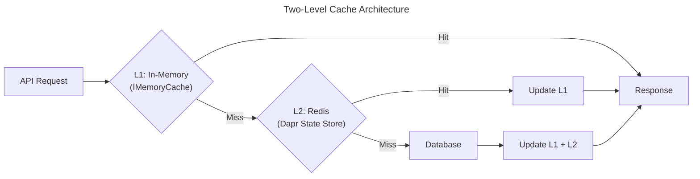
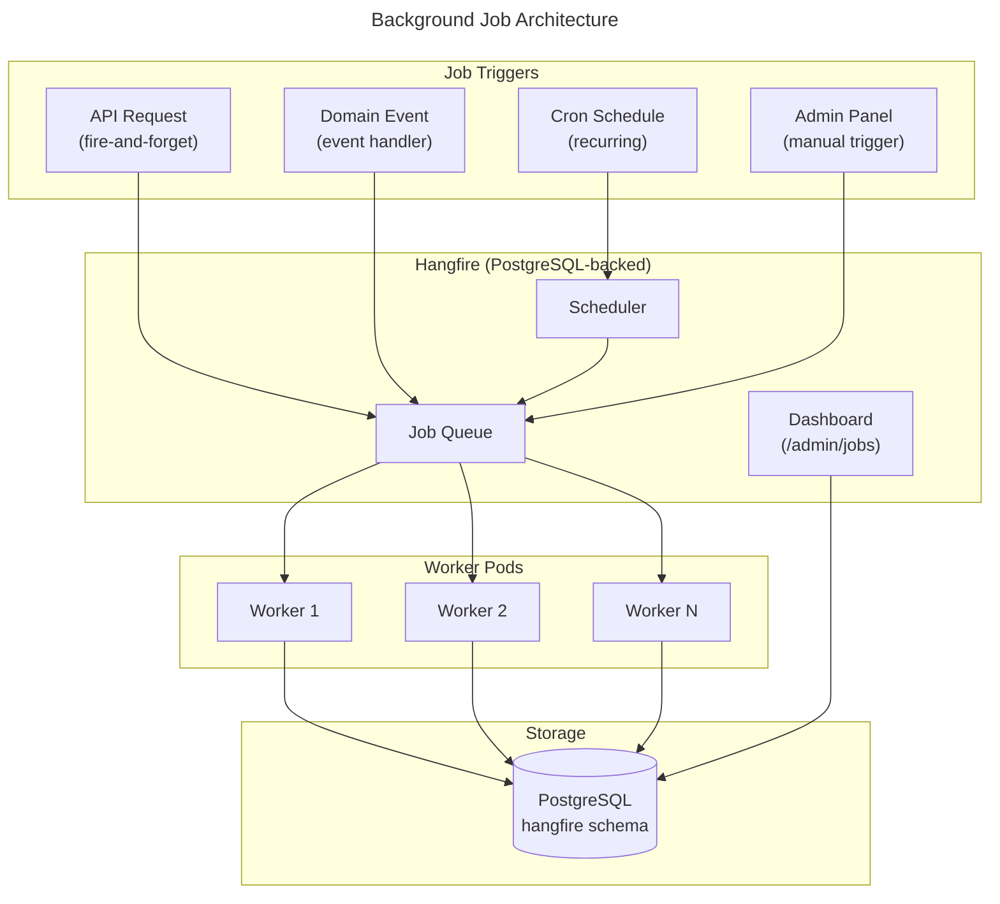
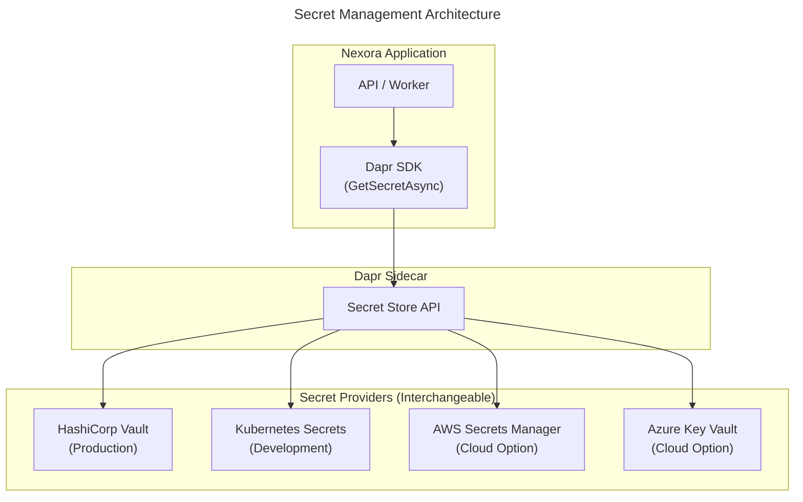
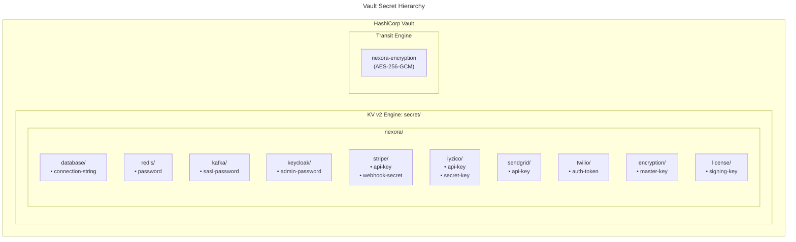
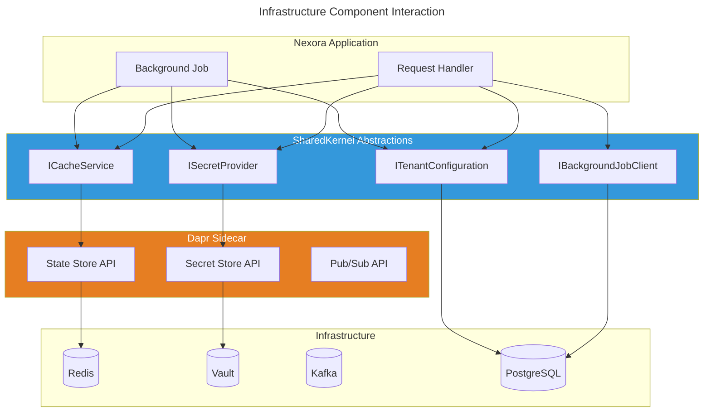

# Nexora - Infrastructure Standards

Bu doküman, tüm modüllerin uyması gereken altyapı standartlarını tanımlar: cache, background job, secret management ve configuration yönetimi.

---

## 1. Cache Management

### 1.1 Architecture

Nexora, **iki katmanlı cache stratejisi** kullanır:

| Katman | Teknoloji | Kullanım | TTL | Abstraction |
|--------|-----------|----------|-----|-------------|
| **L1 — In-Memory** | `IMemoryCache` (.NET) | Hot data, per-pod, request-scoped | 1-5 min | `ICacheService` |
| **L2 — Distributed** | Redis (via Dapr State Store) | Cross-pod, tenant-scoped, shared | 5-60 min | `ICacheService` |



**Neden Dapr State Store?**
- Provider-agnostic: Redis, Memcached, DynamoDB, CosmosDB arasında switch yapılabilir
- Dapr sidecar ile yönetilir — connection management, retry, circuit breaker Dapr'ın sorumluluğu
- Kubernetes secret'larıyla entegre — connection string'ler Dapr component YAML'ında
- Self-hosted müşteriler farklı cache provider kullanabilir (values.yaml'dan değiştirmek yeterli)

### 1.2 Dapr State Store Configuration

```yaml
# deploy/dapr/components/statestore.yaml
apiVersion: dapr.io/v1alpha1
kind: Component
metadata:
  name: statestore
  namespace: nexora
spec:
  type: state.redis
  version: v1
  metadata:
    - name: redisHost
      value: "nexora-redis-master:6379"
    - name: redisPassword
      secretKeyRef:
        name: nexora-redis-credentials
        key: password
    - name: actorStateStore
      value: "true"
    - name: keyPrefix
      value: "nexora"
  scopes:
    - nexora-api
    - nexora-worker
```

### 1.3 Cache Abstraction — `ICacheService`

Tüm modüller cache'e **yalnızca** `ICacheService` üzerinden erişir. Doğrudan `IDistributedCache`, `IMemoryCache` veya Dapr client kullanımı **yasaktır**.

```csharp
// SharedKernel/Caching/ICacheService.cs
namespace Nexora.SharedKernel.Caching;

public interface ICacheService
{
    /// Get from cache (L1 → L2 → null)
    Task<T?> GetAsync<T>(string key, CancellationToken ct = default);

    /// Get from cache or execute factory and cache the result
    Task<T> GetOrSetAsync<T>(
        string key,
        Func<CancellationToken, Task<T>> factory,
        CacheOptions? options = null,
        CancellationToken ct = default);

    /// Set value in both L1 and L2
    Task SetAsync<T>(
        string key,
        T value,
        CacheOptions? options = null,
        CancellationToken ct = default);

    /// Remove from both L1 and L2
    Task RemoveAsync(string key, CancellationToken ct = default);

    /// Remove all keys matching a pattern (e.g., "donations:tenant_isabet:*")
    Task RemoveByPrefixAsync(string prefix, CancellationToken ct = default);
}

public sealed record CacheOptions
{
    /// L1 (in-memory) TTL. Default: 2 minutes
    public TimeSpan L1Ttl { get; init; } = TimeSpan.FromMinutes(2);

    /// L2 (distributed) TTL. Default: 15 minutes
    public TimeSpan L2Ttl { get; init; } = TimeSpan.FromMinutes(15);

    /// Tags for group invalidation
    public string[] Tags { get; init; } = [];
}
```

### 1.4 Cache Key Convention

`DaprCacheService` now **automatically prefixes ALL cache keys with the tenant ID** via `ITenantContextAccessor`. Modules MUST NOT manually include tenant ID in their cache keys — it is enforced by infrastructure.

**Module-supplied key format:**

```
{module}:{entity}:{identifier}
```

The infrastructure layer transparently prepends the tenant ID, producing the actual stored key: `{tenantId}:{module}:{entity}:{identifier}`.

| Module Key (what you write) | Actual Stored Key (auto-prefixed) | Açıklama |
|-----------------------------|-----------------------------------|----------|
| `donations:donation:abc123` | `tenant_isabet:donations:donation:abc123` | Tek entity |
| `crm:leads:list:a1b2c3` | `tenant_isabet:crm:leads:list:a1b2c3` | Sayfalı liste (query hash) |
| `subscription:config` | `tenant_isabet:subscription:config` | Modül config |
| `identity:modules` | `tenant_isabet:identity:modules` | Yüklü modül listesi |
| `identity:permissions:user1` | `tenant_isabet:identity:permissions:user1` | Kullanıcı izinleri |

### 1.5 Modüllerde Cache Kullanımı

```csharp
// ✅ DOĞRU — ICacheService ile (tenant ID is auto-prefixed by infrastructure)
public sealed class GetDonationHandler(
    ICacheService cache,
    IDonationRepository repository)
    : IRequestHandler<GetDonationQuery, DonationResponse?>
{
    public async Task<DonationResponse?> Handle(
        GetDonationQuery query, CancellationToken ct)
    {
        // No tenant ID needed — DaprCacheService auto-prefixes via ITenantContextAccessor
        var cacheKey = $"donations:donation:{query.DonationId}";

        return await cache.GetOrSetAsync(
            cacheKey,
            async token =>
            {
                var donation = await repository.GetByIdAsync(query.DonationId, token);
                return donation?.Adapt<DonationResponse>();
            },
            new CacheOptions { L1Ttl = TimeSpan.FromMinutes(5), L2Ttl = TimeSpan.FromMinutes(30) },
            ct);
    }
}

// ❌ YANLIŞ — Doğrudan Redis/IDistributedCache kullanımı
public sealed class BadHandler(IDistributedCache redis) { ... }    // YASAK
public sealed class BadHandler2(DaprClient dapr) { ... }           // YASAK (cache için)
```

### 1.6 Cache Invalidation

```csharp
// Entity güncellendiğinde cache temizle
public sealed class UpdateDonationHandler(
    ICacheService cache,
    IDonationRepository repository,
    IUnitOfWork unitOfWork)
{
    public async Task Handle(UpdateDonationCommand cmd, CancellationToken ct)
    {
        var donation = await repository.GetByIdAsync(cmd.DonationId, ct);
        donation.UpdateAmount(cmd.NewAmount);
        await unitOfWork.CommitAsync(ct);

        // Tek entity cache'ini temizle (tenant ID auto-prefixed by infrastructure)
        await cache.RemoveAsync(
            $"donations:donation:{cmd.DonationId}", ct);

        // İlgili liste cache'lerini temizle
        await cache.RemoveByPrefixAsync(
            "donations:donation:list:", ct);
    }
}
```

### 1.7 Cache Kuralları

| Kural | Açıklama |
|-------|----------|
| **Tenant izolasyonu** | `DaprCacheService` automatically prefixes all keys with tenant ID via `ITenantContextAccessor`. Modules MUST NOT include tenant ID manually — it is enforced by infrastructure. Cross-tenant cache leak is prevented at the infrastructure layer |
| **Write-through yok** | Cache sadece read path'te kullanılır. Write her zaman DB'ye gider |
| **Stale data toleransı** | TTL'e güvenilir. Kritik data (permissions, modules) kısa TTL (1-2 dk) |
| **Cache-aside pattern** | `GetOrSetAsync` kullanılır. Cache miss'te DB'den yükle, cache'e yaz |
| **Graceful degradation** | Redis çökerse uygulama çalışmaya devam eder (sadece L1 cache ile) |
| **Serialization** | JSON (System.Text.Json). Binary serialization yasak |
| **Max value size** | 1 MB limit. Büyük dataset'ler cache'lenmez, sorgu optimize edilir |

---

## 2. Background Job & Scheduler Management

### 2.1 Architecture

Nexora, **Hangfire** kullanır — persistent, distributed, dashboard'lı background job framework.



**Neden Hangfire?**
- PostgreSQL backend — ek infra gerekmez (zaten var)
- Reliable — job'lar persistent, pod crash'te kaybolmaz
- Dashboard — admin panelden job durumu izlenebilir
- Retry — otomatik retry with exponential backoff
- Cron — recurring job'lar için built-in cron desteği
- Distributed — birden fazla worker pod paralel çalışır

### 2.2 Hangfire Configuration

```yaml
# deploy/dapr/components/hangfire.yaml — değil, Hangfire config appsettings'te
```

```csharp
// Nexora.Infrastructure/Jobs/HangfireConfiguration.cs
public static class HangfireConfiguration
{
    public static IServiceCollection AddNexoraHangfire(
        this IServiceCollection services,
        IConfiguration configuration)
    {
        services.AddHangfire(config =>
        {
            config.UsePostgreSqlStorage(options =>
            {
                options.UseNpgsqlConnection(
                    configuration.GetConnectionString("Hangfire"));
            });

            config.UseSimpleAssemblyNameTypeSerializer();
            config.UseRecommendedSerializerSettings();

            // Tenant-aware job filter
            config.UseFilter(new TenantJobFilter());
            config.UseFilter(new ModuleJobFilter());
        });

        services.AddHangfireServer(options =>
        {
            options.WorkerCount = Environment.ProcessorCount * 2;
            options.Queues = new[]
            {
                "critical",    // Payment processing, security alerts
                "default",     // Normal operations
                "bulk",        // Mass notifications, reports
                "maintenance"  // Cleanup, archival
            };
        });

        return services;
    }
}
```

### 2.3 Job Types & Patterns

#### Fire-and-Forget (Tek seferlik, hemen)
```csharp
// API Handler'dan ateşle, response'u bekleme
public sealed class ConfirmDonationHandler(
    IBackgroundJobClient jobs)
{
    public async Task Handle(ConfirmDonationCommand cmd, CancellationToken ct)
    {
        // ... domain logic ...

        // Makbuz oluşturmayı background'a at
        jobs.Enqueue<GenerateReceiptJob>(
            job => job.ExecuteAsync(cmd.DonationId, cmd.TenantId, CancellationToken.None));

        // SMS gönderimi background'a at
        jobs.Enqueue<SendDonationSmsJob>(
            job => job.ExecuteAsync(cmd.DonationId, cmd.TenantId, CancellationToken.None));
    }
}
```

#### Delayed (Gecikmeli)
```csharp
// 30 dakika sonra çalıştır
jobs.Schedule<SendPaymentReminderJob>(
    job => job.ExecuteAsync(invoiceId, tenantId, CancellationToken.None),
    TimeSpan.FromMinutes(30));
```

#### Recurring (Cron — zamanlanmış)
```csharp
// Her modül kendi recurring job'larını IModule.ConfigureJobs'da kaydeder
// IJobScheduler.AddOrUpdate now accepts Expression<Func<TJob, Task>> parameter
public sealed class DonationsModule : IModule
{
    public void ConfigureJobs(IJobScheduler scheduler)
    {
        // Her gün 02:00'de
        scheduler.AddOrUpdate<RecurringDonationChargeJob>(
            "donations:recurring-charge",
            Cron.Daily(2, 0),
            job => job.RunAsync(
                new RecurringChargeParams { TenantId = "system" },
                CancellationToken.None),
            JobQueues.Critical);

        // Her saat başı
        scheduler.AddOrUpdate<OverdueDetectionJob>(
            "donations:overdue-detection",
            Cron.Hourly(),
            job => job.RunAsync(
                new OverdueDetectionParams { TenantId = "system" },
                CancellationToken.None),
            JobQueues.Default);

        // Her Pazartesi 09:00'da
        scheduler.AddOrUpdate<WeeklyDonationReportJob>(
            "donations:weekly-report",
            Cron.Weekly(DayOfWeek.Monday, 9, 0),
            job => job.RunAsync(
                new WeeklyReportParams { TenantId = "system" },
                CancellationToken.None),
            JobQueues.Bulk);
    }
}
```

#### Continuation (Zincirleme)
```csharp
// Job A bittikten sonra Job B çalışsın
var importJobId = jobs.Enqueue<ImportBankTransactionsJob>(
    job => job.ExecuteAsync(batchId, tenantId, CancellationToken.None));

jobs.ContinueJobWith<MatchDonorsJob>(
    importJobId,
    job => job.ExecuteAsync(batchId, tenantId, CancellationToken.None));
```

### 2.4 Job Base Class & Contract

Tüm job'lar `NexoraJob<TParams>` base class'ından türer:

```csharp
// SharedKernel/Jobs/NexoraJob.cs
public abstract class NexoraJob<TParams>
{
    private readonly ITenantContextAccessor _tenantAccessor;
    private readonly ILogger _logger;

    protected NexoraJob(
        ITenantContextAccessor tenantAccessor,
        ILogger logger)
    {
        _tenantAccessor = tenantAccessor;
        _logger = logger;
    }

    /// Hangfire calls this
    [AutomaticRetry(Attempts = 3, DelaysInSeconds = new[] { 30, 120, 600 })]
    [DisableConcurrentExecution(timeoutInSeconds: 300)]
    public async Task ExecuteAsync(TParams parameters, string tenantId, CancellationToken ct)
    {
        // 1. Set tenant context for this job execution
        _tenantAccessor.SetTenant(tenantId);

        using var activity = Telemetry.StartActivity($"Job:{GetType().Name}");
        activity?.SetTag("tenant.id", tenantId);
        activity?.SetTag("job.params", JsonSerializer.Serialize(parameters));

        try
        {
            _logger.LogInformation(
                "Job {JobName} started for tenant {TenantId} with params {@Params}",
                GetType().Name, tenantId, parameters);

            await HandleAsync(parameters, ct);

            _logger.LogInformation(
                "Job {JobName} completed for tenant {TenantId}",
                GetType().Name, tenantId);
        }
        catch (Exception ex)
        {
            _logger.LogError(ex,
                "Job {JobName} failed for tenant {TenantId}",
                GetType().Name, tenantId);
            throw; // Hangfire handles retry
        }
    }

    /// Module implements this
    protected abstract Task HandleAsync(TParams parameters, CancellationToken ct);
}
```

```csharp
// Modülde kullanım
public sealed class GenerateReceiptJob(
    ITenantContextAccessor tenantAccessor,
    IDonationRepository repository,
    IDocumentService documents,
    ILogger<GenerateReceiptJob> logger)
    : NexoraJob<DonationId>(tenantAccessor, logger)
{
    protected override async Task HandleAsync(DonationId donationId, CancellationToken ct)
    {
        var donation = await repository.GetByIdAsync(donationId, ct)
            ?? throw new InvalidOperationException($"Donation {donationId} not found");

        var receipt = await documents.GenerateFromTemplateAsync(
            "donation-receipt", donation, ct);

        donation.AttachReceipt(receipt.Id);
        await repository.SaveAsync(ct);
    }
}
```

### 2.5 Job Naming Convention

```
{module}:{action-descriptor}
```

| Job ID | Açıklama | Queue | Schedule |
|--------|----------|-------|----------|
| `donations:recurring-charge` | Recurring bağış karttan çekim | critical | Cron.Daily(2, 0) |
| `donations:overdue-detection` | Gecikmiş ödeme tespiti | default | Cron.Hourly() |
| `donations:weekly-report` | Haftalık bağış raporu | bulk | Cron.Weekly(Mon, 9) |
| `subscription:invoice-generation` | Otomatik fatura oluşturma | critical | Cron.Daily(1, 0) |
| `subscription:payment-reminder` | Ödeme hatırlatma gönder | default | Cron.Daily(9, 0) |
| `notifications:cleanup-expired` | Eski notification temizliği | maintenance | Cron.Daily(3, 0) |
| `contacts:duplicate-scan` | Mükerrer kayıt tarama | bulk | Cron.Weekly(Sun, 2) |
| `fleet:insurance-expiry-check` | Sigorta süresi kontrol | default | Cron.Daily(8, 0) |
| `inventory:low-stock-alert` | Düşük stok uyarısı | default | Cron.Hourly() |

### 2.6 Queue Priority

| Queue | Priority | Max Workers | Kullanım |
|-------|----------|-------------|----------|
| `critical` | Highest | 4 | Ödeme, güvenlik, tenant provisioning |
| `default` | Normal | 8 | Standard iş kuralları, bildirimler |
| `bulk` | Low | 4 | Toplu mail/SMS, raporlar, import/export |
| `maintenance` | Lowest | 2 | Cleanup, archival, analytics |

### 2.7 Job Kuralları

| Kural | Açıklama |
|-------|----------|
| **Idempotent** | Her job tekrar çalıştırılabilir olmalı. Hangfire retry yapabilir |
| **Tenant-aware** | Her job tenant context'ini almalı. Cross-tenant job yasak |
| **Timeout** | Max 10 dakika. Uzun süren işler batch'lere bölünür |
| **Retry** | Default: 3 retry, exponential backoff (30s, 120s, 600s) |
| **Concurrency** | `[DisableConcurrentExecution]` ile aynı job'un paralel çalışması engellenir |
| **No HTTP calls in jobs** | Job'lardan external API çağrısı yapılacaksa Polly retry policy zorunlu |
| **Logging** | Her job start/complete/fail loglar. Structured logging zorunlu |
| **Monitoring** | Job failure rate > 5% ise alert. Dashboard: `/admin/hangfire` |

---

## 3. Secret Management

### 3.1 Architecture

Nexora, **Dapr Secret Store** kullanır — HashiCorp Vault (production) veya Kubernetes Secrets (development) üzerinden.



**Neden Dapr Secret Store?**
- Provider-agnostic: Vault, K8s Secrets, AWS SM, Azure KV arasında YAML değişikliği ile geçiş
- Sidecar pattern: Secret rotation uygulama restart gerektirmez
- Self-hosted müşteriler kendi vault'larını kullanabilir
- Development'ta basit K8s secrets yeterli, production'da Vault

### 3.2 Dapr Secret Store Configuration

#### Production — HashiCorp Vault
```yaml
# deploy/dapr/components/secretstore-vault.yaml
apiVersion: dapr.io/v1alpha1
kind: Component
metadata:
  name: secretstore
  namespace: nexora
spec:
  type: secretstores.hashicorp.vault
  version: v1
  metadata:
    - name: vaultAddr
      value: "http://nexora-vault:8200"
    - name: vaultTokenMountPath
      value: "/vault/token"
    - name: vaultKVPrefix
      value: "nexora"
    - name: vaultKVUsePrefix
      value: "true"
    - name: enginePath
      value: "secret"
```

#### Development — Kubernetes Secrets
```yaml
# deploy/dapr/components/secretstore-k8s.yaml
apiVersion: dapr.io/v1alpha1
kind: Component
metadata:
  name: secretstore
  namespace: nexora
spec:
  type: secretstores.kubernetes
  version: v1
  metadata: []
```

### 3.3 Secret Abstraction — `ISecretProvider`

Modüller secret'lara **yalnızca** `ISecretProvider` üzerinden erişir:

```csharp
// SharedKernel/Secrets/ISecretProvider.cs
namespace Nexora.SharedKernel.Secrets;

public interface ISecretProvider
{
    /// Get a secret value by key
    Task<string> GetSecretAsync(string key, CancellationToken ct = default);

    /// Get a secret as a typed object
    Task<T> GetSecretAsync<T>(string key, CancellationToken ct = default);

    /// Get multiple secrets by prefix
    Task<IReadOnlyDictionary<string, string>> GetSecretsAsync(
        string prefix, CancellationToken ct = default);
}

// Implementation uses Dapr under the hood
public sealed class DaprSecretProvider(DaprClient dapr) : ISecretProvider
{
    private const string StoreName = "secretstore";

    public async Task<string> GetSecretAsync(string key, CancellationToken ct)
    {
        var secret = await dapr.GetSecretAsync(StoreName, key, cancellationToken: ct);
        return secret.TryGetValue(key, out var value)
            ? value
            : throw new SecretNotFoundException(key);
    }
}
```

### 3.4 Secret Naming Convention

```
nexora/{category}/{name}
```

| Secret Key | Açıklama | Rotation |
|------------|----------|----------|
| `nexora/database/connection-string` | PostgreSQL connection string | Manuel |
| `nexora/redis/password` | Redis auth password | Manuel |
| `nexora/kafka/sasl-password` | Kafka SASL credentials | Manuel |
| `nexora/keycloak/admin-password` | Keycloak admin credentials | 90 gün |
| `nexora/minio/access-key` | MinIO access credentials | 90 gün |
| `nexora/minio/secret-key` | MinIO secret key | 90 gün |
| `nexora/stripe/api-key` | Stripe API key | İstek üzerine |
| `nexora/stripe/webhook-secret` | Stripe webhook signing secret | İstek üzerine |
| `nexora/iyzico/api-key` | iyzico API key | İstek üzerine |
| `nexora/sendgrid/api-key` | SendGrid API key | İstek üzerine |
| `nexora/twilio/auth-token` | Twilio auth token | İstek üzerine |
| `nexora/license/signing-key` | License validation RSA key | Yıllık |
| `nexora/encryption/master-key` | Data encryption master key | Yıllık |
| `nexora/jwt/signing-key` | JWT signing key (internal) | 90 gün |

### 3.5 Vault Yapısı (Production)

```
vault kv put secret/nexora/database connection-string="Host=...;Password=..."
vault kv put secret/nexora/stripe api-key="sk_live_..." webhook-secret="whsec_..."
vault kv put secret/nexora/encryption master-key="base64-encoded-key"
```



### 3.6 Secret Kuralları

| Kural | Açıklama |
|-------|----------|
| **Asla hardcode** | Secret değerler kaynak kodda, config dosyalarında veya env variable'larda OLMAZ |
| **Asla log'lama** | Secret değerler log'lara yazılmaz. `[Redacted]` placeholder kullanılır |
| **Dapr üzerinden** | Tüm secret erişimi `ISecretProvider` üzerinden. Doğrudan Vault/K8s API çağrısı yasak |
| **Rotation desteği** | Her secret rotation'a hazır olmalı. Connection caching yapılıyorsa refresh mekanizması gerekli |
| **Dev/Prod ayrımı** | Development: K8s Secrets veya user-secrets. Production: Vault |
| **Audit** | Vault audit log aktif. Her secret erişimi loglanır |
| **Least privilege** | Her modül sadece kendi secret'larına erişir (Vault policy ile) |

---

## 4. Configuration Management

### 4.1 Configuration Hierarchy

Nexora, **5 katmanlı configuration** kullanır. Her katman bir üstünü override eder:

```mermaid
---
title: Configuration Hierarchy (Precedence: Bottom Wins)
---
flowchart TB
    L1["Layer 1: appsettings.json\n(defaults, checked into git)"]
    L2["Layer 2: appsettings.{Environment}.json\n(env-specific overrides)"]
    L3["Layer 3: Environment Variables\n(container/pod level)"]
    L4["Layer 4: Dapr Secret Store\n(sensitive values from Vault)"]
    L5["Layer 5: Tenant/Org Config\n(database, per-tenant overrides)"]

    L1 --> L2 --> L3 --> L4 --> L5

    style L1 fill:#95a5a6,color:#fff
    style L2 fill:#7f8c8d,color:#fff
    style L3 fill:#2980b9,color:#fff
    style L4 fill:#e74c3c,color:#fff
    style L5 fill:#27ae60,color:#fff
```

| Katman | Kaynak | İçerik | Örnek |
|--------|--------|--------|-------|
| 1 | `appsettings.json` | Default değerler, yapısal config | Feature flags, default TTL'ler, log levels |
| 2 | `appsettings.{env}.json` | Ortam bazlı overrides | Dev log level = Debug, Prod = Warning |
| 3 | Environment Variables | Container/pod bazlı | `ASPNETCORE_ENVIRONMENT`, `NEXORA_LOG_LEVEL` |
| 4 | Dapr Secret Store | Hassas değerler | DB password, API keys, encryption keys |
| 5 | Database (tenant config) | Tenant/org bazlı ayarlar | Branding, locale, module settings |

### 4.2 appsettings.json Yapısı

```jsonc
// appsettings.json — checked into git, NO secrets
{
  // Core platform settings
  "Nexora": {
    "Platform": {
      "Name": "Nexora",
      "Version": "1.0.0",
      "MaxTenantsPerInstance": 5000,
      "DefaultLocale": "en",
      "SupportedLocales": ["en", "tr", "ar", "de", "fr"]
    },

    // Cache defaults (provider configured via Dapr component)
    "Cache": {
      "DefaultL1TtlMinutes": 2,
      "DefaultL2TtlMinutes": 15,
      "KeyPrefix": "nexora",
      "MaxValueSizeBytes": 1048576
    },

    // Job defaults
    "Jobs": {
      "WorkerCount": 0,          // 0 = auto (ProcessorCount * 2)
      "DefaultRetryAttempts": 3,
      "DefaultRetryDelays": [30, 120, 600],
      "Dashboard": {
        "Enabled": true,
        "Path": "/admin/hangfire",
        "RequireRole": "platform-admin"
      },
      "Queues": {
        "Critical": { "WorkerCount": 4 },
        "Default": { "WorkerCount": 8 },
        "Bulk": { "WorkerCount": 4 },
        "Maintenance": { "WorkerCount": 2 }
      }
    },

    // Module defaults
    "Modules": {
      "AutoDiscovery": true,
      "AssemblyPrefix": "Nexora.Modules."
    },

    // Observability
    "Observability": {
      "Tracing": {
        "Enabled": true,
        "Exporter": "otlp",
        "Endpoint": "http://otel-collector:4317"
      },
      "Metrics": {
        "Enabled": true,
        "Exporter": "prometheus",
        "Path": "/metrics"
      },
      "Logging": {
        "Exporter": "console",
        "MinimumLevel": "Information"
      }
    }
  },

  // Connection strings (non-sensitive parts; passwords injected from secrets)
  "ConnectionStrings": {
    "DefaultConnection": "Host=localhost;Database=nexora;Username=nexora",
    "Hangfire": "Host=localhost;Database=nexora;Username=nexora"
  },

  // External services (URLs only; API keys from secrets)
  "ExternalServices": {
    "Keycloak": {
      "BaseUrl": "http://nexora-keycloak:8080",
      "Realm": "master"
    },
    "MinIO": {
      "Endpoint": "nexora-minio:9000",
      "UseSSL": false,
      "DefaultBucketPrefix": "tenant-"
    }
  },

  // Module-specific config (non-sensitive)
  "ModuleConfig": {
    "Donations": {
      "MaxCartItems": 20,
      "ReceiptNumberFormat": "RCP-{year}-{seq:000000}",
      "ZakatNisabUpdateCron": "0 0 1 * *"
    },
    "Subscription": {
      "InvoiceNumberFormat": "INV-{year}-{seq:000000}",
      "GracePeriodDays": 7,
      "MaxRetryAttempts": 3
    },
    "Notifications": {
      "MaxBulkBatchSize": 500,
      "ThrottlePerMinute": 100,
      "RetryIntervals": [60, 300, 3600]
    }
  }
}
```

### 4.3 Environment Variables

Environment variable'lar `.NET IConfiguration` convention'ına uyar: `__` (çift underscore) ile nesting.

```bash
# Helm values.yaml'dan pod env var'lara map:
env:
  - name: ASPNETCORE_ENVIRONMENT
    value: "Production"
  - name: Nexora__Platform__MaxTenantsPerInstance
    value: "10000"
  - name: Nexora__Cache__DefaultL2TtlMinutes
    value: "30"
  - name: Nexora__Observability__Logging__MinimumLevel
    value: "Warning"
  - name: ConnectionStrings__DefaultConnection
    valueFrom:
      secretKeyRef:
        name: nexora-db-credentials
        key: connection-string
```

### 4.4 Tenant-Level Configuration

Tenant bazlı ayarlar veritabanında saklanır ve `ITenantConfiguration` ile erişilir:

```csharp
// SharedKernel/Configuration/ITenantConfiguration.cs
public interface ITenantConfiguration
{
    /// Get a tenant-specific setting (falls back to platform default)
    Task<T> GetAsync<T>(string key, CancellationToken ct = default);

    /// Set a tenant-specific setting
    Task SetAsync<T>(string key, T value, CancellationToken ct = default);

    /// Get all settings for a module
    Task<ModuleSettings> GetModuleSettingsAsync(
        string moduleName, CancellationToken ct = default);
}
```

```csharp
// Usage in a handler
public sealed class ProcessDonationHandler(
    ITenantConfiguration tenantConfig)
{
    public async Task Handle(ProcessDonationCommand cmd, CancellationToken ct)
    {
        // Tenant-specific: which payment gateway to use
        var gateway = await tenantConfig.GetAsync<string>(
            "donations:payment-gateway", ct);   // "stripe" or "iyzico"

        // Tenant-specific: receipt format
        var format = await tenantConfig.GetAsync<string>(
            "donations:receipt-format", ct);     // "RCP-{year}-{seq}"

        // Tenant-specific: default currency
        var currency = await tenantConfig.GetAsync<string>(
            "platform:default-currency", ct);    // "USD" or "TRY"
    }
}
```

### 4.5 Configuration Categories

| Kategori | Katman | Örnek | Değiştiren |
|----------|--------|-------|------------|
| **Platform** | appsettings.json | Max tenants, supported locales | DevOps (deploy) |
| **Infrastructure** | Env vars / Helm | DB host, cache TTL, worker count | DevOps (deploy) |
| **Secrets** | Dapr/Vault | API keys, passwords, encryption keys | DevOps (Vault) |
| **Tenant** | Database | Branding, locale, timezone, currency | Tenant Admin (UI) |
| **Organization** | Database | Org-specific branding, email sender | Org Admin (UI) |
| **Module** | Database | Module-specific settings per tenant | Tenant Admin (UI) |
| **User** | Database | Language, notification prefs, theme | User (UI) |

### 4.6 Module Configuration Pattern

Her modül kendi ayarlarını strongly-typed options pattern ile tanımlar:

```csharp
// Nexora.Modules.Donations/Configuration/DonationModuleOptions.cs
public sealed class DonationModuleOptions
{
    public const string SectionName = "ModuleConfig:Donations";

    public int MaxCartItems { get; set; } = 20;
    public string ReceiptNumberFormat { get; set; } = "RCP-{year}-{seq:000000}";
    public string ZakatNisabUpdateCron { get; set; } = "0 0 1 * *";
    public string DefaultCurrency { get; set; } = "USD";
    public bool EnableGuestDonations { get; set; } = true;
    public int RecurringRetryMaxAttempts { get; set; } = 3;
}

// Module registration
public sealed class DonationsModule : IModule
{
    public void ConfigureServices(IServiceCollection services, IConfiguration configuration)
    {
        services.Configure<DonationModuleOptions>(
            configuration.GetSection(DonationModuleOptions.SectionName));
        // ...
    }
}

// Usage with IOptions
public sealed class GenerateReceiptJob(
    IOptions<DonationModuleOptions> options)
{
    public async Task HandleAsync(DonationId donationId, CancellationToken ct)
    {
        var format = options.Value.ReceiptNumberFormat;
        // ...
    }
}
```

### 4.7 Feature Flags

Feature flag'ler platform veya tenant bazında kontrol edilir:

```csharp
// SharedKernel/Features/IFeatureManager.cs
public interface IFeatureManager
{
    /// Check if a feature is enabled for the current tenant
    Task<bool> IsEnabledAsync(string featureName, CancellationToken ct = default);
}
```

```csharp
// Usage
if (await features.IsEnabledAsync("donations:enable-crypto-payments", ct))
{
    // Show crypto payment option
}
```

```jsonc
// appsettings.json — platform-wide defaults
{
  "FeatureFlags": {
    "donations:enable-crypto-payments": false,
    "crm:enable-ai-lead-scoring": false,
    "notifications:enable-whatsapp": true,
    "pos:enable-offline-mode": true
  }
}
```

Tenant admins can override feature flags via admin panel (stored in DB).

### 4.8 Configuration Kuralları

| Kural | Açıklama |
|-------|----------|
| **Secret ≠ Config** | API key'ler config'te olmaz, Vault'ta olur. URL'ler config'te olur |
| **Default zorunlu** | Her config key'in anlamlı bir default değeri olmalı |
| **Strongly-typed** | Raw string config yerine `IOptions<T>` pattern kullanılır |
| **Validate on startup** | Config değerleri uygulama başlarken validate edilir (`IValidateOptions<T>`) |
| **No magic strings** | Config key'ler constant olarak tanımlanır, inline string yasak |
| **Tenant override** | Platform default → Tenant override → Org override hiyerarşisi her zaman geçerli |
| **Restart-free** | Config değişiklikleri `IOptionsMonitor<T>` ile runtime'da yansır (restart gerektirmez) |
| **Git-safe** | `appsettings.json` git'e commit edilir. Secret içermez |

---

## 5. DomainEventChannel

The `DomainEventChannel` uses **Wait** mode (not DropWrite). When the channel is full, `TryWrite` returns `false` and a warning is logged — events are not silently dropped. Consumers should process events promptly to avoid back-pressure.

```csharp
// DomainEventChannel behavior:
// - Mode: BoundedChannelFullMode.Wait (changed from DropWrite)
// - TryWrite returns false when channel is full
// - Warning is logged when TryWrite fails (channel full)
// - Callers should handle false return and implement appropriate back-pressure strategy
```

---

## 6. Cross-Cutting Summary



### Provider Değiştirme (Deployment Bazlı)

| Concern | Development | Production (Cloud) | Self-Hosted |
|---------|-------------|-------------------|-------------|
| Cache | In-memory only | Redis (Dapr state) | Redis veya Memcached |
| Secrets | K8s Secrets (Dapr) | HashiCorp Vault (Dapr) | Vault veya K8s Secrets |
| Jobs | Hangfire (in-process) | Hangfire (PostgreSQL) | Hangfire (PostgreSQL) |
| Config | appsettings.Development.json | Env vars + Vault | Helm values + Vault |
| Pub/Sub | In-memory (Dapr) | Kafka (Dapr) | Kafka veya RabbitMQ |

Tüm değişiklikler **sadece Dapr component YAML dosyalarında** yapılır. Uygulama kodu değişmez.
