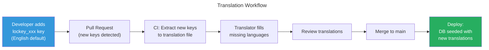

# Nexora - Localization (i18n) Standards

## 1. Golden Rule

> **NO hardcoded user-facing strings anywhere — not in the backend, not in the frontend.**
> Every string that can be displayed to a user MUST be a localization key.

This applies to:
- API response messages (success, error, validation)
- UI labels, buttons, tooltips, placeholders
- Email/SMS/WhatsApp notification templates
- PDF reports and receipts
- System logs shown to users (not internal debug logs)

## 2. Localization Key Convention

### Format
```
lockey_{scope}_{context}_{descriptor}
```

### Components

| Part | Description | Example |
|------|------------|---------|
| `lockey_` | Mandatory prefix — identifies a localization key | `lockey_` |
| `{scope}` | Module or area | `crm`, `donations`, `common`, `error`, `validation` |
| `{context}` | Feature or entity | `lead`, `donation`, `contact`, `auth` |
| `{descriptor}` | Specific meaning | `created_success`, `not_found`, `amount_required` |

### Examples

```
# Common
lockey_common_save                          → "Save" / "Kaydet"
lockey_common_cancel                        → "Cancel" / "İptal"
lockey_common_delete_confirm                → "Are you sure?" / "Emin misiniz?"
lockey_common_loading                       → "Loading..." / "Yükleniyor..."
lockey_common_no_results                    → "No results found" / "Sonuç bulunamadı"

# Errors
lockey_error_not_found                      → "Resource not found" / "Kaynak bulunamadı"
lockey_error_unauthorized                   → "You are not authorized" / "Yetkiniz yok"
lockey_error_module_not_installed           → "This module is not installed" / "Bu modül yüklü değil"
lockey_error_missing_dependencies           → "Required modules are not installed: {deps}"

# Validation
lockey_validation_required                  → "{field} is required" / "{field} zorunludur"
lockey_validation_email_invalid             → "Invalid email address" / "Geçersiz e-posta adresi"
lockey_validation_amount_greater_than_zero  → "Amount must be greater than zero"

# CRM
lockey_crm_lead_created_success             → "Lead created successfully"
lockey_crm_lead_not_found                   → "Lead not found"
lockey_crm_lead_already_closed              → "This lead is already closed"
lockey_crm_lead_stage_changed               → "Lead moved to {stage}"
lockey_crm_pipeline_name                    → "Pipeline"
lockey_crm_nav_leads                        → "Leads"
lockey_crm_nav_pipelines                    → "Pipelines"

# Donations
lockey_donations_donation_confirmed         → "Donation confirmed. Thank you!"
lockey_donations_amount_minimum             → "Minimum donation is {amount} {currency}"
lockey_donations_recurring_created          → "Recurring donation set up successfully"
lockey_donations_receipt_generated           → "Receipt #{number} generated"
lockey_donations_bank_import_completed      → "Bank import completed: {matched} matched, {unmatched} unmatched"

# Education
lockey_education_enrollment_accepted        → "Student accepted for enrollment"
lockey_education_appointment_booked         → "Appointment booked for {date}"

# Navigation (used by module manifests)
lockey_nav_dashboard                        → "Dashboard"
lockey_nav_contacts                         → "Contacts"
lockey_nav_leads                            → "Leads"
lockey_nav_donations                        → "Donations"
lockey_nav_campaigns                        → "Campaigns"
lockey_nav_sponsorships                     → "Sponsorships"
```

## 3. Backend Localization

### 3.1 Response Format

API responses MUST use localization keys. The backend NEVER returns translated strings — the client resolves them.

```json
// SUCCESS response
{
  "data": { "id": "don-123", "status": "confirmed" },
  "message": {
    "key": "lockey_donations_donation_confirmed",
    "params": {}
  }
}

// ERROR response
{
  "error": {
    "code": "DONATION_AMOUNT_MINIMUM",
    "message": {
      "key": "lockey_donations_amount_minimum",
      "params": { "amount": "10", "currency": "TL" }
    },
    "details": []
  },
  "traceId": "00-abc123..."
}

// VALIDATION error response
{
  "error": {
    "code": "VALIDATION_FAILED",
    "message": {
      "key": "lockey_error_validation_failed",
      "params": {}
    },
    "details": [
      {
        "field": "amount",
        "message": {
          "key": "lockey_validation_amount_greater_than_zero",
          "params": {}
        }
      },
      {
        "field": "donorEmail",
        "message": {
          "key": "lockey_validation_email_invalid",
          "params": {}
        }
      }
    ]
  }
}
```

### 3.2 Localization Key Types in C#

```csharp
// Localization key value object — enforces lockey_ prefix
public sealed record LocalizedMessage
{
    public string Key { get; init; }
    public Dictionary<string, string> Params { get; init; } = [];

    public LocalizedMessage(string key, Dictionary<string, string>? @params = null)
    {
        if (!key.StartsWith("lockey_"))
            throw new ArgumentException($"Localization key must start with 'lockey_'. Got: {key}");
        Key = key;
        Params = @params ?? [];
    }

    // Convenience factory methods
    public static LocalizedMessage Of(string key)
        => new(key);

    public static LocalizedMessage Of(string key, params (string name, string value)[] @params)
        => new(key, @params.ToDictionary(p => p.name, p => p.value));
}
```

### 3.3 Usage in Handlers

```csharp
// Command handler returning localized message
public sealed class CreateDonationHandler(
    IDonationRepository repository,
    IUnitOfWork unitOfWork)
    : IRequestHandler<CreateDonationCommand, Result<DonationResponse>>
{
    public async Task<Result<DonationResponse>> Handle(
        CreateDonationCommand request, CancellationToken ct)
    {
        var donor = await _contactQuery.GetAsync(request.DonorId, ct);
        if (donor is null)
            return Result.Failure<DonationResponse>(
                LocalizedMessage.Of("lockey_error_donor_not_found"));

        if (request.Amount <= 0)
            return Result.Failure<DonationResponse>(
                LocalizedMessage.Of("lockey_validation_amount_greater_than_zero"));

        // ... create donation

        return Result.Success(response,
            LocalizedMessage.Of("lockey_donations_donation_confirmed"));
    }
}
```

### 3.4 Validation Messages

```csharp
// FluentValidation — all messages are lockey_ keys
public sealed class CreateDonationCommandValidator
    : AbstractValidator<CreateDonationCommand>
{
    public CreateDonationCommandValidator()
    {
        RuleFor(x => x.DonorId)
            .NotEmpty()
            .WithMessage("lockey_validation_required")
            .WithName("lockey_donations_field_donor");

        RuleFor(x => x.Amount)
            .GreaterThan(0)
            .WithMessage("lockey_validation_amount_greater_than_zero");

        RuleFor(x => x.Currency)
            .NotEmpty()
            .WithMessage("lockey_validation_required")
            .Length(3)
            .WithMessage("lockey_validation_currency_invalid");
    }
}
```

### 3.5 Domain Exception Messages

```csharp
public class DomainException : Exception
{
    public LocalizedMessage LocalizedMessage { get; }

    public DomainException(string locKey, Dictionary<string, string>? @params = null)
        : base(locKey)
    {
        LocalizedMessage = new LocalizedMessage(locKey, @params);
    }
}

// Usage in domain entity
public void Confirm(PaymentReference reference)
{
    if (Status != DonationStatus.Pending)
        throw new DomainException(
            "lockey_donations_only_pending_can_confirm",
            new() { ["status"] = Status.ToString() });
}
```

### 3.6 Translation Storage (Backend)

Translations stored in PostgreSQL for runtime flexibility:

```sql
-- In public schema (shared across tenants)
CREATE TABLE localization_resources (
    id UUID PRIMARY KEY,
    language_code VARCHAR(10) NOT NULL,   -- "en", "tr", "ar"
    key VARCHAR(255) NOT NULL,            -- "lockey_donations_donation_confirmed"
    value TEXT NOT NULL,                  -- "Donation confirmed. Thank you!"
    module VARCHAR(50),                   -- "donations" (nullable for common keys)
    updated_at TIMESTAMP DEFAULT NOW(),
    UNIQUE (language_code, key)
);

-- Tenant-specific overrides
CREATE TABLE localization_overrides (
    id UUID PRIMARY KEY,
    tenant_id UUID REFERENCES tenants(id),
    language_code VARCHAR(10) NOT NULL,
    key VARCHAR(255) NOT NULL,
    value TEXT NOT NULL,                  -- tenant can customize messages
    UNIQUE (tenant_id, language_code, key)
);
```

### 3.7 Server-Side Translation (Notifications only)

Notification Engine is the **only** backend component that resolves translations — because emails/SMS must be sent in the recipient's preferred language:

```csharp
public sealed class NotificationRenderer(ILocalizationService locService)
{
    public async Task<string> RenderTemplateAsync(
        string templateKey,
        string languageCode,
        Dictionary<string, string> variables,
        CancellationToken ct)
    {
        var template = await locService.GetAsync(templateKey, languageCode, ct);
        // Replace {variable} placeholders
        return variables.Aggregate(template,
            (current, kv) => current.Replace($"{{{kv.Key}}}", kv.Value));
    }
}
```

## 4. Frontend Localization

### 4.1 Library

- **Admin (React)**: `react-i18next` + `i18next`
- **Portal (Next.js)**: `next-intl` (SSR-compatible, built for App Router)

### 4.2 Translation Files Structure

```
src/
├── locales/
│   ├── en/
│   │   ├── common.json          # lockey_common_*
│   │   ├── error.json           # lockey_error_*
│   │   ├── validation.json      # lockey_validation_*
│   │   ├── navigation.json      # lockey_nav_*
│   │   ├── crm.json             # lockey_crm_*
│   │   ├── donations.json       # lockey_donations_*
│   │   ├── sponsorship.json     # lockey_sponsorship_*
│   │   ├── education.json       # lockey_education_*
│   │   └── ...                  # one file per module
│   ├── tr/
│   │   ├── common.json
│   │   ├── error.json
│   │   └── ...
│   └── ar/
│       └── ...
```

### 4.3 Translation File Format

```json
// locales/en/donations.json
{
  "lockey_donations_donation_confirmed": "Donation confirmed. Thank you!",
  "lockey_donations_amount_minimum": "Minimum donation is {{amount}} {{currency}}",
  "lockey_donations_recurring_created": "Recurring donation set up successfully",
  "lockey_donations_receipt_generated": "Receipt #{{number}} generated",
  "lockey_donations_bank_import_completed": "Bank import completed: {{matched}} matched, {{unmatched}} unmatched",
  "lockey_donations_field_donor": "Donor",
  "lockey_donations_field_amount": "Amount",
  "lockey_donations_field_category": "Category",
  "lockey_donations_status_pending": "Pending",
  "lockey_donations_status_confirmed": "Confirmed",
  "lockey_donations_status_failed": "Failed",
  "lockey_donations_page_title": "Donations",
  "lockey_donations_create_title": "New Donation"
}
```

```json
// locales/tr/donations.json
{
  "lockey_donations_donation_confirmed": "Bağış onaylandı. Teşekkür ederiz!",
  "lockey_donations_amount_minimum": "Minimum bağış tutarı {{amount}} {{currency}}",
  "lockey_donations_recurring_created": "Düzenli bağış başarıyla oluşturuldu",
  "lockey_donations_receipt_generated": "Makbuz #{{number}} oluşturuldu",
  "lockey_donations_bank_import_completed": "Banka aktarımı tamamlandı: {{matched}} eşleştirildi, {{unmatched}} eşleştirilmedi",
  "lockey_donations_field_donor": "Bağışçı",
  "lockey_donations_field_amount": "Tutar",
  "lockey_donations_field_category": "Kategori",
  "lockey_donations_status_pending": "Beklemede",
  "lockey_donations_status_confirmed": "Onaylandı",
  "lockey_donations_status_failed": "Başarısız",
  "lockey_donations_page_title": "Bağışlar",
  "lockey_donations_create_title": "Yeni Bağış"
}
```

### 4.4 Usage in React Components

```tsx
// CORRECT — Always use translation function
import { useTranslation } from 'react-i18next';

const DonationConfirmation: React.FC<{ donation: Donation }> = ({ donation }) => {
  const { t } = useTranslation('donations');

  return (
    <div>
      <h1>{t('lockey_donations_page_title')}</h1>
      <Alert variant="success">
        {t('lockey_donations_donation_confirmed')}
      </Alert>
      <p>
        {t('lockey_donations_receipt_generated', { number: donation.receiptNumber })}
      </p>
    </div>
  );
};

// WRONG — NEVER do this
const Bad: React.FC = () => {
  return <h1>Donations</h1>;  // ❌ Hardcoded string!
};
```

### 4.5 Resolving API Error Messages

```tsx
// API error messages come as lockey_ keys — resolve them on the client
const useApiError = () => {
  const { t } = useTranslation(['error', 'validation']);

  const resolveError = (error: ApiError): string => {
    const { key, params } = error.message;
    // Determine namespace from key
    const ns = key.startsWith('lockey_validation_') ? 'validation' :
               key.startsWith('lockey_error_') ? 'error' :
               key.split('_')[1]; // module name
    return t(key, { ns, ...params });
  };

  return { resolveError };
};

// Usage in form
const { resolveError } = useApiError();

try {
  await createDonation(data);
} catch (err) {
  toast.error(resolveError(err));
}
```

### 4.6 Next.js (Portal) — SSR Localization

```tsx
// app/[locale]/donations/page.tsx
import { useTranslations } from 'next-intl';

export default function DonationsPage() {
  const t = useTranslations('donations');

  return (
    <div>
      <h1>{t('lockey_donations_page_title')}</h1>
    </div>
  );
}

// Locale from URL: /en/donations, /tr/donations, /ar/donations
```

### 4.7 RTL Support

For Arabic and other RTL languages:
```tsx
// Layout component detects RTL
const Layout: React.FC = ({ children }) => {
  const { i18n } = useTranslation();
  const dir = ['ar', 'he', 'fa'].includes(i18n.language) ? 'rtl' : 'ltr';

  return <div dir={dir}>{children}</div>;
};
```

Tailwind CSS RTL utilities:
```html
<div class="mr-4 rtl:ml-4 rtl:mr-0">
  <!-- Margin-right in LTR, margin-left in RTL -->
</div>
```

## 5. Supported Languages

### Initial Release
| Code | Language | Direction |
|------|----------|-----------|
| `en` | English | LTR |
| `tr` | Turkish | LTR |

### Phase 2+
| Code | Language | Direction |
|------|----------|-----------|
| `ar` | Arabic | RTL |
| `de` | German | LTR |
| `fr` | French | LTR |

### Adding a New Language
1. Create translation files in `locales/{code}/`
2. Add language to supported list in config
3. Register in Keycloak realm settings
4. Seed `localization_resources` table with backend translations
5. No code changes needed — purely data-driven

## 6. Translation Workflow



### CI Key Extraction
A CI step scans code for new `lockey_` keys and:
1. Reports untranslated keys as PR comment
2. Auto-adds English entries from default values
3. Flags missing translations for other languages

## 7. Forbidden Patterns

```csharp
// ❌ FORBIDDEN: Hardcoded string in response
return Ok("Donation created successfully");

// ❌ FORBIDDEN: Hardcoded error message
throw new Exception("Donor not found");

// ❌ FORBIDDEN: Hardcoded validation message
RuleFor(x => x.Amount).GreaterThan(0).WithMessage("Amount must be positive");

// ❌ FORBIDDEN: String without lockey_ prefix
return Result.Failure(LocalizedMessage.Of("donation_not_found"));

// ✅ CORRECT: Always use lockey_ prefix
return Result.Success(response, LocalizedMessage.Of("lockey_donations_donation_confirmed"));
return Result.Failure<T>(LocalizedMessage.Of("lockey_error_donor_not_found"));
throw new DomainException("lockey_donations_only_pending_can_confirm");
RuleFor(x => x.Amount).GreaterThan(0).WithMessage("lockey_validation_amount_greater_than_zero");
```

```tsx
// ❌ FORBIDDEN: Hardcoded UI text
<button>Save</button>
<h1>Donations</h1>
<p>No results found</p>

// ✅ CORRECT: Always use translation function
<button>{t('lockey_common_save')}</button>
<h1>{t('lockey_donations_page_title')}</h1>
<p>{t('lockey_common_no_results')}</p>
```
