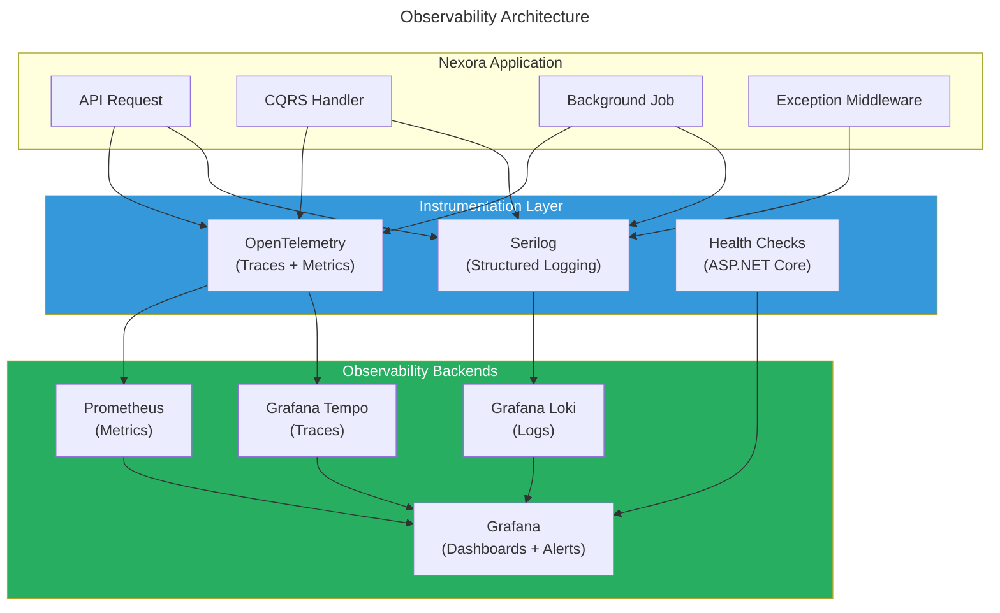
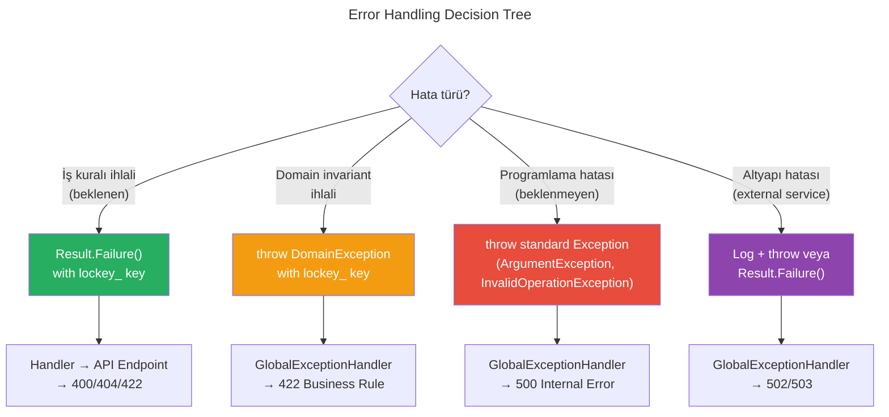

# Nexora - Observability & Error Handling Standards

Bu doküman, platformun tamamında uygulanması gereken loglama, distributed tracing, metrik toplama, health check ve merkezi hata yönetimi standartlarını tanımlar.

---

## 1. Genel Mimari



### Teknoloji Seçimleri

| Concern | Teknoloji | Neden |
|---------|-----------|-------|
| **Structured Logging** | Serilog + Serilog.Sinks.OpenTelemetry | .NET ekosisteminde en olgun structured logging kütüphanesi. Enricher ve sink desteği geniş |
| **Distributed Tracing** | OpenTelemetry (.NET SDK) | Vendor-agnostic standart. Grafana Tempo, Jaeger, Zipkin arasında geçiş mümkün |
| **Metrics** | OpenTelemetry Metrics (System.Diagnostics.Metrics) | .NET native Meter/Counter/Histogram API. Prometheus exporter ile uyumlu |
| **Log Aggregation** | Grafana Loki | Kubernetes-native, düşük kaynak tüketimi, LogQL ile güçlü sorgulama |
| **Trace Storage** | Grafana Tempo | Loki ile aynı ekosistem, trace-to-log korelasyonu kolay |
| **Dashboards & Alerts** | Grafana | Tek dashboard'da logs + traces + metrics. Alert yönetimi built-in |
| **Health Checks** | ASP.NET Core Health Checks | Framework-native, Kubernetes readiness/liveness probe desteği |

---

## 2. Structured Logging

### 2.1 Temel Kurallar

| Kural | Açıklama |
|-------|----------|
| **Serilog zorunlu** | Tüm loglama `ILogger<T>` üzerinden. Doğrudan `Console.WriteLine`, `Debug.WriteLine` veya `Trace.WriteLine` yasak |
| **Structured parameters** | Her zaman named parameters kullan: `{OrderId}`, `{TenantId}`. Positional `{0}`, `{1}` yasak |
| **PascalCase parametreler** | Log parametreleri PascalCase olmalı: `{UserId}`, `{DonationAmount}`. camelCase veya snake_case yasak |
| **String interpolation yasak** | `$"User {userId}"` yerine `"User {UserId}", userId` kullan. Interpolation Serilog'un structured özelliğini bozar |
| **İngilizce log mesajları** | Loglar developer'a yönelik — her zaman İngilizce. Kullanıcıya dönük mesajlar `lockey_` key kullanır |
| **Destructuring dikkatli** | Büyük object'leri `{@Object}` ile loglamaktan kaçın. Sadece küçük DTO/record'lar için kullan |
| **Secret loglamak yasak** | Password, token, API key gibi hassas değerler ASLA loglara yazılmaz. `[Redacted]` placeholder kullanılır |
| **Exception log formatı** | Exception loglarken `LogError(ex, "message", args)` kullan — exception birinci parametre |

### 2.2 Log Level Kullanımı

| Level | Ne zaman | Örnek | Production'da? |
|-------|----------|-------|----------------|
| `Trace` | Detaylı diagnostic (method giriş/çıkış, SQL) | `Entering GetUserById with {UserId}` | Hayır |
| `Debug` | Development diagnostic (cache hit/miss, config load) | `Cache hit for key {CacheKey}` | Hayır |
| `Information` | İş olayları (entity oluşturuldu, akış tamamlandı) | `Tenant {TenantId} created with slug {Slug}` | Evet |
| `Warning` | Kurtarılabilir sorunlar (retry, fallback, degraded) | `Keycloak realm {RealmName} already exists, skipping` | Evet |
| `Error` | Müdahale gerektiren hatalar (API timeout, ödeme başarısız) | `Failed to create Keycloak user for {Email}` | Evet |
| `Critical` | Sistem çöküşü (DB bağlantı kaybı, out of memory) | `Database connection pool exhausted` | Evet + Alert |

### 2.3 Zorunlu Log Alanları (Enrichment)

Serilog enrichment ile her log satırına otomatik eklenen alanlar:

| Alan | Kaynak | Açıklama |
|------|--------|----------|
| `TenantId` | TenantMiddleware / Job Context | Tenant izolasyonu, log filtreleme |
| `UserId` | JWT `sub` claim | Kullanıcı bazlı audit trail |
| `CorrelationId` | Request header / auto-generated | Request chain takibi |
| `TraceId` | OpenTelemetry | Distributed trace korelasyonu |
| `SpanId` | OpenTelemetry | Span-level korelasyon |
| `ModuleName` | Handler namespace | Modül bazlı filtreleme |
| `MachineName` | Environment | Pod/instance tanımlama |
| `Environment` | Configuration | dev/staging/prod ayırma |

```csharp
// ✅ DOĞRU — Serilog enrichment yapılandırması (Program.cs)
builder.Host.UseSerilog((context, services, configuration) =>
{
    configuration
        .ReadFrom.Configuration(context.Configuration)
        .ReadFrom.Services(services)
        .Enrich.FromLogContext()
        .Enrich.WithMachineName()
        .Enrich.WithEnvironmentName()
        .Enrich.WithProperty("Application", "Nexora")
        .WriteTo.OpenTelemetry(options =>
        {
            options.Endpoint = context.Configuration["Observability:Logging:OtlpEndpoint"]
                ?? "http://localhost:4317";
        });
});
```

### 2.4 Handler Loglama Standardı

Her CQRS handler'da **mutlaka** loglanması gereken durumlar:

```csharp
// ✅ DOĞRU — Command handler loglama pattern'i
public sealed class CreateTenantHandler(
    PlatformDbContext platformDb,
    ITenantSchemaManager schemaManager,
    IKeycloakAdminService keycloakAdmin,
    ILogger<CreateTenantHandler> logger) : ICommandHandler<CreateTenantCommand, TenantDto>
{
    public async Task<Result<TenantDto>> Handle(
        CreateTenantCommand request,
        CancellationToken cancellationToken)
    {
        // 1. Business rule ihlali — Warning (expected failure)
        if (slugExists)
        {
            logger.LogWarning("Tenant creation failed: slug {Slug} already taken", request.Slug);
            return Result<TenantDto>.Failure("lockey_identity_error_tenant_slug_taken", ...);
        }

        // 2. Başarılı iş olayı — Information
        logger.LogInformation("Tenant {TenantId} created with slug {Slug}",
            tenant.Id, tenant.Slug);

        return Result<TenantDto>.Success(dto, new LocalizedMessage("lockey_identity_tenant_created"));
    }
}
```

```csharp
// ❌ YANLIŞ — Loglama yapılmayan handler
public sealed class CreateTenantHandler(
    PlatformDbContext platformDb) : ICommandHandler<CreateTenantCommand, TenantDto>
{
    public async Task<Result<TenantDto>> Handle(...)
    {
        // Business logic without any logging
        var tenant = Tenant.Create(request.Name, request.Slug);
        await platformDb.Tenants.AddAsync(tenant);
        await platformDb.SaveChangesAsync(cancellationToken);
        return Result<TenantDto>.Success(dto, ...);
    }
}
```

### 2.5 Loglama Kuralları: Ne Loglanmalı, Ne Loglanmamalı

#### Loglanması Zorunlu (Command Handler'lar)

| Durum | Level | Örnek |
|-------|-------|-------|
| Entity oluşturuldu/güncellendi/silindi | `Information` | `Tenant {TenantId} created` |
| Business rule reddi (expected failure) | `Warning` | `Slug {Slug} already taken` |
| External service çağrısı (KC, payment) | `Information` | `Created Keycloak realm {RealmName}` |
| External service hatası | `Error` | `Failed to create KC realm: {StatusCode}` |
| State transition | `Information` | `User {UserId} status changed to {Status}` |

#### Loglanması Zorunlu (Query Handler'lar)

| Durum | Level | Örnek |
|-------|-------|-------|
| Entity bulunamadı (expected) | `Debug` | `User {UserId} not found` |
| Yavaş query (>500ms) | `Warning` | `Slow query in GetAuditLogs: {ElapsedMs}ms` |

#### Loglanmaması Gereken

| Durum | Neden |
|-------|-------|
| Her request giriş/çıkışı | `LoggingBehavior` middleware zaten bunu yapıyor |
| Validation hataları | `ValidationBehavior` pipeline'da zaten loglanıyor |
| Hassas veriler (password, token, PII) | Güvenlik — `[Redacted]` kullan |
| Büyük payload'lar (request/response body) | Performans ve disk maliyeti |

### 2.6 Kod Örnekleri

```csharp
// ✅ DOĞRU — Structured logging
logger.LogInformation("Tenant {TenantId} created with slug {Slug}", tenant.Id, tenant.Slug);

// ✅ DOĞRU — Exception logging (exception ilk parametre)
logger.LogError(ex, "Failed to create Keycloak realm {RealmName}", realmName);

// ✅ DOĞRU — Warning for expected business failure
logger.LogWarning("Module {ModuleName} install rejected: dependency {Dependency} not active",
    request.ModuleName, missingDep);

// ❌ YANLIŞ — String interpolation (structured logging bozulur)
logger.LogInformation($"Tenant {tenant.Id} created");

// ❌ YANLIŞ — Positional parameters
logger.LogInformation("Tenant {0} created", tenant.Id);

// ❌ YANLIŞ — camelCase parameter
logger.LogInformation("Tenant {tenantId} created", tenant.Id);

// ❌ YANLIŞ — Secret logging
logger.LogInformation("KC token obtained: {Token}", token);

// ❌ YANLIŞ — Log without exception parameter
logger.LogError("Failed to create realm: " + ex.Message);
```

---

## 3. Exception Handling Stratejisi

### 3.1 İki Katmanlı Hata Modeli

Nexora, **iki farklı hata mekanizması** kullanır:

| Mekanizma | Ne Zaman | Örnek |
|-----------|----------|-------|
| **Result Pattern** | Beklenen iş hataları (validation, business rule) | Slug zaten alınmış, kullanıcı bulunamadı, modül zaten yüklü |
| **Exception** | Beklenmeyen sistem hataları (programming error, infra failure) | DB bağlantı hatası, null reference, Keycloak unreachable |



### 3.2 Exception Türleri ve Kullanımı

| Exception Türü | Ne Zaman | HTTP Status | Log Level | Örnek |
|----------------|----------|-------------|-----------|-------|
| `DomainException` | Domain invariant ihlali (entity state guard) | 422 | Warning | `lockey_identity_error_cannot_uninstall` |
| `ValidationException` | FluentValidation hatası (pipeline'dan fırlatılır) | 400 | Warning | Validation pipeline otomatik fırlatır |
| `ArgumentException` | Geçersiz method parametresi (programming error) | 500 | Error | `Schema name cannot be empty` |
| `InvalidOperationException` | Geçersiz state (programming error) | 500 | Error | `Tenant context not set` |
| `KeyNotFoundException` | Dış kaynak bulunamadı (secret, config) | 500 | Error | `Secret 'x' not found` |
| `HttpRequestException` | External service hatası | 502 | Error | Keycloak API hatası |
| `OperationCanceledException` | Request iptal edildi | — | Debug | Client bağlantıyı kesti |

### 3.3 Global Exception Handler (Zorunlu Middleware)

Tüm unhandled exception'lar merkezi bir middleware tarafından yakalanır ve standart `ProblemDetails` formatında döndürülür:

```csharp
// ✅ ZORUNLU — GlobalExceptionHandler implementasyonu
public sealed class GlobalExceptionHandler(
    ILogger<GlobalExceptionHandler> logger) : IExceptionHandler
{
    public async ValueTask<bool> TryHandleAsync(
        HttpContext httpContext,
        Exception exception,
        CancellationToken cancellationToken)
    {
        var (statusCode, errorKey, logLevel) = exception switch
        {
            DomainException domainEx =>
                (StatusCodes.Status422UnprocessableEntity,
                 domainEx.LocalizationKey,
                 LogLevel.Warning),

            ValidationException validationEx =>
                (StatusCodes.Status400BadRequest,
                 "lockey_error_validation_failed",
                 LogLevel.Warning),

            OperationCanceledException =>
                (StatusCodes.Status499ClientClosedRequest,
                 "lockey_error_request_cancelled",
                 LogLevel.Debug),

            KeyNotFoundException =>
                (StatusCodes.Status404NotFound,
                 "lockey_error_resource_not_found",
                 LogLevel.Warning),

            _ =>
                (StatusCodes.Status500InternalServerError,
                 "lockey_error_unexpected",
                 LogLevel.Error)
        };

        logger.Log(logLevel, exception,
            "Unhandled exception {ExceptionType} at {Path}",
            exception.GetType().Name, httpContext.Request.Path);

        httpContext.Response.StatusCode = statusCode;

        var envelope = ApiEnvelope<object>.Fail(
            new Error(new LocalizedMessage(errorKey)));

        await httpContext.Response.WriteAsJsonAsync(envelope, cancellationToken);
        return true;
    }
}
```

### 3.4 Exception Handling Kuralları

| Kural | Açıklama |
|-------|----------|
| **Result pattern öncelikli** | Handler'larda beklenen hatalar için exception fırlatma, `Result.Failure()` kullan |
| **DomainException sadece domain'de** | Sadece entity/value object/aggregate root içinden fırlatılır. Handler'lardan ASLA fırlatılmaz |
| **catch(Exception) yasak** | Generic catch-all sadece 2 yerde: `GlobalExceptionHandler` ve `NexoraJob`. Modül kodunda yasak |
| **catch ve yut yasak** | Exception yakalayıp sessizce yutma yasak. Ya loglayıp rethrow, ya da explicit intent ile dökümante et |
| **throw; tercih et** | `throw ex;` yerine `throw;` kullan — stack trace korunur |
| **Exception mesajı İngilizce** | System exception'lar İngilizce message alır. User-facing hatalar `lockey_` key ile `Result.Failure()` döner |
| **DomainException = lockey_ key** | `DomainException` constructor'ı `lockey_` prefix zorlar |
| **Inner exception koru** | Wrap ederken inner exception'ı kaybet me: `new InvalidOperationException("msg", ex)` |

### 3.5 Forbidden Patterns

```csharp
// ❌ YASAK — Raw Exception fırlatma
throw new Exception("Something went wrong");

// ❌ YASAK — Handler'dan DomainException fırlatma (Result pattern kullan)
public async Task<Result<TenantDto>> Handle(...)
{
    if (slugExists)
        throw new DomainException("lockey_identity_error_slug_taken"); // YANLIŞ
}

// ❌ YASAK — Generic catch-all (modül kodunda)
try { ... }
catch (Exception) { /* sessizce yutma */ }

// ❌ YASAK — throw ex (stack trace kaybolur)
catch (Exception ex)
{
    logger.LogError(ex, "Error");
    throw ex; // YANLIŞ — throw; kullan
}

// ❌ YASAK — Exception mesajını string olarak loglama
catch (Exception ex)
{
    logger.LogError("Error: " + ex.Message); // YANLIŞ — exception parametre olarak geç
}
```

```csharp
// ✅ DOĞRU — Result pattern ile beklenen hata
public async Task<Result<TenantDto>> Handle(...)
{
    if (slugExists)
        return Result<TenantDto>.Failure("lockey_identity_error_slug_taken", ...);
}

// ✅ DOĞRU — DomainException sadece entity'den
public sealed class Tenant
{
    public void Activate()
    {
        if (Status == TenantStatus.Terminated)
            throw new DomainException("lockey_identity_error_tenant_cannot_reactivate");
    }
}

// ✅ DOĞRU — Loglayıp rethrow
catch (HttpRequestException ex)
{
    logger.LogError(ex, "Keycloak API call failed for realm {RealmName}", realmName);
    throw;
}
```

---

## 4. Distributed Tracing

### 4.1 OpenTelemetry Yapılandırması

```csharp
// ✅ Program.cs — OpenTelemetry trace & metric registration
builder.Services.AddOpenTelemetry()
    .ConfigureResource(resource => resource
        .AddService("nexora-api",
            serviceVersion: typeof(Program).Assembly.GetName().Version?.ToString() ?? "1.0.0"))
    .WithTracing(tracing => tracing
        .AddAspNetCoreInstrumentation()
        .AddHttpClientInstrumentation()
        .AddEntityFrameworkCoreInstrumentation()
        .AddSource("Nexora.*")
        .AddOtlpExporter())
    .WithMetrics(metrics => metrics
        .AddAspNetCoreInstrumentation()
        .AddHttpClientInstrumentation()
        .AddRuntimeInstrumentation()
        .AddMeter("Nexora.*")
        .AddOtlpExporter());
```

### 4.2 Custom Activity (Span) Kuralları

| Kural | Açıklama |
|-------|----------|
| **ActivitySource adlandırma** | `Nexora.{Module}` formatında: `Nexora.Identity`, `Nexora.CRM` |
| **Span adlandırma** | `{Operation} {Resource}`: `Create Tenant`, `Install Module`, `Sync Keycloak User` |
| **Tag standartları** | `tenant.id`, `user.id`, `module.name` — dot-separated, lowercase |
| **Status** | Hata durumunda `Activity.SetStatus(ActivityStatusCode.Error, message)` |
| **Sensitive data yasak** | Tag'lere password, token, PII ekleme |

```csharp
// ✅ DOĞRU — Custom Activity kullanımı (external service çağrısı)
public sealed class KeycloakAdminService(
    HttpClient httpClient,
    ILogger<KeycloakAdminService> logger) : IKeycloakAdminService
{
    private static readonly ActivitySource ActivitySource = new("Nexora.Identity.Keycloak");

    public async Task<string> CreateRealmAsync(string realmName, string displayName, CancellationToken ct)
    {
        using var activity = ActivitySource.StartActivity("Create Keycloak Realm");
        activity?.SetTag("keycloak.realm", realmName);

        try
        {
            // ... API call
            activity?.SetStatus(ActivityStatusCode.Ok);
            return realmName;
        }
        catch (Exception ex)
        {
            activity?.SetStatus(ActivityStatusCode.Error, ex.Message);
            throw;
        }
    }
}
```

### 4.3 Ne Zaman Custom Activity Oluşturulmalı

| Durum | Activity Gerekli mi? | Neden |
|-------|----------------------|-------|
| HTTP request handling | **Hayır** | ASP.NET Core instrumentation otomatik oluşturur |
| EF Core query | **Hayır** | EF Core instrumentation otomatik oluşturur |
| HttpClient çağrısı | **Hayır** | HttpClient instrumentation otomatik oluşturur |
| External service business logic | **Evet** | Keycloak realm oluşturma, payment processing gibi iş mantığı |
| Background job execution | **Evet** | `NexoraJob` base class'ında otomatik oluşturulmalı |
| Cross-module event handling | **Evet** | Event consumer'da yeni span başlatılmalı |
| Cache operation | **Hayır** | ICacheService abstraction'ı içinde handle edilir |
| Bulk/batch operation | **Evet** | Her batch item için değil, tüm batch operasyonu için |

---

## 5. Metrikler

### 5.1 Metric Adlandırma Kuralları

```
nexora.{module}.{metric_type}.{descriptor}
```

| Component | Format | Örnek |
|-----------|--------|-------|
| Prefix | `nexora` | Sabit |
| Module | lowercase | `identity`, `crm`, `donations` |
| Type | `counter`, `histogram`, `gauge` | Metric türüne göre |
| Descriptor | dot-separated | `tenant.created`, `request.duration` |

### 5.2 Zorunlu Platform Metrikleri

| Metrik | Tür | Unit | Açıklama |
|--------|-----|------|----------|
| `nexora.http.request.duration` | Histogram | ms | Request süreleri (auto — ASP.NET Core) |
| `nexora.http.request.count` | Counter | — | Toplam request sayısı (auto) |
| `nexora.db.query.duration` | Histogram | ms | EF Core query süreleri (auto) |
| `nexora.job.execution.duration` | Histogram | ms | Background job süreleri |
| `nexora.job.failure.count` | Counter | — | Job failure sayısı |
| `nexora.cache.hit.count` | Counter | — | Cache hit sayısı |
| `nexora.cache.miss.count` | Counter | — | Cache miss sayısı |

### 5.3 Zorunlu Modül Metrikleri

Her modül kendi iş metriklerini tanımlar:

```csharp
// ✅ DOĞRU — Modül metrikleri (Identity module örneği)
public static class IdentityMetrics
{
    private static readonly Meter Meter = new("Nexora.Identity", "1.0.0");

    public static readonly Counter<long> TenantsCreated =
        Meter.CreateCounter<long>("nexora.identity.tenant.created", description: "Tenants created");

    public static readonly Counter<long> UsersCreated =
        Meter.CreateCounter<long>("nexora.identity.user.created", description: "Users created");

    public static readonly Counter<long> LoginAttempts =
        Meter.CreateCounter<long>("nexora.identity.login.attempt", description: "Login attempts");

    public static readonly Counter<long> ModulesInstalled =
        Meter.CreateCounter<long>("nexora.identity.module.installed", description: "Modules installed");
}

// Handler'da kullanım
public sealed class CreateTenantHandler(...) : ICommandHandler<CreateTenantCommand, TenantDto>
{
    public async Task<Result<TenantDto>> Handle(...)
    {
        // ... business logic
        IdentityMetrics.TenantsCreated.Add(1,
            new KeyValuePair<string, object?>("tenant.slug", tenant.Slug));
        return Result<TenantDto>.Success(dto, ...);
    }
}
```

---

## 6. Health Checks

### 6.1 Endpoint Yapısı

| Endpoint | Kullanım | Kubernetes Probe |
|----------|----------|-----------------|
| `/health/live` | Uygulama ayakta mı? (process alive) | `livenessProbe` |
| `/health/ready` | Bağımlılıklar hazır mı? (DB, KC, Redis) | `readinessProbe` |
| `/health/startup` | İlk başlatma tamamlandı mı? | `startupProbe` |

### 6.2 Modül Health Check Pattern

```csharp
// ✅ Her modül IModule.CheckHealthAsync() ile kendi sağlık kontrolünü yapar
public sealed class IdentityModule : IModule
{
    public async Task<HealthCheckResult> CheckHealthAsync(CancellationToken ct)
    {
        // DB connectivity, Keycloak reachability gibi kontroller
        // Degraded durumda: HealthCheckResult.Degraded("KC unreachable")
        return HealthCheckResult.Healthy();
    }
}
```

### 6.3 Zorunlu Health Check'ler

| Check | Endpoint | Scope | Timeout |
|-------|----------|-------|---------|
| PostgreSQL connectivity | `/health/ready` | Platform | 5s |
| Redis connectivity | `/health/ready` | Platform | 3s |
| Keycloak reachability | `/health/ready` | Identity module | 5s |
| Disk space | `/health/live` | Platform | 1s |
| Module-specific checks | `/health/ready` | Per module | 5s |

---

## 7. API Error Response Formatı

Tüm hatalar (handler Result.Failure, unhandled exception, validation) aynı `ApiEnvelope` formatında döner:

### 7.1 Business Rule Hatası (Result.Failure → 400/404/422)
```json
{
  "data": null,
  "message": null,
  "errors": null,
  "error": {
    "message": {
      "key": "lockey_identity_error_tenant_slug_taken",
      "params": { "slug": "acme" }
    },
    "details": null
  }
}
```

### 7.2 Validation Hatası (FluentValidation → 400)
```json
{
  "data": null,
  "message": null,
  "errors": [
    { "key": "lockey_identity_validation_tenant_name_required", "params": null },
    { "key": "lockey_identity_validation_tenant_slug_format", "params": null }
  ],
  "error": null
}
```

### 7.3 Domain Exception (Unhandled → 422)
```json
{
  "data": null,
  "message": null,
  "errors": null,
  "error": {
    "message": {
      "key": "lockey_identity_error_cannot_uninstall",
      "params": {}
    },
    "details": null
  }
}
```

### 7.4 Unexpected Error (500)
```json
{
  "data": null,
  "message": null,
  "errors": null,
  "error": {
    "message": {
      "key": "lockey_error_unexpected",
      "params": {}
    },
    "details": null
  }
}
```

### 7.5 HTTP Status Code Mapping

| Hata Kaynağı | HTTP Status | Error Key |
|--------------|-------------|-----------|
| `Result.Failure()` — not found | 404 | Handler'ın belirlediği `lockey_` key |
| `Result.Failure()` — business rule | 400 | Handler'ın belirlediği `lockey_` key |
| `ValidationException` | 400 | `lockey_error_validation_failed` |
| `DomainException` | 422 | Exception'ın `LocalizationKey`'i |
| `KeyNotFoundException` | 404 | `lockey_error_resource_not_found` |
| `OperationCanceledException` | 499 | `lockey_error_request_cancelled` |
| `HttpRequestException` | 502 | `lockey_error_external_service_unavailable` |
| Diğer tüm Exception'lar | 500 | `lockey_error_unexpected` |

---

## 8. Correlation ve Context Propagation

### 8.1 CorrelationId

Her request zinciri boyunca tek bir `CorrelationId` taşınır:

```
Client → APISIX Gateway → API → Background Job → External Service
          CorrelationId propagated across all hops
```

| Hop | Header | Açıklama |
|-----|--------|----------|
| Client → Gateway | `X-Correlation-Id` | Client oluşturur veya gateway otomatik üretir |
| Gateway → API | `X-Correlation-Id` | Gateway forward eder |
| API → Background Job | Hangfire parameter | Job enqueue ederken CorrelationId geçilir |
| API → External Service | `X-Correlation-Id` | HttpClient delegating handler ekler |

### 8.2 Serilog LogContext Enrichment

```csharp
// TenantMiddleware veya early middleware'de
using (LogContext.PushProperty("CorrelationId", correlationId))
using (LogContext.PushProperty("TenantId", tenantId))
using (LogContext.PushProperty("UserId", userId))
{
    await next(context);
}
```

---

## 9. Alerting Standartları

| Metrik / Koşul | Severity | Aksiyon |
|----------------|----------|--------|
| Error rate > 5% (5 dk window) | **Critical** | PagerDuty / on-call bildirim |
| P99 latency > 2s (5 dk window) | **Warning** | Slack #alerts kanalı |
| Job failure rate > 10% | **Critical** | PagerDuty + Slack |
| Health check failing > 2 dk | **Critical** | PagerDuty |
| DB connection pool > 80% | **Warning** | Slack #infra kanalı |
| Disk usage > 85% | **Warning** | Slack #infra kanalı |
| Memory usage > 90% | **Critical** | PagerDuty |
| Certificate expiry < 14 gün | **Warning** | Slack #infra kanalı |

---

## 10. Özet Kurallar Tablosu

| Kural | Açıklama |
|-------|----------|
| **Serilog + ILogger<T>** | Tüm loglama bu abstraction üzerinden. `Console.Write` yasak |
| **Structured parameters** | Named, PascalCase: `{TenantId}`, `{UserId}`. String interpolation yasak |
| **İngilizce log mesajları** | Loglar developer'a yönelik. User-facing mesajlar `lockey_` key |
| **Command handler log zorunlu** | Her command handler en az success ve failure loglamalı |
| **Query handler log opsiyonel** | Sadece not-found (Debug) ve slow query (Warning) loglanır |
| **GlobalExceptionHandler zorunlu** | Tüm unhandled exception'lar standart response formatında döner |
| **Result pattern öncelikli** | Beklenen hatalar exception değil, Result.Failure() ile döner |
| **DomainException = entity only** | Sadece domain entity'lerden fırlatılır. Handler'lardan asla |
| **catch(Exception) kısıtlı** | Sadece GlobalExceptionHandler ve NexoraJob'da izin verilir |
| **Secret loglamak yasak** | Password, token, API key loglara yazılamaz |
| **OpenTelemetry traces** | External service ve job execution'da custom Activity gerekli |
| **Modül metrikleri** | Her modül kendi business metriklerini tanımlar ve raporlar |
| **Health check 3 endpoint** | `/health/live`, `/health/ready`, `/health/startup` |
| **CorrelationId propagation** | Tüm request zinciri boyunca `X-Correlation-Id` taşınır |
