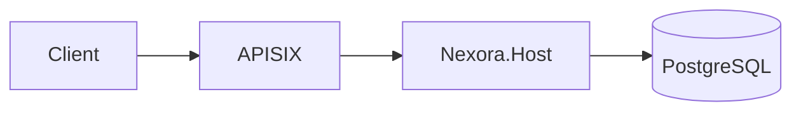

# Documentation Style

Derives from: CLAUDE.md §Mandatory Standards §2. Source: legacy `DOCUMENTATION_STANDARDS.md`.

## 1. Markdown Baseline

- Files are lowercase-kebab `.md` in new folders
  (`architectural-principles.md`). Legacy UPPERCASE files remain until retired.
- One top-level `# Title` per file.
- Blank line around headings, fenced blocks, and lists (markdownlint MD022, MD031, MD032).
- Every fenced block has a language tag (MD040): `csharp`, `ts`, `tsx`, `json`, `bash`,
  `mermaid`, `text`.
- Lines soft-wrap at the author's discretion — no hard column limit, but keep tables
  readable in raw form.
- Relative links between repo docs; absolute only for external references.

## 2. Mermaid for Diagrams (Mandatory)

All diagrams MUST be Mermaid, embedded inline in the markdown. Image files (`.png`, `.svg`,
`.drawio`) are forbidden for new diagrams. Mermaid renders natively on GitHub.



Diagram types and when to use them:

| Type | Use for |
|------|---------|
| `flowchart` | Request paths, decision trees, process flow |
| `sequenceDiagram` | Interactions across services/components over time |
| `stateDiagram-v2` | Entity lifecycle |
| `erDiagram` | Database schema (module spec) |
| `classDiagram` | Component/type relationships (module spec) |
| `graph` (C4-style) | High-level architecture (architecture docs) |

## 3. ADR Rules

- ADRs live in `../decisions/`.
- Status values: `Proposed`, `Accepted`, `Deprecated`, `Superseded by ADR-NNN`.
- **An accepted ADR is immutable.** To change a decision, write a new ADR that supersedes
  the old one and mark the old one `Superseded`.
- Minor clarifications are allowed as dated **Amendments** at the bottom of the ADR (see
  existing `ADR-005-amendment-1.md`, `ADR-011-addendum-1.md` for precedent).
- Every standard in this folder cites the ADR(s) it derives from at the top. Changing a
  standard requires an ADR (see [README.md](README.md) §Changing a Standard).

## 4. Module Spec Required Diagrams

Every module spec under `docs/modules/**/SPEC.md` MUST include, at minimum:

1. **ER diagram** (`erDiagram`) — tables owned by the module and their relationships.
2. **State diagram** (`stateDiagram-v2`) — lifecycle for each primary aggregate.
3. **Sequence diagram** (`sequenceDiagram`) — the canonical write flow and, if different,
   the canonical read flow.
4. **Component diagram** (`classDiagram` or `flowchart`) — module's internal structure
   (Domain / Application / Infrastructure / Api blocks).
5. **Integration diagram** (`flowchart` or `sequenceDiagram`) — events published/consumed,
   cross-module calls via SharedKernel, external services hit.

In addition every module spec includes:

- **Permission matrix** — per [permissions.md](permissions.md) §5.
- **Audit coverage** — per [audit-coverage.md](audit-coverage.md).

Use the `write-module-spec` skill to scaffold these.

## 5. Linking Conventions

- Between docs in the same repo: **relative** Markdown links.
  - `[Permissions](./permissions.md)` or `[Permissions](permissions.md)` (same folder).
  - `[ADR-014](../decisions/ADR-014-distributed-consistency-patterns.md)` (folder up).
- Link text is the human-readable title, not the filename.
- External links: full https URL; prefer stable canonical URLs (e.g. RFC, MDN, vendor docs).
- Anchor links use GitHub-normalised slugs: lowercase, `&` and punctuation stripped,
  spaces to hyphens. Test the anchor before committing.

## 6. English vs Turkish

- **Code, identifiers, comments, API names, log messages, ADRs, and standards** — English
  only.
- **User-facing content** — multi-language via `lockey_` keys ([localization.md](localization.md)).
- **Internal team docs** (meeting notes, release notes for the team, migration playbooks
  that are not part of `standards/`, `decisions/`, or `modules/`) — English or Turkish at
  the author's choice.

Rationale: the `docs/` hierarchy is maintained by multiple contributors and occasionally
by future maintainers who may not read Turkish; keeping the authoritative technical corpus
in English avoids translation debt. Turkish is fine in transient artifacts.

## 7. API Reference Docs

- Generated from C# XML doc comments — every public type and method MUST have XML docs.
- `<summary>`, `<param>`, `<returns>`, `<exception>`, `<example>` where relevant.
- Keep examples runnable — they are the most-read documentation.

## 8. Changelog

- `CHANGELOG.md` updated for every user-visible change.
- Format: Keep a Changelog-style with `Added`, `Changed`, `Fixed`, `Removed`, `Security`,
  `Deprecated` sections under each released version heading.
- Breaking changes get an explicit `### Breaking` sub-section and link to the migration
  note or ADR.

## 9. TODO Conventions

Inside a doc file, inline TODOs for follow-up work use:

```
TODO(maintainer): <action>
TODO(@alias): <action>
```

These are harvested by the `maintainer-todo-sweep` task and should each resolve within one
release cycle, or be promoted to a tracked task.
